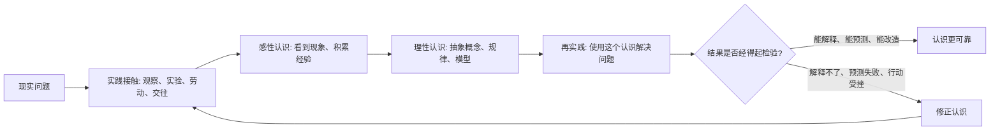

## 毛选思维筑基课: 实践是认识的来源和检验

### 作者
digoal

### 日期
2026-05-17

### 标签
实践论 , 认识论 , 实事求是 , 调查研究 , 理论联系实际 , 认识检验 , 学习方法 , 反馈闭环 , 毛泽东思想 , 思维筑基

----

## 背景

> 面向对象: 初中生到高中生  
> 核心问题: 为什么说人的认识不是凭空想出来的，也不能只靠说得有道理来证明？  
> 先说结论: “实践是认识的来源和检验”就是说，人的知识首先来自人与世界的真实接触，最后也必须回到真实行动中接受检验。想法可以很漂亮，但能不能解释现实、解决问题、经得起重复验证，才是它是否可靠的关键。

## 一张图先看懂



## 求真讲法

### 它到底说了什么

这句话包含两层意思:

1. 实践是认识的来源: 人的认识不是从脑袋里凭空冒出来的，而是来自观察、劳动、实验、学习、交往、斗争、试错等真实活动。
2. 实践是认识的检验: 一个认识是不是真的可靠，不能只看它听起来是否顺耳、说的人是否权威、逻辑是否漂亮，还要看它放回现实中能不能经得起检验。

比如你以为自己会骑自行车。只在脑中背“保持平衡、向前蹬、握好车把”，这还不是真会。真正的认识，要在骑上车、摔过、调整过、最后能稳定骑行之后才成立。

这里的“实践”不是狭义的“动手干活”，而是人和现实世界发生有效接触的活动。做实验是实践，解题训练是实践，社会调查是实践，写文章给读者看反馈也是实践。

### 它是怎么来的

这个观点属于马克思主义认识论的重要命题，在中国思想语境中常通过《实践论》来学习。它要解决的核心问题是: 人怎样才能获得可靠认识？

它反对两种极端:

| 极端 | 错在哪里 | 典型表现 |
| --- | --- | --- |
| 唯书本论 | 把书本结论当成现实本身 | “书上这么说，所以一定对” |
| 唯经验论 | 只相信自己见过的局部经验 | “我身边这样，所以全世界都这样” |

“实践是认识的来源和检验”不是否定书本，也不是否定思考。它真正强调的是: 书本和思考必须连接现实；经验也必须经过抽象、比较、验证，才能上升为可靠认识。

可以把认识过程看成四步:

```text
第一步: 接触现实，获得材料
第二步: 整理材料，形成判断
第三步: 抽象概括，形成规律
第四步: 回到实践，检验并修正
```

如果少了第一步，认识容易空；如果少了第四步，认识容易停在自我感觉正确。

### 它依赖哪些假设

把这句话当作认识论公理，需要接受几个前提:

1. 世界是可以被人接触和认识的。虽然人的认识会有局限，但现实不是完全不可理解的。
2. 人的认识会犯错。正因为会犯错，所以需要实践检验，而不是只靠权威或主观确信。
3. 现实会对行动给出反馈。一个想法放进现实中，会产生结果；结果能帮助我们判断认识是否可靠。
4. 认识可以迭代。一次实践不一定直接得到真理，但反复实践、比较、修正，可以让认识更接近对象。
5. 实践本身也要有条件。混乱的试错、样本太少的观察、被偏见污染的数据，都可能产生错误认识。

所以，这条公理不是说“做了就一定懂”，而是说“可靠的懂，离不开做、看、验、改”。

### 常见误解

| 误解 | 为什么不对 | 更准确的说法 |
| --- | --- | --- |
| 只要亲身经历就一定正确 | 个人经历可能片面 | 经历要被比较、分析、验证 |
| 理论没有用，实践最重要 | 没有理论，实践容易重复低级错误 | 理论来自实践，也要指导实践 |
| 实践检验就是马上见效 | 有些认识需要长期、多条件检验 | 要看时间尺度和检验条件 |
| 多做就会懂 | 机械重复不等于有效实践 | 实践要有目标、反馈和修正 |
| 成功了就说明认识全对 | 成功可能含有偶然因素 | 要区分规律、条件和运气 |

一个学生做对一道数学题，不等于完全掌握这个知识点。可能是题型刚好熟悉，也可能是猜对了步骤。要检验是否真的懂，需要换题、变条件、讲给别人听、隔一段时间再做。

## 求存讲法

### 它有什么用

这条公理的现实价值很直接: 它让人少空想，少迷信，少被漂亮话带走。

遇到一个观点时，可以用三个问题判断它是否可靠:

1. 它的材料从哪里来？
2. 它能解释哪些现实现象？
3. 它放到行动中是否经得起检验？

这三个问题能过滤很多不可靠判断。比如“某学习方法三天提分”“某行业一定暴富”“某人说得很权威所以必然正确”，都要回到实践材料和检验结果上看。

### 它怎么迁移到熟悉领域

#### 学习

学英语单词时，只看单词表是第一层认识；能在句子里认出来是第二层；能自己写句子、听懂对话、在作文里用对是更高层认识。每一次使用，都是实践检验。

#### 写作

你以为一篇文章写得清楚，但读者看不懂，说明你的认识没有通过实践检验。真正有效的写作，要看读者是否理解、是否被说服、是否能复述你的核心观点。

#### 科学

科学假说不能只靠想象成立。它要能解释已知现象，最好还能预测新现象，并在实验或观察中接受检验。

#### 工作

一个产品经理认为用户需要某功能，不能只靠会议讨论。要访谈用户、看数据、做原型、观察使用结果。用户真实行为比会议里的想象更接近检验。

### 它的适用范围和边界

这条公理适合处理学习、科学、技术、管理、写作、社会调查、产品验证等问题。但使用时要注意边界:

1. 单次实践不等于最终真理。一次成功或失败，只是证据，不是全部证据。
2. 实践结果要看条件。条件变了，结论可能也要改。
3. 实践不是蛮干。没有观察指标、没有反馈机制、没有复盘，实践就很难产生可靠认识。
4. 有些问题不能随便拿现实试错。医学、法律、金融高风险决策，需要专业伦理、制度和安全边界。
5. 现实检验不只看短期效果。有些认识需要长期检验，比如健康习惯、教育方法、组织制度。

### 正例: 怎么用它提升能力

假设你想提高数学应用题能力，不要只说“我要努力”。可以按实践认识闭环做:

1. 调查现实: 收集最近 30 道错题。
2. 获得材料: 标出错因，是审题错、公式错、建模错，还是计算错。
3. 形成认识: 发现 60% 错误来自“不会把文字转成数量关系”。
4. 回到实践: 专门训练画线段图、列方程、改写题意。
5. 检验结果: 一周后用新题测试，看同类错误是否减少。
6. 修正认识: 如果仍然错，再判断是概念问题还是训练方法问题。

这比“我多刷点题”更有效，因为它把实践变成了有反馈的认识升级。

### 反例: 前提不成立会怎样

一个同学听说“每天凌晨四点起床学习，成绩一定会提升”。他没有调查自己的睡眠状态，也没有观察白天效率，只是机械模仿。坚持一周后，上课犯困，作业错误更多，成绩没有提升。

这个失败不是因为“早起一定错”，而是因为他违反了几个前提:

1. 没有从自身现实出发，缺少实践材料。
2. 没有设置检验指标，只看是否早起，不看学习质量。
3. 没有根据反馈修正，身体已经给出负面信号，却继续硬撑。
4. 把别人的局部经验当作普遍真理。

如果按这条公理处理，他应该先记录睡眠、精神状态、学习效率和错题数量，再小范围试验，最后根据结果调整作息。

## 思考

### 为什么“想明白”不等于“真明白”？

因为想明白只说明你的脑中形成了一个解释。真明白还需要这个解释能解决问题、能被别人复核、能在变化条件下保持有效。

### 为什么“亲眼所见”也可能错？

因为眼睛看到的是现象，不一定看到结构。比如你看到一个同学考试前一天突击复习后考得不错，不能立刻推出“临时抱佛脚最有效”。你还需要知道他平时基础、题目难度、考试范围和偶然因素。

### 为什么理论还重要？

如果只有实践，没有理论，人会被零散经验牵着走。理论的价值，是帮助我们把许多经验组织起来，看到规律。但理论一旦脱离实践，就会变成空话。

### 一个反事实问题

如果一个社会只相信权威、不允许实践检验，会发生什么？  

可能会出现表面一致、实际低效的问题。错误观点因为没人敢检验而长期存在，真实问题因为没人敢反馈而越来越严重。

## 最后记住

1. 认识从实践中来，不是从空想中来。
2. 认识要回到实践中检验，不是说得漂亮就算可靠。
3. 实践不是蛮干，而是有目标、有反馈、有修正的行动。
4. 个人经验有价值，但必须经过比较、分析和重复检验。
5. 理论和实践不是对立关系，真正可靠的理论来自实践，也能指导新的实践。

## 参考资料

1. 毛泽东: 《实践论》。
2. 毛泽东: 《反对本本主义》。
3. 马克思、恩格斯相关认识论思想，通行马克思主义哲学教材体系。
4. 《毛泽东选集》第一卷至第四卷，人民出版社通行版本。
  
#### [PostgreSQL 解决方案集合](../201706/20170601_02.md "40cff096e9ed7122c512b35d8561d9c8")
  
  
#### [德哥 / digoal's Github - 公益是一辈子的事.](https://github.com/digoal/blog/blob/master/README.md "22709685feb7cab07d30f30387f0a9ae")
  
  
#### [About 德哥](https://github.com/digoal/blog/blob/master/me/readme.md "a37735981e7704886ffd590565582dd0")
  
  

  
