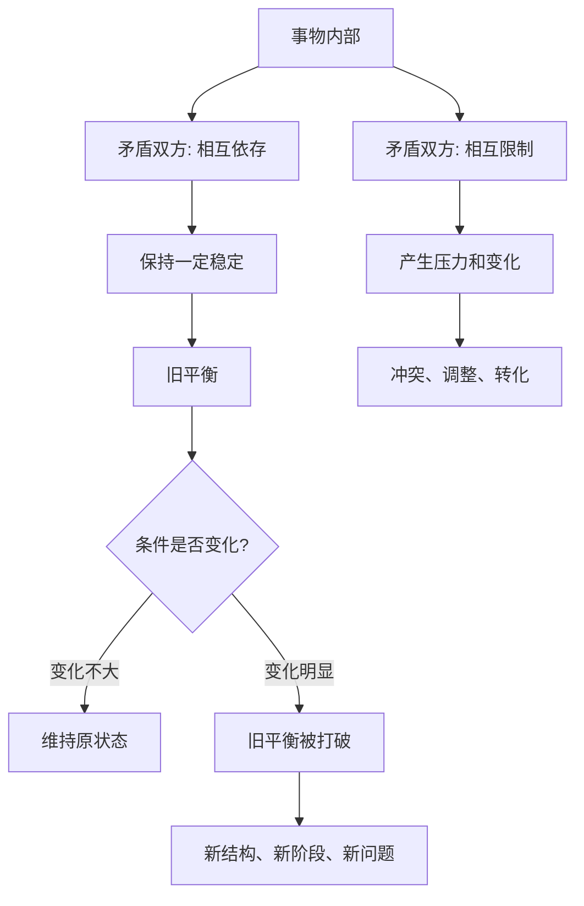

## 毛选思维筑基课: 矛盾是事物发展的动力

### 作者
digoal

### 日期
2026-05-17

### 标签
矛盾论 , 辩证法 , 主要矛盾 , 对立统一 , 阶段变化 , 具体问题具体分析 , 结构分析 , 毛泽东思想 , 思维方法 , 思维筑基

----

## 背景

> 面向对象: 初中生到高中生  
> 核心问题: 为什么说事物不是靠“静止不变”发展，而是在内部矛盾的推动中变化？  
> 先说结论: “矛盾是事物发展的动力”不是说吵架越多越好，而是说任何事物内部都存在相互依存、相互限制、相互推动的对立关系。发展常常来自这些关系的变化、失衡、调整和重新统一。

## 一张图先看懂



## 求真讲法

### 它到底说了什么

这里的“矛盾”，不是日常语言里的“吵架”或“前后说法不一致”。在辩证法中，矛盾指的是事物内部或事物之间同时存在的两种关系:

1. 对立: 双方方向不同、利益不同、功能不同，甚至互相限制。
2. 统一: 双方又在同一个事物或同一个过程中相互依存，离开对方就不能说明自身。

比如学习中的“休息”和“训练”就是一组矛盾。训练太少，能力上不去；训练太多，身体和注意力崩溃。二者方向不同，但共同决定学习效果。真正的发展，不是消灭其中一方，而是在不同阶段找到新的平衡。

所以，“矛盾推动发展”的意思是: 事物内部的张力会迫使结构调整。当旧平衡无法容纳新条件时，事物就会变化。

### 它是怎么来的

这个观点来自辩证法传统，在马克思主义哲学中被系统化，并在《矛盾论》中被用来分析中国革命和社会问题。它要解决的核心问题是: 世界为什么会变化？变化的关键在哪里？

如果只用静止眼光看问题，我们容易说:

```text
这个学生成绩差，是因为他不努力。
这个团队效率低，是因为大家不配合。
这个产品卖不好，是因为市场不好。
```

但矛盾分析会继续追问:

```text
不努力背后，是目标不清、方法错误、反馈太慢，还是压力过大？
不配合背后，是分工冲突、利益不一致、信息不透明，还是流程设计错误？
卖不好背后，是需求不真、价格不对、渠道不通，还是交付能力不足？
```

它把“一个标签”拆成“多组关系”，再判断哪一组关系决定当前发展。

### 它依赖哪些假设

把“矛盾是事物发展的动力”当作思维公理，需要接受几个前提:

1. 事物不是孤立点，而是由关系构成的过程。
2. 关系内部常有方向不同的力量，它们既互相排斥，也互相依存。
3. 稳定不是没有矛盾，而是矛盾暂时处在可承受的平衡中。
4. 条件变化会改变矛盾双方的力量对比，使旧平衡变成新问题。
5. 不同矛盾的重要性不同，必须区分主要矛盾和次要矛盾。
6. 同一矛盾内部也有主导方面，必须判断矛盾的主要方面。

这里要特别注意: 这条公理不是说“所有变化都只由内部原因决定”。外部条件很重要，但外部条件通常要通过内部结构起作用。阳光能让植物生长，是因为植物内部有吸收、转化、代谢的结构；同样的阳光照在石头上，不会长出叶子。

### 常见误解

| 误解 | 为什么不对 | 更准确的说法 |
| --- | --- | --- |
| 矛盾就是吵架 | 吵架只是某些矛盾的外在表现 | 矛盾是对立统一关系 |
| 有矛盾就是坏事 | 没有矛盾就没有变化动力 | 关键是识别和处理矛盾 |
| 矛盾越激烈越好 | 过度冲突可能破坏系统 | 发展需要可转化的张力 |
| 抓主要矛盾就是只看一个问题 | 次要矛盾也会影响全局 | 重点论必须和两点论结合 |
| 解决矛盾就是消灭一方 | 很多矛盾需要重新平衡 | 解决方式取决于矛盾性质 |

比如“学习和娱乐有矛盾”，不代表娱乐必须被彻底消灭。真正的问题是: 当前主要矛盾是训练不足，还是压力过大？如果一个学生已经高度疲劳，继续增加学习时间反而会降低效率。

## 求存讲法

### 它有什么用

这条公理的实际作用，是帮助我们从“看现象”进入“看结构”。

遇到问题时，不急着贴标签，而是问:

1. 这个事物里有哪些相互拉扯的力量？
2. 哪一组矛盾正在决定当前局面？
3. 矛盾双方谁占主导？
4. 条件变化后，主次会不会转化？
5. 解决这个矛盾，会不会产生新的矛盾？

这五个问题能让分析从情绪判断变成结构判断。

### 它怎么迁移到熟悉领域

#### 学习

学习发展常见矛盾:

| 矛盾双方 | 表面现象 | 真正要处理的问题 |
| --- | --- | --- |
| 速度 vs 准确 | 做题快但错多 | 当前阶段先练准确还是速度 |
| 输入 vs 输出 | 听懂但不会做 | 是否缺少主动表达和训练 |
| 努力 vs 方法 | 时间很多但进步慢 | 主要矛盾是否是方法错误 |
| 压力 vs 恢复 | 越学越累 | 是否需要调整节奏 |

#### 写作

写作里的矛盾不是“文字多还是少”这么简单，而是:

```text
作者想表达的复杂性
          vs
读者能承受的理解成本
```

好文章不是把一方消灭，而是在复杂思想和读者理解之间建立桥梁。

#### 管理

团队管理中常见矛盾:

1. 自由与纪律。
2. 创新与稳定。
3. 短期交付与长期能力。
4. 个体贡献与整体协同。

管理不是永远偏向某一边，而是根据阶段判断主要矛盾。例如创业早期可能主要矛盾是速度，规模扩大后主要矛盾可能变成质量和流程。

#### 技术

软件系统里也有矛盾:

| 矛盾 | 说明 |
| --- | --- |
| 性能 vs 可读性 | 极限优化可能牺牲维护 |
| 灵活性 vs 简单性 | 过早抽象会增加复杂度 |
| 上线速度 vs 稳定性 | 快速发布需要测试和回滚机制 |
| 局部最优 vs 全局架构 | 单点优化可能破坏整体一致性 |

技术判断如果只看一边，容易过度设计或粗糙实现。

### 它的适用范围和边界

这条公理适合分析学习、组织、社会、技术、商业、个人成长等复杂系统。但它也有边界:

1. 不能把任何问题都说成“矛盾”后就停止分析。说出矛盾只是开始，不是结论。
2. 不能用矛盾分析替代具体证据。主要矛盾必须由事实材料支持。
3. 不能把矛盾等同于敌对。有些矛盾是非对抗性的，可以通过协调解决。
4. 不能为了制造变化而制造冲突。冲突过度会让系统受损。
5. 不能忽视外部条件。外部环境会改变内部矛盾的强弱和方向。

### 正例: 怎么用它提升能力

假设一个学生语文作文总是分数不高。普通判断可能是“文采不好”。矛盾分析会这样做:

1. 收集材料: 看最近 5 篇作文批改意见。
2. 找矛盾: 发现主要拉扯是“想表达很多观点”与“文章结构承载不了”。
3. 判断主要方面: 当前不是词句问题，而是结构问题占主导。
4. 制定方法: 每篇作文先写中心论点、三个分论点、每段一个例子。
5. 实践检验: 连续三次训练后，看老师是否仍批评“散”“乱”“不集中”。

这就是用“主要矛盾”替代“笼统努力”。它把问题从“我不会写”推进到“我现在最该解决结构承载能力”。

### 反例: 前提不成立会怎样

一个班级成绩下降，班主任判断“主要矛盾是学生不够努力”，于是增加作业量和考试频率。但一个月后，成绩继续下降，学生更疲惫。

问题出在哪里？

1. 没有调查材料，只凭印象判断主要矛盾。
2. 把“努力不足”当作唯一矛盾，忽视了“基础漏洞”“睡眠不足”“反馈太慢”等次要或真正主要的矛盾。
3. 没有判断矛盾主要方面。当前主导因素可能不是时间少，而是错误重复太多。
4. 没有观察条件变化。作业增加后，疲劳上升，原来的次要矛盾变成新的主要矛盾。

这说明矛盾分析不是喊一句“抓主要矛盾”，而是要用事实持续判断主次变化。

### 一张对照表

| 问题层次 | 普通看法 | 矛盾分析 |
| --- | --- | --- |
| 现象 | 成绩差 | 哪些力量导致成绩无法提升 |
| 原因 | 不努力 | 方法、基础、反馈、压力、目标之间的关系 |
| 重点 | 多花时间 | 判断当前主要矛盾 |
| 行动 | 加任务 | 针对主要矛盾设计干预 |
| 复盘 | 看结果好坏 | 看矛盾结构是否改变 |

### 一个极简 SVG: 矛盾推动变化

<svg width="720" height="230" viewBox="0 0 720 230" xmlns="http://www.w3.org/2000/svg" role="img" aria-label="矛盾推动变化示意图">
  <rect x="40" y="70" width="150" height="70" rx="8" fill="#e8f2ff" stroke="#2563eb"/>
  <text x="115" y="111" text-anchor="middle" font-size="16" fill="#111827">力量 A</text>
  <rect x="250" y="70" width="150" height="70" rx="8" fill="#fff7ed" stroke="#ea580c"/>
  <text x="325" y="111" text-anchor="middle" font-size="16" fill="#111827">力量 B</text>
  <line x1="190" y1="105" x2="250" y2="105" stroke="#111827" stroke-width="2" marker-end="url(#arrow)" marker-start="url(#arrow)"/>
  <text x="220" y="92" text-anchor="middle" font-size="13" fill="#374151">对立统一</text>
  <path d="M400 105 C455 40, 515 40, 570 105" fill="none" stroke="#16a34a" stroke-width="3" marker-end="url(#arrow)"/>
  <path d="M400 105 C455 170, 515 170, 570 105" fill="none" stroke="#db2777" stroke-width="3" marker-end="url(#arrow)"/>
  <rect x="570" y="70" width="110" height="70" rx="8" fill="#f0fdf4" stroke="#16a34a"/>
  <text x="625" y="100" text-anchor="middle" font-size="15" fill="#111827">新平衡</text>
  <text x="625" y="122" text-anchor="middle" font-size="15" fill="#111827">新阶段</text>
  <defs>
    <marker id="arrow" markerWidth="10" markerHeight="10" refX="8" refY="3" orient="auto">
      <path d="M0,0 L0,6 L9,3 z" fill="#111827"/>
    </marker>
  </defs>
</svg>

## 思考

### 为什么没有矛盾就没有发展？

如果一个系统内部没有任何张力，就不会产生调整的必要。学习没有“现在能力”和“目标能力”的差距，就不会训练；企业没有“客户需求”和“现有产品”的差距，就不会创新；社会没有“旧制度”和“新需要”的冲突，就不会改革。

### 为什么“抓主要矛盾”比“努力解决所有问题”更重要？

因为人的时间、注意力、资源有限。复杂系统里问题很多，但不是每个问题都同样决定结果。平均用力看似全面，实际上可能避开了真正卡住发展的关键。

### 为什么矛盾会转化？

因为条件会变化。今天主要矛盾是速度不够，明天可能变成质量不稳；今天主要矛盾是没有用户，明天可能变成交付能力不足。会分析矛盾的人，不把一次判断当永久答案。

### 一个反事实问题

如果一个人相信“问题只有一个原因”，会发生什么？

他会习惯找单一解释: 成绩差就是懒，团队差就是人不行，产品差就是市场不好。这样做很省脑力，但会错过真正的结构关系，也就很难找到有效改法。

## 最后记住

1. 矛盾不是简单吵架，而是对立统一的关系。
2. 发展来自矛盾双方的变化、失衡、调整和重新统一。
3. 分析问题要区分主要矛盾、次要矛盾，以及矛盾的主要方面。
4. 矛盾会随条件变化而转化，昨天的重点不一定是今天的重点。
5. 矛盾分析必须建立在事实调查上，否则会变成空洞标签。

## 参考资料

1. 毛泽东: 《矛盾论》。
2. 毛泽东: 《实践论》。
3. 《毛泽东选集》第一卷至第四卷，人民出版社通行版本。
4. 马克思主义哲学中关于唯物辩证法、矛盾分析方法的通行教材体系。
  
#### [PostgreSQL 解决方案集合](../201706/20170601_02.md "40cff096e9ed7122c512b35d8561d9c8")
  
  
#### [德哥 / digoal's Github - 公益是一辈子的事.](https://github.com/digoal/blog/blob/master/README.md "22709685feb7cab07d30f30387f0a9ae")
  
  
#### [About 德哥](https://github.com/digoal/blog/blob/master/me/readme.md "a37735981e7704886ffd590565582dd0")
  
  

  
