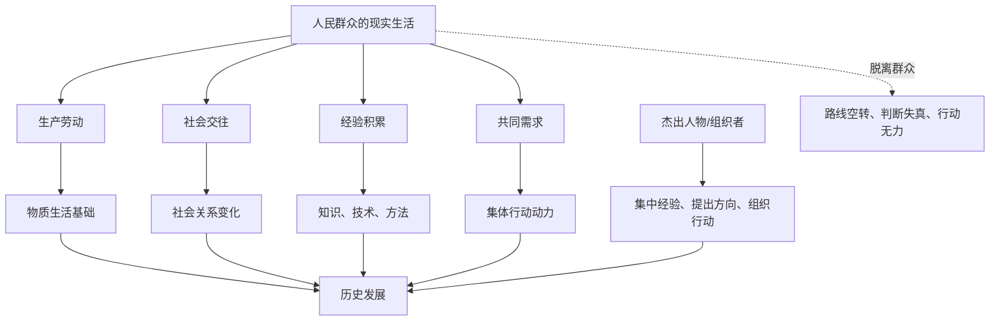

## 毛选思维筑基课: 人民群众是历史主体: 一句话讲透

### 作者
digoal

### 日期
2026-05-17

### 标签
人民群众 , 历史主体 , 群众路线 , 唯物史观 , 从群众中来 , 到群众中去 , 组织实践 , 用户反馈 , 毛泽东思想 , 思维筑基

----

## 背景

> 面向对象: 初中生到高中生  
> 核心问题: 历史到底是少数英雄创造的，还是广大普通人共同推动的？  
> 先说结论: “人民群众是历史主体”不是否认杰出人物的作用，而是说历史发展的根本力量来自广大人民的生产实践、社会实践、创造经验和集体行动。个人可以加速、组织、代表或表达历史趋势，但不能脱离群众和现实条件凭空创造历史。

## 一张图先看懂



## 求真讲法

### 它到底说了什么

“人民群众是历史主体”是一种历史观。它说的是: 推动历史变化的根本力量，不是少数人头脑中的想法，而是广大人民在生产、生活、斗争、创造和组织中的实践活动。

这里的“人民群众”不是一个空泛词。它至少包含三层意思:

1. 生产主体: 人们通过劳动创造衣食住行、工具、技术和社会财富。
2. 实践主体: 人们在真实生活中发现问题、积累经验、形成需求。
3. 行动主体: 当分散经验被组织起来，群众可以形成改变现实的力量。

这句话并不等于“个人不重要”。杰出人物、思想家、组织者、领导者当然重要。但他们的重要性，通常表现为能够集中群众经验、表达时代需求、组织群众力量，而不是脱离现实条件单独创造历史。

### 它是怎么来的

这个观点来自唯物史观。唯物史观强调，历史首先要从人的现实生活和生产活动出发，而不是只从帝王将相、英雄人物、抽象观念出发。

如果只用“英雄史观”看历史，容易得到这样的解释:

```text
某个时代变化，是因为某个伟大人物出现了。
某场运动成功，是因为某个领袖特别聪明。
某项制度改变，是因为少数人突然想通了。
```

但群众史观会继续追问:

```text
为什么这个人物能被那个时代需要？
为什么他的主张能被许多人接受？
为什么某些群众愿意行动、承受成本、改变旧秩序？
为什么相同想法在另一个时代没有成功？
```

这不是把个人从历史中拿掉，而是把个人放回更大的社会条件、群众需求和组织关系中理解。

### 它依赖哪些假设

把“人民群众是历史主体”当作思维公理，需要接受几个前提:

1. 历史不是纯观念运动，而是建立在现实生产、生活和社会关系之上。
2. 广大普通人的活动不是背景板，而是社会财富、制度变化和文化创造的基础。
3. 群众不是天然形成统一力量，需要被表达、组织、教育和动员。
4. 杰出人物的作用受时代条件、群众基础和组织能力约束。
5. 判断一条路线是否有效，要看它是否来自群众经验，并能否回到群众实践中被检验。

这里有一个关键边界: 群众是历史主体，不等于群众每一次具体判断都天然正确。群众中有真实经验，也会有局限、分散、短期情绪和信息不足。所以还需要调查研究、理论加工和组织实践。

### 常见误解

| 误解 | 为什么不对 | 更准确的说法 |
| --- | --- | --- |
| 群众主体就是个人不重要 | 杰出人物能集中经验、提出方向、组织行动 | 个人作用要放在群众和时代条件中理解 |
| 群众想什么就一定对 | 群众经验真实，但也可能分散、局部、短期 | 要从群众中来，再经过集中加工 |
| 群众路线就是迎合多数意见 | 迎合不等于领导 | 群众路线要把分散经验上升为正确路线 |
| 历史只由经济决定 | 经济基础重要，但政治、文化、组织也会反作用 | 要看多种社会关系的整体运动 |
| 人多就有力量 | 分散的人群不等于组织化力量 | 群众力量需要目标、路线和组织 |

比如一个班级里多数同学说“少写作业最好”，这不自动等于正确路线。老师需要理解背后的真实问题: 是作业重复、难度不匹配、反馈太慢，还是学生只是逃避训练？正确做法不是简单迎合，也不是简单压制，而是从真实经验中找结构问题。

## 求存讲法

### 它有什么用

这条公理的最大用处，是让我们看问题时不被“少数人叙事”带偏。

它提醒我们:

1. 看历史，不只看人物传记，还要看当时的生产方式、社会结构和群众需求。
2. 看组织，不只看领导讲话，还要看基层执行、成员感受和反馈机制。
3. 看产品，不只看创始人愿景，还要看用户真实痛点和使用行为。
4. 看学习，不只看老师讲得好不好，还要看学生是否真正理解、练习和反馈。
5. 看文章，不只看作者表达，还要看读者能否理解、复述和行动。

它把注意力从“谁说了什么”拉回到“谁在实践、谁在承受、谁在创造、谁在执行、谁在反馈”。

### 它怎么迁移到熟悉领域

#### 学习

一个班级成绩提升，不只是老师讲课水平提高。真正的主体还包括学生的听课、练习、提问、互助、错题复盘和持续反馈。老师可以组织和引导，但学生不进入实践，学习不会真正发生。

#### 写作

写作者不能只沉浸在“我要表达什么”，还要问“读者真实困惑是什么”。读者的理解困难、经验背景、注意力限制，会决定文章是否有效。好的写作，是把作者思考和读者经验接上。

#### 产品

产品不是创始人想象出来就成立的。用户是否愿意使用、付费、复购、推荐，才是产品认识的实践检验。用户不是被动接受者，而是产品演化的重要主体。

#### 管理

组织管理不能只靠上层设计。制度是否可执行，要看一线员工如何理解、如何操作、遇到什么阻力。脱离一线经验的制度，表面完整，执行时会变形。

### 它的适用范围和边界

这条公理适合分析历史、政治、组织、教育、产品、传播和社会变迁。但使用时要注意边界:

1. 不能把“群众主体”理解成“多数意见永远正确”。多数意见也可能受信息不足、短期情绪和错误引导影响。
2. 不能把“尊重群众”变成“放弃判断”。群众经验需要被调查、比较、提炼和组织。
3. 不能否认专业知识。复杂问题仍需要专家、制度和专业方法，但专家必须接受现实检验。
4. 不能把群众当作抽象符号。真正的群众是具体的人，有不同处境、利益、能力和诉求。
5. 不能忽视组织。没有组织，群众力量常常是分散的，难以持续改变现实。

### 正例: 怎么用它提升能力

假设你要组织一次班级学习互助活动。普通做法是班干部直接制定计划: 每天晚自习后统一讲题。但效果可能不好，因为不知道同学真正卡在哪里。

按“人民群众是历史主体”的方法，可以这样做:

1. 从群众中来: 先收集同学最近最常错的题型和最困惑的知识点。
2. 分类集中: 发现大多数问题集中在函数图像和应用题建模。
3. 制定路线: 不做泛泛补课，而是安排两个专题小组。
4. 到群众中去: 让同学用新题检验是否真的听懂。
5. 反馈修正: 如果仍然错，就调整讲解方式和训练材料。

这不是简单投票，而是把真实经验组织成有效行动。

### 反例: 前提不成立会怎样

一个产品团队在会议室里设计了一个“学生时间管理 App”。团队认为学生最需要复杂的日程、番茄钟、积分、排行榜和社交打卡。上线后，真实学生很少使用。

失败原因不是“学生不自律”这么简单，而是几个前提不成立:

1. 没有从真实用户中来，没有调查学生实际时间压力和使用场景。
2. 把设计者想象当成群众需求，违背群众主体的前提。
3. 没有让用户参与早期反馈，路线没有回到群众实践中检验。
4. 没有区分不同学生群体: 初中生、高中生、大学生的痛点并不相同。

如果承认用户是产品演化的主体，团队就会先做访谈、观察、原型测试，再决定功能优先级。

### 一张对照表

| 问题 | 精英中心看法 | 群众主体看法 |
| --- | --- | --- |
| 历史变化 | 少数人物创造历史 | 群众实践是根本力量，人物在条件中发挥作用 |
| 组织管理 | 上层设计决定一切 | 一线执行和反馈决定制度是否有效 |
| 产品创新 | 创始人灵感最重要 | 用户痛点和使用行为决定产品方向 |
| 教育学习 | 老师讲完就算完成 | 学生真正理解和训练才算发生 |
| 写作传播 | 作者表达最重要 | 读者理解、复述和行动同样重要 |

### 一个极简 SVG: 群众路线闭环

<svg width="720" height="240" viewBox="0 0 720 240" xmlns="http://www.w3.org/2000/svg" role="img" aria-label="群众路线闭环">
  <rect x="40" y="82" width="130" height="64" rx="8" fill="#e8f2ff" stroke="#2563eb"/>
  <text x="105" y="109" text-anchor="middle" font-size="15" fill="#111827">群众经验</text>
  <text x="105" y="130" text-anchor="middle" font-size="13" fill="#374151">问题与需求</text>
  <rect x="220" y="82" width="130" height="64" rx="8" fill="#fff7ed" stroke="#ea580c"/>
  <text x="285" y="109" text-anchor="middle" font-size="15" fill="#111827">集中加工</text>
  <text x="285" y="130" text-anchor="middle" font-size="13" fill="#374151">分析与路线</text>
  <rect x="400" y="82" width="130" height="64" rx="8" fill="#f0fdf4" stroke="#16a34a"/>
  <text x="465" y="109" text-anchor="middle" font-size="15" fill="#111827">组织实践</text>
  <text x="465" y="130" text-anchor="middle" font-size="13" fill="#374151">执行与协同</text>
  <rect x="570" y="82" width="110" height="64" rx="8" fill="#fdf2f8" stroke="#db2777"/>
  <text x="625" y="109" text-anchor="middle" font-size="15" fill="#111827">反馈修正</text>
  <text x="625" y="130" text-anchor="middle" font-size="13" fill="#374151">检验路线</text>
  <path d="M170 114 L220 114" stroke="#111827" stroke-width="2" marker-end="url(#arrow)"/>
  <path d="M350 114 L400 114" stroke="#111827" stroke-width="2" marker-end="url(#arrow)"/>
  <path d="M530 114 L570 114" stroke="#111827" stroke-width="2" marker-end="url(#arrow)"/>
  <path d="M625 146 C590 210, 125 210, 105 146" fill="none" stroke="#111827" stroke-width="2" marker-end="url(#arrow)"/>
  <defs>
    <marker id="arrow" markerWidth="10" markerHeight="10" refX="8" refY="3" orient="auto">
      <path d="M0,0 L0,6 L9,3 z" fill="#111827"/>
    </marker>
  </defs>
</svg>

## 思考

### 为什么不能只用英雄解释历史？

因为同一个英雄，如果没有时代需求、群众基础、组织条件和现实矛盾，就很难产生历史影响。个人作用真实存在，但它要通过群众和条件才能变成历史力量。

### 为什么群众经验还需要加工？

群众经验通常是具体的、分散的、带有局部视角的。它很宝贵，因为它接触现实；但它还需要比较、抽象、组织，才能变成稳定路线。这就是“从群众中来，到群众中去”的意义。

### 为什么管理者最怕脱离一线？

因为一线掌握真实摩擦: 哪个流程多余，哪个规则执行不了，哪个客户最痛，哪个指标在造假。脱离一线，管理者看到的是报表，不是现实。

### 一个反事实问题

如果一个组织相信“上层永远比基层懂”，会发生什么？

它可能短期内命令统一，但长期会出现信息失真、执行变形、成员沉默和问题积累。因为真实问题无法从群众实践中进入决策层，路线就会越来越空。

## 最后记住

1. 人民群众是历史主体，指的是群众实践构成历史发展的根本力量。
2. 杰出人物重要，但其作用要放在时代条件、群众基础和组织关系中理解。
3. 群众路线不是迎合多数，而是从群众经验中提炼路线，再回到群众实践中检验。
4. 群众主体不等于群众每次判断都天然正确，真实经验还需要调查、分析和组织。
5. 在学习、写作、产品和管理中，谁真实实践、承受、反馈，谁就不能被当成背景板。

## 参考资料

1. 毛泽东: 《关于领导方法的若干问题》。
2. 毛泽东: 《论联合政府》。
3. 毛泽东: 《在延安文艺座谈会上的讲话》。
4. 毛泽东: 《反对本本主义》。
5. 《毛泽东选集》第一卷至第四卷，人民出版社通行版本。
6. 马克思主义哲学中关于唯物史观和群众史观的通行教材体系。
  
#### [PostgreSQL 解决方案集合](../201706/20170601_02.md "40cff096e9ed7122c512b35d8561d9c8")
  
  
#### [德哥 / digoal's Github - 公益是一辈子的事.](https://github.com/digoal/blog/blob/master/README.md "22709685feb7cab07d30f30387f0a9ae")
  
  
#### [About 德哥](https://github.com/digoal/blog/blob/master/me/readme.md "a37735981e7704886ffd590565582dd0")
  
  

  
