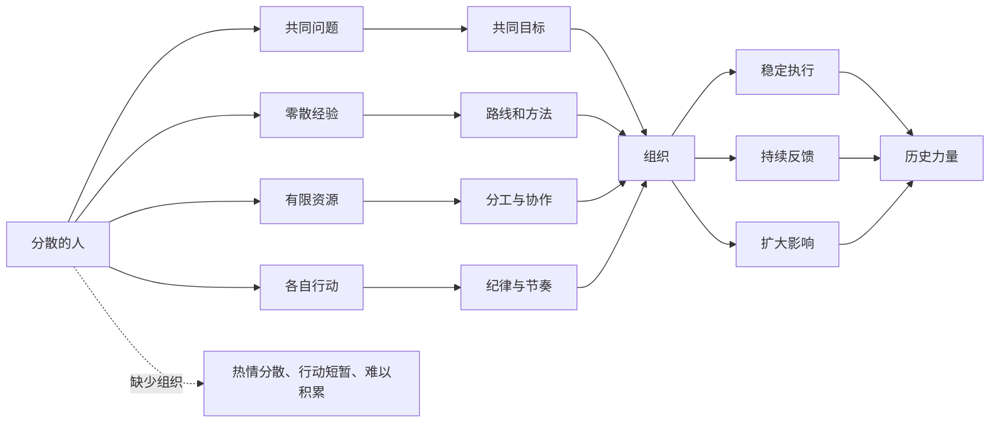

## 毛选思维筑基课: 组织把分散力量变成历史力量: 一句话讲透

### 作者
digoal

### 日期
2026-05-17

### 标签
组织力量 , 分散力量 , 历史力量 , 共同目标 , 分工协作 , 纪律节奏 , 反馈修正 , 群众路线 , 毛泽东思想 , 思维筑基

----

## 背景

> 面向对象: 初中生到高中生  
> 核心问题: 为什么许多人有同样愿望，却不一定能改变现实？为什么有组织的少数人，有时能产生超过人数本身的力量？  
> 先说结论: 分散力量只是“许多人各自想做事”，组织力量则是“许多人围绕共同目标、分工协作、遵守规则、持续反馈、统一行动”。组织的作用，就是把零散愿望、经验、资源和行动，变成能够持续改变现实的系统力量。

## 一张图先看懂



## 求真讲法

### 它到底说了什么

“组织把分散力量变成历史力量”说的是: 人数、愿望、情绪、资源本身并不会自动改变现实。只有当它们被共同目标、分工协作、规则纪律、反馈修正和持续行动连接起来，才会变成稳定力量。

一群人都想把教室打扫干净，如果每个人各扫一点、没人分工、没人检查、没人处理垃圾，结果可能还是乱。  

但如果有人安排:

1. 谁扫地。
2. 谁擦黑板。
3. 谁倒垃圾。
4. 谁检查角落。
5. 每天什么时间完成。

同样的人数，就能产生完全不同的结果。这就是组织的力量。

所以，组织不是简单“把人聚在一起”。真正的组织至少包含五个要素:

| 要素 | 解决的问题 | 没有它会怎样 |
| --- | --- | --- |
| 共同目标 | 大家往哪里走 | 各做各的 |
| 路线方法 | 怎么走才有效 | 热情变成乱动 |
| 分工协作 | 谁负责什么 | 重复劳动或无人负责 |
| 规则纪律 | 如何保持一致行动 | 一遇阻力就散 |
| 反馈修正 | 如何越做越准 | 错误长期重复 |

### 它是怎么来的

这个观点来自对社会行动和历史变迁的观察。历史上很多重大变化，并不是因为某个人突然有了想法，也不是因为人群自然形成力量，而是因为分散的需求、经验、资源被组织起来。

在《毛泽东选集》的思想体系中，组织问题和群众问题是连在一起的。群众是历史主体，但群众力量要真正发挥出来，需要路线、组织、干部、纪律和实践检验。  

这就是为什么群众路线不是简单收集意见，而是“从群众中来，到群众中去”: 先把群众的分散经验集中起来，形成可执行的路线，再组织群众实践，并通过反馈继续修正。

可以把它看成一个转化过程:

```text
分散愿望
  ↓
共同目标
  ↓
组织结构
  ↓
协同行动
  ↓
反馈修正
  ↓
持续影响
```

没有组织，愿望容易停在情绪层；有组织，愿望才可能进入现实层。

### 它依赖哪些假设

把“组织把分散力量变成历史力量”当作思维公理，需要接受几个前提:

1. 个人力量有限。复杂问题通常无法靠一个人的短期努力解决。
2. 分散力量存在协调成本。人越多，如果没有规则，混乱不一定减少，反而可能增加。
3. 共同目标可以降低行动方向的分歧。
4. 分工协作可以让每个人发挥局部优势。
5. 纪律和信任可以降低反复沟通、互相猜疑和中途放弃的成本。
6. 反馈机制可以让组织从错误中学习，而不是机械重复。

这条公理不是说“组织越大越好”。组织如果目标错误、反馈堵塞、纪律变成僵化、分工变成割裂，也会把力量浪费掉，甚至造成破坏。

### 常见误解

| 误解 | 为什么不对 | 更准确的说法 |
| --- | --- | --- |
| 组织就是人越多越好 | 人多但无目标、无分工会更乱 | 组织质量比人数更重要 |
| 组织就是服从命令 | 只有命令没有反馈会失真 | 组织需要纪律，也需要信息回流 |
| 有热情就不需要组织 | 热情容易短暂和分散 | 热情要转化为持续行动 |
| 组织会压制个人 | 坏组织会压制，好的组织能放大个人能力 | 关键看目标、规则和反馈 |
| 开会就是组织 | 开会只是沟通方式 | 真正组织看责任、执行和结果 |

比如一个社团每周开会讨论“要做大影响力”，但没人负责内容、没人联系场地、没人复盘效果。这样的社团虽然有会议，却没有真正的组织能力。

## 求存讲法

### 它有什么用

这条公理能帮助我们理解很多现实问题:

1. 为什么一个班级有人才，却不一定有战斗力。
2. 为什么一个团队想法很多，却做不出产品。
3. 为什么一场活动报名很多，却现场混乱。
4. 为什么社会中的共同需求，需要制度和组织才能变成改变。
5. 为什么学习小组比单独努力更可能形成长期反馈。

它提醒我们: 不要只看“有没有人”“有没有热情”“有没有资源”，更要看这些力量有没有被组织成持续行动。

### 它怎么迁移到熟悉领域

#### 学习

学习小组不是几个人坐在一起就有效。有效学习小组要有目标、材料、分工、节奏和反馈。

| 分散状态 | 组织状态 |
| --- | --- |
| 大家都说想进步 | 明确本周解决函数错题 |
| 每个人随便讲题 | 每人负责一种题型 |
| 不知道学得怎样 | 用周测检验效果 |
| 错题各自丢着 | 建共享错题库 |
| 热闹一阵就散 | 固定时间复盘 |

#### 写作

一篇文章也是组织。素材、观点、例子、图表、结论如果只是堆在一起，读者会累。好文章用结构把分散材料组织成一条能被理解的路径。

#### 产品

产品团队里，用户研究、设计、开发、测试、运营如果各自为战，就会产生大量返工。组织能力体现在需求如何进入、优先级如何确定、谁负责交付、怎么测试、上线后怎么反馈。

#### 管理

管理不是盯人，而是设计让人能协作的系统。目标清楚、权责清楚、节奏清楚、反馈清楚，人的努力才容易累积。

### 它的适用范围和边界

这条公理适合分析团队、社团、班级、企业、社会运动、项目协作和知识生产。但它不能被简单滥用:

1. 组织不能替代正确方向。方向错，组织能力越强，偏离越快。
2. 组织不能替代真实能力。没有技能和资源，只靠口号组织不出结果。
3. 组织不能压死反馈。只要求一致，不允许报告问题，会制造假执行。
4. 组织不能无限增加层级。层级过多会带来信息损耗和责任模糊。
5. 组织不能忽视人的差异。不同人能力、动机和处境不同，分工要尊重现实。

### 正例: 怎么用它提升能力

假设一个班级想提高英语听力成绩。分散状态下，每个同学都说“我要多听”，但很快就坚持不下去。

用组织方法可以这样做:

1. 共同目标: 两周内把听力选择题平均正确率提高 10%。
2. 分工协作: A 负责整理高频场景词，B 负责找材料，C 负责记录错因，D 负责组织互测。
3. 固定节奏: 每天 15 分钟精听，每三天一次小测。
4. 反馈修正: 统计错因是听不出数字、连读、转折词，还是场景词不熟。
5. 迭代方法: 如果主要错误是转折词，就集中训练 but、however、actually 后面的信息。

结果不是因为大家突然更聪明，而是因为分散努力被组织成了可重复、可检查、可修正的行动。

### 反例: 前提不成立会怎样

一个创业团队有 8 个人，大家都很积极，每天都在群里发想法。有人想做短视频，有人想做小程序，有人想找投资，有人想改 logo，有人想参加展会。一个月后，钱花了不少，产品还没上线。

失败的关键不是人少，也不是大家不努力，而是组织前提没有成立:

1. 没有共同目标，不知道本月最重要结果是什么。
2. 没有主要任务排序，所有想法同时推进。
3. 没有分工边界，很多事情重复做，也有关键事情没人做。
4. 没有反馈机制，不知道哪些动作真正带来用户。
5. 没有纪律和节奏，热情被碎片化消耗。

这说明“人多、想法多、热情高”不等于组织力量。没有组织，力量会互相抵消。

### 一张对照表

| 维度 | 分散力量 | 组织力量 |
| --- | --- | --- |
| 目标 | 各有想法 | 共同方向 |
| 行动 | 临时、随机 | 有节奏、可持续 |
| 资源 | 分散占用 | 集中配置 |
| 信息 | 各自知道一部分 | 有机制汇总和回流 |
| 错误 | 重复发生 | 复盘后修正 |
| 影响 | 短期热闹 | 长期积累 |

### 一个极简 SVG: 组织放大力量

<svg width="720" height="240" viewBox="0 0 720 240" xmlns="http://www.w3.org/2000/svg" role="img" aria-label="组织放大力量示意图">
  <circle cx="70" cy="65" r="14" fill="#e8f2ff" stroke="#2563eb"/>
  <circle cx="120" cy="110" r="14" fill="#e8f2ff" stroke="#2563eb"/>
  <circle cx="65" cy="155" r="14" fill="#e8f2ff" stroke="#2563eb"/>
  <circle cx="145" cy="165" r="14" fill="#e8f2ff" stroke="#2563eb"/>
  <text x="105" y="210" text-anchor="middle" font-size="15" fill="#111827">分散个体</text>

  <path d="M180 120 L255 120" stroke="#111827" stroke-width="2" marker-end="url(#arrow)"/>
  <text x="218" y="104" text-anchor="middle" font-size="13" fill="#374151">组织化</text>

  <rect x="270" y="55" width="170" height="130" rx="10" fill="#fff7ed" stroke="#ea580c"/>
  <text x="355" y="82" text-anchor="middle" font-size="15" fill="#111827">目标</text>
  <text x="355" y="110" text-anchor="middle" font-size="15" fill="#111827">分工</text>
  <text x="355" y="138" text-anchor="middle" font-size="15" fill="#111827">纪律</text>
  <text x="355" y="166" text-anchor="middle" font-size="15" fill="#111827">反馈</text>

  <path d="M440 120 L520 120" stroke="#111827" stroke-width="2" marker-end="url(#arrow)"/>
  <text x="480" y="104" text-anchor="middle" font-size="13" fill="#374151">持续执行</text>

  <rect x="535" y="75" width="130" height="90" rx="10" fill="#f0fdf4" stroke="#16a34a"/>
  <text x="600" y="110" text-anchor="middle" font-size="16" fill="#111827">系统力量</text>
  <text x="600" y="135" text-anchor="middle" font-size="14" fill="#374151">可积累影响</text>

  <defs>
    <marker id="arrow" markerWidth="10" markerHeight="10" refX="8" refY="3" orient="auto">
      <path d="M0,0 L0,6 L9,3 z" fill="#111827"/>
    </marker>
  </defs>
</svg>

## 思考

### 为什么人多不一定力量大？

因为人多会带来协调成本。如果没有共同目标、分工和规则，人越多，沟通越乱，互相等待越多，责任越不清楚。真正的力量不是人数相加，而是协作结构形成后的力量放大。

### 为什么纪律不是组织的全部？

纪律能保证行动一致，但如果没有目标、反馈和修正，纪律可能变成机械服从。好的组织既能统一行动，也能接收真实信息，发现错误后及时调整。

### 为什么组织需要信任？

没有信任，每个人都会把大量精力花在防备、解释、甩锅和确认上。信任能降低协作成本，让分工真正发生。但信任不能只靠感情，还要靠透明规则和稳定兑现。

### 一个反事实问题

如果一个团队只有共同理想，没有分工和反馈，会发生什么？

它可能一开始很热闹，但很快陷入重复讨论、责任悬空和行动疲劳。共同理想能点火，组织机制才能让火持续燃烧。

## 最后记住

1. 分散力量不会自动变成历史力量，必须经过组织化。
2. 组织的核心不是人多，而是共同目标、路线方法、分工协作、纪律节奏和反馈修正。
3. 好组织能放大个人能力，坏组织会浪费甚至压制个人能力。
4. 组织不能替代正确方向和真实能力，方向错时组织越强，偏离越快。
5. 判断一个组织是否有效，不看口号和会议数量，而看它能否持续执行、学习和产生结果。

## 参考资料

1. 毛泽东: 《关于领导方法的若干问题》。
2. 毛泽东: 《论联合政府》。
3. 毛泽东: 《中国革命战争的战略问题》。
4. 毛泽东: 《整顿党的作风》。
5. 《毛泽东选集》第一卷至第四卷，人民出版社通行版本。
6. 马克思主义哲学和组织理论中关于群众路线、组织建设、实践反馈的通行教材体系。
  
#### [PostgreSQL 解决方案集合](../201706/20170601_02.md "40cff096e9ed7122c512b35d8561d9c8")
  
  
#### [德哥 / digoal's Github - 公益是一辈子的事.](https://github.com/digoal/blog/blob/master/README.md "22709685feb7cab07d30f30387f0a9ae")
  
  
#### [About 德哥](https://github.com/digoal/blog/blob/master/me/readme.md "a37735981e7704886ffd590565582dd0")
  
  

  
