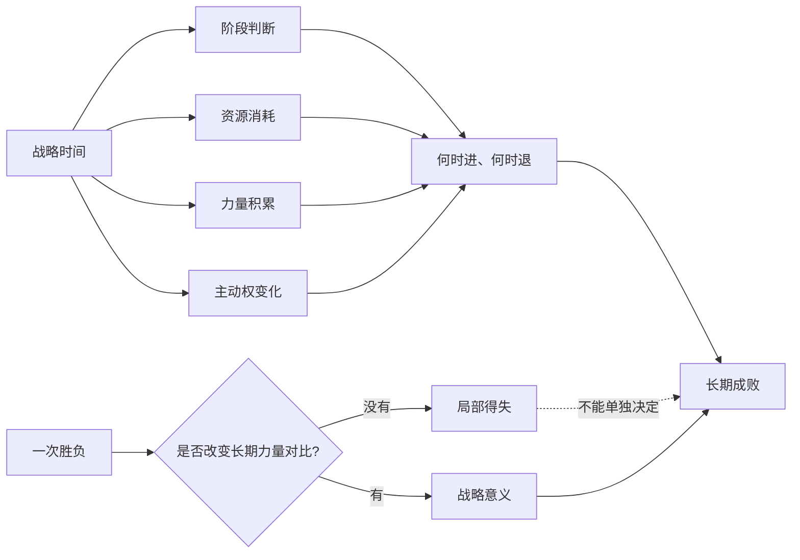

## 毛选思维筑基课: 战略时间比一时胜负更重要

### 作者
digoal

### 日期
2026-05-17

### 标签
战略时间 , 一时胜负 , 持久战 , 阶段判断 , 力量对比 , 保存力量 , 主动权 , 长期主义 , 毛泽东思想 , 思维筑基

----

## 背景

> 面向对象: 初中生到高中生  
> 核心问题: 为什么有些短期失败不是真失败，有些短期胜利反而会埋下长期失败？  
> 先说结论: “战略时间比一时胜负更重要”不是说短期胜负不重要，而是说真正决定成败的，常常不是某一次输赢，而是在更长时间里能否保存力量、改变条件、积累优势、掌握主动权。

## 一张图先看懂



## 求真讲法

### 它到底说了什么

“战略时间比一时胜负更重要”说的是: 判断一个行动是否正确，不能只看眼前赢了还是输了，还要看它在长期时间中造成什么变化。

一次考试考得好，当然值得高兴；但如果只是靠临时突击，长期基础没有变，这个胜利的战略价值很小。一次考试失利，当然需要复盘；但如果它暴露了关键漏洞，让你及时修正，长期看可能反而有价值。

所以，战略时间关注四个问题:

1. 这个结果是否改变了力量对比？
2. 这个过程消耗了多少资源？
3. 这个行动是否带来可积累能力？
4. 这个选择是否影响下一阶段的主动权？

一时胜负看的是“这一局怎样”，战略时间看的是“这一局之后，整个局势怎样”。

### 它是怎么来的

这个观点在军事、政治、组织和个人成长中都很重要。在《论持久战》中，一个核心思路就是不能用一两次战役的输赢判断全局，而要看战争阶段、双方力量变化、资源消耗和长期趋势。

更一般地说，当双方力量不平衡，或者问题周期很长时，短期胜负最容易误导人。

```text
短期视角:
今天赢了 -> 我很强
今天输了 -> 我完了

战略时间视角:
今天赢了 -> 是否增强了长期能力？
今天输了 -> 是否保存了力量并获得了真实信息？
```

这不是安慰失败者，也不是轻视胜利者。它要求我们把胜负放到时间轴上重新判断。

### 它依赖哪些假设

把“战略时间比一时胜负更重要”当作思维公理，需要接受几个前提:

1. 复杂竞争不是一次行动决定的，而是多个阶段连续演化的。
2. 资源有限，短期胜利如果消耗过大，可能削弱长期能力。
3. 条件会变化，今天弱的一方可能通过时间积累改变力量对比。
4. 主动权比单次结果更深层。能选择何时打、何地打、以什么方式打，比被动追逐胜负更重要。
5. 失败也可能提供信息。关键是能否从失败中修正路线，而不是反复失败。

这条公理不是说“任何失败都值得”。如果失败既没有保存力量，也没有获得信息，还重复消耗资源，那就不是战略耐心，而是错误坚持。

### 常见误解

| 误解 | 为什么不对 | 更准确的说法 |
| --- | --- | --- |
| 战略时间重要，所以短期输赢无所谓 | 短期输赢会影响士气、资源和机会 | 短期结果要放入长期结构判断 |
| 忍耐就是战略 | 没有积累的忍耐只是拖延 | 战略时间必须改变力量对比 |
| 赢了一次就说明路线正确 | 胜利可能来自运气或对手失误 | 要看胜利是否可复制、可积累 |
| 退一步就是失败 | 有些退却是为了保存力量和转换条件 | 关键看退却后是否获得主动 |
| 长期主义就是慢慢来 | 长期主义不是低效率 | 它要求每一步都服务长期优势 |

比如一个学生为了月考临时熬夜刷题，短期分数上去了，但身体变差、基础漏洞没补、学习节奏被打乱。这个短期胜利就可能没有战略价值。

## 求存讲法

### 它有什么用

这条公理能帮助我们不被眼前情绪牵着走。

它让我们学会问:

1. 这次赢，是能力提升，还是偶然运气？
2. 这次输，是方向错误，还是阶段性代价？
3. 我现在该争一时输赢，还是该保存资源？
4. 哪个行动能改变未来三个月、一年、三年的力量对比？
5. 我是否正在用短期好看，换长期脆弱？

它不是让人逃避当下，而是让人把当下放进长期结构里。

### 它怎么迁移到熟悉领域

#### 学习

学习的战略时间，不是看一次考试，而是看能力曲线。

| 一时胜负视角 | 战略时间视角 |
| --- | --- |
| 这次考高分就是好 | 高分是否来自稳定能力 |
| 这次考低分就是坏 | 低分是否暴露关键漏洞 |
| 临时突击有效就继续 | 是否破坏长期节奏 |
| 只补最容易提分的题 | 是否补上底层概念 |

#### 创业

创业中，一次融资、一次曝光、一次大客户成交都可能是胜利。但战略时间会继续问: 是否建立了可持续产品能力、现金流能力、交付能力和复购能力？如果没有，短期热闹可能只是长期压力。

#### 竞争

比赛中，有时保守不是懦弱，冒进也不是勇敢。如果对手强、自己状态差，先保存体力、减少失误、等待机会，可能比硬拼一局更有战略价值。

#### 个人成长

个人成长里，战略时间意味着不要把一天的状态当成全部。真正重要的是持续复利: 睡眠、训练、阅读、表达、复盘、健康，这些都不是一天见效，但会在时间中改变人。

### 它的适用范围和边界

这条公理适合长期竞争、学习成长、组织建设、创业、投资、科研和技能训练。但它也有边界:

1. 不能用“看长期”掩盖当前错误。如果每一步都在恶化，就不是战略耐心。
2. 不能忽视关键窗口。有些机会错过后很难再来，长期判断也要包含时机。
3. 不能牺牲底线换时间。违法、失信、伤害健康的“短期策略”会破坏长期基础。
4. 不能把长期目标写得空泛。长期必须被拆成阶段目标和反馈指标。
5. 不能把所有失败都解释成布局。战略失败和阶段代价必须区分。

### 正例: 怎么用它提升能力

假设一个学生准备半年后的中考。眼前最容易做的是刷大量简单题，让每天看起来很充实。但战略时间要求他先判断长期力量对比。

可以这样做:

1. 阶段判断: 距离考试 6 个月，不是只追求每天做题数量，而是先补底层漏洞。
2. 资源判断: 每天精力有限，不能靠熬夜换短期进度。
3. 力量积累: 前 2 个月补概念和错题类型，中间 2 个月强化题型，最后 2 个月模拟和速度。
4. 主动权判断: 越早补基础，后期越有选择权；越晚补基础，越容易被模拟考牵着走。
5. 反馈修正: 每两周看错题结构是否变化，而不是只看当天心情。

这就是用战略时间管理学习，而不是被一次小测或一天状态带跑。

### 反例: 前提不成立会怎样

一个创业团队为了证明增长，花大量预算买流量，短期用户数暴涨。团队以为自己赢了，开始扩招和扩大服务器。但一个月后，用户留存很低，付费很少，现金流吃紧。

失败原因不是“增长不重要”，而是战略时间判断错了:

1. 短期胜利没有改变长期力量对比，用户数没有转化为留存和收入。
2. 资源消耗过大，买流量削弱了后续迭代能力。
3. 没有获得关键认识，不知道用户为什么留下或离开。
4. 把外部热闹当作内部能力，误判了主动权。

如果按战略时间思考，团队会先小规模验证留存、付费、复购，再决定是否放大投放。

### 一张对照表

| 判断对象 | 一时胜负 | 战略时间 |
| --- | --- | --- |
| 考试 | 这次分数高低 | 能力结构是否改善 |
| 比赛 | 这一局输赢 | 体力、节奏、下一局主动权 |
| 创业 | 曝光和用户数 | 留存、现金流、交付能力 |
| 写作 | 一篇文章阅读量 | 读者信任和表达能力积累 |
| 管理 | 一次突击完成 | 团队机制是否更强 |
| 投资 | 今日涨跌 | 资产质量、估值、风险暴露 |

### 一个极简 SVG: 时间改变力量对比

<svg width="720" height="250" viewBox="0 0 720 250" xmlns="http://www.w3.org/2000/svg" role="img" aria-label="战略时间改变力量对比">
  <line x1="70" y1="200" x2="660" y2="200" stroke="#111827" stroke-width="2"/>
  <line x1="70" y1="200" x2="70" y2="35" stroke="#111827" stroke-width="2"/>
  <text x="365" y="230" text-anchor="middle" font-size="14" fill="#374151">时间</text>
  <text x="25" y="120" text-anchor="middle" font-size="14" fill="#374151" transform="rotate(-90 25 120)">力量</text>

  <path d="M90 70 C210 80, 330 110, 620 150" fill="none" stroke="#ea580c" stroke-width="4"/>
  <text x="615" y="145" font-size="14" fill="#9a3412">只追短胜</text>

  <path d="M90 170 C210 160, 330 125, 620 65" fill="none" stroke="#16a34a" stroke-width="4"/>
  <text x="615" y="62" font-size="14" fill="#166534">持续积累</text>

  <circle cx="185" cy="82" r="5" fill="#ea580c"/>
  <text x="185" y="58" text-anchor="middle" font-size="13" fill="#374151">短期领先</text>
  <circle cx="500" cy="92" r="5" fill="#16a34a"/>
  <text x="500" y="72" text-anchor="middle" font-size="13" fill="#374151">长期反超</text>
</svg>

## 思考

### 为什么短期胜利有时会伤害长期？

因为短期胜利可能来自透支。比如熬夜、烧钱、压榨团队、牺牲质量，都能制造一时好看的结果。但如果这些动作破坏健康、现金流、信任和能力，长期就会付出更大代价。

### 为什么失败有时有战略价值？

因为失败能暴露真实矛盾。一次低分、一次产品失败、一次比赛失误，如果能让人看清关键漏洞，并及时调整，就可能让长期路线更稳。但前提是复盘和修正真的发生。

### 为什么阶段判断很重要？

因为同一个动作，在不同阶段意义不同。创业早期追求完美流程可能太慢，规模扩大后没有流程又会失控。学习早期大量模拟可能浪费，后期不模拟又无法适应考试节奏。

### 一个反事实问题

如果一个人只看一时胜负，会发生什么？

他会被眼前结果反复操控: 赢了就膨胀，输了就崩溃；看到快收益就追，遇到慢积累就放弃。这样的人很难穿越长周期，也很难建立真正的能力。

## 最后记住

1. 一时胜负重要，但不能单独决定战略判断。
2. 战略时间看的是阶段、资源、力量积累和主动权变化。
3. 短期胜利如果不能积累能力，可能只是热闹；短期失败如果能修正路线，可能有长期价值。
4. 长期主义不是拖延，而是让每一步都服务长期优势。
5. 判断一个行动，要问它是否改变未来的力量对比，而不只是今天好不好看。

## 参考资料

1. 毛泽东: 《论持久战》。
2. 毛泽东: 《中国革命战争的战略问题》。
3. 毛泽东: 《抗日游击战争的战略问题》。
4. 《毛泽东选集》第一卷至第四卷，人民出版社通行版本。
5. 战略管理、学习科学和组织理论中关于阶段、资源约束、反馈和长期能力积累的通行教材体系。
  
#### [PostgreSQL 解决方案集合](../201706/20170601_02.md "40cff096e9ed7122c512b35d8561d9c8")
  
  
#### [德哥 / digoal's Github - 公益是一辈子的事.](https://github.com/digoal/blog/blob/master/README.md "22709685feb7cab07d30f30387f0a9ae")
  
  
#### [About 德哥](https://github.com/digoal/blog/blob/master/me/readme.md "a37735981e7704886ffd590565582dd0")
  
  

  
