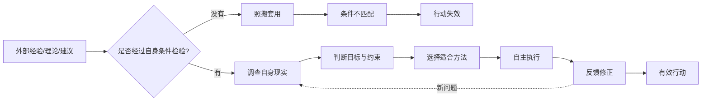

## 毛选思维筑基课: 独立自主是有效行动的前提

### 作者
digoal

### 日期
2026-05-17

### 标签
独立自主 , 有效行动 , 反对本本主义 , 自力更生 , 本地化验证 , 实事求是 , 主体判断 , 反馈闭环 , 毛泽东思想 , 思维筑基

----

## 背景

> 面向对象: 初中生到高中生  
> 核心问题: 为什么照搬别人的成功经验，常常不能解决自己的问题？为什么真正有效的行动，必须先有自己的判断和承担？  
> 先说结论: “独立自主是有效行动的前提”不是拒绝学习别人，而是说任何理论、经验、建议和资源，进入自己的现实处境时，都必须经过自己的调查、判断、选择、执行和修正。不能把外部答案直接当成自己的行动答案。

## 一张图先看懂



## 求真讲法

### 它到底说了什么

“独立自主”不是“谁的话都不听”，也不是“我想怎样就怎样”。它真正说的是: 行动主体必须根据自己的现实条件，形成判断、作出选择，并承担后果。

一个学生看到学霸每天凌晨五点起床背英语，于是也照做。结果白天上课犯困，效率更差。这不是因为早起一定错，而是因为他没有判断自己的睡眠、课程安排、身体状态和学习问题。别人的方法没有经过自己的条件检验，就变成了机械照搬。

所以，“独立自主是有效行动的前提”包含四层意思:

1. 自己调查: 先弄清自己的真实情况。
2. 自己判断: 不把权威、潮流、模板直接当答案。
3. 自己选择: 外部经验只能作为材料，不能替代决策。
4. 自己负责: 行动结果要通过反馈修正，而不是把责任推给别人。

### 它是怎么来的

在《毛泽东选集》的思想体系中，独立自主和“实事求是”“反对本本主义”“中国化”“自力更生”是连在一起的。

它要解决的问题是: 普遍理论和外部经验怎样才能真正进入具体实践？

如果没有独立自主，就容易出现两种错误:

```text
第一种: 教条主义
别人说过、书上写过、上级要求过，所以照做。

第二种: 依赖主义
自己不判断、不建设能力，只等外部资源、外部指令、外部救援。
```

独立自主不是否定理论，而是要求理论必须和具体条件结合；也不是否定外部帮助，而是要求外部帮助不能替代自身能力建设。

### 它依赖哪些假设

把“独立自主是有效行动的前提”当作思维公理，需要接受几个前提:

1. 每个行动主体的条件不同。目标、资源、环境、能力、约束都可能不同。
2. 外部经验有条件。别人的成功往往依赖特定时间、地点、资源和结构。
3. 行动必须有人承担后果。不能只借用别人的结论，却不承担自己的现实结果。
4. 有效行动需要反馈闭环。自主不是一次性决定，而是持续修正。
5. 学习外部经验需要转化能力。不会转化，经验越多，越容易混乱。

这条公理不是说“只靠自己”。独立自主和开放学习并不矛盾。真正独立的人，反而更会学习，因为他知道外部经验是材料，不是命令。

### 常见误解

| 误解 | 为什么不对 | 更准确的说法 |
| --- | --- | --- |
| 独立自主就是不听别人 | 拒绝信息会让判断变窄 | 要广泛学习，但自己判断 |
| 独立自主就是任性 | 任性是不顾事实和后果 | 自主必须基于调查和责任 |
| 自力更生就是不要资源 | 外部资源可以使用 | 关键是不能依赖到失去主体能力 |
| 反对本本主义就是反对读书 | 书本是重要材料 | 反对的是用书本替代现实 |
| 学别人成功方法就能成功 | 成功方法有条件 | 要做本地化检验和改造 |

比如“番茄工作法”对一些人有效，但不是所有人都适合 25 分钟切换。写作、编程、深度阅读可能需要更长的连续时间。独立自主不是不用方法，而是把方法放进自己的任务结构里测试。

## 求存讲法

### 它有什么用

这条公理能帮人避免三类常见失败:

1. 模板失败: 套用别人方案，却不适合自己的条件。
2. 依赖失败: 等别人安排，自己没有判断和能力。
3. 甩锅失败: 行动前不判断，失败后说“别人让我这么做”。

它让我们在行动前问:

1. 我的真实问题是什么？
2. 别人的经验成立条件是什么？
3. 我的条件和他的条件哪里相同，哪里不同？
4. 哪部分可以照用，哪部分必须改造？
5. 如果失败，我如何用反馈修正？

这五问能把“盲目模仿”变成“有判断地学习”。

### 它怎么迁移到熟悉领域

#### 学习

同样是提高数学，有的人缺概念，有的人缺训练，有的人缺审题，有的人缺考试节奏。如果都照搬“每天刷 100 题”，就会浪费大量时间。独立自主的学习，是先诊断自己的主要问题，再选择方法。

#### 写作

别人用标题党获得阅读量，不代表你也应该照搬。如果你的目标是做思维筑基课，核心不是刺激点击，而是建立清晰概念、推导链和迁移能力。写作方法必须服从自己的内容目标。

#### 工作

公司学习“大厂流程”时，如果团队只有 5 个人，却照搬复杂审批、周会、汇报层级，就会拖慢执行。独立自主不是拒绝先进经验，而是判断哪些机制适合当前阶段。

#### 技术

技术选型不能只看流行。一个框架在大规模团队中有效，不代表小项目也需要。选择技术要看团队能力、维护成本、性能要求、生态成熟度和交付周期。

### 它的适用范围和边界

这条公理适合学习方法、组织建设、创业、技术选型、职业规划、写作策略和公共决策。但它也有边界:

1. 不能把独立自主当成拒绝专业建议。医学、法律、工程安全等高风险领域，必须尊重专业知识。
2. 不能用自主掩盖无知。没有调查和学习的“自主”，只是拍脑袋。
3. 不能忽视合作。独立自主是主体判断能力，不是孤立行动。
4. 不能把所有外部约束都当成干扰。规则、标准、伦理和事实边界必须遵守。
5. 不能只强调精神独立，不建设实际能力。没有能力支撑，自主会变成口号。

### 正例: 怎么用它提升能力

假设一个学生英语听力差，看到网上有人推荐“每天听英文新闻一小时”。他没有立刻照搬，而是先做独立判断:

1. 调查自身现实: 听力错题中，主要错在连读、弱读和数字信息。
2. 分析外部经验: 英文新闻语速快、词汇难，适合中高级训练。
3. 判断条件差异: 自己基础还不足，直接听新闻可能挫败感很强。
4. 改造方法: 先用课本听力和慢速材料做精听，每天 20 分钟。
5. 反馈修正: 两周后如果数字题错误下降，再逐步加入新闻片段。

这就是独立自主: 学习别人重视听力输入的原则，但不机械复制具体方法。

### 反例: 前提不成立会怎样

一个小团队看到大公司使用复杂项目管理系统，于是也引入同样流程: 每个需求写长文档，必须多人评审，每天同步两次，每周做大量汇报。结果团队 6 个人中有 3 个人把大量时间花在维护流程上，产品进度反而变慢。

失败原因不是“大公司流程错了”，而是:

1. 没有调查自身团队规模和协作成本。
2. 没有分析外部经验成立条件: 大团队需要流程降低沟通风险，小团队更需要速度和直接沟通。
3. 没有本地化改造，把工具和流程当成答案。
4. 没有及时反馈修正，流程已经拖慢交付，还继续坚持。

如果坚持独立自主，团队会保留必要需求记录和风险检查，删除不适合当前阶段的审批和汇报。

### 一张对照表

| 问题 | 依赖照搬 | 独立自主 |
| --- | --- | --- |
| 学习方法 | 学霸怎么做我就怎么做 | 先诊断自己的主要问题 |
| 技术选型 | 流行什么就用什么 | 看项目约束和维护能力 |
| 写作策略 | 爆款怎么写我就怎么写 | 看读者、目标和内容类型 |
| 团队管理 | 大公司流程直接搬 | 按团队阶段做本地化 |
| 职业规划 | 别人赚钱就跟风 | 看能力、资源、风险承受 |
| 解决问题 | 等别人给答案 | 自己调查、判断、执行、修正 |

### 一个极简 SVG: 外部经验的本地化

<svg width="720" height="250" viewBox="0 0 720 250" xmlns="http://www.w3.org/2000/svg" role="img" aria-label="外部经验本地化示意图">
  <rect x="40" y="75" width="140" height="80" rx="8" fill="#e8f2ff" stroke="#2563eb"/>
  <text x="110" y="108" text-anchor="middle" font-size="15" fill="#111827">外部经验</text>
  <text x="110" y="132" text-anchor="middle" font-size="13" fill="#374151">理论/案例/建议</text>

  <path d="M180 115 L255 115" stroke="#111827" stroke-width="2" marker-end="url(#arrow)"/>
  <text x="218" y="99" text-anchor="middle" font-size="13" fill="#374151">不能直搬</text>

  <rect x="270" y="55" width="180" height="120" rx="10" fill="#fff7ed" stroke="#ea580c"/>
  <text x="360" y="84" text-anchor="middle" font-size="15" fill="#111827">独立判断</text>
  <text x="360" y="110" text-anchor="middle" font-size="13" fill="#374151">自身条件</text>
  <text x="360" y="132" text-anchor="middle" font-size="13" fill="#374151">目标约束</text>
  <text x="360" y="154" text-anchor="middle" font-size="13" fill="#374151">风险责任</text>

  <path d="M450 115 L525 115" stroke="#111827" stroke-width="2" marker-end="url(#arrow)"/>
  <text x="488" y="99" text-anchor="middle" font-size="13" fill="#374151">改造使用</text>

  <rect x="540" y="75" width="140" height="80" rx="8" fill="#f0fdf4" stroke="#16a34a"/>
  <text x="610" y="108" text-anchor="middle" font-size="15" fill="#111827">有效行动</text>
  <text x="610" y="132" text-anchor="middle" font-size="13" fill="#374151">执行/反馈/修正</text>

  <defs>
    <marker id="arrow" markerWidth="10" markerHeight="10" refX="8" refY="3" orient="auto">
      <path d="M0,0 L0,6 L9,3 z" fill="#111827"/>
    </marker>
  </defs>
</svg>

## 思考

### 为什么越是想学习别人，越需要独立自主？

因为不会独立判断的人，看到什么都想学，最后方法互相打架。真正会学习的人，能看出别人经验背后的条件、原则和边界，再选择适合自己的部分。

### 为什么依赖外部答案会削弱行动能力？

因为每一次不判断，都是在放弃训练判断力。久而久之，人会习惯等指令、等模板、等救援。遇到新问题时，就不知道如何从现实出发。

### 为什么独立自主必须和反馈绑定？

因为自主判断也可能错。它不是保证一次判断正确，而是保证你拥有根据现实反馈修正路线的能力。没有反馈，自主容易变成固执。

### 一个反事实问题

如果一个人永远只复制别人成功经验，会发生什么？

他可能短期看起来很勤奋、很会学习，但长期会失去判断具体条件的能力。一旦环境变化，模板失效，他就会不知道该怎么办。

## 最后记住

1. 独立自主不是封闭，而是基于自身条件作判断。
2. 外部经验是材料，不是直接答案。
3. 反对本本主义不是反对读书，而是反对用书本替代现实。
4. 有效行动需要调查、判断、选择、执行和反馈闭环。
5. 真正的自主不是任性，而是能够学习、转化、承担和修正。

## 参考资料

1. 毛泽东: 《反对本本主义》。
2. 毛泽东: 《实践论》。
3. 毛泽东: 《改造我们的学习》。
4. 毛泽东: 《中国革命战争的战略问题》。
5. 《毛泽东选集》第一卷至第四卷，人民出版社通行版本。
6. 马克思主义哲学和组织行动理论中关于实事求是、理论联系实际、主体性与实践反馈的通行教材体系。
  
#### [PostgreSQL 解决方案集合](../201706/20170601_02.md "40cff096e9ed7122c512b35d8561d9c8")
  
  
#### [德哥 / digoal's Github - 公益是一辈子的事.](https://github.com/digoal/blog/blob/master/README.md "22709685feb7cab07d30f30387f0a9ae")
  
  
#### [About 德哥](https://github.com/digoal/blog/blob/master/me/readme.md "a37735981e7704886ffd590565582dd0")
  
  

  
