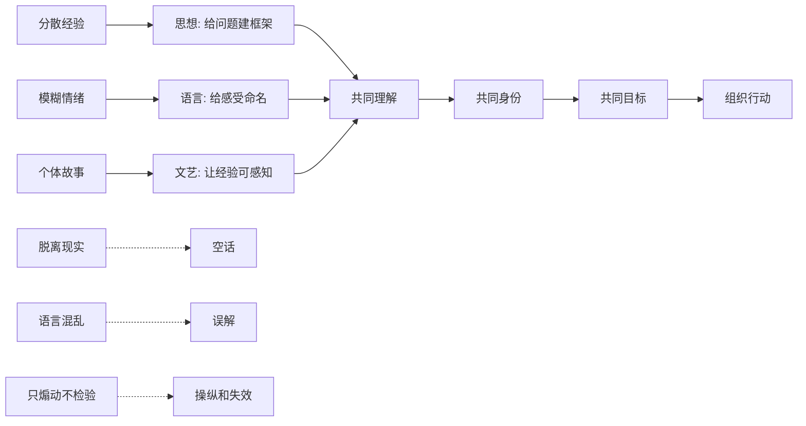

## 毛选思维筑基课: 思想、语言和文艺也是组织力量

### 作者
digoal

### 日期
2026-05-17

### 标签
思想力量 , 语言力量 , 文艺 , 组织力量 , 反对党八股 , 文艺座谈会 , 共同理解 , 表达框架 , 毛泽东思想 , 思维筑基

----

## 背景

> 面向对象: 初中生到高中生  
> 核心问题: 为什么一句话、一篇文章、一首歌、一部电影，有时能让分散的人形成共同理解和行动？  
> 先说结论: 思想、语言和文艺不只是“表达想法”或“好看好听”，它们能把分散经验命名，把模糊情绪说清，把个体感受连接成共同理解，再把共同理解转化为组织行动。但它们必须扎根现实和群众经验，否则就会变成空话、噪音或操纵。

## 一张图先看懂



## 求真讲法

### 它到底说了什么

“思想、语言和文艺也是组织力量”说的是: 人不是只靠命令行动。人要行动，首先要理解自己处在什么问题中，为什么要行动，和谁一起行动，行动有什么意义。

思想提供框架。它回答“我们面对的是什么问题”。  
语言提供命名。它把模糊感受变成可以交流的概念。  
文艺提供感知。它用故事、形象、声音和情绪，让抽象道理进入人的经验。

比如一个班级里很多同学都觉得学习很累，但说不清为什么。如果有人把问题说成“不是你不努力，而是没有区分低效重复和有效训练”，这句话就重新组织了大家的经验。它让原本分散的抱怨，变成可以讨论、可以改进的问题。

所以，语言不是包装纸。好的语言能改变人看问题的方式。

### 它是怎么来的

在《毛泽东选集》的思想体系中，思想、语言、文艺和组织不是分开的。《反对党八股》批评空洞僵硬的文风，《在延安文艺座谈会上的讲话》讨论文艺和人民生活的关系，《改造我们的学习》《整顿党的作风》强调思想方法和作风建设。

这些文章背后的共同问题是: 认识怎样变成群众能理解、能接受、能实践的力量？

如果一个道理只停留在少数人的脑中，它还不是组织力量。它必须经过语言表达、文艺呈现、群众理解、实践检验，才可能变成现实行动。

可以把这个过程看成:

```text
现实经验
  ↓
思想提炼
  ↓
语言表达
  ↓
文艺感知
  ↓
共同理解
  ↓
组织行动
  ↓
实践反馈
```

这就是为什么文风、话语、故事和表达对象很重要。说给谁听，就要从谁的经验出发。

### 它依赖哪些假设

把“思想、语言和文艺也是组织力量”当作思维公理，需要接受几个前提:

1. 人的行动受理解影响。人不只被利益推动，也被意义、身份和解释框架影响。
2. 分散经验需要命名。没有合适语言，很多真实问题会停留在模糊感受中。
3. 共同语言可以降低协作成本。大家对问题有相近理解，行动更容易一致。
4. 文艺能把抽象道理变成可感受的经验。人常常先被故事打动，再理解道理。
5. 表达必须接受现实检验。语言如果脱离事实和群众经验，短期能喊响，长期会失效。

这条公理不是说“只要会说话就能组织”。表达只是组织力量的一部分，还需要真实问题、行动机制、反馈修正和责任承担。

### 常见误解

| 误解 | 为什么不对 | 更准确的说法 |
| --- | --- | --- |
| 语言只是包装 | 语言会影响人如何理解问题 | 语言也是认知结构 |
| 文艺只是娱乐 | 文艺能保存经验、塑造情感和共同记忆 | 文艺有认识和组织功能 |
| 口号响亮就有力量 | 空口号没有事实和行动支撑会失效 | 有力量的语言必须连接现实 |
| 思想越抽象越高级 | 抽象但不能解释现实就是空转 | 好思想能回到具体问题 |
| 打动人就等于正确 | 情绪感染不能替代事实检验 | 感动之后还要看逻辑和实践 |

比如“努力就会成功”很容易打动人，但它过于粗糙。它忽略了方法、资源、反馈、阶段和身体条件。相比之下，“有效努力要有目标、方法、反馈和复盘”虽然没那么像口号，却更能组织行动。

## 求存讲法

### 它有什么用

这条公理能帮助我们理解写作、演讲、教育、管理、传播和文艺作品的真实作用。

它让我们问:

1. 这套思想是否解释了真实问题？
2. 这套语言是否让人更清楚，还是更糊涂？
3. 这个故事是否连接了人的真实经验？
4. 它是否形成共同理解和共同目标？
5. 它是否能进入行动，而不只是制造情绪？

好的表达不是把话说漂亮，而是让人更准确地看见现实，并知道下一步怎样行动。

### 它怎么迁移到熟悉领域

#### 学习

老师讲“你们要认真”，学生可能听完就忘。但如果老师说“你们现在最大问题不是不努力，而是错题没有分类，导致同一种错误重复发生”，学生就更容易行动。因为后者把模糊批评变成了具体问题。

#### 写作

写作不是堆金句。真正有力量的文章，能为读者命名困惑、拆出结构、提供判断标准，让读者读完后看问题的方式改变。

#### 管理

管理中的语言很关键。领导说“大家提高效率”很空；说“本周减少重复沟通，把需求入口统一到一个表，每天下午 5 点确认阻塞问题”就能组织行动。

#### 文艺

一部电影或小说，如果只是喊道理，读者会反感。但如果它通过人物命运、冲突和选择，让人看见某种社会处境，人就可能真正理解一个抽象问题。

### 它的适用范围和边界

这条公理适合分析教育、写作、宣传、文艺、组织沟通、品牌传播和社会动员。但它有清晰边界:

1. 思想不能替代事实。再完整的理论，也要回到现实材料中检验。
2. 语言不能替代行动。说清楚只是开始，执行机制才让改变发生。
3. 文艺不能只剩立场。没有人物、细节和真实经验，作品会变成说明书。
4. 情绪不能替代判断。让人激动不等于让人理解。
5. 表达不能脱离对象。说给学生、工人、工程师、投资人、家长听，语言和例子都要不同。

### 正例: 怎么用它提升能力

假设你要写一篇文章，帮助同学理解“为什么刷题很多但成绩不涨”。

普通写法可能是:

```text
大家要努力，要坚持，要相信自己。
```

这种话听起来积极，但组织不了行动。更有效的写法是:

1. 命名问题: “低效重复不是努力，而是在同一错误上原地打转。”
2. 建立框架: 把错题分成概念错、方法错、审题错、计算错、时间分配错。
3. 给出语言: “错题不是失败记录，而是训练地图。”
4. 设计行动: 每天只复盘一类高频错误，并用新题检验。
5. 接受反馈: 一周后看同类错误是否减少。

这时，思想提供框架，语言改变理解，文章组织行动。

### 反例: 前提不成立会怎样

一个学校社团想提高凝聚力，于是反复喊“我们是最强团队”“大家要有使命感”。但社团活动混乱、分工不清、成员意见没人听，口号越喊越多，参与的人反而越来越少。

失败原因不是“语言没用”，而是语言失去了组织力量的前提:

1. 语言没有连接真实问题。成员的问题是分工和反馈，不是缺口号。
2. 思想没有形成可执行框架。只讲使命，没有任务结构。
3. 情绪动员没有行动机制。喊完之后不知道谁做什么。
4. 表达没有接受反馈。成员已经冷淡，组织者还以为是不够热血。

这说明，脱离现实的语言会变成噪音，甚至削弱信任。

### 一张对照表

| 维度 | 无效表达 | 有组织力的表达 |
| --- | --- | --- |
| 思想 | 抽象口号 | 能解释真实问题的框架 |
| 语言 | 华丽但模糊 | 准确命名关键矛盾 |
| 文艺 | 只讲立场 | 用人物和情境承载经验 |
| 情绪 | 短暂刺激 | 和理解、行动连接 |
| 对象 | 不分听众 | 从对象经验出发 |
| 结果 | 热闹后消散 | 形成共识和行动 |

### 一个极简 SVG: 表达如何组织行动

<svg width="720" height="250" viewBox="0 0 720 250" xmlns="http://www.w3.org/2000/svg" role="img" aria-label="思想语言文艺组织行动示意图">
  <rect x="35" y="75" width="130" height="80" rx="8" fill="#e8f2ff" stroke="#2563eb"/>
  <text x="100" y="106" text-anchor="middle" font-size="15" fill="#111827">真实经验</text>
  <text x="100" y="130" text-anchor="middle" font-size="13" fill="#374151">问题/情绪/故事</text>

  <path d="M165 115 L230 115" stroke="#111827" stroke-width="2" marker-end="url(#arrow)"/>

  <rect x="245" y="45" width="150" height="140" rx="10" fill="#fff7ed" stroke="#ea580c"/>
  <text x="320" y="78" text-anchor="middle" font-size="15" fill="#111827">表达加工</text>
  <text x="320" y="106" text-anchor="middle" font-size="13" fill="#374151">思想框架</text>
  <text x="320" y="130" text-anchor="middle" font-size="13" fill="#374151">语言命名</text>
  <text x="320" y="154" text-anchor="middle" font-size="13" fill="#374151">文艺呈现</text>

  <path d="M395 115 L460 115" stroke="#111827" stroke-width="2" marker-end="url(#arrow)"/>

  <rect x="475" y="75" width="100" height="80" rx="8" fill="#f0fdf4" stroke="#16a34a"/>
  <text x="525" y="106" text-anchor="middle" font-size="15" fill="#111827">共同理解</text>
  <text x="525" y="130" text-anchor="middle" font-size="13" fill="#374151">共识/身份</text>

  <path d="M575 115 L620 115" stroke="#111827" stroke-width="2" marker-end="url(#arrow)"/>

  <rect x="625" y="75" width="70" height="80" rx="8" fill="#fdf2f8" stroke="#db2777"/>
  <text x="660" y="106" text-anchor="middle" font-size="15" fill="#111827">行动</text>
  <text x="660" y="130" text-anchor="middle" font-size="13" fill="#374151">组织</text>

  <defs>
    <marker id="arrow" markerWidth="10" markerHeight="10" refX="8" refY="3" orient="auto">
      <path d="M0,0 L0,6 L9,3 z" fill="#111827"/>
    </marker>
  </defs>
</svg>

## 思考

### 为什么语言能改变现实？

语言不能像工具一样直接搬动物体，但它能改变人的理解、判断和协作方式。一个问题被准确命名后，人们就更容易讨论它、识别它、处理它。

### 为什么空话会伤害组织？

空话让人以为问题已经被处理，其实只是被遮盖。长期听空话的人，会降低信任，不再相信表达和行动之间有联系。

### 为什么文艺比道理更容易进入人心？

因为人不是纯逻辑机器。很多道理要通过人物、情境、冲突和命运，才会变得可感。文艺让人先“看见”和“感到”，再进一步理解。

### 一个反事实问题

如果一个组织只会下命令，不会解释意义、命名问题、讲清目标，会发生什么？

它可能短期能推动执行，但长期会让成员只做表面动作。因为人不知道为什么做、怎样判断好坏、遇到变化如何调整，组织就会越来越依赖外部命令。

## 最后记住

1. 思想提供框架，语言提供命名，文艺提供可感经验。
2. 它们能把分散经验变成共同理解，再推动组织行动。
3. 有组织力的表达必须连接真实问题和具体对象。
4. 口号、情绪和漂亮话不能替代事实、行动和反馈。
5. 写作、教育、管理和文艺的关键，不只是表达自己，而是帮助别人更清楚地看见现实。

## 参考资料

1. 毛泽东: 《反对党八股》。
2. 毛泽东: 《在延安文艺座谈会上的讲话》。
3. 毛泽东: 《改造我们的学习》。
4. 毛泽东: 《整顿党的作风》。
5. 《毛泽东选集》第一卷至第四卷，人民出版社通行版本。
6. 传播学、修辞学、文艺理论和组织沟通中关于语言、叙事、共同意义与集体行动的通行教材体系。
  
#### [PostgreSQL 解决方案集合](../201706/20170601_02.md "40cff096e9ed7122c512b35d8561d9c8")
  
  
#### [德哥 / digoal's Github - 公益是一辈子的事.](https://github.com/digoal/blog/blob/master/README.md "22709685feb7cab07d30f30387f0a9ae")
  
  
#### [About 德哥](https://github.com/digoal/blog/blob/master/me/readme.md "a37735981e7704886ffd590565582dd0")
  
  

  
