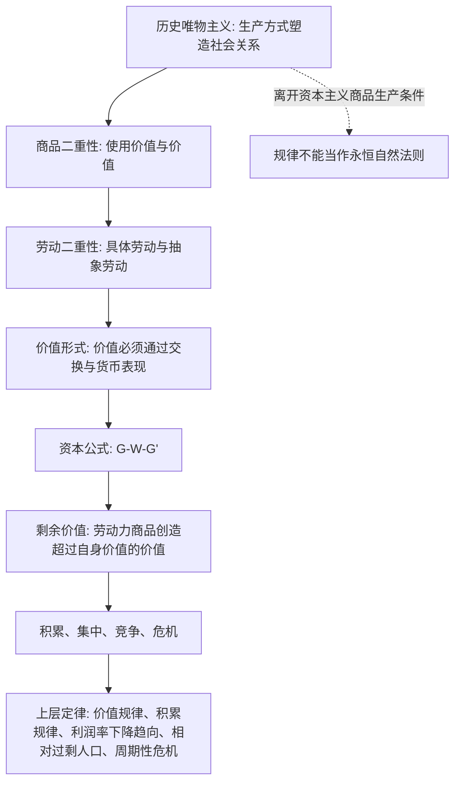

## 马哲思维筑基课: 《资本论》中的底层公理与上层定律

### 作者
digoal

### 日期
2026-05-17

### 标签
资本论 , 马克思 , 恩格斯 , 底层公理 , 上层定律 , 历史唯物主义 , 商品二重性 , 剩余价值 , 资本积累 , 危机规律

----

## 背景

> 面向对象: 高中生到大学低年级读者  
> 核心问题: 《资本论》里到底哪些是马克思、恩格斯哲学思想的底层前提，哪些是由这些前提推出的经典规律？  
> 先说结论: 《资本论》不是把哲学公理写成数学公理的书，而是把资本主义生产方式当作一个历史系统来解剖。它的底层前提是“物质生产决定社会关系的基本形态”“社会关系通过商品、货币、资本这些形式表现出来”“资本以增殖为目的并支配劳动”；上层规律则包括价值规律、剩余价值规律、资本积累规律、利润率趋向下降规律、相对过剩人口规律、危机规律等。

## 一张图先看懂



## 求真讲法

### 先界定: “公理”和“定律”怎么理解

《资本论》不是欧几里得几何式的公理系统。这里把“底层公理”理解为马克思批判政治经济学时反复依赖的基本前提；把“上层定律”理解为在这些前提成立时，资本主义生产方式内部反复出现的结构性规律。

这一区分很重要。比如“价值由社会必要劳动时间决定”既像定义，也像规律；“剩余价值来源于雇佣劳动”既是理论核心，也是一条解释资本主义利润来源的机制命题。为了便于理解，本文按“底层前提 -> 中层机制 -> 上层规律”来归类。

### 底层公理一: 物质生产优先于观念解释

人首先要吃、穿、住、生产生活资料，然后才有政治、法律、宗教、哲学等上层观念形态。社会不是由纯观念任意创造出来的，人的意识、制度和道德判断，要放回具体的生产方式与物质生活条件中理解。

这就是历史唯物主义在《资本论》中的基本姿态: 不先问“资本家好不好”“工人懒不懒”，而先问“这个生产方式如何组织劳动、财产、交换和分配”。

### 底层公理二: 人不是孤立个人，而是处在社会生产关系中

《资本论》分析的不是抽象孤立的个人，而是资本家、雇佣工人、地主、商人、货币所有者等社会关系中的人。个人行为当然重要，但它经常被制度位置约束。

资本家不是因为个人道德特殊才追逐利润，而是因为资本的存在方式就是价值增殖；工人不是因为天生贫穷才出卖劳动力，而是因为生产资料与劳动者分离。

### 底层公理三: 劳动是人与自然之间的物质变换

劳动不是单纯的辛苦，而是人为了生活而改造自然、生产使用价值的活动。任何社会都需要劳动和使用价值，但只有在商品社会中，劳动成果才普遍以商品形式出现。

所以《资本论》不是简单赞美劳动，而是区分两件事: 作为生活基础的劳动，以及在资本主义下被价值增殖逻辑支配的雇佣劳动。

### 底层公理四: 商品具有二重性

商品一方面有使用价值，即能满足某种需要；另一方面有价值，即作为社会劳动的凝结，可以在交换中同别的商品发生比例关系。

这是一切后续分析的入口。只看使用价值，就会把资本主义看成普通的物品生产；只看价格波动，又会看不到背后的社会劳动关系。

### 底层公理五: 劳动也具有二重性

生产商品的劳动也有两面: 具体劳动生产具体使用价值，抽象劳动形成价值。木匠做桌子、裁缝做衣服，这是具体劳动；当它们在市场上被折算为可比较的价值量时，就表现为抽象劳动。

马克思认为这是理解政治经济学的关键。没有劳动二重性，就很难解释为什么完全不同的商品能在市场上被比较、交换、折算。

### 底层公理六: 价值必须通过形式表现出来

价值不是商品上能直接看见的自然属性，它必须通过交换关系、货币、价格等形式表现。于是，社会关系会倒过来表现为物与物的关系。

这就是商品拜物教的基础: 人们以为是商品、货币、资本自己有神秘力量，实际上是人与人的生产关系披上了物的外衣。

### 底层公理七: 劳动力成为商品，是资本主义的特殊前提

资本主义不是有市场、有货币就够了。关键在于劳动力本身成为商品: 工人在人身上是自由的，可以出卖劳动力；但又不占有足够生产资料，不得不出卖劳动力。

这解释了为什么资本主义剥削不主要表现为人身强迫，而表现为“等价交换”之下的剩余价值生产。

### 底层公理八: 资本不是物，而是自我增殖的价值关系

机器、厂房、货币本身不必然是资本。只有当它们进入“货币 -> 商品 -> 更多货币”的循环，并以获取剩余价值为目的时，才成为资本。

因此资本不是一堆东西，而是一种社会关系: 它通过支配劳动力和生产资料，让价值不断增殖。

## 中层机制: 从公理到规律的桥

| 层次 | 核心命题 | 它解决的问题 |
|---|---|---|
| 商品二重性 | 商品同时是使用价值和价值 | 为什么物品能成为交换关系中的商品 |
| 劳动二重性 | 具体劳动造使用价值，抽象劳动形成价值 | 为什么不同劳动产品能比较 |
| 价值形式 | 价值必须通过货币、价格表现 | 为什么社会关系表现为物的关系 |
| 劳动力商品 | 劳动力能创造超过自身价值的价值 | 利润和剩余价值从哪里来 |
| 资本循环 | 资本运动目标是 G-W-G' | 为什么生产服从增殖而非单纯需要 |
| 竞争机制 | 单个资本被迫提高效率、扩大积累 | 为什么资本逻辑不依赖个人善恶 |

## 经典上层定律

### 1. 价值规律

商品价值量由生产该商品所需要的社会必要劳动时间决定。市场价格会围绕价值波动，但不能长期脱离社会劳动耗费。

简单说: 个别人花了十天做一件别人一天能做完的东西，市场不会按十天奖励他；社会承认的是平均技术条件和平均熟练程度下必要的劳动时间。

### 2. 剩余价值规律

资本主义利润的根源不是低买高卖，而是劳动力商品的特殊性: 工人一天创造的价值，可以超过维持其劳动力再生产所需要的价值。超过部分就是剩余价值。

这条规律是《资本论》的中心。它解释了为什么形式上看似平等的工资交换，仍然可以产生资本对劳动的剥削。

### 3. 绝对剩余价值与相对剩余价值规律

资本提高剩余价值有两种基本路径: 延长工作日或提高劳动强度，叫绝对剩余价值生产；通过技术、组织和生产率提升，缩短必要劳动时间，叫相对剩余价值生产。

这解释了为什么资本主义既会压榨时间，也会推动技术进步。技术进步不只是“人类理性进步”，还被资本增殖逻辑强烈塑造。

### 4. 资本积累规律

剩余价值转化为追加资本，资本就会不断扩大再生产。资本家之间的竞争迫使每个资本家不断积累，否则就会被更高效率、更大规模的资本淘汰。

所以积累不是个人贪婪的偶然结果，而是资本作为社会关系的内在要求。

### 5. 资本集中与资本集聚规律

积累会带来资本规模扩大，这是集聚；竞争、兼并、信用和破产会让较多资本控制在更少主体手里，这是集中。

这条规律解释了为什么资本主义发展常常伴随大企业、金融控制力、平台化和行业寡头化。

### 6. 相对过剩人口规律

资本积累并不自动让所有劳动者稳定就业。机器、技术、周期性波动和产业结构变化，会制造一支相对过剩人口，也就是产业后备军。

它的功能是给工资和劳动条件施加压力，使资本在扩张时有可雇佣劳动力，在收缩时又能把失业风险转嫁给劳动者。

### 7. 利润率趋向下降规律

竞争推动资本家采用更多机器、设备和技术，资本有机构成提高。如果剩余价值主要来自活劳动，那么在其他条件不变时，平均利润率会出现下降趋向。

这不是说利润率每天、每年必然下降，而是说资本主义有一种内在压力。马克思也讨论了反作用因素，例如提高剥削率、压低工资、降低不变资本要素价格、对外贸易等。

### 8. 平均利润率与生产价格规律

不同部门资本构成不同，直接按价值交换会导致利润率差异很大。竞争会推动资本流向高利润部门，最终形成平均利润率，商品也会围绕生产价格运动。

这说明《资本论》不是停留在“价值等于价格”的粗糙说法，而是解释价值如何通过竞争和资本流动转化为更复杂的价格形式。

### 9. 社会再生产与比例失衡规律

社会总资本再生产需要不同部门之间保持一定比例，例如生产资料部门和消费资料部门之间要能衔接。一旦比例失衡，商品卖不出去、资本循环中断，就会出现危机。

这条规律把危机从“偶然管理失误”提升为系统性问题: 资本主义生产是私人决策，结果却需要社会总协调。

### 10. 资本主义危机规律

资本主义危机不是因为物品绝对太多，而是因为相对于有支付能力的需求而言“过剩”。一边是生产能力扩大，另一边是工资和消费能力受限，资本增殖链条就会断裂。

危机表现为过剩生产、信用收缩、企业破产、失业增加、资产贬值。它既破坏生产力，也为下一轮资本重组创造条件。

### 11. 商品拜物教规律

在商品社会中，人与人的社会关系表现为物与物的关系。人们容易把价格、货币、资本看成天然有力量的东西，而忘记它们背后是特定的社会劳动关系。

这不仅是经济学命题，也是哲学命题: 它说明资本主义社会中的意识形态不是简单谎言，而是现实社会关系的颠倒表现。

## 求存讲法

### 它有什么用

这套公理和规律的用处，不是让人背诵几个术语，而是提供一种系统视角: 当看到工资、利润、技术进步、失业、危机、平台垄断、金融扩张时，不只问“谁好谁坏”，还要问“这个结构如何迫使参与者这样行动”。

### 怎么迁移到现实分析

```text
表面现象: 商品涨价、企业裁员、平台扩张、技术替代
    ↓
不要立刻道德化解释
    ↓
追问: 生产资料归谁? 劳动力如何被组织? 价值如何实现?
    ↓
判断: 是短期管理问题，还是资本增殖逻辑下的结构性压力?
```

### 正例: 分析自动化裁员

如果一家企业用自动化设备替代部分岗位，表面看是技术选择。用《资本论》的框架看，还要追问: 自动化是否降低单位商品价值？是否提高相对剩余价值？是否扩大资本有机构成？是否制造相对过剩人口并压低议价能力？

这样分析，就不会把问题简单归因于“老板坏”或“技术坏”，而能看到技术、竞争、利润率、就业之间的结构联系。

### 反例: 把所有市场现象都套成《资本论》规律

如果一个社会不存在普遍商品生产、雇佣劳动、资本增殖和劳动力商品化，那么《资本论》中许多规律就不能直接套用。比如家庭内部的互助劳动、古代贡赋关系、计划分配体系，都不能简单说成同一种资本逻辑。

这说明《资本论》的规律有历史边界。它批判的是资本主义生产方式，不是把所有人类行为都还原成资本。

## 思考

1. 如果资本主义的剥削常常通过“自由契约”和“等价交换”实现，那么只看法律形式是否平等，够不够理解社会关系？
2. 如果技术进步既能提高生产力，也能强化资本对劳动的支配，那么技术到底是中性的，还是会被制度关系塑形？
3. 如果危机不是因为社会没有生产能力，而是因为价值实现受阻，那么“贫困中的过剩”说明了什么？
4. 如果商品拜物教是真实社会关系的颠倒表现，那么批判意识形态能不能只靠“告诉人们真相”？

## 最后记住

1. 《资本论》的底层不是道德控诉，而是历史唯物主义和辩证法的社会结构分析。
2. 商品二重性、劳动二重性、劳动力商品化，是通向剩余价值理论的三把钥匙。
3. 资本不是物，而是以价值增殖为目的的社会关系。
4. 价值规律、剩余价值规律、积累规律、相对过剩人口规律、利润率下降趋向和危机规律，是《资本论》的经典上层规律。
5. 这些规律不是超历史自然法则，它们成立于资本主义商品生产和雇佣劳动关系占支配地位的条件下。

## 参考资料

- 马克思: 《资本论》第一卷，特别是“商品”“货币或商品流通”“绝对剩余价值的生产”“相对剩余价值的生产”“资本的积累过程”等部分。
- 马克思: 《资本论》第二卷，关于资本循环、周转和社会总资本再生产的分析。
- 马克思: 《资本论》第三卷，关于平均利润率、生产价格、利润率趋向下降规律和信用的分析。
- 恩格斯: 《反杜林论》《路德维希·费尔巴哈和德国古典哲学的终结》，可作为理解马克思主义哲学表达的辅助文本。
- 说明: 本文基于通行的马克思主义政治经济学和哲学教材体系做结构化概括；“公理”是教学性重构，不是马克思、恩格斯在原书中使用的形式化术语。
  
#### [PostgreSQL 解决方案集合](../201706/20170601_02.md "40cff096e9ed7122c512b35d8561d9c8")
  
  
#### [德哥 / digoal's Github - 公益是一辈子的事.](https://github.com/digoal/blog/blob/master/README.md "22709685feb7cab07d30f30387f0a9ae")
  
  
#### [About 德哥](https://github.com/digoal/blog/blob/master/me/readme.md "a37735981e7704886ffd590565582dd0")
  
  

  
