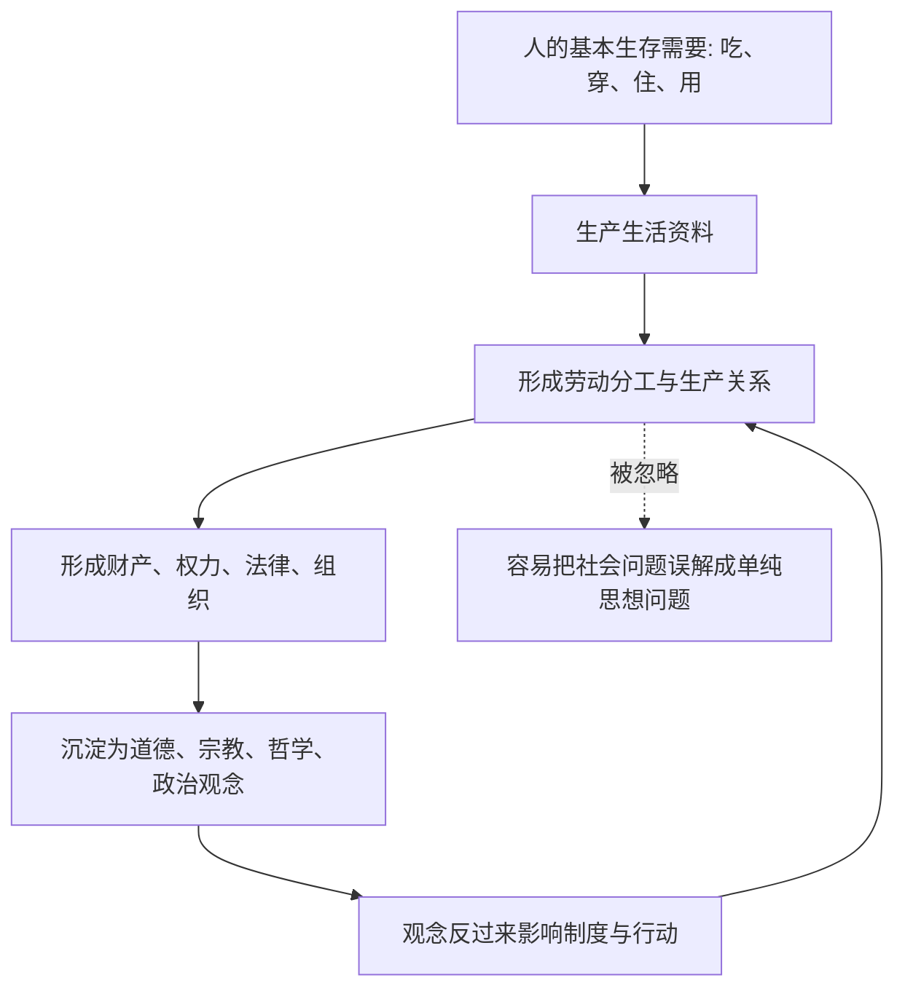

## 马哲思维筑基课: 物质生产优先于观念解释

### 作者
digoal

### 日期
2026-05-17

### 标签
物质生产 , 观念解释 , 历史唯物主义 , 生产方式 , 社会关系 , 上层建筑 , 制度分析 , 意识形态 , 马克思主义哲学 , 结构分析

----

## 背景

> 面向对象: 高中生到大学低年级读者  
> 核心问题: 为什么马克思主义解释社会时，总是先看人们怎样生产生活资料，而不是先看人们相信什么观念？  
> 先说结论: “物质生产优先于观念解释”不是说思想不重要，也不是说经济能解释一切；它说的是，若要理解一个社会的制度、法律、道德和观念，必须先看这个社会怎样组织衣食住行、劳动分工、生产资料和分配关系。

## 一张图先看懂



## 求真讲法

### 它到底说了什么

这句话可以拆成两层:

第一层，人类社会不是先有纯粹思想，再从思想里长出生活。人必须先解决吃饭、居住、劳动、工具、资源和协作问题，然后才有稳定的学校、法律、国家、宗教、哲学和艺术。

第二层，观念不是凭空飘在天上的东西。很多观念看似纯精神，背后常常有具体的生活条件、生产方式和社会关系。例如，一个社会为什么重视家族、契约、效率、服从、自由或竞争，往往不能只从“大家怎么想”解释，还要看人们怎样谋生、怎样合作、谁掌握资源、谁承担风险。

更正式地说: 物质生活的生产方式，制约社会生活、政治生活和精神生活的一般过程。这里的“制约”不是机械决定，而是提供问题、边界、压力和可能性。

### 它是怎么来的

这个观点的动机很直接: 反对把历史解释成少数伟人思想、抽象理念或道德观念自动展开的过程。

比如解释资本主义社会，如果只说“人们更爱自由、更重视契约、更追求财富”，就会漏掉更底层的问题: 为什么劳动力会成为商品？为什么大量人必须出卖劳动力？为什么企业必须不断扩大生产？为什么竞争会迫使技术更新和成本压缩？

马克思、恩格斯的处理方式是: 先看生产方式，再看制度和观念。不是因为制度和观念不重要，而是因为它们通常是在特定物质生活条件中生成、运转和变化的。

### 它依赖哪些假设

| 假设 | 含义 | 如果不成立会怎样 |
|---|---|---|
| 人有基本生存需要 | 人必须获得食物、住所、工具和生活资料 | 社会分析会变成纯观念游戏 |
| 生产需要协作 | 大多数生活资料不是孤立个人凭空获得的 | 很难解释分工、组织和权力 |
| 生产资料分配不均 | 土地、工具、机器、资本等资源归属会影响人际关系 | 阶级、雇佣、依附关系会被看轻 |
| 观念有现实功能 | 观念会解释、维护、批判或改变现实关系 | 会误以为观念只是口号 |
| 历史条件会变化 | 不同生产方式会形成不同制度和观念 | 容易把某个时代的观念当成永恒真理 |

### 常见误解

误解一: “物质生产优先”就是“经济决定一切”。

不对。它说的是解释顺序和基础约束，不是说所有事情都能被工资、价格、利润直接解释。战争、宗教、民族、法律、科技、个人选择都可能产生真实影响，只是这些影响要放回具体社会条件中理解。

误解二: “观念只是假的、没用的”。

也不对。观念可以组织人、动员人、约束人，也可以改变制度。只是观念要发生力量，通常需要同利益、组织、资源、技术和现实矛盾结合。

误解三: “先看生产”就是只看工厂。

不对。物质生产包括农业、工业、服务业、数字平台、家庭再生产、教育训练、基础设施、能源、物流等。现代社会里，代码、数据中心、算法平台也属于生产和再生产结构的一部分。

## 求存讲法

### 它有什么用

它的主要作用是让我们分析社会问题时少一点空泛道德评判，多一点结构追问。

当看到一个现象时，不只问“大家为什么这么想”，还要问:

```text
谁在生产？
用什么工具生产？
生产资料归谁？
产品如何分配？
风险由谁承担？
哪些观念在解释、维护或挑战这种关系？
```

这样能把“观念冲突”还原到更深层的生活条件和利益结构中。

### 它怎么迁移到熟悉领域

#### 学校例子

如果一个班级总说“要自觉学习”，但学生每天睡眠不足、通勤很长、课程负担过重，那么只讲观念教育就不够。要先看学习活动的物质条件: 时间、身体、工具、空间、评价制度。

#### 公司例子

如果公司反复强调“主人翁精神”，但员工没有决策权、没有收益分享、没有稳定预期，那么这种观念很难长期有效。因为观念和生产关系不匹配。

#### 技术例子

如果一个平台宣称“连接让世界更美好”，也要看它的收入模式、流量分配、劳动外包、数据占有和算法控制。否则容易把商业结构包装成纯粹价值观。

### 它的适用范围和边界

这个观点适合分析长期、结构性、群体性的社会现象，尤其适合分析制度、阶级、组织、产业、技术和意识形态之间的关系。

它不适合粗暴解释每一个个人选择。一个人喜欢某种音乐、选择某个朋友、突然改变想法，不能都简单归因于生产方式。个体心理、偶然事件、文化传统和创造性都有独立意义。

更准确的用法是: 对大规模社会现象，先查物质生产和社会关系；对具体个人行动，再补充心理、文化、历史和偶然因素。

### 正例: 怎么用它提升能力

假设你想理解“为什么短视频平台上情绪化内容更容易传播”。

浅层解释是: “现在的人浮躁。”  
更结构化的解释是:

1. 平台靠注意力变现。
2. 算法偏好高停留、高互动内容。
3. 创作者为了生存和收益，倾向生产更强刺激的内容。
4. 用户在碎片化时间里消费内容，复杂论证不占优势。
5. “情绪化表达”于是从个人风格变成平台生产关系中的稳定策略。

这就是从物质生产和组织结构解释观念形态: 不是否认人会浮躁，而是追问什么结构持续制造这种表达。

### 反例: 前提不成立会怎样

假设你分析一个学生为什么突然讨厌数学，直接套用“物质生产决定观念”，说这是生产方式造成的。这个解释就太粗。

因为这里的对象是一个具体个人、一个短期心理变化。更可能的因素包括: 最近一次考试失败、老师反馈方式、同伴比较、家庭压力、睡眠不足、学习方法不合适。宏观生产方式可能构成背景，但不能替代具体分析。

这个反例说明: 该观点的强项是解释社会结构，不是替代所有层面的心理学、教育学和个案判断。

## 思考

1. 如果一个社会反复宣传某种美德，但现实制度不断奖励相反行为，我们应该相信口号，还是先分析制度怎样分配利益？
2. 如果观念可以反过来改变现实，那么为什么有些观念很快消失，有些观念却能长期动员大量人？
3. 当数字平台、算法和数据成为生产资料时，“物质生产”是否已经不只是机器和工厂？
4. 如果一个人的想法并不完全由环境决定，那么“物质生产优先”怎样避免变成机械决定论？

## 最后记住

1. “物质生产优先于观念解释”是一种解释顺序: 先看人们如何生产和生活，再看观念如何形成。
2. 它不是“经济决定一切”，而是说物质生活条件为制度和观念提供基础约束。
3. 观念不是没用，它会反作用于现实，但反作用通常需要组织、资源和社会矛盾作为条件。
4. 这个观点最适合分析长期、结构性、群体性的社会现象，不适合粗暴解释每个个体选择。
5. 用它分析问题时，关键问题是: 谁生产、用什么生产、归谁所有、如何分配、由什么观念来解释和维护。

## 参考资料

- 马克思、恩格斯: 《德意志意识形态》，关于现实的人、物质生活生产和意识关系的论述。
- 马克思: 《〈政治经济学批判〉序言》，关于物质生活生产方式制约社会生活、政治生活和精神生活过程的经典表述。
- 恩格斯: 《路德维希·费尔巴哈和德国古典哲学的终结》，关于历史唯物主义与德国古典哲学关系的说明。
- 马克思: 《资本论》第一卷，关于商品、劳动过程、价值形式和资本主义生产过程的分析。
- 说明: 本文基于通行马克思主义哲学与政治经济学教材体系做教学性重构；“公理”是便于理解的抽象说法，不是马克思、恩格斯原文中的形式化公理。
  
#### [PostgreSQL 解决方案集合](../201706/20170601_02.md "40cff096e9ed7122c512b35d8561d9c8")
  
  
#### [德哥 / digoal's Github - 公益是一辈子的事.](https://github.com/digoal/blog/blob/master/README.md "22709685feb7cab07d30f30387f0a9ae")
  
  
#### [About 德哥](https://github.com/digoal/blog/blob/master/me/readme.md "a37735981e7704886ffd590565582dd0")
  
  

  
