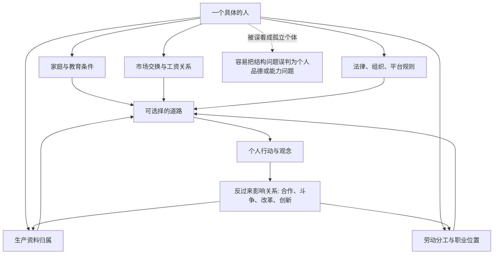

## 马哲思维筑基课: 人不是孤立个人，而是处在社会生产关系中

### 作者
digoal

### 日期
2026-05-17

### 标签
社会生产关系 , 现实个人 , 生产资料 , 劳动分工 , 雇佣关系 , 结构约束 , 个人选择 , 马克思主义哲学 , 关系性个人 , 社会分析

----

## 背景

> 面向对象: 高中生到大学低年级读者  
> 核心问题: 为什么马克思主义分析社会时，不把人只看成“想做什么就做什么”的孤立个人，而要看他处在什么生产关系里？  
> 先说结论: 这个命题不是否认个人选择，而是提醒我们: 人的选择、能力、欲望和观念，总是在一定的家庭、劳动分工、财产归属、组织制度、市场交换和权力关系中形成并发挥作用。

## 一张图先看懂



## 求真讲法

### 它到底说了什么

“人不是孤立个人”不是说个人没有思想、意志和责任，而是说个人从来不是在真空里行动。

一个人能不能上学、学什么技能、找什么工作、怎样获得收入、能不能创业、有没有议价能力，都不是只由“个人努力”决定。它还取决于家庭资源、社会分工、生产资料归属、行业结构、法律制度、组织规则和市场位置。

在马克思主义语境中，“社会生产关系”指人们在生产、交换、分配和消费过程中形成的关系。比如谁拥有土地、机器、资本、数据和平台；谁出卖劳动力；谁组织生产；谁承担风险；谁分配收益。

所以，这个命题的核心是: 要理解一个人的行动，不能只问“他想什么”，还要问“他站在什么关系位置上”。

### 它是怎么来的

这个观点是对抽象个人主义解释的修正。

抽象个人主义常常把社会理解成一个个独立个人的简单相加: 每个人自由选择，结果自然形成社会秩序。这个视角能解释一部分日常行为，但解释不了很多结构性问题。

比如，为什么有些人“自由地”出卖劳动力？为什么企业老板和员工在法律上都是自由主体，但在谈判中力量并不相等？为什么同样努力的人，因为家庭、地区、行业和资产位置不同，会面对完全不同的选择空间？

马克思、恩格斯强调现实的人，不是哲学想象中的孤立人，而是在一定历史条件下从事生产和交往的人。人创造社会关系，但人也在既有社会关系中开始行动。

### 它依赖哪些假设

| 假设 | 含义 | 如果不成立会怎样 |
|---|---|---|
| 人必须通过社会获得生活资料 | 大多数人不能脱离他人协作独立生存 | 孤立个人模型会显得更合理 |
| 生产资料有归属关系 | 土地、机器、资本、平台、数据归谁，会影响行动空间 | 阶级、雇佣、依附关系难以解释 |
| 分工改变人的位置 | 不同职业、岗位和组织角色有不同权力与风险 | 会把岗位差异误解成纯个人差异 |
| 制度会塑造选择 | 法律、市场、学校、公司规则限制和引导行为 | “自由选择”会被理解得过于简单 |
| 人能反作用于关系 | 人不是结构的木偶，可以合作、斗争、改革和创造 | 会滑向机械决定论 |

### 常见误解

误解一: “人处在社会关系中”就是“个人不重要”。

不对。这个命题不是取消个人，而是让个人变得更具体。抽象地说“一个人很努力”信息太少；具体地看，他在哪个行业、有什么资源、受什么规则约束、能调动什么组织力量，才更接近真实。

误解二: “社会关系决定一切，所以个人不用负责”。

也不对。社会关系会限制选择，但不会替个人完成选择。一个人在既定条件下仍然要判断、学习、合作、承担后果。结构分析不是逃避责任，而是避免把所有结果都粗暴归因于个人品德。

误解三: “只要改变想法，就能改变命运”。

想法重要，但想法要变成现实，需要资源、技能、组织、时间、制度通道和他人配合。只讲心态，不看关系位置，容易把真实约束包装成个人不够积极。

## 求存讲法

### 它有什么用

它的用处是帮助我们区分两类问题:

```text
个人问题: 方法、习惯、判断、技能、责任
结构问题: 资源、岗位、规则、分工、议价能力、收益分配
```

很多现实问题是两者交织的。如果只看个人，会把结构压力道德化；如果只看结构，又会忽略个人能动性。这个命题要求我们同时看“人怎么选择”和“选择空间怎么被生产关系塑造”。

### 它怎么迁移到熟悉领域

#### 学习场景

两个学生成绩不同，不能只说一个努力、一个不努力。还要看家庭学习空间、父母时间、学校资源、同伴环境、健康状况、信息渠道和评价制度。努力仍然重要，但努力的起点、成本和回报并不一样。

#### 职场场景

一个员工是否“有主人翁精神”，不能只看态度。还要看他有没有决策权、收益分享、信息透明度、职业安全感和谈判能力。如果这些关系都不存在，要求他像所有者一样承担风险，往往只是口号。

#### 平台经济场景

外卖骑手、网约车司机、内容创作者看似是自由接单、自由发布，但他们的收入、节奏和可见度常常受平台规则、算法分发、评价体系和流量机制影响。表面是个人选择，深层是平台化生产关系。

### 它的适用范围和边界

这个观点特别适合分析职业、收入、阶级、教育机会、劳动关系、平台规则、企业组织和社会分层。

但它不能替代所有个体解释。人的性格、兴趣、偶然经历、心理创伤、道德选择和创造力都有真实影响。把每个具体选择都直接归因于生产关系，会变成另一种偷懒。

更稳妥的用法是:

| 分析对象 | 优先提问 | 注意边界 |
|---|---|---|
| 群体性差异 | 他们处在什么资源与制度位置？ | 不要抹掉个体差异 |
| 劳动关系 | 谁组织生产，谁承担风险，谁分配收益？ | 不要把所有冲突都简化成敌我 |
| 教育机会 | 起点、资源、规则是否相同？ | 不要否认学习方法和主动性 |
| 平台行为 | 算法、流量、收入模式如何塑造选择？ | 不要把用户和创作者都看成被动者 |

### 正例: 怎么用它提升能力

假设你想分析“为什么年轻人不愿意进工厂”。

浅层解释可能是: “年轻人吃不了苦。”  
关系性解释会继续追问:

1. 工资是否覆盖生活成本和未来预期？
2. 工作时间、晋升通道和技能积累如何？
3. 企业是否让工人分享效率提升的收益？
4. 劳动过程是否高度重复，缺少自主性？
5. 服务业、平台经济和学历竞争是否改变了比较选项？

这样分析不会否认个人态度，但能看到态度背后的生产关系和选择结构。

### 反例: 前提不成立会怎样

假设一个学生明明拥有稳定学习条件、充分资源、合适老师和较自由的选择空间，却长期不完成作业。此时如果只说“这是社会生产关系造成的”，解释就过度了。

这里更需要分析具体个人因素: 时间管理、注意力、兴趣、目标感、情绪状态、同伴影响或家庭沟通。社会关系仍是背景，但不是最直接的解释。

这个反例说明: “人处在社会生产关系中”不是万能钥匙。它提醒我们看结构，但不能替代对具体人的具体分析。

## 思考

1. 当一个人说“我完全靠自己成功”时，他可能忽略了哪些社会条件？
2. 当一个人失败时，哪些部分应由个人负责，哪些部分应由制度和关系结构解释？
3. 如果平台算法决定谁被看见、谁能挣钱，那么内容创作者还是完全自由的吗？
4. 教育公平的关键是让每个人“同场考试”，还是让每个人拥有接近的起点和支持条件？
5. 如果人既被关系塑造，又能改变关系，那么个人行动怎样才能从“抱怨结构”变成“改造结构”？

## 最后记住

1. 人不是孤立原子，而是在家庭、学校、市场、公司、平台和国家等关系中行动。
2. 社会生产关系包括生产资料归属、劳动分工、组织规则、交换方式和收益分配。
3. 这个命题不是否认个人努力，而是解释努力为什么会有不同起点、成本和回报。
4. 结构分析不能替代个人责任，个人责任也不能遮蔽结构约束。
5. 真正成熟的分析，要同时看“这个人怎么选择”和“他能选择什么”。

## 参考资料

- 马克思、恩格斯: 《德意志意识形态》，关于“现实的个人”及其物质生活条件和交往关系的论述。
- 马克思: 《关于费尔巴哈的提纲》，特别是关于人的本质不是单个人所固有的抽象物，而是一切社会关系的总和的思想。
- 马克思: 《资本论》第一卷，关于劳动力商品、资本主义生产过程、协作、分工和机器大工业的分析。
- 恩格斯: 《反杜林论》，关于历史唯物主义和社会关系分析的系统说明。
- 说明: 本文基于通行马克思主义哲学与政治经济学教材体系做教学性重构；“公理”是便于学习的抽象说法，不是马克思、恩格斯原文中的形式化公理。
  
#### [PostgreSQL 解决方案集合](../201706/20170601_02.md "40cff096e9ed7122c512b35d8561d9c8")
  
  
#### [德哥 / digoal's Github - 公益是一辈子的事.](https://github.com/digoal/blog/blob/master/README.md "22709685feb7cab07d30f30387f0a9ae")
  
  
#### [About 德哥](https://github.com/digoal/blog/blob/master/me/readme.md "a37735981e7704886ffd590565582dd0")
  
  

  
