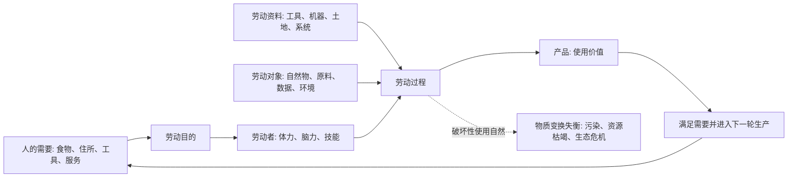

## 马哲思维筑基课: 劳动是人与自然之间的物质变换

### 作者
digoal

### 日期
2026-05-17

### 标签
劳动 , 物质变换 , 人与自然 , 劳动过程 , 使用价值 , 劳动对象 , 劳动资料 , 生态边界 , 雇佣劳动 , 资本论

----

## 背景

> 面向对象: 高中生到大学低年级读者  
> 核心问题: 为什么马克思把劳动理解为人与自然之间的“物质变换”，而不只是辛苦、职业或赚钱手段？  
> 先说结论: 劳动是人有目的地运用身体、工具和知识，改变自然物的形态，使其成为生活资料和生产资料的过程。它是人类社会存在的基础；但在资本主义下，劳动又被组织成雇佣劳动，并服从资本增殖。

## 一张图先看懂



## 求真讲法

### 它到底说了什么

“劳动是人与自然之间的物质变换”说的是: 人不能只靠想象活着。人要吃饭、穿衣、居住、出行、学习和生产，就必须同自然发生关系，把自然物改造成能满足需要的东西。

种地是把土地、水、种子、阳光和人的活动结合起来，变成粮食。盖房是把木材、钢筋、水泥、设计和施工结合起来，变成住所。写程序看起来很“虚拟”，也离不开电力、设备、网络、数据中心、人的训练和协作。

所以劳动不是单纯的“累”，而是一个有目的的转化过程: 人把自然条件、工具和自身能力组织起来，生产使用价值。

### 它是怎么来的

这个命题的动机，是把劳动从道德评价和职业标签中解放出来。

日常语言里，我们常说“他很勤劳”“这份工作很辛苦”“劳动是赚钱方式”。这些说法都只看到一部分。马克思在《资本论》中先分析一般劳动过程: 不管在什么社会，人都必须通过某种劳动过程同自然交换物质，才能维持生活。

这一步很关键。只有先理解劳动的一般形式，才能进一步分析资本主义的特殊形式: 在资本主义下，劳动不只是生产使用价值，还被资本组织起来生产价值和剩余价值。

换句话说:

```text
一般劳动过程: 人为了需要而改造自然 -> 生产使用价值
资本主义劳动过程: 资本购买劳动力并组织生产 -> 生产商品、价值和剩余价值
```

### 它依赖哪些假设

| 假设 | 含义 | 如果不成立会怎样 |
|---|---|---|
| 人有物质需要 | 人必须获得食物、住所、能源、工具等生活条件 | 劳动就不再是社会存在的基础 |
| 自然提供对象和条件 | 土地、矿物、植物、能源、信息载体等是生产前提 | 人会被误解成能脱离自然生活 |
| 人能有目的地行动 | 劳动包含计划、想象、选择和执行 | 劳动会被降成动物本能或机械运动 |
| 工具会放大能力 | 劳动资料改变人与自然发生关系的方式 | 技术和生产力发展难以解释 |
| 物质变换有边界 | 自然承载力、资源循环和生态条件不能无限透支 | 会忽略污染、枯竭和生态危机 |

### 常见误解

误解一: 劳动就是体力劳动。

不对。劳动包括体力，也包括脑力、组织、设计、计算、照护、维护和创造。关键不在于是否出汗，而在于是否通过有目的活动改变对象、形成使用价值或维持社会再生产。

误解二: 劳动只发生在工厂和田地。

不对。现代劳动还发生在实验室、医院、学校、厨房、办公室、服务器机房和平台系统中。它们都以不同方式参与人与自然之间的物质变换。

误解三: 自然只是被人征服的对象。

不对。马克思讲“物质变换”，不是鼓励无限掠夺自然。人通过劳动改造自然，同时也受自然规律约束。破坏生态循环，最后会反过来破坏人的生活条件。

误解四: 劳动天然等于自由创造。

不一定。劳动有可能是创造性的，也可能是被迫的、异化的、被严密控制的。要看劳动者是否掌握条件、目的、过程和成果。

## 求存讲法

### 它有什么用

这个命题能帮助我们从三个层次看劳动:

| 层次 | 关键问题 | 例子 |
|---|---|---|
| 自然层 | 人怎样同自然交换物质？ | 农业、能源、制造、物流 |
| 技术层 | 人用什么工具和知识改变对象？ | 机器、算法、实验设备 |
| 社会层 | 谁组织劳动，谁占有成果？ | 家庭劳动、雇佣劳动、平台劳动 |

这样一来，劳动就不只是“找工作”，而是理解社会如何生存、如何发展、如何产生矛盾的入口。

### 它怎么迁移到熟悉领域

#### 学习

学习也是一种特殊劳动。学生把时间、注意力、教材、工具和老师反馈结合起来，把外部知识转化为自己的能力。只喊“努力”不够，还要看学习资料、方法、反馈、睡眠和环境。

#### 技术

人工智能、软件和自动化看似减少劳动，实际上是改变劳动方式。它把一部分直接劳动转移到模型训练、数据标注、系统维护、能源消耗和设备制造中。

#### 管理

管理不是单纯监督别人，而是组织劳动过程: 明确目标、配置工具、协调分工、减少浪费、处理反馈。如果管理只追求速度，不考虑人的身体和自然边界，就会制造损耗。

### 它的适用范围和边界

这个观点适合解释生产、技术、生态、产业和社会再生产问题。它能提醒我们: 任何看似“虚拟”的经济活动，都有物质基础；任何看似“自然”的资源利用，也有社会组织方式。

但它不能把所有人类活动都简单归为生产劳动。游戏、友谊、艺术欣赏、休息和沉思也有价值，不应全部用生产效率衡量。劳动是社会存在的基础，不等于人生意义的全部。

还要区分一般劳动和特定社会形式下的劳动。一般劳动是人类永恒需要；雇佣劳动、奴隶劳动、家庭无偿劳动、平台劳动，则是不同社会关系中的具体形式。

### 正例: 怎么用它提升能力

假设你想分析“为什么外卖平台让送餐越来越快”。

浅层解释是: 骑手更努力，消费者更着急。  
用“劳动是人与自然之间的物质变换”来看，需要继续追问:

1. 食物从厨房到消费者手里，需要哪些物质环节？
2. 平台算法如何组织路线、时间和评价？
3. 骑手使用什么劳动资料，如电动车、手机、地图系统？
4. 时间压缩是否把风险转移到骑手身体和交通环境？
5. 这种劳动过程满足了谁的需要，又让谁承担损耗？

这样就能看见: 外卖不是手机上的一个按钮，而是一整套人与物、技术、城市空间和劳动关系的组织。

### 反例: 前提不成立会怎样

假设有人把“劳动是人与自然之间的物质变换”用来评价所有活动，认为只有直接生产物品的人才有价值，照护、教育、艺术、沟通都“不算劳动”。这就误用了命题。

错误出在两个地方: 第一，把“物质变换”理解得太狭窄，只看有形产品；第二，忽略了社会再生产。照护、教育和维护虽然不一定直接制造商品，却维持人的身体、能力和社会关系，是许多生产活动能够继续的条件。

这个反例说明: 不能把劳动简化成“手上做出一个物件”。劳动的范围要结合使用价值、社会再生产和具体关系来判断。

## 思考

1. 如果劳动是人与自然之间的物质变换，那么数字经济真的“脱离物质”了吗？
2. 当机器替代人的直接操作时，劳动是消失了，还是转移到设计、维护、能源和数据环节？
3. 如果一个生产过程制造了商品，却破坏了水、空气和人的身体，它还算有效的物质变换吗？
4. 为什么同样是劳动，有时让人感到创造和自由，有时却让人感到被支配和异化？
5. 如果劳动是社会存在的基础，那么休息、照护和教育应不应该被重新估价？

## 最后记住

1. 劳动不是单纯辛苦，而是人有目的地调节人与自然之间物质变换的过程。
2. 劳动过程通常包含劳动者、劳动对象和劳动资料三个要素。
3. 一般劳动生产使用价值；资本主义下的雇佣劳动还被组织来生产价值和剩余价值。
4. 人改造自然，也受自然规律和生态边界约束。
5. 理解劳动，要同时看自然条件、技术工具和社会关系。

## 参考资料

- 马克思: 《资本论》第一卷，第五章“劳动过程和价值增殖过程”，关于劳动过程、劳动对象、劳动资料和人与自然物质变换的分析。
- 马克思: 《1844年经济学哲学手稿》，关于劳动、对象化和异化劳动的早期论述。
- 马克思、恩格斯: 《德意志意识形态》，关于现实的人、物质生产和生活条件的论述。
- 恩格斯: 《自然辩证法》，可作为理解人与自然关系、劳动和自然条件问题的辅助文本。
- 说明: 本文基于通行马克思主义哲学与政治经济学教材体系做教学性重构；“公理”是便于学习的抽象说法，不是马克思、恩格斯原文中的形式化公理。
  
#### [PostgreSQL 解决方案集合](../201706/20170601_02.md "40cff096e9ed7122c512b35d8561d9c8")
  
  
#### [德哥 / digoal's Github - 公益是一辈子的事.](https://github.com/digoal/blog/blob/master/README.md "22709685feb7cab07d30f30387f0a9ae")
  
  
#### [About 德哥](https://github.com/digoal/blog/blob/master/me/readme.md "a37735981e7704886ffd590565582dd0")
  
  

  
