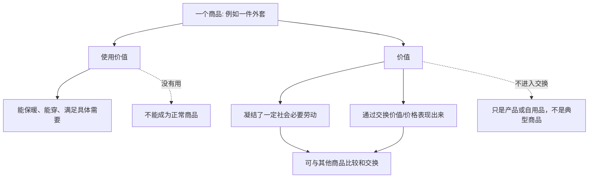

## 马哲思维筑基课: 商品具有二重性

### 作者
digoal

### 日期
2026-05-17

### 标签
商品二重性 , 使用价值 , 价值 , 交换价值 , 商品生产 , 社会劳动 , 价值形式 , 政治经济学 , 资本论 , 商品分析

----

## 背景

> 面向对象: 高中生到大学低年级读者  
> 核心问题: 为什么《资本论》一开头就分析商品，而且说商品同时具有使用价值和价值？  
> 先说结论: 商品不是普通物品。它一方面能满足人的需要，叫使用价值；另一方面能在市场上同别的商品交换，表现为价值。商品二重性就是: 同一个商品既是“有用的东西”，又是“社会劳动关系的载体”。

## 一张图先看懂



## 求真讲法

### 它到底说了什么

商品有两面。

第一面是使用价值。它能满足某种需要，比如米能吃、衣服能穿、手机能通信、药能治病。使用价值和物品的具体性质有关。

第二面是价值。它不是说这个东西“对我很重要”，而是说这个商品作为社会劳动的产物，可以同其他商品按一定比例交换。价值不是用眼睛直接看见的，它要通过交换价值、货币和价格表现出来。

所以，一瓶水作为使用价值，是能解渴；作为价值，是它在市场上能卖多少钱、能换多少别的商品，背后反映社会生产它所需要的劳动耗费。

### 它是怎么来的

马克思从商品开始，是因为资本主义社会的财富首先表现为庞大的商品堆积。要理解资本、货币、工资和利润，就要先理解最简单、最普通的经济细胞: 商品。

为什么一个商品会有两面？因为商品不是为生产者自己直接使用而生产，而是为交换而生产。只要进入交换，它就必须同时满足两个条件:

```text
对别人有用 -> 有使用价值
能与别的商品交换 -> 有价值
```

如果一件东西对任何人都没用，就没有市场意义上的商品地位。如果一件东西只供自己使用，不进入交换，它可以是产品，但不是典型商品。

商品二重性进一步引出劳动二重性: 使用价值来自具体劳动，价值来自抽象劳动。后面货币、资本、剩余价值的分析，都离不开这个起点。

### 它依赖哪些假设

| 假设 | 含义 | 如果不成立会怎样 |
|---|---|---|
| 存在社会分工 | 不同人生产不同东西，需要互相交换 | 商品交换就不是普遍形式 |
| 产品为交换而生产 | 生产者不是主要为自己直接消费 | 产品未必成为商品 |
| 商品对他人有用 | 使用价值是交换能够发生的前提 | 无人需要的东西卖不出去 |
| 劳动可以被社会比较 | 不同具体劳动在交换中被折算为可比较的社会劳动 | 价值量难以成立 |
| 交换需要共同尺度 | 货币或价格让不同商品可以比较 | 交换会停留在偶然物物交换 |

### 常见误解

误解一: 使用价值越大，价值就一定越大。

不对。空气对人极其有用，但在通常条件下没有商品价值，因为不需要通过商品生产和交换获得。钻石不如水必需，却可能价格很高，因为稀缺、生产条件、社会需求和市场形式不同。

误解二: 价值就是价格。

不对。价格是价值的货币表现，但价格会受供求、垄断、预期、政策、品牌等因素影响。价值和价格有关，但不能简单画等号。

误解三: 商品二重性是物品天然自带的两个属性。

不对。使用价值同物的自然属性关系更直接；价值则是商品社会中的社会属性。一个苹果能吃，这是自然属性和使用价值；它能卖多少钱，则取决于社会生产、交换和市场关系。

误解四: 只要有用就是商品。

不对。家里自己做的一顿饭有使用价值，但如果不拿去交换，就不是典型商品。商品必须是为别人、为交换而生产的使用价值。

## 求存讲法

### 它有什么用

商品二重性可以训练我们同时看两件事:

| 看法 | 关注点 | 容易忽略什么 |
|---|---|---|
| 只看使用价值 | 这个东西有什么用 | 谁生产、怎样交换、价格为何形成 |
| 只看价格 | 这个东西卖多少钱 | 它是否真正满足需要 |
| 二重性视角 | 有用性与社会交换关系 | 同时看需求、劳动、市场和社会关系 |

这种视角能避免两个极端: 一是只谈功能，不谈生产和交换；二是只谈价格，不谈真实需要。

### 它怎么迁移到熟悉领域

#### 消费

买手机时，使用价值是拍照、通信、续航、系统体验；价值和价格则涉及生产成本、品牌、供应链、市场竞争和社会劳动。一个人只看参数，可能忽略价格结构；只看价格，可能买到不适合自己的东西。

#### 学习

一门课程的使用价值，是它能不能提升理解力、技能或判断力。如果课程被拿到市场上销售，它又成为商品，要考虑定价、包装、流量、品牌和支付意愿。好课程不一定卖得贵，卖得贵的课程也不一定最有用。

#### 数字产品

软件、会员、数据服务看似没有实体，但仍可能是商品。它们的使用价值是解决问题，价值表现为订阅费、授权费、广告收入或数据变现。虚拟不等于没有物质基础，因为开发、服务器、能源和维护都需要劳动。

### 它的适用范围和边界

商品二重性适合分析进入市场交换的劳动产品或服务。它对资本主义市场社会尤其关键，因为大量生活资料、生产资料和服务都以商品形式出现。

但它不适合把一切关系都商品化。亲情、友谊、信任、公共责任、志愿服务和许多公共物品，不能只用商品二重性理解。它们可能有使用价值，却不应或不完全通过市场价值来衡量。

还要注意，商品二重性分析的是商品形式，不等于对商品社会的道德赞美。它是解剖工具，不是价值判断本身。

### 正例: 怎么用它提升能力

假设你想判断一个在线知识产品值不值得买。

只看宣传语不够，要分两步:

1. 看使用价值: 它是否解决你的具体问题？内容是否清楚？练习和反馈是否有效？是否适合你的基础？
2. 看价值和价格表现: 它的价格是否由真实教学劳动、服务成本、品牌溢价、营销费用或稀缺性构成？有没有更合适的替代品？

这样就不会把“贵”自动等同于“有价值”，也不会把“便宜”自动等同于“划算”。

### 反例: 前提不成立会怎样

假设一个人把母亲给孩子做饭也完全当成商品分析，说这顿饭只是一种市场价值的表现。这就错用了商品二重性。

这顿饭有使用价值，也包含劳动，但它没有以市场交换为目的。它首先属于家庭生活和照护关系，不是典型商品。如果硬套商品逻辑，就会遮蔽亲情、责任、照护和共同生活的意义。

这个反例说明: 商品二重性只适用于商品形式，不适合把所有有用劳动和所有人际关系都改写成买卖关系。

## 思考

1. 为什么很多东西越被商品化，人们越容易只看价格，而忘记它真正的使用价值？
2. 如果一个商品很有用但卖不出去，是使用价值出了问题，还是价值实现出了问题？
3. 数字商品可以无限复制，它的价值和价格为什么仍然存在？
4. 教育、医疗、住房这些东西既有强烈使用价值，又进入市场交换时，会产生什么矛盾？
5. 如果商品价值是一种社会关系，为什么它在日常生活中看起来像物品自己的自然属性？

## 最后记住

1. 商品不是普通物品，而是为交换而生产的使用价值。
2. 商品有二重性: 使用价值和价值。
3. 使用价值解决“有什么用”，价值解决“为什么能和别的商品交换”。
4. 价值不能直接看见，通常通过交换价值、货币和价格表现。
5. 商品二重性是理解劳动二重性、货币、资本和剩余价值的入口。

## 参考资料

- 马克思: 《资本论》第一卷第一章“商品”，关于使用价值、交换价值、价值和商品二重性的分析。
- 马克思: 《政治经济学批判》，关于商品、货币和价值形式的早期系统分析。
- 恩格斯: 《反杜林论》，关于政治经济学对象和价值问题的辅助论述。
- 说明: 本文基于通行马克思主义政治经济学教材体系做教学性重构；“公理”是便于学习的抽象说法，不是马克思、恩格斯原文中的形式化公理。
  
#### [PostgreSQL 解决方案集合](../201706/20170601_02.md "40cff096e9ed7122c512b35d8561d9c8")
  
  
#### [德哥 / digoal's Github - 公益是一辈子的事.](https://github.com/digoal/blog/blob/master/README.md "22709685feb7cab07d30f30387f0a9ae")
  
  
#### [About 德哥](https://github.com/digoal/blog/blob/master/me/readme.md "a37735981e7704886ffd590565582dd0")
  
  

  
