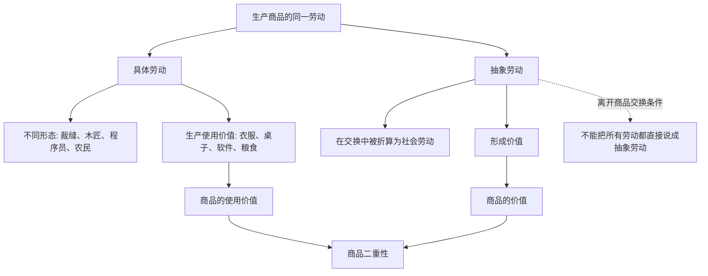

## 马哲思维筑基课: 劳动也具有二重性

### 作者
digoal

### 日期
2026-05-17

### 标签
劳动二重性 , 具体劳动 , 抽象劳动 , 使用价值 , 价值形成 , 商品交换 , 社会必要劳动 , 政治经济学 , 马克思 , 资本论

----

## 背景

> 面向对象: 高中生到大学低年级读者  
> 核心问题: 为什么《资本论》说生产商品的劳动也有两面，而且这是理解政治经济学的关键？  
> 先说结论: 生产商品的劳动一方面是具体劳动，生产具体使用价值；另一方面是抽象劳动，在商品交换中被看作无差别的人类劳动，形成价值。商品的二重性，根源就在劳动的二重性。

## 一张图先看懂



## 求真讲法

### 它到底说了什么

劳动二重性说的是: 同一个生产商品的劳动，可以从两个角度看。

第一个角度是具体劳动。它关心劳动的具体形式和具体效果。裁缝缝衣服，木匠做桌子，农民种粮食，程序员写软件，这些劳动方式不同，生产出的使用价值也不同。

第二个角度是抽象劳动。它不再看劳动的具体内容，而是看这些不同劳动在商品交换中怎样被社会折算为可比较的劳动耗费。衣服、桌子、粮食、软件完全不同，但它们都可以在市场上用价格比较，这说明它们背后被当作某种共同的社会劳动来处理。

所以，抽象劳动不是“抽象地想一想的劳动”，也不是“脑力劳动”。它是商品社会中，不同具体劳动在交换关系中被化约为无差别人类劳动的社会形式。

### 它是怎么来的

马克思先发现商品有二重性: 商品既有使用价值，又有价值。接着问题来了: 这两面从哪里来？

使用价值来自具体劳动。不同物品之所以有不同用途，是因为生产它们的劳动方式、对象、工具和技能不同。

价值则不能来自这些具体差别。衣服和桌子用途不同、材料不同、工艺不同，但它们能交换，说明它们在交换中被看成具有某种共同东西。马克思把这个共同东西理解为抽象劳动，即被社会承认的、无差别的人类劳动耗费。

可以把推理压缩成:

```text
商品有使用价值 -> 来自具体劳动
商品有价值 -> 来自抽象劳动
商品二重性 -> 根源是劳动二重性
```

### 它依赖哪些假设

| 假设 | 含义 | 如果不成立会怎样 |
|---|---|---|
| 产品以商品形式交换 | 劳动产品进入市场比较 | 不同劳动不必被统一折算 |
| 存在社会分工 | 不同人从事不同劳动并互相依赖 | 具体劳动差异不明显 |
| 劳动产品有使用价值 | 具体劳动必须生产对他人有用的东西 | 商品卖不出去，劳动得不到社会承认 |
| 市场承认社会必要劳动 | 个别劳动要接受社会平均条件检验 | 私人耗时不能自动变成价值 |
| 交换需要共同尺度 | 不同商品需要被比较 | 抽象劳动难以表现为价值 |

### 常见误解

误解一: 抽象劳动就是脑力劳动。

不对。脑力劳动也可以是具体劳动，比如医生诊断、工程师设计、教师备课。抽象劳动不是按体力和脑力划分，而是指在商品交换中，不同劳动被社会折算为无差别劳动。

误解二: 具体劳动低级，抽象劳动高级。

不对。二者不是高低等级，而是同一劳动的两个方面。具体劳动回答“生产了什么有用东西”，抽象劳动回答“这个劳动在商品交换中形成多少价值”。

误解三: 劳动时间越长，价值一定越大。

不对。价值看的是社会必要劳动时间，不是个人实际耗时。别人一小时能做好的东西，你花十小时做，市场通常不会承认十小时的价值。

误解四: 所有劳动天然都是抽象劳动。

不对。抽象劳动是商品生产和交换条件下形成的社会规定。家庭中为自己做饭、朋友间互助、社区志愿服务可以有使用价值和社会意义，但不能都直接按商品价值来理解。

## 求存讲法

### 它有什么用

劳动二重性帮助我们看懂一个常见现象: 为什么“有用”和“值钱”不是一回事。

| 角度 | 看什么 | 典型问题 |
|---|---|---|
| 具体劳动 | 技能、对象、工具、产品用途 | 这个劳动生产了什么有用东西？ |
| 抽象劳动 | 社会承认的劳动耗费 | 这个劳动在市场中形成多少价值？ |
| 二重性视角 | 有用性和价值形成的关系 | 为什么有些有用劳动不值钱，有些不太必要的东西却卖得贵？ |

它能让我们同时分析技术、市场和社会关系，而不是只用“辛苦不辛苦”判断劳动。

### 它怎么迁移到熟悉领域

#### 学习

一个学生写作业，具体劳动是解题、阅读、写作、实验；如果学习成果进入考试、竞赛或求职评价，它又会被某种社会尺度折算。这里不是严格商品价值，但可以类比理解: 个人努力必须被某套社会评价机制承认，才会转化为成绩、证书或机会。

#### 职场

一个程序员修复线上故障，具体劳动是排查日志、理解代码、修改系统；市场评价可能按岗位、稀缺性、业务影响和公司收益来折算。很有用的劳动未必被充分计价，计价高的劳动也未必最辛苦。

#### 家庭照护

照顾老人和孩子有极高使用价值，但如果它不进入市场交换，通常不会表现为工资和价格。这说明“没有价格”不等于“没有价值意义”，只是它没有以商品价值形式表现。

### 它的适用范围和边界

劳动二重性适用于商品生产条件下的劳动。也就是说，劳动产品或服务要进入交换，才会同时表现为具体劳动和抽象劳动。

它不适合把所有活动都市场化解释。休息、亲密关系、志愿互助、家庭照护、公共责任等，可能有重要意义，但不一定以价值形式出现。

还要注意，抽象劳动不是个人主观决定的。不是你认为自己劳动很抽象，价值就形成了；它要经过社会交换、市场需求、技术条件和社会必要劳动时间的检验。

### 正例: 怎么用它提升能力

假设你想理解“为什么一个手工杯子花了很多时间，却不一定能卖高价”。

可以分两步分析:

1. 具体劳动: 这个杯子的材料、工艺、审美、耐用性、手感是否真的形成使用价值？
2. 抽象劳动: 市场是否承认这类劳动耗费？同类产品的社会平均生产时间是多少？消费者是否愿意为手工差异付费？

如果手工耗时没有形成被社会承认的差异，个别劳动时间就很难全部转化为价值。这个分析比简单说“消费者不识货”更准确。

### 反例: 前提不成立会怎样

假设你给家人做饭，花了两个小时。有人说:“既然劳动有二重性，这顿饭也形成了商品价值，应该按餐厅价格计算。”

这个说法的问题是: 这顿饭没有作为商品进入市场交换。它当然有使用价值，也包含具体劳动，还可能有情感和照护意义；但它不是典型商品生产，因此不能直接用抽象劳动和商品价值来衡量。

这个反例说明: 劳动二重性不是所有劳动的天然属性，而是商品生产条件下劳动的特殊社会形式。

## 思考

1. 为什么很多特别辛苦的劳动，市场价格却不高？
2. 为什么同样写代码，有的人收入很高，有的人收入一般？差别只在个人努力吗？
3. 家庭照护没有市场价格时，它的社会意义为什么容易被低估？
4. 如果人工智能降低某类商品的社会必要劳动时间，这类劳动的价值表现会怎样变化？
5. 当一个社会只承认能卖钱的劳动时，会遗漏哪些重要的人类活动？

## 最后记住

1. 劳动二重性是理解商品二重性的钥匙。
2. 具体劳动生产使用价值，抽象劳动形成价值。
3. 抽象劳动不是脑力劳动，而是商品交换中被社会折算的无差别人类劳动。
4. 价值看社会必要劳动时间，不看个人单独耗费了多少时间。
5. 劳动二重性适用于商品生产条件，不能把所有劳动都粗暴市场化。

## 参考资料

- 马克思: 《资本论》第一卷第一章“商品”，特别是关于“体现在商品中的劳动的二重性”的分析。
- 马克思: 《政治经济学批判》，关于商品、劳动和价值形式的相关论述。
- 恩格斯: 《反杜林论》，关于价值、劳动和政治经济学对象的辅助说明。
- 说明: 本文基于通行马克思主义政治经济学教材体系做教学性重构；“公理”是便于学习的抽象说法，不是马克思、恩格斯原文中的形式化公理。
  
#### [PostgreSQL 解决方案集合](../201706/20170601_02.md "40cff096e9ed7122c512b35d8561d9c8")
  
  
#### [德哥 / digoal's Github - 公益是一辈子的事.](https://github.com/digoal/blog/blob/master/README.md "22709685feb7cab07d30f30387f0a9ae")
  
  
#### [About 德哥](https://github.com/digoal/blog/blob/master/me/readme.md "a37735981e7704886ffd590565582dd0")
  
  

  
