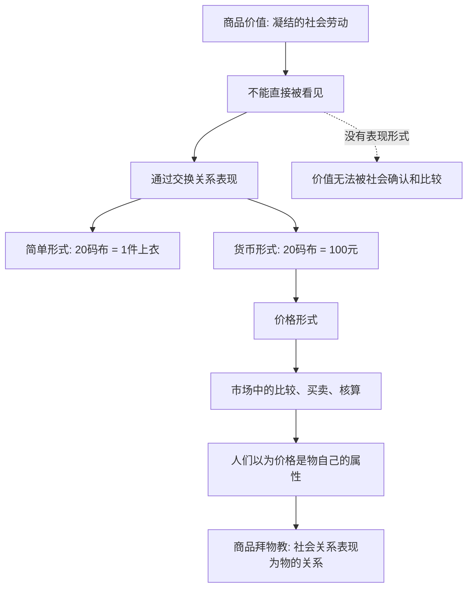

## 马哲思维筑基课: 价值必须通过形式表现出来

### 作者
digoal

### 日期
2026-05-17

### 标签
价值形式 , 交换价值 , 货币 , 价格 , 社会劳动 , 商品价值 , 商品拜物教 , 价值表现 , 政治经济学 , 资本论

----

## 背景

> 面向对象: 高中生到大学低年级读者  
> 核心问题: 如果价值不是商品身上能直接看见的东西，为什么我们又能说商品“有价值”？  
> 先说结论: 价值不是颜色、重量、味道那样的自然属性，而是商品社会中劳动被社会承认的关系。它不能自己显现，必须通过交换价值、货币、价格等形式表现出来。

## 一张图先看懂



## 求真讲法

### 它到底说了什么

“价值必须通过形式表现出来”说的是: 商品的价值不能像颜色、形状、重量那样直接感知。你拿起一件衣服，可以看见颜色，摸到材质，试出保暖性；但你不能直接看见它“值多少”。

价值要通过别的东西表现。最简单的表现是交换关系，比如“20码布 = 1件上衣”。在货币出现后，价值通常表现为价格，比如“这件衣服100元”。

所以，要区分四个概念:

| 概念 | 简单解释 | 例子 |
|---|---|---|
| 使用价值 | 商品有什么用 | 衣服能保暖 |
| 价值 | 凝结在商品中的社会劳动 | 生产衣服耗费并被社会承认的劳动 |
| 交换价值 | 价值在与别的商品交换中的表现 | 20码布 = 1件上衣 |
| 价格 | 价值的货币表现 | 1件上衣 = 100元 |

价值是里面的社会关系，价格是外面的货币表现。二者有关，但不完全相同。

### 它是怎么来的

马克思从商品二重性出发: 商品有使用价值和价值。使用价值容易理解，因为它同物品的自然属性有关。难点在价值: 如果价值不是自然属性，它怎么被社会认识？

答案是: 价值只有在商品交换中，才获得可见形式。

一件上衣单独放在那里，它只是一个有用物。只有当它同布、粮食、铁、货币发生交换关系时，它的价值才表现出来。货币就是价值表现长期发展出来的一般形式: 各种商品都用货币来表现自身价值。

可以压缩成:

```text
价值不可直接感知
    ↓
必须在交换中表现
    ↓
交换价值是价值的表现形式
    ↓
货币成为一般等价物
    ↓
价格成为日常可见形式
```

### 它依赖哪些假设

| 假设 | 含义 | 如果不成立会怎样 |
|---|---|---|
| 商品进入交换 | 商品要同别的商品发生关系 | 价值难以获得社会表现 |
| 存在社会劳动比较 | 不同劳动产品需要被社会承认和比较 | 价值形式没有必要 |
| 交换需要等价表达 | 一种商品要用另一种商品表现自身价值 | 交换比例无法稳定表达 |
| 货币承担一般等价物 | 所有商品都用货币表现价值 | 价格形式难以普遍化 |
| 价格会受市场影响 | 价格表现价值，但会受供求、垄断、预期等影响 | 容易把价格误认为价值本身 |

### 常见误解

误解一: 价值就是价格。

不对。价格是价值的货币表现，但价格会偏离价值。供求、品牌、垄断、政策、情绪、信用和投机都可能影响价格。

误解二: 价值可以脱离任何表现形式独立存在并被直接测量。

不对。在商品社会中，价值作为社会关系，必须通过交换关系、货币和价格表现。没有这些形式，价值就无法被社会确认和比较。

误解三: 价格是商品自己的天然属性。

不对。商品不会像有重量一样天然有价格。价格是商品进入特定社会交换关系后的表现形式。

误解四: 只要有价格，就一定真实反映价值。

不对。价格可能虚高、虚低，也可能被垄断、炒作或补贴扭曲。价格是入口，不是终点；看到价格后还要追问生产条件、需求结构和社会关系。

## 求存讲法

### 它有什么用

这个命题能帮助我们避免被“价格表象”困住。

日常生活里，我们最先看到的是价格: 房价、工资、学费、会员费、股票价格、平台订单价格。价格很重要，但它只是表现形式。真正要分析，还要问:

```text
这个价格表现了什么劳动和资源？
这个价格被什么制度、权力、供求和预期影响？
谁通过这种价格形式获得收益？
谁的劳动没有被价格充分表现？
```

这样才能从价格走向背后的社会关系。

### 它怎么迁移到熟悉领域

#### 消费

一件衣服标价1000元，不等于它一定包含比100元衣服多十倍的社会必要劳动。品牌、渠道、广告、稀缺性和消费者身份认同都可能进入价格形式。

#### 工资

工资是劳动力价值和劳动关系的货币表现，但工资不等于劳动者创造的全部价值。理解工资，要看劳动力再生产成本、岗位供求、组织权力、议价能力和剩余价值分配。

#### 数字平台

平台上一个订单的价格，看似只是消费者和商家的交易，背后还包含算法分配、佣金规则、流量权重、骑手劳动、城市空间和数据控制。价格形式把复杂关系压缩成一个数字。

### 它的适用范围和边界

这个观点适合分析商品、货币、价格、工资、利润、资产价格和市场交换。它尤其适合提醒我们: 价格不是自然事实，而是社会关系的表现形式。

但它不能推出“价格都不可信”这种结论。价格虽然不是价值本身，却是市场社会中极重要的信息形式。错误不在于使用价格，而在于把价格当成无需解释的终极事实。

也不能把所有价值都等同于商品价值。亲情、尊严、生命、信任、公共责任等可以有重要意义，但不一定适合用商品价值和价格形式衡量。

### 正例: 怎么用它提升能力

假设你想判断一个培训课9999元是否值得买。

不要只问“贵不贵”，而要分层看:

1. 使用价值: 它能否解决你的具体问题？课程、练习、反馈是否有效？
2. 价值表现: 这个价格对应哪些真实教学劳动、服务成本和持续支持？
3. 价格扭曲: 是否有过度营销、焦虑贩卖、名师光环或信息不对称？
4. 替代方案: 是否有更低成本但同样有效的学习路径？

这样就能把价格当线索，而不是把价格当答案。

### 反例: 前提不成立会怎样

假设朋友帮你搬家，你说:“既然劳动有价值，必须按市场搬家公司价格给你结算，否则这份劳动就没有价值。”

这个说法混淆了两种意义。朋友的帮助有使用价值，也有情感和互助意义，但它没有以商品交换为前提，不一定需要通过价格形式表现。如果硬套价格形式，反而会破坏互助关系本身。

这个反例说明: “价值必须通过形式表现出来”讨论的是商品价值，不是说所有人类意义都必须货币化。

## 思考

1. 为什么我们很容易把“价格高”误认为“东西天然更好”？
2. 如果价格是价值的表现形式，而不是价值本身，投资和消费判断应该多问哪些问题？
3. 工资作为价格形式，遮蔽了哪些劳动过程和分配关系？
4. 当数据、注意力和流量被定价时，哪些社会关系被压缩成了数字？
5. 如果某些重要活动没有价格，它们会不会在社会评价中被系统性低估？

## 最后记住

1. 价值不是商品的自然属性，而是商品社会中的社会劳动关系。
2. 价值不能直接显现，必须通过交换价值、货币和价格等形式表现。
3. 价格是价值的货币表现，但价格不等于价值本身。
4. 价值形式让商品可以比较，也容易让人误以为社会关系是物自己的属性。
5. 这个命题适用于商品价值分析，不能把所有人类意义都货币化。

## 参考资料

- 马克思: 《资本论》第一卷第一章“商品”，特别是关于价值形式、相对价值形式、等价形式和货币形式的分析。
- 马克思: 《政治经济学批判》，关于商品、货币和价值表现的相关论述。
- 恩格斯: 《反杜林论》，关于政治经济学、价值和交换关系的辅助说明。
- 说明: 本文基于通行马克思主义政治经济学教材体系做教学性重构；“公理”是便于学习的抽象说法，不是马克思、恩格斯原文中的形式化公理。
  
#### [PostgreSQL 解决方案集合](../201706/20170601_02.md "40cff096e9ed7122c512b35d8561d9c8")
  
  
#### [德哥 / digoal's Github - 公益是一辈子的事.](https://github.com/digoal/blog/blob/master/README.md "22709685feb7cab07d30f30387f0a9ae")
  
  
#### [About 德哥](https://github.com/digoal/blog/blob/master/me/readme.md "a37735981e7704886ffd590565582dd0")
  
  

  
