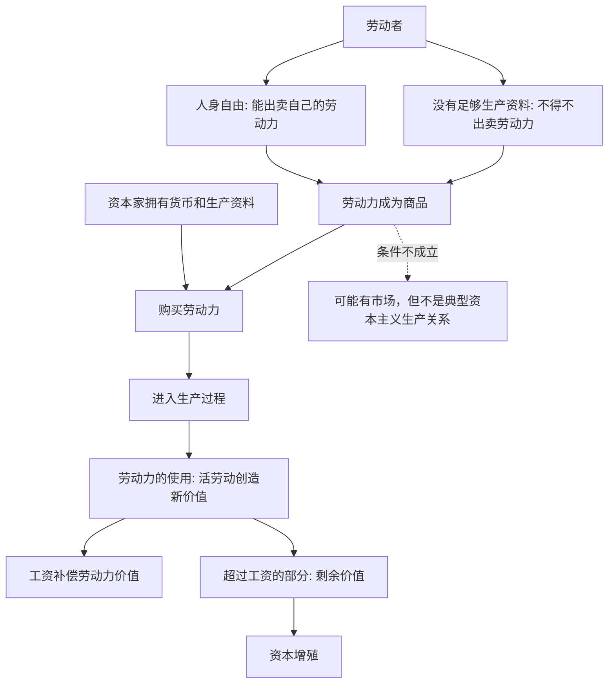

## 马哲思维筑基课: 劳动力成为商品，是资本主义的特殊前提

### 作者
digoal

### 日期
2026-05-17

### 标签
劳动力商品 , 雇佣劳动 , 剩余价值 , 工资 , 生产资料 , 资本主义前提 , 劳动力价值 , 劳动力使用价值 , 马克思 , 资本论

----

## 背景

> 面向对象: 高中生到大学低年级读者  
> 核心问题: 为什么有市场、有货币、有买卖还不一定是资本主义，必须等到“劳动力成为商品”才进入资本主义生产的核心？  
> 先说结论: 资本主义的关键不只是商品交换，而是劳动者把自己的劳动力作为商品卖给资本。劳动力的特殊性在于，它的使用能创造出超过自身价值的新价值，这正是剩余价值的来源。

## 一张图先看懂



## 求真讲法

### 它到底说了什么

先区分两个词: 劳动和劳动力。

劳动，是人实际进行的活动，比如搬运、编程、教学、种地、护理。劳动力，是人进行劳动的能力，包括体力、脑力、技能、经验和注意力。

在资本主义下，工人卖的不是“劳动本身”，而是在一定时间内使用自己劳动力的权利。资本家买到劳动力后，把它同机器、原料、场地、软件、管理等结合起来，组织生产。

劳动力成为商品，意味着人的劳动能力也进入市场。它像其他商品一样有价值，通常表现为工资；但它又不同于普通商品，因为它被使用时能创造新价值，并且可能创造出超过工资的价值。

### 它是怎么来的

马克思想解释一个难题: 如果市场交换遵循等价交换，资本家为什么能得到利润？

如果只是低买高卖，一个人赚的钱就是另一个人亏的钱，无法解释整个资本家阶级稳定获得利润。真正的关键在生产过程里: 资本家在市场上按价值购买劳动力，然后在生产中使用劳动力。

劳动力的价值，由维持劳动者及其家庭再生产所需的生活资料、教育训练和历史文化标准决定，通常表现为工资。可是劳动力的使用价值，是能够劳动、能够创造价值。一个工人一天创造的价值，可能超过一天工资所代表的价值。这个差额就是剩余价值。

可以压缩成:

```text
资本家按价值购买劳动力
    ↓
劳动力进入生产过程
    ↓
劳动创造新价值
    ↓
新价值 > 劳动力价值
    ↓
剩余价值产生
```

### 它依赖哪些假设

| 假设 | 含义 | 如果不成立会怎样 |
|---|---|---|
| 劳动者人身自由 | 劳动者不是奴隶或农奴，能签订雇佣契约 | 不是典型的自由雇佣劳动 |
| 劳动者缺少生产资料 | 劳动者不能独立稳定生产生活资料 | 没有持续出卖劳动力的压力 |
| 资本家掌握生产资料 | 机器、厂房、资本、平台、原料等由资本支配 | 资本难以组织雇佣劳动 |
| 劳动力有价值 | 维持劳动力再生产需要生活资料和训练成本 | 工资关系难以稳定 |
| 劳动力能创造新价值 | 活劳动在生产中形成超过自身价值的价值 | 剩余价值无法解释 |

### 常见误解

误解一: 工人卖的是劳动。

更准确地说，工人卖的是劳动力在一定时间内的使用权。劳动是在生产过程中实际发生的活动，不能在发生之前作为完成品卖出。

误解二: 工资就是工人全部劳动的报酬。

不对。在马克思的分析中，工资表现为劳动的价格，但本质上是劳动力价值的货币表现。工人一天劳动创造的新价值，可能大于工资。

误解三: 有雇佣关系就一定完全自由平等。

法律形式上双方自由签约，但经济条件并不对称。劳动者没有足够生产资料，通常必须出卖劳动力；资本家掌握生产资料和组织权。

误解四: 劳动力商品化等于把人本身买卖。

不对。资本主义下买卖的不是人的人身所有权，而是劳动力的临时使用权。这也是它区别于奴隶制的地方。但这并不意味着关系完全平等，因为生产资料占有结构仍然不平等。

## 求存讲法

### 它有什么用

这个命题帮助我们看懂资本主义和普通市场交换的差别。

| 关系类型 | 表面形式 | 核心区别 |
|---|---|---|
| 普通商品交换 | 商品换货币 | 买卖的是劳动产品 |
| 自给生产 | 自己劳动自己使用 | 产品主要不进入市场 |
| 奴隶制 | 人身被占有 | 买卖的是人身支配权 |
| 雇佣劳动 | 工资换劳动时间 | 买卖的是劳动力使用权 |
| 资本主义生产 | 资本购买劳动力并组织生产 | 目标是剩余价值和资本增殖 |

它能让我们避免把资本主义简单理解为“市场经济”。市场很早就存在，但劳动力普遍成为商品，并被资本组织起来生产剩余价值，是资本主义的特殊前提。

### 它怎么迁移到熟悉领域

#### 职场

员工拿工资，不只是“把时间卖给公司”。更准确地说，是把一定时间内使用自身能力的权利交给公司。公司通过组织流程、工具、管理和市场销售，把员工的劳动能力转化为产品、服务和利润。

#### 平台经济

外卖骑手、网约车司机、内容创作者表面上更自由，但也可能把劳动力持续接入平台。平台未必直接雇佣所有人，却通过算法、订单、流量、评分和规则组织劳动过程。

#### 教育

教育训练会提高劳动力的能力，也可能提高劳动力价值。学历、技能证书、实习经验本质上都在影响一个人进入劳动市场时的劳动力条件。

### 它的适用范围和边界

这个观点适合分析工资、雇佣关系、劳动合同、平台劳动、资本利润、剩余价值和劳动者议价能力。

但不能把所有劳动都当作劳动力商品。家庭照护、志愿服务、朋友互助、自己给自己做饭，都可能包含劳动，却不一定以劳动力商品形式出现。

也不能把劳动者看成被动工具。劳动力商品化说明一种结构关系，但劳动者仍会学习、协商、抵抗、组织、跳槽、创业和改变规则。

### 正例: 怎么用它提升能力

假设你想分析“为什么公司愿意给高技能员工高工资”。

只说“因为他努力”不够。可以这样看:

1. 他的劳动力再生产成本更高: 学习、训练、经验积累需要时间和资源。
2. 他的劳动力使用价值更强: 能解决复杂问题，提高效率或创造更大收入。
3. 市场供给可能稀缺: 资本之间竞争推高工资。
4. 工资仍不等于全部创造价值: 公司支付高工资，是因为预期能从这种劳动力使用中获得更多增殖。

这样就能同时看见技能、市场和资本增殖逻辑。

### 反例: 前提不成立会怎样

假设一个家庭成员照顾老人，没有签劳动合同，也不是为了工资交换。有人说:“既然照护也是劳动，那它一定是劳动力商品。”

这个说法不准确。照护当然有使用价值，也可能非常辛苦，但如果它没有以市场雇佣方式出售劳动力使用权，就不是典型的劳动力商品。它属于家庭再生产和照护关系。

这个反例说明: 劳动力成为商品，是特定社会关系下的形式，不是所有劳动活动的天然属性。

## 思考

1. 为什么资本主义可以在法律平等的合同形式下，仍然产生资本对劳动的支配？
2. 如果工资看起来是“劳动价格”，它遮蔽了哪些生产过程中的关系？
3. 平台不直接雇佣劳动者时，是否仍可能组织和支配劳动力？
4. 教育是在发展人的自由能力，还是在生产更适合市场出售的劳动力？两者如何区分？
5. 如果劳动者重新掌握生产资料，劳动力还必须作为商品出售吗？

## 最后记住

1. 劳动是实际活动，劳动力是劳动能力；资本主义市场上出售的是劳动力使用权。
2. 劳动力成为商品需要两个条件: 劳动者人身自由，同时缺少足够生产资料。
3. 劳动力的价值通常表现为工资，但工资不等于劳动创造的全部新价值。
4. 劳动力的特殊使用价值，是能够创造超过自身价值的价值。
5. 劳动力商品化是理解资本主义剩余价值和资本增殖的关键前提。

## 参考资料

- 马克思: 《资本论》第一卷第四章“货币转化为资本”，关于劳动力成为商品的两个条件。
- 马克思: 《资本论》第一卷第五章“劳动过程和价值增殖过程”，关于劳动力使用和剩余价值生产的分析。
- 马克思: 《资本论》第一卷第六章“劳动力的买和卖”，关于劳动力价值、使用价值和工资关系的分析。
- 恩格斯: 《反杜林论》，关于资本主义生产关系和剩余价值理论的辅助说明。
- 说明: 本文基于通行马克思主义政治经济学教材体系做教学性重构；“公理”是便于学习的抽象说法，不是马克思、恩格斯原文中的形式化公理。
  
#### [PostgreSQL 解决方案集合](../201706/20170601_02.md "40cff096e9ed7122c512b35d8561d9c8")
  
  
#### [德哥 / digoal's Github - 公益是一辈子的事.](https://github.com/digoal/blog/blob/master/README.md "22709685feb7cab07d30f30387f0a9ae")
  
  
#### [About 德哥](https://github.com/digoal/blog/blob/master/me/readme.md "a37735981e7704886ffd590565582dd0")
  
  

  
