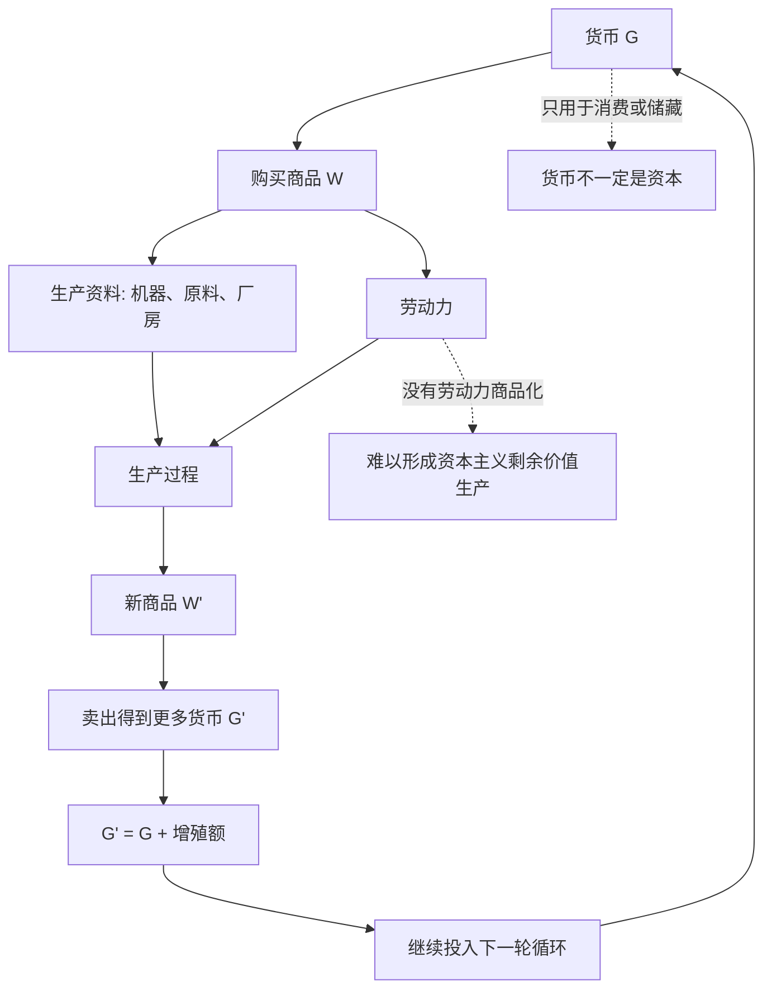

## 马哲思维筑基课: 资本不是物，而是自我增殖的价值关系

### 作者
digoal

### 日期
2026-05-17

### 标签
资本 , 自我增殖 , 价值关系 , G-W-G , 剩余价值 , 劳动力商品化 , 生产资料 , 资本循环 , 社会关系 , 资本论

----

## 背景

> 面向对象: 高中生到大学低年级读者  
> 核心问题: 为什么钱、机器、厂房不天然就是资本，只有进入某种社会关系和运动过程后才成为资本？  
> 先说结论: 资本不是一堆东西，而是价值为了获得更多价值而运动的社会关系。货币、机器、厂房只有在支配劳动力、组织生产并实现 G-W-G' 的增殖运动时，才成为资本。

## 一张图先看懂



## 求真讲法

### 它到底说了什么

日常语言里，人们常说“他有资本”，意思是他有钱、有房、有设备、有资源。但在《资本论》的分析中，这还不够。

一台机器放在仓库里，只是机器。一个农民自己用工具种地，工具也未必是资本。一笔钱如果只是用来买饭、买衣服、交学费，也只是货币。它们只有进入一种特殊运动，目标是带回更多价值，才成为资本。

资本的典型公式是:

```text
G - W - G'
货币 -> 商品 -> 更多货币
```

这里的关键不是买卖本身，而是最后的 G' 必须大于最初的 G。资本是“会增殖的价值”，但它不是自己神秘地长大，而是通过购买劳动力、组织生产、占有剩余价值来增殖。

### 它是怎么来的

马克思先分析普通商品流通:

```text
W - G - W
商品 -> 货币 -> 商品
```

比如农民卖粮食得到钱，再用钱买衣服。这个过程的目的，是用一种使用价值换另一种使用价值。钱只是中介。

资本流通不同:

```text
G - W - G'
货币 -> 商品 -> 更多货币
```

这里的起点和终点都是货币，区别只在于终点更多。于是问题来了: 多出来的价值从哪里来？

答案不能只停留在流通领域。单纯低买高卖不能解释整个资本家阶级稳定获得利润。关键在生产领域: 资本购买劳动力，而劳动力的使用能够创造超过自身价值的新价值。于是，资本不是物，而是一种通过劳动力商品化和生产资料占有实现价值增殖的社会关系。

### 它依赖哪些假设

| 假设 | 含义 | 如果不成立会怎样 |
|---|---|---|
| 价值以货币形式集中 | 货币能购买生产资料和劳动力 | 资本运动缺少起点 |
| 劳动力成为商品 | 劳动者能出卖劳动力，同时缺少生产资料 | 剩余价值生产难以发生 |
| 生产资料被资本支配 | 机器、厂房、原料等用于组织雇佣劳动 | 物只是工具或财产，不一定是资本 |
| 商品可以销售实现价值 | 生产出的商品要卖出去，价值才实现 | 增殖可能停在库存和亏损中 |
| 增殖成为目的 | 生产不是为直接需要，而是为更多价值 | 货币运动不构成资本运动 |

### 常见误解

误解一: 有钱就是有资本。

不准确。钱可以是消费基金、储蓄、捐赠、学费，也可以是资本。关键看它是否进入增殖运动，是否用来购买劳动力和生产资料，并以获得更多价值为目的。

误解二: 机器天然就是资本。

不对。同一台机器，在合作社、家庭工坊、自用生产、资本主义工厂中，社会性质可能不同。机器是否是资本，要看它处在什么生产关系里。

误解三: 资本会自己赚钱。

这是表象。资本看起来像自己会增殖，是因为社会关系被物的形式遮蔽了。实际增殖过程离不开劳动、组织、市场、信用、制度和权力关系。

误解四: 批判资本就是反对工具、技术和财富。

不对。马克思批判的不是机器、货币、财富本身，而是这些东西在特定社会关系中成为支配劳动、追逐剩余价值的资本形式。

## 求存讲法

### 它有什么用

这个命题能帮助我们分清三件事:

| 对象 | 只是物时 | 成为资本时 |
|---|---|---|
| 货币 | 用于消费、储蓄、互助 | 投入生产或经营，目标是带回更多货币 |
| 机器 | 自用工具、公共设备 | 作为生产资料支配雇佣劳动 |
| 房屋 | 居住空间 | 用于租金、抵押、资产增值 |
| 平台系统 | 技术工具 | 组织劳动、控制流量并抽取收益 |
| 数据 | 信息记录 | 用于定价、控制、变现和资本增殖 |

它让我们不再把资本看成“东西多”，而是看这些东西怎样进入增殖关系。

### 它怎么迁移到熟悉领域

#### 创业

一笔启动资金不是自动成为资本。只有当它用于购买设备、雇佣人员、组织产品、进入市场，并以收入超过投入为目标时，它才进入资本运动。

#### 房地产

一套房自己住，主要是生活资料；如果被用来出租、炒卖、抵押融资、获得资产增值，它就可能进入资本关系。物没变，社会功能变了。

#### 数字平台

服务器、代码和算法本身是技术系统。但当平台用它们组织商家、劳动者和用户，控制交易入口并持续抽取佣金、广告费或数据收益时，这套系统就成为资本增殖的工具。

### 它的适用范围和边界

这个观点适合分析企业、投资、雇佣劳动、平台经济、房地产、金融和产业组织。

但它不能把所有积累、节约和工具使用都说成资本。学生买电脑学习，农民用锄头给自己种菜，家庭存钱应急，都不必然是资本。判断标准不是“有没有物”，而是“是否进入以价值增殖为目的的社会关系”。

也要注意，资本不是只有工厂资本。商业资本、金融资本、平台资本、数据资本等形式不同，但都要回到价值增殖和社会关系来分析。

### 正例: 怎么用它提升能力

假设你想判断一个平台是不是资本逻辑很强。

可以看四个问题:

1. 它是否把货币投入系统、流量、补贴和基础设施，目标是获得更多货币回报？
2. 它是否组织了大量劳动，包括员工、商家、骑手、主播、创作者或用户劳动？
3. 它是否通过规则、算法、佣金、广告和数据控制收益分配？
4. 它是否把增长、估值、利润和市场支配作为持续目标？

如果这些条件成立，平台就不只是一个技术工具，而是资本关系的组织形式。

### 反例: 前提不成立会怎样

假设一个社区共同购买一台工具，供居民免费维修家具、自行车和家电。有人说:“这台机器很贵，所以它就是资本。”

这个说法不准确。机器很贵，只说明它是重要生产资料或工具；但如果它不用于雇佣劳动、不以价值增殖为目的、不由某个主体通过它占有剩余价值，它就不是典型资本。

这个反例说明: 资本不是物的自然属性，而是物在特定社会关系和运动目的中的功能。

## 思考

1. 为什么同一笔钱，用来买饭不是资本，用来雇人生产并出售商品就可能是资本？
2. 如果资本不是物，而是关系，那么“反资本”是否等于反技术、反财富、反机器？
3. 平台看起来只是 App，为什么它可能比传统工厂更强地组织和支配劳动？
4. 当资本的目的变成不断增殖时，人的需要会怎样被重新排序？
5. 如果生产资料由劳动者共同控制，机器和货币还会以同样方式成为资本吗？

## 最后记住

1. 资本不是钱、机器、厂房这些物本身，而是自我增殖的价值关系。
2. 资本的典型运动是 G-W-G': 货币变成商品，再变成更多货币。
3. 资本增殖的关键不在流通技巧，而在劳动力商品化和剩余价值生产。
4. 同一个物，在不同社会关系中可以是生活资料、工具、公共资源，也可以是资本。
5. 判断资本，要看它是否以价值增殖为目的，并是否通过特定关系组织和支配劳动。

## 参考资料

- 马克思: 《资本论》第一卷第四章“货币转化为资本”，关于 G-W-G' 和资本一般公式的分析。
- 马克思: 《资本论》第一卷第五章“劳动过程和价值增殖过程”，关于资本如何组织劳动并实现价值增殖的分析。
- 马克思: 《资本论》第一卷第六章“劳动力的买和卖”，关于劳动力商品化与剩余价值来源的分析。
- 马克思: 《雇佣劳动与资本》，关于资本不是物而是社会关系的通俗表达。
- 说明: 本文基于通行马克思主义政治经济学教材体系做教学性重构；“公理”是便于学习的抽象说法，不是马克思、恩格斯原文中的形式化公理。
  
#### [PostgreSQL 解决方案集合](../201706/20170601_02.md "40cff096e9ed7122c512b35d8561d9c8")
  
  
#### [德哥 / digoal's Github - 公益是一辈子的事.](https://github.com/digoal/blog/blob/master/README.md "22709685feb7cab07d30f30387f0a9ae")
  
  
#### [About 德哥](https://github.com/digoal/blog/blob/master/me/readme.md "a37735981e7704886ffd590565582dd0")
  
  

  
