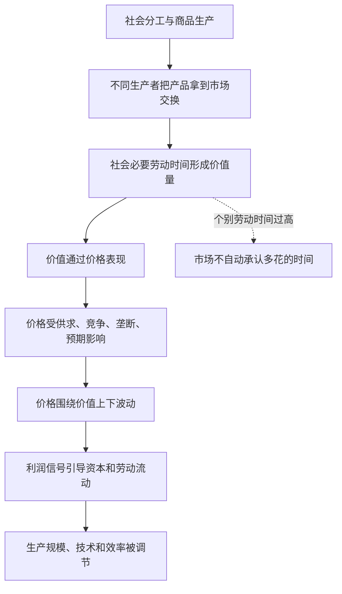

## 马哲思维筑基课: 价值规律

### 作者
digoal

### 日期
2026-05-17

### 标签
价值规律 , 社会必要劳动时间 , 商品价值 , 价格波动 , 商品生产 , 市场竞争 , 抽象劳动 , 价值量 , 政治经济学 , 资本论

----

## 背景

> 面向对象: 高中生到大学低年级读者  
> 核心问题: 为什么商品价值不是由个人主观感觉、个别辛苦程度或偶然价格决定，而要看社会必要劳动时间？  
> 先说结论: 价值规律说的是，商品价值量由生产该商品的社会必要劳动时间决定；市场价格会受供求等因素影响而上下波动，但长期会围绕价值运动，并通过竞争调节生产和资源配置。

## 一张图先看懂



## 求真讲法

### 它到底说了什么

价值规律的核心是: 商品价值量不是由某个人自己花了多少时间决定，而是由社会必要劳动时间决定。

“社会必要劳动时间”可以理解为: 在现有社会正常生产条件下，用平均熟练程度和平均劳动强度，生产某种商品通常需要的劳动时间。

比如，市场上大多数厂家用1小时能做出一件合格T恤。你因为工具落后、方法低效，花了5小时才做出同样T恤，市场通常不会按5小时给你定价。社会承认的是平均条件下必要的劳动，而不是个别人的全部辛苦。

价值规律还说: 价格不等于价值，但价格不会完全脱离价值。短期价格会因为供求、抢购、库存、品牌、垄断和预期而波动；长期看，价格要受到生产该商品所需社会劳动耗费的约束。

### 它是怎么来的

价值规律不是凭空出现的，它建立在前面几个命题上:

```text
商品有二重性
    ↓
商品既有使用价值，又有价值
    ↓
劳动有二重性
    ↓
具体劳动生产使用价值，抽象劳动形成价值
    ↓
不同商品在市场中交换
    ↓
价值量需要一个社会尺度
    ↓
这个尺度就是社会必要劳动时间
```

在商品社会中，每个生产者表面上是私人生产: 自己决定生产什么、怎么生产、生产多少。但产品能不能卖出去、能卖多少钱，要由市场上的社会需求和平均生产条件来检验。

价值规律就是这种“私人劳动必须转化为社会劳动”的规律。它不是某个机构下达的命令，而是通过价格、竞争、盈亏和破产压力发挥作用。

### 它依赖哪些假设

| 假设 | 含义 | 如果不成立会怎样 |
|---|---|---|
| 商品为交换而生产 | 产品要进入市场交换 | 价值规律难以成为主要调节方式 |
| 存在社会分工 | 不同生产者互相依赖 | 商品交换缺少普遍基础 |
| 劳动能被社会比较 | 不同具体劳动被折算为抽象劳动 | 社会必要劳动时间难以形成 |
| 竞争和价格信号存在 | 生产者会受盈亏、价格和市场份额影响 | 价值规律调节会被削弱 |
| 商品有社会需求 | 使用价值必须被别人需要 | 没有需求的劳动不能自动形成价值 |

### 常见误解

误解一: 价值规律等于“劳动时间越长，价值越高”。

不对。价值量取决于社会必要劳动时间，不是个别劳动时间。低效率造成的额外耗时，不会自动被社会承认。

误解二: 价值规律等于“价格永远等于价值”。

不对。价格是价值的货币表现，会围绕价值波动。供求、垄断、政策、品牌和预期都可能让价格暂时偏离价值。

误解三: 只要东西有用，就一定有价值。

不对。使用价值是价值实现的前提，但不是价值本身。空气有巨大使用价值，在通常条件下却不是商品价值。没人需要的商品，即使花了劳动，也难以实现价值。

误解四: 价值规律是自然规律，任何社会都一样。

不对。价值规律是商品生产和商品交换条件下的规律。不同社会中，资源配置可能更多依靠传统、命令、计划、互助或公共制度。

## 求存讲法

### 它有什么用

价值规律可以解释三个常见问题:

| 问题 | 价值规律的解释 |
|---|---|
| 为什么落后产能会被淘汰？ | 个别劳动时间高于社会必要劳动时间，成本压力更大 |
| 为什么技术进步会压低某些商品价格？ | 社会必要劳动时间下降，价值量趋于下降 |
| 为什么热门商品会吸引更多生产者？ | 价格高于价值时，利润信号吸引资本和劳动进入 |

它帮助我们看懂市场不是单纯“想卖多少就卖多少”，而是社会劳动通过价格和竞争被重新分配。

### 它怎么迁移到熟悉领域

#### 学习

一个学生花10小时背一章内容，另一个学生用更好的方法2小时掌握。考试评价不会因为第一个人花了更久就自动给更高分。这里不能直接等同商品价值，但可以类比: 结果要接受某种社会尺度检验。

#### 公司

如果一家企业生产同样产品需要更高成本、更长时间，而市场价格由行业平均效率约束，它就会被迫改进技术、管理和供应链，否则利润会被压缩。

#### 数字产品

软件、课程、内容产品的复制成本可能很低，但开发、维护、更新、获客、服务器和服务支持仍然耗费社会劳动。它们的价格还会受到稀缺性、品牌和平台规则影响，所以更需要区分价值基础和价格形式。

### 它的适用范围和边界

价值规律适合分析商品生产、市场竞争、价格波动、技术进步、产业转移和企业效率。

但它不是万能解释。垄断、国家政策、金融投机、知识产权、补贴、战争、自然灾害、平台控制和消费者心理，都可能让价格长期或短期偏离价值。偏离不等于价值规律不存在，而是说明价格形式受多种力量共同影响。

还要注意，价值规律分析的是商品价值，不应把生命、尊严、友谊、公共责任、生态系统等全部压成市场价格。

### 正例: 怎么用它提升能力

假设你想分析“为什么某种电子产品几年后明显降价”。

不要只说“商家良心发现”，可以这样看:

1. 生产技术成熟，单位产品所需社会必要劳动时间下降。
2. 供应链扩大，零部件成本和组装成本下降。
3. 竞争者进入，价格被压向更低水平。
4. 新型号出现，旧型号需求下降，价格进一步下调。

这就是价值规律和价格竞争共同作用的结果。

### 反例: 前提不成立会怎样

假设一个手工艺人做了一个杯子，花了100小时，但市场上功能和质量相近的杯子通常1小时就能生产。手工艺人说:“我花了100小时，所以它必然值100小时的价格。”

这个判断忽略了社会必要劳动时间。除非手工差异形成了被社会承认的特殊使用价值，例如艺术性、收藏性、品牌或稀缺性，否则个别耗时不会自动变成价值。

这个反例说明: 价值规律不是奖励一切辛苦，而是检验私人劳动是否被社会需要、是否达到社会平均条件。

## 思考

1. 如果市场只承认社会必要劳动时间，低效率劳动者会面临什么压力？
2. 技术进步降低商品价值量时，消费者、企业和劳动者分别会怎样受影响？
3. 如果价格长期高于价值，是因为稀缺、垄断、品牌，还是因为我们误判了价值基础？
4. 平台和算法控制流量时，价值规律是被取消了，还是通过新的形式发挥作用？
5. 哪些重要的人类活动不应该交给价值规律来衡量？

## 最后记住

1. 价值规律的核心是: 商品价值量由社会必要劳动时间决定。
2. 社会必要劳动时间不是个别耗时，而是正常条件下的社会平均必要耗费。
3. 价格是价值的货币表现，会受供求等因素影响而围绕价值波动。
4. 价值规律通过竞争、价格、盈亏和资源流动调节商品生产。
5. 价值规律适用于商品生产和交换条件，不能把所有社会价值都市场化。

## 参考资料

- 马克思: 《资本论》第一卷第一章“商品”，关于价值量和社会必要劳动时间的分析。
- 马克思: 《资本论》第一卷关于劳动二重性、价值形式和商品交换的相关论述。
- 马克思: 《政治经济学批判》，关于价值、货币和商品生产规律的分析。
- 恩格斯: 《反杜林论》，关于价值规律和商品生产的辅助说明。
- 说明: 本文基于通行马克思主义政治经济学教材体系做教学性重构；“上层定律”是便于学习的归类说法，不是马克思、恩格斯原文中的形式化术语。
  
#### [PostgreSQL 解决方案集合](../201706/20170601_02.md "40cff096e9ed7122c512b35d8561d9c8")
  
  
#### [德哥 / digoal's Github - 公益是一辈子的事.](https://github.com/digoal/blog/blob/master/README.md "22709685feb7cab07d30f30387f0a9ae")
  
  
#### [About 德哥](https://github.com/digoal/blog/blob/master/me/readme.md "a37735981e7704886ffd590565582dd0")
  
  

  
