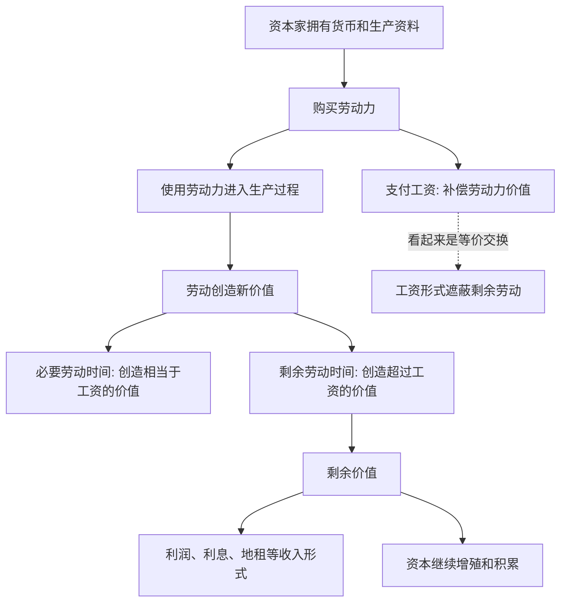

## 马哲思维筑基课: 剩余价值规律

### 作者
digoal

### 日期
2026-05-17

### 标签
剩余价值规律 , 劳动力价值 , 必要劳动 , 剩余劳动 , 工资 , 资本增殖 , 雇佣劳动 , 剥削 , 政治经济学 , 资本论

----

## 背景

> 面向对象: 高中生到大学低年级读者  
> 核心问题: 如果资本家按市场价格购买劳动力，为什么资本主义生产仍然会产生剥削和利润？  
> 先说结论: 剩余价值规律说的是，资本按价值购买劳动力，但劳动力在生产中创造的新价值可以超过自身价值；超过工资所代表劳动力价值的部分，就是剩余价值，它是资本增殖和资本主义利润的基础。

## 一张图先看懂



## 求真讲法

### 它到底说了什么

剩余价值规律要解释的是: 资本为什么能稳定增殖。

关键不在于资本家在市场上简单“低买高卖”。如果只是低买高卖，一个人赚到的钱就是另一个人亏掉的钱，无法解释整个资本家阶级为什么能持续获得利润。

马克思的解释是: 资本家在市场上购买的不是已经完成的劳动，而是劳动力。劳动力像其他商品一样有价值，通常表现为工资；但它的特殊使用价值是能够劳动、能够创造新价值。

假设工人一天工资对应4小时必要劳动创造的价值，但工人实际工作8小时。前4小时创造相当于工资的价值，后4小时创造的价值超过工资，成为剩余价值。形式上看，资本家按契约支付了工资；实质上看，生产过程包含未付酬的剩余劳动。

### 它是怎么来的

剩余价值规律建立在几个前提上:

```text
商品二重性
    ↓
劳动二重性
    ↓
劳动力成为商品
    ↓
资本购买劳动力并组织生产
    ↓
劳动力的使用创造新价值
    ↓
新价值超过劳动力自身价值
    ↓
剩余价值产生
```

这里最关键的是区分“劳动力价值”和“劳动力使用价值”。

劳动力价值，是维持劳动者生存、恢复体力脑力、养育后代、接受教育训练所需生活资料的价值，表现为工资。

劳动力使用价值，是劳动者在生产过程中实际劳动的能力。它能创造新价值，而且创造的新价值可能大于工资。资本主义利润的秘密，就在这个差额里。

### 它依赖哪些假设

| 假设 | 含义 | 如果不成立会怎样 |
|---|---|---|
| 劳动力成为商品 | 劳动者自由出卖劳动力，同时缺少生产资料 | 雇佣劳动关系难以稳定 |
| 资本掌握生产资料 | 资本能组织劳动力、工具、原料和市场销售 | 剩余价值生产缺少组织条件 |
| 劳动力能创造新价值 | 活劳动在生产中增加价值 | 剩余价值无法产生 |
| 工作日超过必要劳动时间 | 劳动者创造的价值大于工资对应价值 | 没有剩余劳动，就没有剩余价值 |
| 产品能够销售 | 商品卖出去，价值和剩余价值才能实现 | 剩余价值可能停留在库存中 |

### 常见误解

误解一: 剩余价值就是商人加价。

不对。加价只是流通中的表现。剩余价值的根源在生产过程，是劳动力创造的新价值超过劳动力自身价值。

误解二: 资本家付了工资，就不存在剥削。

不对。马克思讨论的剥削不是说工资一定低于劳动力价值，而是说即使按劳动力价值支付工资，只要工作日中存在剩余劳动，资本仍可占有剩余价值。

误解三: 利润完全来自机器。

不准确。机器能提高效率、转移自身价值、降低单位商品成本，但在马克思理论中，新价值的创造来自活劳动。机器本身不会凭空创造新价值。

误解四: 剩余价值规律只适用于黑心老板。

不对。它分析的是资本主义生产关系，不是单个资本家的道德品质。即使资本家个人友善，只要他作为资本人格化存在，也会受竞争和增殖压力推动。

## 求存讲法

### 它有什么用

剩余价值规律可以解释资本主义中的几个现象:

| 现象 | 剩余价值规律的解释 |
|---|---|
| 企业追求延长工时 | 增加剩余劳动时间，生产绝对剩余价值 |
| 企业投资技术 | 缩短必要劳动时间，提高相对剩余价值 |
| 工资和利润存在张力 | 工资上升可能压缩剩余价值率，反之亦然 |
| 管理追求效率 | 用组织和技术提高单位时间内的价值增殖能力 |
| 资本不断积累 | 剩余价值被再投入，扩大资本规模 |

它让我们看到，利润不是单纯来自聪明买卖，而是来自对劳动过程的组织、控制和剩余劳动的占有。

### 它怎么迁移到熟悉领域

#### 职场

一个员工的工资是月薪2万元，并不意味着他一个月只为公司创造2万元价值。公司雇佣他，是因为预期他参与生产、销售、研发、运营后，能创造超过工资和相关成本的价值。

#### 平台经济

平台通过算法、订单、评分、补贴和佣金组织劳动。即使劳动者看似自由接单，平台也可能通过规则安排劳动时间、劳动强度和收益分配，从中获得增殖。

#### 技术管理

自动化工具看似减少劳动，但资本采用技术的目的通常不是让劳动者更自由，而是提高效率、压缩成本、增强控制，从而提高剩余价值生产能力。

### 它的适用范围和边界

剩余价值规律适合分析资本主义雇佣劳动、企业利润、工资关系、工作日、劳动强度、技术替代、平台劳动和资本积累。

但它不适合机械套用到所有劳动关系。家庭成员之间的照护、朋友互助、志愿服务、自给生产，不一定以劳动力商品和资本增殖为前提，不能直接说都在生产剩余价值。

也要区分剩余价值和它的表现形式。利润、利息、地租、股息、平台佣金等可能是剩余价值的转化或分割形式，但具体分析还要看行业、金融、产权和市场结构。

### 正例: 怎么用它提升能力

假设你想分析“为什么企业既说重视员工，又不断提高绩效要求”。

可以这样拆解:

1. 企业支付工资，是购买劳动力的使用权。
2. 绩效制度的目标，是让单位时间内创造更多可销售成果。
3. 如果工资不同比例增加，而劳动强度和产出提高，剩余价值率可能上升。
4. 竞争压力会迫使企业把这种做法常态化。

这样分析，比简单说“老板坏”或“员工不努力”更能抓住制度逻辑。

### 反例: 前提不成立会怎样

假设一个人周末帮朋友搬家，没有工资、没有资本组织、没有商品销售。有人说:“你劳动了，所以朋友一定占有了你的剩余价值。”

这个说法不准确。这里有劳动和互助，但没有劳动力作为商品出售，也没有资本购买劳动力并组织生产商品以增殖。因此不能直接套用剩余价值规律。

这个反例说明: 剩余价值规律有明确边界，它分析的是资本主义雇佣劳动和资本增殖关系。

## 思考

1. 如果工资形式把一天劳动表现为“全部劳动都被支付了”，它遮蔽了什么？
2. 为什么资本更关心劳动过程的组织、节奏和效率，而不只是买卖价格？
3. 技术进步在什么条件下解放劳动者，在什么条件下加强剩余价值生产？
4. 平台经济中，谁在组织劳动，谁在承担风险，谁在获得增殖？
5. 如果劳动者共同掌握生产资料，剩余劳动会以什么形式存在，又由谁决定如何使用？

## 最后记住

1. 剩余价值不是简单加价，而是生产过程中产生的超过劳动力价值的新价值。
2. 工资表现为劳动价格，但在马克思理论中本质上是劳动力价值的货币表现。
3. 必要劳动时间创造相当于工资的价值，剩余劳动时间创造剩余价值。
4. 剩余价值规律解释资本主义利润、积累和劳动控制的基础。
5. 它适用于资本主义雇佣劳动关系，不能随意套到所有互助和非商品劳动中。

## 参考资料

- 马克思: 《资本论》第一卷第四章“货币转化为资本”，关于资本一般公式和剩余价值来源问题。
- 马克思: 《资本论》第一卷第五章“劳动过程和价值增殖过程”，关于劳动创造新价值和价值增殖过程的分析。
- 马克思: 《资本论》第一卷第六章“劳动力的买和卖”，关于劳动力价值与使用价值的分析。
- 马克思: 《资本论》第一卷第七至九章，关于剩余价值率、工作日、必要劳动和剩余劳动的分析。
- 说明: 本文基于通行马克思主义政治经济学教材体系做教学性重构；“上层定律”是便于学习的归类说法，不是马克思、恩格斯原文中的形式化术语。
  
#### [PostgreSQL 解决方案集合](../201706/20170601_02.md "40cff096e9ed7122c512b35d8561d9c8")
  
  
#### [德哥 / digoal's Github - 公益是一辈子的事.](https://github.com/digoal/blog/blob/master/README.md "22709685feb7cab07d30f30387f0a9ae")
  
  
#### [About 德哥](https://github.com/digoal/blog/blob/master/me/readme.md "a37735981e7704886ffd590565582dd0")
  
  

  
