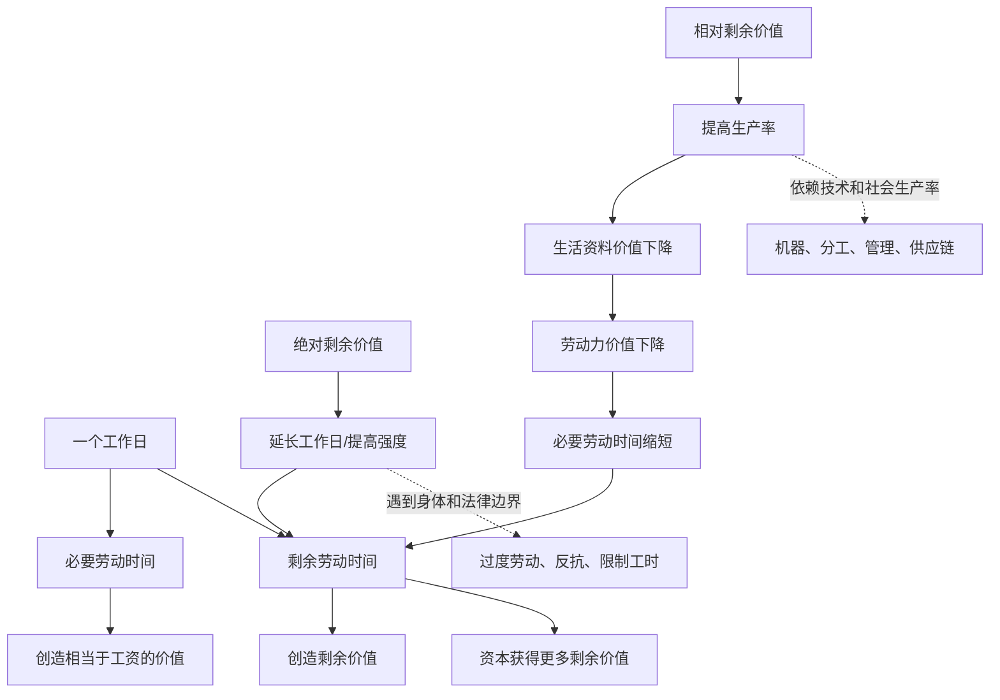

## 马哲思维筑基课: 绝对剩余价值与相对剩余价值规律

### 作者
digoal

### 日期
2026-05-17

### 标签
绝对剩余价值 , 相对剩余价值 , 必要劳动时间 , 剩余劳动时间 , 工作日 , 劳动强度 , 生产率 , 技术进步 , 资本增殖 , 资本论

----

## 背景

> 面向对象: 高中生到大学低年级读者  
> 核心问题: 资本怎样在工资关系不变的表面下，增加对剩余劳动的占有？  
> 先说结论: 绝对剩余价值靠延长工作日或提高劳动强度，让剩余劳动时间变长；相对剩余价值靠提高生产率、降低劳动力再生产成本，从而缩短必要劳动时间，让同一工作日中剩余劳动占比变大。

## 一张图先看懂



## 求真讲法

### 它到底说了什么

剩余价值来自剩余劳动。问题是: 资本怎样增加剩余劳动？

第一种办法是绝对剩余价值生产。假设必要劳动时间是4小时，原来工作日是8小时，那么剩余劳动时间是4小时。如果工作日延长到10小时，必要劳动时间还是4小时，剩余劳动时间就变成6小时。资本获得更多剩余价值。

第二种办法是相对剩余价值生产。工作日仍然是8小时，但通过技术、分工、管理、供应链和社会生产率提高，工人维持生活所需商品变便宜了，劳动力价值下降。必要劳动时间从4小时缩短到3小时，剩余劳动时间就从4小时增加到5小时。

所以，两者的区别很清楚:

```text
绝对剩余价值: 把工作日拉长，或让同一时间内劳动更紧
相对剩余价值: 工作日不一定变长，但必要劳动时间变短
```

### 它是怎么来的

它来自剩余价值规律的进一步展开。

资本购买劳动力后，关心的是劳动力在生产过程中能创造多少超过工资的价值。一天劳动可以分成两部分:

1. 必要劳动时间: 工人创造相当于自己工资的价值。
2. 剩余劳动时间: 工人创造超过工资的价值，形成剩余价值。

如果资本要增加剩余价值，就有两条基本路径:

| 路径 | 改变什么 | 结果 |
|---|---|---|
| 绝对剩余价值 | 延长工作日或提高劳动强度 | 剩余劳动时间绝对增加 |
| 相对剩余价值 | 缩短必要劳动时间 | 剩余劳动时间相对增加 |

马克思用这一区分说明: 资本主义既会直接压榨劳动时间，也会推动技术进步和生产组织变革。技术进步不是纯粹中性的，它常常被资本用来改变必要劳动和剩余劳动的比例。

### 它依赖哪些假设

| 假设 | 含义 | 如果不成立会怎样 |
|---|---|---|
| 劳动力成为商品 | 工资表现劳动力价值 | 无法用必要劳动/剩余劳动解释工资关系 |
| 工作日可被组织和控制 | 资本能安排劳动时间、节奏和强度 | 绝对剩余价值生产受限 |
| 劳动创造新价值 | 活劳动在生产中形成新增价值 | 剩余价值来源无法说明 |
| 劳动力价值可变化 | 生活资料价值和再生产成本会变化 | 相对剩余价值生产难以发生 |
| 社会生产率可提高 | 技术、分工和组织能降低商品价值 | 必要劳动时间难以缩短 |

### 常见误解

误解一: 绝对剩余价值只等于延长上班时间。

不完全。延长工作日是典型方式，但提高劳动强度、压缩休息、加快节奏，也可能在同样时间内增加劳动耗费。

误解二: 相对剩余价值就是企业多赚钱。

不准确。相对剩余价值的关键是必要劳动时间缩短、剩余劳动时间相对增加。单纯涨价、垄断或投机带来的收入，不等于相对剩余价值生产。

误解三: 技术进步一定自动解放劳动者。

不一定。技术可以减少必要劳动、提高生产力，但在资本关系下，它也可能变成强化管理、替代岗位、提高劳动强度和扩大剩余价值的手段。

误解四: 两种方式互相排斥。

不对。现实中常常同时存在: 企业既采用技术提高效率，也可能延长工时、增加绩效压力、压缩休息。

## 求存讲法

### 它有什么用

这个规律能帮我们分析劳动管理中的两类压力:

| 现象 | 更接近哪种方式 | 说明 |
|---|---|---|
| 加班、延长营业时间 | 绝对剩余价值 | 扩大劳动时间 |
| 提高流水线速度 | 绝对 + 相对 | 强化劳动，同时依赖组织技术 |
| 自动化设备替代部分工序 | 相对剩余价值 | 提高生产率，缩短必要劳动时间 |
| 绩效软件实时监控 | 绝对 + 相对 | 压缩空闲，提高单位时间产出 |
| 供应链优化降低生活资料价格 | 相对剩余价值 | 可能降低劳动力再生产成本 |

它让我们看懂: “效率提升”不只是技术问题，也是劳动时间分配和剩余价值分配问题。

### 它怎么迁移到熟悉领域

#### 职场

如果公司要求员工每天多工作2小时，这是增加绝对剩余价值的典型方向。如果公司引入工具，让同样8小时内完成更多任务，则可能增加相对剩余价值，也可能同时提高劳动强度。

#### 平台经济

外卖平台缩短配送时限、提高接单密度，表面是效率优化，实际可能让同一时间内的劳动更密集。算法既可能延长劳动时间，也可能压缩每单劳动间隙。

#### 消费品产业

如果食品、服装、住房等生活资料的生产率提高，劳动力再生产成本可能下降。资本就可能在工资相对稳定甚至下降的情况下，增加相对剩余价值。

### 它的适用范围和边界

这个规律适合分析资本主义企业中的工时、劳动强度、技术管理、生产率、工资关系和利润来源。

但它不能简单套用到所有“效率提升”。比如一个学生用更好方法学习，效率提高未必是相对剩余价值；一个家庭用洗衣机节省家务时间，也不一定进入资本增殖关系。是否适用，关键看有没有资本购买劳动力、组织生产并占有剩余价值。

还要注意，缩短必要劳动时间并不自动意味着工资下降。工资受劳动力价值、历史文化标准、劳动组织、法律、工会、供求和阶级力量影响。

### 正例: 怎么用它提升能力

假设你想分析“为什么企业引入自动化后，员工反而更忙”。

可以这样拆解:

1. 自动化提高了单位时间产出，可能减少某些必要劳动环节。
2. 企业没有把节省的时间转化为休息，而是提高目标和绩效标准。
3. 同一工作日内，空闲被压缩，剩余劳动比例可能增加。
4. 技术因此不是单纯减负，而成为重新组织劳动、提高剩余价值生产的工具。

这个分析能避免两个简单说法: “技术必然好”或“技术必然坏”。关键是技术处在什么生产关系中。

### 反例: 前提不成立会怎样

假设几个朋友一起做饭，因为买了更好的厨具，做饭时间从2小时缩短到1小时。有人说:“这就是相对剩余价值。”

这个说法不准确。这里有技术提高效率，但没有资本购买劳动力、没有工资关系、没有剩余价值占有。它更像生活效率提升，而不是资本主义意义上的相对剩余价值生产。

这个反例说明: 判断绝对或相对剩余价值，不能只看时间变长或效率提高，还要看是否处在资本雇佣劳动关系中。

## 思考

1. 为什么资本既会追求加班，也会追求自动化？
2. 如果技术提高了生产率，节省出来的时间应该归谁支配？
3. 当绩效系统让同样8小时变得更紧张时，这算不算一种隐蔽的工作日延长？
4. 法律限制工时后，资本为什么更可能转向提高劳动强度和生产率？
5. 如果劳动者共同控制生产资料，生产率提高会怎样改变工作日安排？

## 最后记住

1. 剩余价值来自剩余劳动，增加剩余价值就是增加剩余劳动的绝对量或相对比例。
2. 绝对剩余价值靠延长工作日、提高劳动强度或压缩休息。
3. 相对剩余价值靠提高生产率、降低劳动力价值、缩短必要劳动时间。
4. 技术进步在资本关系中常常服务于剩余价值生产，但它本身不必然只能如此使用。
5. 两种方式现实中经常叠加，不能机械二分。

## 参考资料

- 马克思: 《资本论》第一卷第三篇“绝对剩余价值的生产”，关于工作日、劳动过程和价值增殖过程的分析。
- 马克思: 《资本论》第一卷第四篇“相对剩余价值的生产”，关于协作、分工、机器和大工业的分析。
- 马克思: 《资本论》第一卷第七至十章，关于剩余价值率、必要劳动、剩余劳动和工作日的分析。
- 恩格斯: 《反杜林论》，关于剩余价值理论和资本主义生产方式的辅助说明。
- 说明: 本文基于通行马克思主义政治经济学教材体系做教学性重构；“上层定律”是便于学习的归类说法，不是马克思、恩格斯原文中的形式化术语。
  
#### [PostgreSQL 解决方案集合](../201706/20170601_02.md "40cff096e9ed7122c512b35d8561d9c8")
  
  
#### [德哥 / digoal's Github - 公益是一辈子的事.](https://github.com/digoal/blog/blob/master/README.md "22709685feb7cab07d30f30387f0a9ae")
  
  
#### [About 德哥](https://github.com/digoal/blog/blob/master/me/readme.md "a37735981e7704886ffd590565582dd0")
  
  

  
