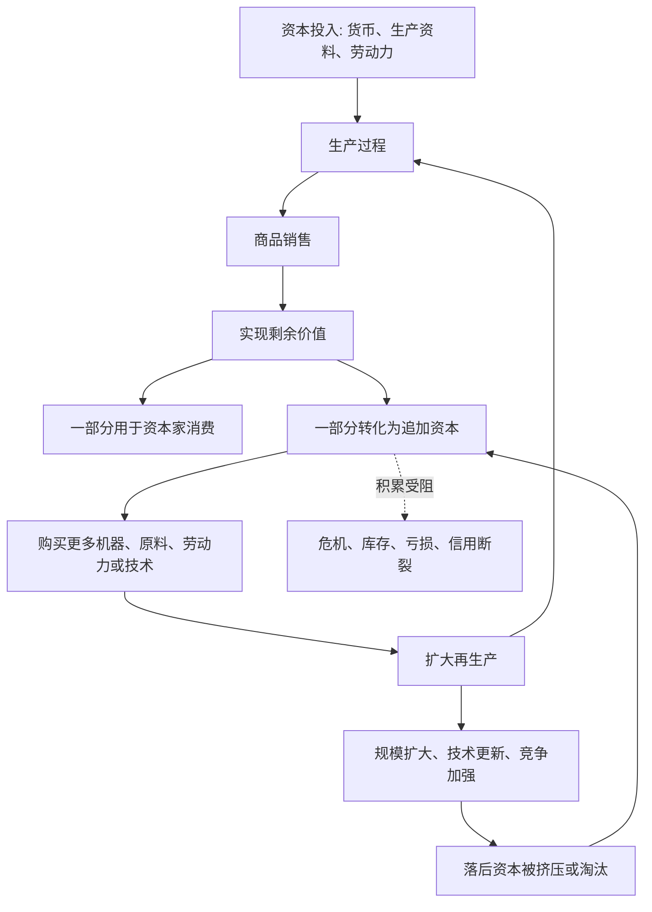

## 马哲思维筑基课: 资本积累规律

### 作者
digoal

### 日期
2026-05-17

### 标签
资本积累 , 剩余价值资本化 , 扩大再生产 , 竞争压力 , 追加资本 , 资本增殖 , 技术投资 , 规模扩张 , 政治经济学 , 资本论

----

## 背景

> 面向对象: 高中生到大学低年级读者  
> 核心问题: 为什么资本主义企业不能只赚一次钱就停下，而会不断扩大规模、更新技术、压低成本并追求下一轮增长？  
> 先说结论: 资本积累规律说的是，剩余价值不是只被消费掉，而会不断转化为追加资本，投入下一轮生产，形成“资本增殖 -> 扩大再生产 -> 更多资本增殖”的循环。竞争压力使这种积累不只是个人选择，而是资本生存的条件。

## 一张图先看懂



## 求真讲法

### 它到底说了什么

资本积累规律说的是: 资本主义生产不是简单的“投入一次、赚一次、结束”。资本的目标是自我增殖，赚到的剩余价值会有相当部分重新投入生产，变成追加资本。

比如一家工厂今年赚了利润。它可以把全部利润用于老板个人消费，也可以拿出一部分购买新机器、扩大厂房、雇更多员工、建设渠道、研发新产品。后一种做法就是把剩余价值转化为资本。

当这种过程不断重复，就形成资本积累:

```text
资本 -> 生产 -> 剩余价值 -> 追加资本 -> 扩大生产 -> 更多剩余价值
```

所以，资本积累不是“攒钱”这么简单，而是剩余价值不断资本化、生产规模不断扩大的过程。

### 它是怎么来的

资本积累规律来自剩余价值规律和资本自我增殖逻辑。

资本家获得剩余价值后，为什么不全部消费掉？因为资本主义竞争会迫使每个资本家不断扩大规模、提高技术、降低成本。如果一个资本家停在原地，另一个资本家把利润投入机器、技术和市场扩张，后者就可能用更低成本、更高产量、更强渠道把前者挤出市场。

因此，积累既是欲望，也是压力。单个资本家看似自由选择，实际上被竞争关系推着走。

可以把推导链写成:

```text
劳动力创造剩余价值
    ↓
资本占有剩余价值
    ↓
剩余价值部分转化为追加资本
    ↓
生产规模和技术能力扩大
    ↓
竞争迫使其他资本跟进
    ↓
资本积累成为系统性规律
```

### 它依赖哪些假设

| 假设 | 含义 | 如果不成立会怎样 |
|---|---|---|
| 剩余价值能够产生 | 雇佣劳动创造超过劳动力价值的新价值 | 没有可积累的源泉 |
| 剩余价值能够实现 | 商品能卖出去，价值转化为货币 | 积累可能停在库存和亏损中 |
| 资本可再投入 | 货币能购买更多生产资料和劳动力 | 扩大再生产难以持续 |
| 市场竞争存在 | 资本家被迫提高效率和扩大规模 | 积累压力会减弱 |
| 信用和制度支持 | 银行、股份制、产权和合同帮助资本扩张 | 积累速度和规模受限 |

### 常见误解

误解一: 资本积累就是资本家个人贪婪。

不准确。个人贪婪可能存在，但资本积累更深层是制度逻辑。资本如果不积累，就可能在竞争中被更高效率、更大规模的资本淘汰。

误解二: 积累等于储蓄。

不对。储蓄只是把钱保存起来；资本积累是把剩余价值转化为追加资本，投入生产和增殖循环。

误解三: 积累一定让所有人更富。

不一定。资本积累可以扩大生产力和商品供给，但也可能扩大劳动强度、就业不稳定、财富集中和相对贫困。

误解四: 企业扩大规模一定因为需求真实增长。

不一定。企业扩张还可能来自竞争压力、融资压力、市场份额争夺、估值逻辑和对未来利润的预期。扩张过度也可能造成过剩和危机。

## 求存讲法

### 它有什么用

资本积累规律可以解释很多现代现象:

| 现象 | 积累规律的解释 |
|---|---|
| 企业持续再投资 | 剩余价值转化为追加资本 |
| 大厂不断扩张业务 | 规模、流量和数据本身成为竞争优势 |
| 技术快速迭代 | 提高生产率，压低单位成本，争夺市场 |
| 中小企业被挤压 | 积累能力弱，难以跟上规模和技术竞争 |
| 融资驱动增长 | 信用和资本市场加速积累过程 |

它让我们看到，增长不是企业宣传里的抽象口号，而是资本关系中的生存机制。

### 它怎么迁移到熟悉领域

#### 公司

公司盈利后，若竞争者都在扩大研发、降价、投广告、建渠道，自己不跟进就可能失去市场。因此，员工会感受到持续增长目标、绩效压力和组织扩张。

#### 平台经济

平台早期大量补贴，未必是为了短期利润，而是为了积累用户、数据、商家和网络效应。一旦规模形成，平台就可能提高佣金、改变规则、强化变现。

#### 个人生活的类比

个人学习也有“再投入”的类比: 把一次学习成果转化为更高能力，再争取更复杂机会。但这只是类比，不是严格资本积累，因为个人能力成长不等于占有他人剩余价值。

### 它的适用范围和边界

资本积累规律适合分析企业扩张、产业升级、资本集中、技术投资、平台增长、金融融资和劳动压力。

但不能把所有扩大规模都叫资本积累。学校增加图书、社区建设公共设施、家庭改善生活条件，可能是公共投入或生活改善，不一定以剩余价值资本化为目标。

还要注意，积累不是无阻力直线增长。它会受到市场需求、利润率、劳动力供给、资源环境、信用周期、政策制度和社会反抗的限制。

### 正例: 怎么用它提升能力

假设你想分析“为什么互联网平台长期亏损还继续扩张”。

可以这样拆解:

1. 平台通过融资获得货币资本，提前扩大规模。
2. 补贴用户和商家，是为了积累网络效应、数据和市场入口。
3. 规模扩大后，平台获得更强定价权、规则制定权和变现能力。
4. 投资人期待未来剩余价值或垄断收益兑现。
5. 如果增长停止，估值、融资和竞争地位都可能受损。

这说明，积累不只发生在传统工厂，也可以通过流量、数据、信用和平台规则展开。

### 反例: 前提不成立会怎样

假设一个合作社年底有结余，成员决定减少工作时间、改善休息条件、增加社区服务，而不是扩大规模和追求更高利润。有人说:“只要有结余再使用，就是资本积累。”

这个说法过于粗糙。这里确实有剩余和再分配，但如果目标不是价值增殖，不是通过雇佣劳动扩大资本，不是为了在竞争中占有更多剩余价值，就不能简单称为资本积累。

这个反例说明: 资本积累的关键不是“有剩余”，而是剩余价值转化为追加资本并服务于资本增殖。

## 思考

1. 为什么资本主义企业很难满足于“够用就好”？
2. 当企业把利润投入自动化时，劳动者会获得更多自由，还是面临更大压力？
3. 平台积累用户和数据，和工厂积累机器设备有什么相同与不同？
4. 如果竞争迫使所有企业都扩张，会不会导致过剩生产和危机？
5. 如果剩余不再服务于资本增殖，而由劳动者和社会共同决定用途，积累会变成什么样？

## 最后记住

1. 资本积累是剩余价值转化为追加资本，不是普通储蓄。
2. 积累的循环是: 剩余价值 -> 追加资本 -> 扩大再生产 -> 更多剩余价值。
3. 竞争使积累成为资本的生存压力，而不只是个人选择。
4. 积累推动生产力发展，也可能带来财富集中、劳动压力和危机风险。
5. 判断是否为资本积累，要看剩余是否服务于价值增殖和雇佣劳动关系的扩大。

## 参考资料

- 马克思: 《资本论》第一卷第七篇“资本的积累过程”，关于剩余价值转化为资本和扩大再生产的分析。
- 马克思: 《资本论》第一卷第二十二章“剩余价值转化为资本”，关于资本积累的一般机制。
- 马克思: 《资本论》第一卷第二十三章“资本主义积累的一般规律”，关于积累、就业和相对过剩人口的分析。
- 恩格斯: 《反杜林论》，关于资本主义生产方式和资本积累的辅助说明。
- 说明: 本文基于通行马克思主义政治经济学教材体系做教学性重构；“上层定律”是便于学习的归类说法，不是马克思、恩格斯原文中的形式化术语。
  
#### [PostgreSQL 解决方案集合](../201706/20170601_02.md "40cff096e9ed7122c512b35d8561d9c8")
  
  
#### [德哥 / digoal's Github - 公益是一辈子的事.](https://github.com/digoal/blog/blob/master/README.md "22709685feb7cab07d30f30387f0a9ae")
  
  
#### [About 德哥](https://github.com/digoal/blog/blob/master/me/readme.md "a37735981e7704886ffd590565582dd0")
  
  

  
