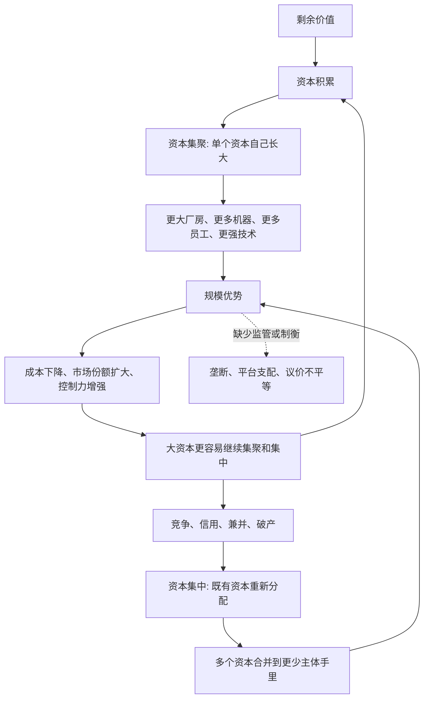

## 马哲思维筑基课: 资本集中与资本集聚规律

### 作者
digoal

### 日期
2026-05-17

### 标签
资本集中 , 资本集聚 , 资本积累 , 兼并收购 , 信用制度 , 行业寡头 , 平台资本 , 控制权 , 规模优势 , 资本论

----

## 背景

> 面向对象: 高中生到大学低年级读者  
> 核心问题: 为什么资本主义发展中，大企业、平台巨头、行业寡头和金融控制力往往越来越强？  
> 先说结论: 资本集聚是单个资本通过积累不断长大；资本集中是多个已有资本通过兼并、收购、破产、信用和控制权重组，集中到更少主体手里。二者共同推动资本规模扩大和控制权集中。

## 一张图先看懂



## 求真讲法

### 它到底说了什么

资本集聚和资本集中都在讲资本规模变大，但机制不同。

资本集聚，是一个资本通过自身积累长大。比如一家工厂把利润再投入，购买更多机器、扩大厂房、雇更多人、开发更多产品。这是“自己长大”。

资本集中，是已经存在的多个资本被合并、吞并或控制到更少主体手里。比如大公司收购小公司，两家企业合并，弱企业破产后资产被强企业低价买走，金融资本通过持股和债权控制企业。这是“把已有资本重新集中”。

简单说:

```text
资本集聚: 1 变成更大的 1
资本集中: 1 + 1 + 1 变成一个更大的 1
```

两者会互相加强。集聚让企业更有能力收购别人；集中让企业一下子获得更大规模和市场控制力。

### 它是怎么来的

这个规律来自资本积累和竞争。

资本积累让单个资本不断扩大。企业有了更多剩余价值，就可以购买更多生产资料和劳动力，提高技术水平，形成规模优势。

竞争又会淘汰弱者、奖励强者。强资本成本更低、融资更容易、渠道更强、抗风险能力更高；弱资本可能亏损、破产、被收购。信用制度、股份制和资本市场还会加速这个过程，因为资本可以通过借贷、上市、并购和股权控制迅速扩大支配范围。

可以把推导链写成:

```text
剩余价值产生
    ↓
剩余价值转化为追加资本
    ↓
单个资本通过积累变大: 集聚
    ↓
竞争使强资本吞并或控制弱资本
    ↓
多个既有资本合并: 集中
    ↓
更大的资本获得更强竞争优势
```

### 它依赖哪些假设

| 假设 | 含义 | 如果不成立会怎样 |
|---|---|---|
| 剩余价值能够积累 | 利润可再投入生产和扩张 | 集聚缺少来源 |
| 市场竞争存在 | 强弱资本通过价格、技术、渠道竞争 | 集中压力较弱 |
| 资本可以转让和合并 | 企业、资产、股权、债权能被买卖 | 并购和控制权重组受限 |
| 信用制度发展 | 借贷、股份、证券市场帮助资本扩张 | 集中速度较慢 |
| 规模优势存在 | 大资本在成本、技术、渠道上有优势 | 大资本未必更容易胜出 |

### 常见误解

误解一: 集聚和集中是同一个概念。

不对。集聚主要靠内部积累，集中主要靠既有资本之间的合并、吞并和控制权重组。

误解二: 大企业一定是因为更勤奋、更优秀。

不一定。大企业可能有技术和管理优势，但也可能来自资本规模、融资能力、并购、网络效应、政策资源、数据控制和市场支配。

误解三: 资本集中一定提高社会效率。

不一定。集中可能带来规模经济和技术投入，也可能带来垄断定价、压制创新、挤压供应商和劳动者、削弱消费者选择。

误解四: 小企业失败只是自己能力差。

不一定。小企业可能被规模成本、渠道封锁、平台规则、融资门槛和大资本价格战挤压。能力问题存在，但不能替代结构分析。

## 求存讲法

### 它有什么用

这个规律可以解释许多现代经济现象:

| 现象 | 更接近哪种机制 | 说明 |
|---|---|---|
| 企业把利润投入新工厂 | 集聚 | 单个资本通过积累长大 |
| 大公司收购竞争对手 | 集中 | 既有资本控制权合并 |
| 平台吃掉上下游业务 | 集聚 + 集中 | 自身扩张并吞并生态伙伴 |
| 破产企业资产被低价收购 | 集中 | 危机中资本重新分配 |
| 风投推动行业整合 | 集中 | 金融资本加速控制权重组 |

它让我们看到，行业变成“几家巨头主导”，并不只是消费者自然选择，也有资本积累、信用扩张、竞争淘汰和控制权重组的系统逻辑。

### 它怎么迁移到熟悉领域

#### 平台经济

一个平台最初可能靠补贴和技术积累用户，这是集聚。随后它收购竞争对手、投资上下游、控制支付、物流和广告入口，这是集中。最后，平台不仅是一个产品，而是行业入口和规则制定者。

#### 连锁商业

一家门店盈利后开第二家、第三家，是集聚。大型连锁收购地方品牌、接管渠道、整合供应链，是集中。结果是街边小店面对更低采购成本、更强品牌和更密集网点的竞争。

#### 金融资本

银行、基金、控股公司不一定直接经营工厂，却可以通过债权、股权和董事会控制多个企业。这种控制权结构能让资本集中速度远快于单个企业慢慢积累。

### 它的适用范围和边界

资本集聚与集中规律适合分析企业规模扩张、并购、行业整合、平台垄断、金融控股、供应链控制和市场支配力。

但不是所有“大规模组织”都是资本集中。公共医院集团、合作社联盟、公益基础设施网络，如果不是以价值增殖和资本控制为目标，就不能简单套用资本集中概念。

也不能认为集中永远不可逆。监管拆分、技术变革、消费者迁移、劳动者组织、开源生态、公共政策和新市场出现，都可能削弱既有大资本的支配力。

### 正例: 怎么用它提升能力

假设你想分析“为什么一个行业最后只剩几家大平台”。

可以这样拆解:

1. 平台通过融资和利润再投入，扩大技术、用户和基础设施，这是集聚。
2. 平台通过补贴和规模优势压低竞争者生存空间。
3. 平台收购潜在对手或上下游关键环节，这是集中。
4. 用户、商家和数据越多，平台越有网络效应。
5. 大平台因此更容易继续融资、并购和制定规则。

这样分析比简单说“大家都喜欢用大平台”更完整。

### 反例: 前提不成立会怎样

假设几个小农户自愿组成合作社，共用仓储、物流和销售渠道，收益按成员约定分配，目标是降低成本、稳定生活，而不是占有雇佣劳动的剩余价值。有人说:“规模变大了，所以这就是资本集中。”

这个判断过于粗糙。这里确实有资源联合和规模协作，但如果没有资本控制权吞并、没有价值增殖目的、没有通过雇佣劳动扩大剩余价值占有，就不能简单称为资本集中。

这个反例说明: 判断资本集聚和集中，不能只看规模变大，还要看控制权、增殖目的和生产关系。

## 思考

1. 为什么很多行业从“百家竞争”走向“几家巨头主导”？
2. 大资本带来的规模效率和垄断风险，应该怎样区分？
3. 平台通过规则控制商家和劳动者时，它是在提供服务，还是在集中控制权？
4. 信用和资本市场为什么能让资本集中比自然积累快得多？
5. 如果监管、合作社和公共基础设施改变控制权结构，资本集中规律会怎样被限制？

## 最后记住

1. 资本集聚是单个资本通过积累自己长大。
2. 资本集中是多个既有资本通过兼并、收购、破产、信用和控制权重组集中到更少主体手里。
3. 集聚靠剩余价值转化为追加资本，集中靠既有资本的重新分配。
4. 二者共同推动大资本、行业寡头、平台支配和金融控制力增强。
5. 判断是否属于资本集聚或集中，要看增殖目的、控制权和生产关系，不能只看规模大小。

## 参考资料

- 马克思: 《资本论》第一卷第二十三章“资本主义积累的一般规律”，关于资本积累、资本集聚和资本集中的分析。
- 马克思: 《资本论》第三卷，关于信用、股份资本和资本集中相关问题的分析。
- 马克思: 《雇佣劳动与资本》，关于资本作为社会关系的通俗表达。
- 恩格斯: 《反杜林论》，关于资本主义生产方式、竞争和资本集中的辅助说明。
- 说明: 本文基于通行马克思主义政治经济学教材体系做教学性重构；“上层定律”是便于学习的归类说法，不是马克思、恩格斯原文中的形式化术语。
  
#### [PostgreSQL 解决方案集合](../201706/20170601_02.md "40cff096e9ed7122c512b35d8561d9c8")
  
  
#### [德哥 / digoal's Github - 公益是一辈子的事.](https://github.com/digoal/blog/blob/master/README.md "22709685feb7cab07d30f30387f0a9ae")
  
  
#### [About 德哥](https://github.com/digoal/blog/blob/master/me/readme.md "a37735981e7704886ffd590565582dd0")
  
  

  
