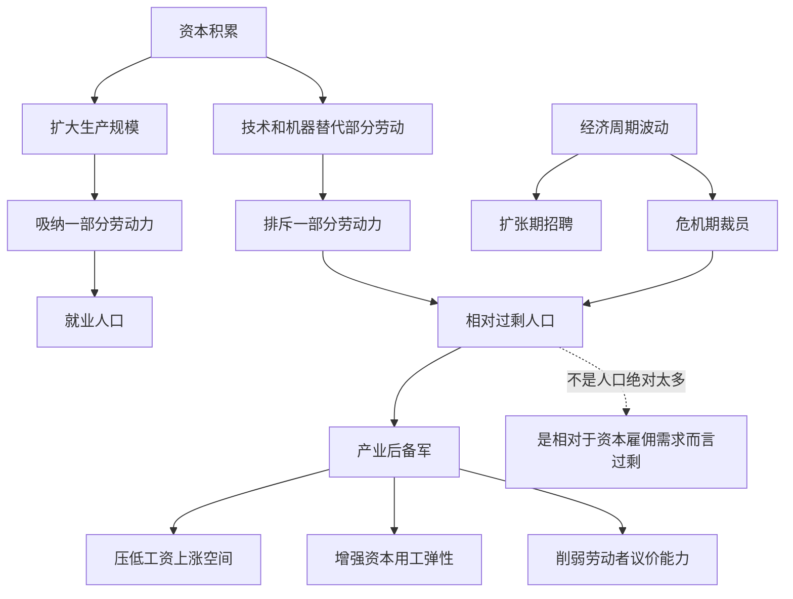

## 马哲思维筑基课: 相对过剩人口规律

### 作者
digoal

### 日期
2026-05-17

### 标签
相对过剩人口 , 产业后备军 , 资本积累 , 技术替代 , 失业 , 劳动力市场 , 工资压力 , 零工经济 , 议价能力 , 资本论

----

## 背景

> 面向对象: 高中生到大学低年级读者  
> 核心问题: 为什么资本积累和技术进步并不必然让所有劳动者稳定就业，反而会不断制造失业、半失业和不稳定就业？  
> 先说结论: 相对过剩人口不是人口绝对太多，而是相对于资本在某一阶段愿意雇佣的劳动力而言，出现了“多余”的劳动者。它构成产业后备军，在资本扩张时被吸纳，在收缩时被排斥，并对工资和劳动条件形成压力。

## 一张图先看懂



## 求真讲法

### 它到底说了什么

相对过剩人口规律说的是: 在资本主义积累过程中，劳动者并不会随着资本增长而全部稳定就业。资本一边扩大生产，一边通过机器、技术、管理和组织方式改变对劳动力的需求，结果会不断形成一批相对多余的劳动者。

这里的“过剩”不是说社会真的不需要这些人生活、学习、创造、照护和参与公共事务，而是说相对于资本追求利润时愿意雇佣的人数，他们暂时或长期显得“多余”。

马克思也把它叫作产业后备军。它像一个劳动力水库: 资本扩张时，从里面吸纳工人；资本收缩时，又把工人排回去。这个后备军的存在，会压低工资上涨空间，增加劳动者竞争压力，并提高资本调整用工的弹性。

### 它是怎么来的

相对过剩人口规律来自资本积累规律。

资本积累会扩大生产，但它不是简单地按比例增加就业。资本为了提高剩余价值和竞争力，会不断提高劳动生产率，增加机器、技术、系统和管理控制。这样一来，同样产量需要的直接劳动可能减少，或者同样劳动者要承担更多产出。

资本积累还具有周期性。扩张时企业大量招人，危机或利润下降时又迅速裁员。劳动者被吸纳和排斥，形成一种不稳定的就业结构。

可以把推导链写成:

```text
剩余价值转化为资本
    ↓
资本积累和技术更新
    ↓
劳动生产率提高
    ↓
部分劳动者被替代、排斥或转入不稳定岗位
    ↓
形成相对过剩人口
    ↓
产业后备军反过来调节工资和劳动纪律
```

### 它依赖哪些假设

| 假设 | 含义 | 如果不成立会怎样 |
|---|---|---|
| 劳动力成为商品 | 劳动者主要靠出卖劳动力生活 | 失业压力不再以同样方式发挥作用 |
| 资本按利润雇佣劳动 | 雇不雇人取决于增殖需要 | 社会需要不能自动转化为就业岗位 |
| 技术和组织会替代劳动 | 机器、算法、管理提高单位劳动产出 | 相对过剩人口形成机制减弱 |
| 经济有周期波动 | 扩张和收缩交替影响就业 | 后备军规模变化不明显 |
| 劳动者议价能力不平等 | 失业和竞争会影响工资条件 | 后备军对工资压力较弱 |

### 常见误解

误解一: 相对过剩人口就是人口太多。

不对。它不是自然人口论，而是社会关系概念。问题不在于人绝对太多，而在于资本只在有利可图时雇佣人。

误解二: 技术进步一定会创造足够新岗位。

不一定。技术可能创造新岗位，也可能替代旧岗位、提高劳动强度、减少直接雇佣，并把劳动者推向低保障、不稳定或间歇性就业。

误解三: 失业完全是个人能力不足。

不对。能力当然影响个人处境，但大规模失业、结构性失业和周期性裁员，不能只用个人努力解释。它们和资本积累、产业结构、技术替代、经济周期有关。

误解四: 有人失业说明社会不需要这些人劳动。

不对。社会有大量需要被满足，如照护、教育、生态修复、公共服务。但这些需要如果不能转化为有利润的岗位，就不一定被资本雇佣体系吸收。

## 求存讲法

### 它有什么用

这个规律能解释劳动市场中的几个现象:

| 现象 | 相对过剩人口规律的解释 |
|---|---|
| 企业一边盈利一边裁员 | 技术、重组和利润率压力改变用工需求 |
| 求职者竞争激烈 | 后备军增加，劳动者议价能力下降 |
| 工资上涨受压制 | 失业和替代人选给在岗者形成压力 |
| 平台零工增多 | 资本用更灵活方式调用劳动力 |
| 危机时裁员集中发生 | 资本收缩，把劳动者排回后备军 |

它让我们看到，失业不只是个人失败，也是一种社会生产关系下的结构性现象。

### 它怎么迁移到熟悉领域

#### 职场

当公司说“外面还有很多人想进来”，这句话背后就有产业后备军的影子。失业者、待业者、应届生、外包人员和临时工的存在，会影响在岗员工的谈判能力。

#### 平台经济

平台可以在高峰期大量吸纳骑手、司机、主播和临时劳动者，在低峰期把收入风险转嫁给劳动者。这种弹性用工把相对过剩人口接入平台系统。

#### 技术替代

人工智能和自动化可能提高生产率，但如果节省的劳动时间不由劳动者共同分享，就可能表现为裁员、岗位减少、工资压制或技能门槛提高。

### 它的适用范围和边界

相对过剩人口规律适合分析资本主义劳动市场、失业、裁员、零工经济、技术替代、工资压力和产业周期。

但它不能解释所有失业原因。个人职业选择、地区迁移、教育匹配、健康状况、家庭照护责任、政策制度和文化因素，也会影响就业。结构分析不能替代具体分析。

还要注意，产业后备军不是固定的一群人。一个人在某个时期可能失业，另一个时期可能就业；同一个行业可能收缩，另一个行业可能扩张。相对过剩人口是一种动态结构。

### 正例: 怎么用它提升能力

假设你想分析“为什么企业引入自动化后，招聘减少但产量上升”。

可以这样拆解:

1. 自动化提高了单位劳动者可以操作的设备和产出。
2. 企业不再需要按原比例增加员工。
3. 部分岗位被取消或外包，劳动者进入待业、转岗或零工状态。
4. 在岗员工面对替代压力，劳动强度和绩效要求可能上升。
5. 这些被排斥或不稳定就业的人，构成相对过剩人口的一部分。

这比简单说“机器抢饭碗”更准确，因为关键不是机器本身，而是技术被资本积累逻辑如何使用。

### 反例: 前提不成立会怎样

假设一个社区为了减少劳动时间，集体引入自动化设备，并把节省出的时间用于教育、照护和休息，而不是裁员或压低工资。有人说:“只要机器减少岗位，就是相对过剩人口规律。”

这个判断不准确。这里技术确实减少了某些劳动时间，但如果生产资料由共同体控制，节省出的时间由成员共同分配，而不是通过资本雇佣关系把人排斥为失业者，就不能简单套用相对过剩人口规律。

这个反例说明: 技术替代本身不是全部，关键在于生产资料归属、劳动组织和节省时间归谁支配。

## 思考

1. 为什么社会有许多未被满足的需要，却仍然会有人失业？
2. 当技术提高生产率时，节省出来的时间应该成为利润，还是成为更多自由时间？
3. 平台把劳动者变成“随叫随到”的资源，是提高自由，还是制造新的后备军形式？
4. 如果失业者越多，在岗劳动者的工资谈判会发生什么变化？
5. 如果生产不以资本增殖为目标，相对过剩人口还会以同样方式存在吗？

## 最后记住

1. 相对过剩人口不是人口绝对太多，而是相对于资本雇佣需求而言过剩。
2. 它来自资本积累、技术替代、经济周期和劳动者被吸纳/排斥的动态过程。
3. 相对过剩人口构成产业后备军，能压低工资上涨空间并削弱劳动者议价能力。
4. 技术进步是否造成失业，取决于生产关系和节省时间归谁支配。
5. 这个规律适用于资本主义劳动市场，不能把所有失业和所有技术变化都机械归因于它。

## 参考资料

- 马克思: 《资本论》第一卷第二十三章“资本主义积累的一般规律”，关于相对过剩人口和产业后备军的分析。
- 马克思: 《资本论》第一卷第四篇“相对剩余价值的生产”，关于机器、分工和大工业如何改变劳动力需求的分析。
- 马克思: 《资本论》第一卷第七篇“资本的积累过程”，关于积累、就业和资本构成变化的分析。
- 恩格斯: 《英国工人阶级状况》，关于工业资本主义、失业和工人生活状态的历史观察。
- 说明: 本文基于通行马克思主义政治经济学教材体系做教学性重构；“上层定律”是便于学习的归类说法，不是马克思、恩格斯原文中的形式化术语。
  
#### [PostgreSQL 解决方案集合](../201706/20170601_02.md "40cff096e9ed7122c512b35d8561d9c8")
  
  
#### [德哥 / digoal's Github - 公益是一辈子的事.](https://github.com/digoal/blog/blob/master/README.md "22709685feb7cab07d30f30387f0a9ae")
  
  
#### [About 德哥](https://github.com/digoal/blog/blob/master/me/readme.md "a37735981e7704886ffd590565582dd0")
  
  

  
