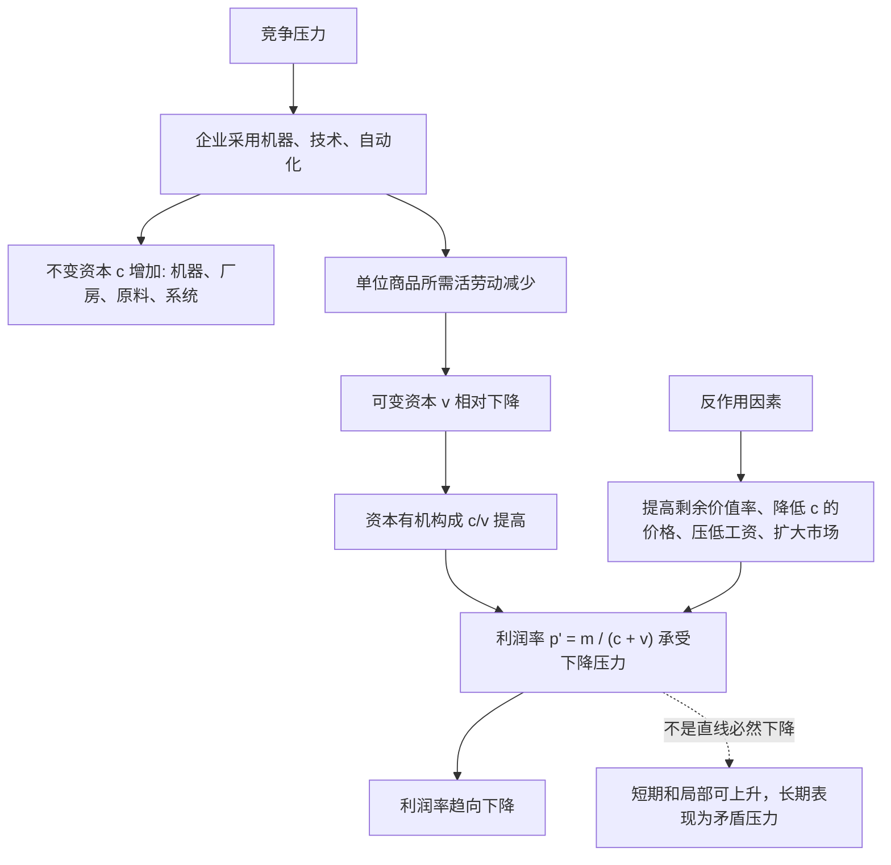

## 马哲思维筑基课: 利润率趋向下降规律

### 作者
digoal

### 日期
2026-05-17

### 标签
利润率趋向下降 , 资本有机构成 , 不变资本 , 可变资本 , 剩余价值率 , 技术进步 , 平均利润率 , 反作用因素 , 危机 , 资本论

----

## 背景

> 面向对象: 高中生到大学低年级读者  
> 核心问题: 为什么资本主义越追求技术进步和机器替代，平均利润率反而可能承受下降压力？  
> 先说结论: 利润率趋向下降规律说的是，竞争推动资本不断增加机器、设备、原料和技术投入，使不变资本相对可变资本上升；如果剩余价值主要来自活劳动，那么相对于总资本，剩余价值的比例就有下降压力。但这是一种“趋向”，会被提高剥削率、降低设备原料价格、压低工资、对外贸易等因素抵消或延缓。

## 一张图先看懂



## 求真讲法

### 它到底说了什么

先看一个简化公式:

```text
利润率 p' = 剩余价值 m / 总预付资本 (c + v)
```

这里的 `c` 是不变资本，比如机器、厂房、原料、能源、软件系统；`v` 是可变资本，也就是购买劳动力的资本，通常表现为工资；`m` 是剩余价值。

在马克思的理论里，新价值主要由活劳动创造。机器很重要，但机器主要把自身价值转移到商品中，不能凭空创造新的价值。资本家为了竞争，会不断增加机器和技术投入，用更多不变资本替代一部分活劳动。结果是 `c` 相对 `v` 上升，资本有机构成提高。

如果总资本越来越大，而创造剩余价值的活劳动相对减少，那么 `m / (c + v)` 就会承受下降压力。这就是利润率趋向下降规律。

### 它是怎么来的

这个规律不是从“资本家不努力”推出的，而是从资本主义竞争和相对剩余价值生产推出的。

企业为了降低成本、提高效率、抢占市场，会采用机器、分工、自动化和管理系统。单个企业这样做，可能获得超额利润；但当全行业都跟进后，技术变成平均条件，商品价值下降，原来的超额利润消失。

同时，整个社会的生产越来越依赖庞大的机器、基础设施、原料、能源和系统，而直接活劳动在总资本中的比重下降。由于剩余价值来源于活劳动，平均利润率就出现趋向性压力。

可以把推导链写成:

```text
竞争迫使企业提高生产率
    ↓
企业增加机器和技术投入
    ↓
不变资本相对可变资本上升
    ↓
资本有机构成提高
    ↓
剩余价值相对于总资本的比例承压
    ↓
平均利润率出现下降趋向
```

### 它依赖哪些假设

| 假设 | 含义 | 如果不成立会怎样 |
|---|---|---|
| 剩余价值主要来自活劳动 | 可变资本购买的劳动力创造新价值 | 规律的核心机制会改变 |
| 竞争推动技术替代 | 企业必须提高生产率、降低成本 | 资本有机构成上升压力减弱 |
| 不变资本比重上升 | 机器、原料、系统投入相对扩大 | 利润率下降压力不明显 |
| 剩余价值率不能无限提高 | 工作日、身体、法律、反抗都有边界 | 下降压力可能被完全抵消 |
| 商品价值需要实现 | 生产出的商品必须卖出去 | 危机和利润率问题会更复杂 |

### 常见误解

误解一: 利润率趋向下降就是利润总量一定下降。

不对。利润率下降时，利润总量仍可能上升。比如资本规模扩大很多，即使每100元资本赚得少了，总利润也可能增加。

误解二: 这个规律说利润率每年都下降。

不对。它说的是一种长期趋向和结构压力，不是直线下降。短期内利润率可以因为技术垄断、涨价、压低工资、金融收益、全球分工等因素上升。

误解三: 机器越多越坏。

不对。问题不在机器本身，而在资本主义关系中，机器常常被用来提高剩余价值、替代劳动、增强控制，并改变利润率结构。

误解四: 反作用因素存在就说明规律无效。

不对。马克思讨论这个规律时同时讨论反作用因素。规律和反作用因素一起构成现实运动，而不是只看单一方向。

## 求存讲法

### 它有什么用

这个规律能解释一些看似矛盾的现象:

| 现象 | 利润率趋向下降规律的解释 |
|---|---|
| 企业越自动化，越需要更大规模销售 | 总资本投入更大，需要更大市场实现利润 |
| 行业技术普及后利润变薄 | 先发超额利润消失，平均利润率承压 |
| 企业不断压成本和裁员 | 试图提高剩余价值率、降低可变资本 |
| 资本转向金融和海外市场 | 寻找更高回报、低成本资源和新市场 |
| 危机中设备闲置、资产贬值 | 通过贬值清理过剩资本，为下一轮利润率恢复创造条件 |

它帮助我们理解: 技术进步可以提高生产力，但在资本关系中，也可能加剧利润率、就业和危机之间的矛盾。

### 它怎么迁移到熟悉领域

#### 制造业

一家工厂买入昂贵自动化设备，短期可能降低成本并获得超额利润。但当同行都使用类似设备后，行业价格下降，利润率可能重新被压低。企业为了维持利润，又继续投资下一代设备。

#### 平台经济

平台投入服务器、算法、数据中心、云基础设施和补贴，前期资本投入巨大。它必须通过规模、广告、佣金、数据变现和金融市场预期来维持回报压力。技术系统越庞大，越需要持续扩张来摊薄成本。

#### 个人类比

学生买昂贵设备学习，如果设备不能带来能力和成果提升，投入回报率会下降。这只是类比，不是严格利润率规律，因为个人学习不是资本雇佣劳动关系。

### 它的适用范围和边界

利润率趋向下降规律适合分析资本主义长期竞争、技术投资、自动化、产业利润变薄、全球扩张、金融化和经济危机压力。

但不能机械用于每个企业或每个年份。某个公司可能凭借专利、品牌、平台垄断、资源控制、金融收益或政策优势长期维持高利润率。某个行业也可能处于新技术爆发期，利润率暂时很高。

还要注意，利润率下降趋向不是唯一危机原因。需求不足、信用扩张、收入分配、资产泡沫、国际竞争、政策变化等都可能参与危机形成。

### 正例: 怎么用它提升能力

假设你想分析“为什么一些制造业企业越卷越薄利”。

可以这样拆解:

1. 企业为了竞争不断买设备、上自动化、扩产能。
2. 初期领先者可能获得超额利润。
3. 技术扩散后，行业平均生产率提高，商品价格下降。
4. 每家企业都背着更高固定资本投入，却面对更低价格和更强竞争。
5. 利润率承压，企业转而压工资、加班、外包、海外转移或寻求金融收益。

这个分析比简单说“市场不好”更能抓住技术竞争和利润率压力的结构。

### 反例: 前提不成立会怎样

假设一家软件公司几乎不增加固定资产，却靠独家版权、网络效应和高订阅价格获得高利润。有人说:“所有资本主义企业利润率都会马上下降，所以它一定很快没利润。”

这个判断太机械。利润率趋向下降是长期结构规律，不是每个企业的短期命运。垄断、知识产权、网络效应、低复制成本和全球市场都可能长期抵消下降压力。

这个反例说明: 分析具体企业和行业时，要同时看资本构成、市场支配力、技术周期、工资结构、价格权力和金融条件。

## 思考

1. 为什么单个企业采用机器能提高利润，但全行业都采用后利润率反而可能承压？
2. 如果技术本来可以减少必要劳动，为什么在资本关系下常表现为裁员和更高绩效压力？
3. 资本为什么会不断寻找海外市场、廉价劳动力和金融收益？
4. 当利润率下降压力积累时，危机是偶然事件，还是系统清理过剩资本的一种方式？
5. 如果机器和技术由劳动者共同控制，生产率提高会不会以不同方式分配成果？

## 最后记住

1. 利润率公式可简化为 `p' = m / (c + v)`。
2. 资本有机构成提高，意味着不变资本相对可变资本上升。
3. 如果剩余价值主要来自活劳动，活劳动相对减少会使平均利润率承受下降压力。
4. 这是一种趋向，不是每年、每个企业、每个行业都直线下降。
5. 提高剥削率、降低不变资本价格、压低工资、对外贸易、金融收益等因素会抵消或延缓下降。

## 参考资料

- 马克思: 《资本论》第三卷第三篇“利润率趋向下降规律”，关于利润率公式、资本有机构成和反作用因素的分析。
- 马克思: 《资本论》第一卷第四篇“相对剩余价值的生产”，关于机器、分工和生产率提高的分析。
- 马克思: 《资本论》第一卷第七篇“资本的积累过程”，关于资本积累和资本构成变化的分析。
- 恩格斯: 《反杜林论》，关于资本主义生产方式、剩余价值和危机问题的辅助说明。
- 说明: 本文基于通行马克思主义政治经济学教材体系做教学性重构；“上层定律”是便于学习的归类说法，不是马克思、恩格斯原文中的形式化术语。
  
#### [PostgreSQL 解决方案集合](../201706/20170601_02.md "40cff096e9ed7122c512b35d8561d9c8")
  
  
#### [德哥 / digoal's Github - 公益是一辈子的事.](https://github.com/digoal/blog/blob/master/README.md "22709685feb7cab07d30f30387f0a9ae")
  
  
#### [About 德哥](https://github.com/digoal/blog/blob/master/me/readme.md "a37735981e7704886ffd590565582dd0")
  
  

  
