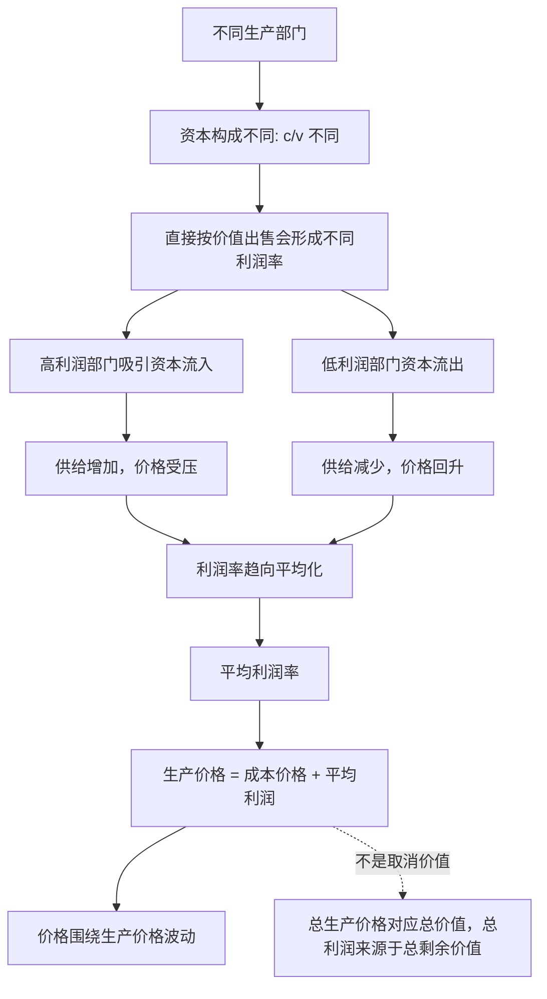

## 马哲思维筑基课: 平均利润率与生产价格规律

### 作者
digoal

### 日期
2026-05-17

### 标签
平均利润率 , 生产价格 , 成本价格 , 资本流动 , 剩余价值分配 , 价值转化 , 部门竞争 , 利润率平均化 , 政治经济学 , 资本论

----

## 背景

> 面向对象: 高中生到大学低年级读者  
> 核心问题: 如果商品价值由劳动决定，为什么现实中不同部门的资本却好像按“投多少钱就拿平均利润”来定价？  
> 先说结论: 平均利润率与生产价格规律说的是，不同部门资本构成不同，直接按价值出售会产生不同利润率；资本会从低利润部门流向高利润部门，竞争最终把总剩余价值重新分配为平均利润，商品也围绕“成本价格 + 平均利润”的生产价格运动。

## 一张图先看懂



## 求真讲法

### 它到底说了什么

先区分四个词:

| 概念 | 简单解释 | 例子 |
|---|---|---|
| 价值 | 商品中凝结的社会必要劳动 | 商品背后的社会劳动耗费 |
| 成本价格 | 资本家实际预付并转移到商品中的成本 | 机器折旧、原料、工资等 |
| 平均利润 | 按社会平均利润率分得的利润 | 资本投入100万，按平均率得到利润 |
| 生产价格 | 成本价格 + 平均利润 | 商品在资本竞争中围绕运动的价格中心 |

问题在于，不同部门资本构成不同。一个部门可能机器多、工人少；另一个部门可能机器少、工人多。如果新价值和剩余价值主要来自活劳动，那么直接按价值出售时，不同部门的利润率会差很多。

但资本不愿长期停在低利润部门。资本会流向高利润部门，离开低利润部门。流入使高利润部门供给增加、价格下降；流出使低利润部门供给减少、价格上升。经过竞争，利润率趋向平均化。

于是，商品不再简单围绕个别价值出售，而是围绕生产价格出售:

```text
生产价格 = 成本价格 + 平均利润
```

### 它是怎么来的

这个规律来自价值规律、剩余价值规律和资本竞争。

价值规律说明商品价值由社会必要劳动时间决定。剩余价值规律说明剩余价值来自雇佣劳动中的剩余劳动。但在资本主义现实中，资本家不是按“我这个部门实际生产了多少剩余价值”来要求利润，而是按“我投入了多少资本”来要求利润。

如果一个部门利润率高，资本就会涌入；如果利润率低，资本就会退出。这种跨部门竞争让总剩余价值在不同资本之间重新分配，形成平均利润。

可以把推导链写成:

```text
不同部门资本构成不同
    ↓
直接利润率不同
    ↓
资本追逐高利润并跨部门流动
    ↓
供求和价格变化
    ↓
利润率趋向平均化
    ↓
价值转化为生产价格
```

关键是: 生产价格不是否定价值规律，而是价值规律在资本竞争中的转化形式。全社会看，总利润仍然来源于总剩余价值；只是剩余价值不一定由生产它的部门全部占有，而是在资本之间按平均利润重新分配。

### 它依赖哪些假设

| 假设 | 含义 | 如果不成立会怎样 |
|---|---|---|
| 不同部门资本构成不同 | 各行业机器、原料、劳动力比例不同 | 利润率差异不明显 |
| 资本追逐利润 | 资本会从低利润部门流向高利润部门 | 平均化机制难以发生 |
| 资本可以流动 | 投资、退出、转产、并购在一定程度上可行 | 利润率差异可能长期固化 |
| 竞争发挥作用 | 供求变化会影响价格和利润率 | 生产价格形成受阻 |
| 总剩余价值可被分配 | 不同资本通过竞争分享总剩余价值 | 平均利润无法解释 |

### 常见误解

误解一: 生产价格推翻了劳动价值论。

不准确。生产价格说明价值在资本主义竞争中发生转化。个别商品价格可能偏离价值，但全社会层面，总生产价格以总价值为基础，总利润来源于总剩余价值。

误解二: 平均利润说明利润来自资本本身。

不对。现实表面上看，资本似乎按投入大小自动生利润；但马克思的解释是，平均利润是总剩余价值在各资本之间重新分配的结果。

误解三: 所有行业利润率会完全一样。

不对。平均化是一种趋势，不是数学上时时刻刻相等。风险、垄断、技术壁垒、政策、土地资源、品牌、金融条件都会造成差异。

误解四: 成本价格就是价值。

不对。成本价格是资本家预付的成本部分；价值还包括剩余价值。资本家容易把成本价格看成全部真实基础，从而遮蔽剩余劳动。

## 求存讲法

### 它有什么用

这个规律能解释现实市场中的一些现象:

| 现象 | 平均利润率与生产价格规律的解释 |
|---|---|
| 资本涌入热门行业 | 高利润吸引资本进入 |
| 热门行业很快变卷 | 供给增加，价格和利润率被压低 |
| 冷门行业价格回升 | 资本退出后供给减少，利润率可能恢复 |
| 重资产行业也要求利润 | 利润按总资本预付要求平均回报 |
| 商品价格不等于劳动价值 | 价值通过竞争转化为生产价格 |

它让我们理解，现实价格中心不是简单的“价值 + 随机波动”，而是经过资本流动、竞争和平均利润率转化后的生产价格。

### 它怎么迁移到熟悉领域

#### 投资

如果某行业利润率很高，资本会大量进入，竞争加剧，价格下降，利润率回落。普通人看到一个赛道很赚钱时，往往已经处在资本涌入阶段，后续收益可能被快速平均化。

#### 企业经营

企业定价不只是“成本加一点利润”，而是受行业平均利润、竞争强度、资本规模、进入壁垒和替代品影响。重资产企业尤其需要考虑资本回报率，否则难以持续融资和更新设备。

#### 平台经济

平台通过垄断入口、控制流量和制造网络效应，可能阻碍利润率平均化，让高利润维持更久。这说明平均化规律会受到垄断和壁垒的限制，而不是机械完成。

### 它的适用范围和边界

这个规律适合分析资本主义市场中的跨行业资本流动、行业利润率、投资热潮、价格中心、竞争和生产价格。

但它不能机械套到所有价格。垄断、专利、土地稀缺、自然资源、平台控制、国家政策、战争、金融泡沫和消费心理，都可能让价格长期偏离生产价格。

还要注意，平均利润率是社会层面的抽象。单个企业利润率会因管理、技术、品牌、债务、规模和市场位置而差异很大。

### 正例: 怎么用它提升能力

假设你想分析“为什么一个行业刚开始暴利，几年后就变成薄利”。

可以这样拆解:

1. 初期需求高、供给少，利润率高于社会平均水平。
2. 资本被高利润吸引，大量企业、资金和人才进入。
3. 供给增加，价格下降，营销和研发成本上升。
4. 利润率逐渐向社会平均水平靠拢。
5. 只有拥有技术壁垒、品牌、渠道或垄断位置的企业，才能较久维持超额利润。

这个分析比简单说“风口没了”更结构化。

### 反例: 前提不成立会怎样

假设某地只有一个供水系统，进入壁垒极高，居民不能选择替代供应商。有人说:“资本会自由流入，高利润会很快被平均化。”

这个判断忽略了前提。利润率平均化需要资本能够进入和竞争。如果存在自然垄断、政策牌照、基础设施壁垒或资源控制，高利润可能长期维持，生产价格规律会被垄断价格改变表现形式。

这个反例说明: 平均利润率是竞争资本流动的结果；没有足够流动和竞争，平均化就会受阻。

## 思考

1. 为什么资本会从低利润行业流向高利润行业？
2. 如果利润看起来按资本大小分配，劳动创造剩余价值的关系为什么会被遮蔽？
3. 垄断和平台壁垒如何阻止利润率平均化？
4. 投资者追逐热门赛道时，为什么常常把超额利润迅速卷成平均利润？
5. 如果资本不能自由流动，生产价格规律会怎样改变表现形式？

## 最后记住

1. 平均利润率来自资本跨部门流动和竞争。
2. 生产价格 = 成本价格 + 平均利润。
3. 生产价格不是否定价值规律，而是价值规律在资本竞争中的转化形式。
4. 总利润来源于总剩余价值，但具体部门获得的利润不一定等于本部门生产的剩余价值。
5. 垄断、壁垒、政策和金融条件会阻碍或扭曲利润率平均化。

## 参考资料

- 马克思: 《资本论》第三卷第二篇“利润转化为平均利润”，关于平均利润率形成的分析。
- 马克思: 《资本论》第三卷第九章“平均利润率的形成和商品价值转化为生产价格”，关于生产价格的经典论述。
- 马克思: 《资本论》第一卷第一章“商品”，关于价值和社会必要劳动时间的基础分析。
- 马克思: 《资本论》第一卷第五章“劳动过程和价值增殖过程”，关于剩余价值来源的分析。
- 说明: 本文基于通行马克思主义政治经济学教材体系做教学性重构；“上层定律”是便于学习的归类说法，不是马克思、恩格斯原文中的形式化术语。
  
#### [PostgreSQL 解决方案集合](../201706/20170601_02.md "40cff096e9ed7122c512b35d8561d9c8")
  
  
#### [德哥 / digoal's Github - 公益是一辈子的事.](https://github.com/digoal/blog/blob/master/README.md "22709685feb7cab07d30f30387f0a9ae")
  
  
#### [About 德哥](https://github.com/digoal/blog/blob/master/me/readme.md "a37735981e7704886ffd590565582dd0")
  
  

  
