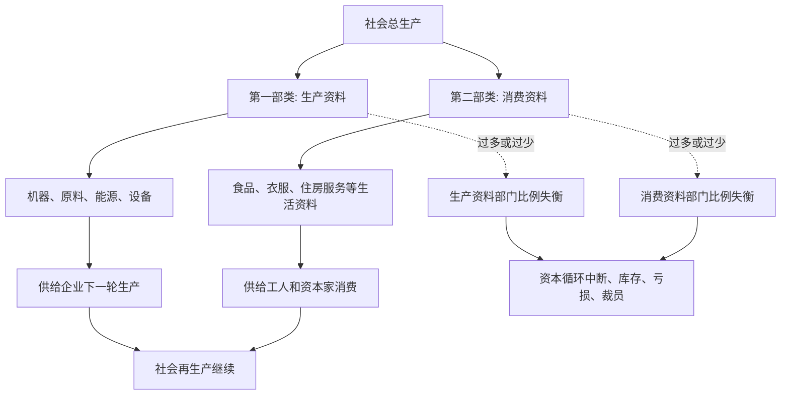

## 马哲思维筑基课: 社会再生产与比例失衡规律

### 作者
digoal

### 日期
2026-05-17

### 标签
社会再生产 , 比例失衡 , 两大部类 , 生产资料 , 消费资料 , 资本循环 , 扩大再生产 , 价值实现 , 产能过剩 , 资本论

----

## 背景

> 面向对象: 高中生到大学低年级读者  
> 核心问题: 为什么单个企业都在努力生产和销售，整个社会却仍可能出现某些商品过剩、某些环节短缺、资本循环中断和经济危机？  
> 先说结论: 社会再生产与比例失衡规律说的是，社会总生产要持续运转，不仅每个企业要卖出商品，还要求生产资料部门和消费资料部门在实物形态、价值补偿和需求结构上保持一定比例。资本主义私人生产缺少自觉总协调，容易出现比例失衡。

## 一张图先看懂



## 求真讲法

### 它到底说了什么

“再生产”不是重复生产同一个东西，而是社会生产过程一轮结束后，还能进入下一轮。

一个企业卖出商品，只说明它自己的资本循环可能完成。但整个社会要继续生产，还必须满足更复杂的条件: 生产机器、原料、能源的部门，要能供应下一轮生产；生产食物、衣服、住房等消费资料的部门，要能满足劳动者和资本家的消费；各部门之间还要在数量和价值上对得上。

马克思把社会总生产简化为两大部类:

| 部类 | 生产什么 | 主要用途 |
|---|---|---|
| 第一部类 | 生产资料 | 机器、原料、能源、设备，供下一轮生产使用 |
| 第二部类 | 消费资料 | 食品、衣服、住房服务等，供人生活消费 |

如果第一部类扩张太快，生产了大量机器和设备，但第二部类和最终消费能力跟不上，就可能出现产能过剩。如果第二部类扩张太快，但生产资料供应不足，也会卡在原料、设备和能源瓶颈上。

### 它是怎么来的

这个规律来自资本循环和社会总资本再生产分析。

单个资本的循环可以写成:

```text
货币资本 -> 生产资本 -> 商品资本 -> 更多货币资本
```

但社会总资本不是一个企业。每个企业的产出，常常是另一个企业的投入；每个企业的工资和利润，又会转化为消费资料需求。于是，社会再生产必须同时完成两件事:

1. 价值补偿: 卖出商品，收回成本和剩余价值。
2. 实物替换: 找到下一轮生产需要的机器、原料、能源、劳动力生活资料。

比例失衡就是这两个层面接不上。可能货币上看有需求，但实物供应跟不上；也可能实物生产很多，但没有足够有支付能力的需求来实现价值。

可以把推导链写成:

```text
社会分工扩大
    ↓
企业彼此依赖
    ↓
生产资料部门和消费资料部门必须衔接
    ↓
私人生产各自追求利润
    ↓
社会总比例缺少自觉协调
    ↓
比例失衡导致资本循环中断
```

### 它依赖哪些假设

| 假设 | 含义 | 如果不成立会怎样 |
|---|---|---|
| 社会生产高度分工 | 企业和部门互相依赖 | 比例失衡影响范围较小 |
| 商品要实现价值 | 产品必须卖出，资本才能回流 | 库存和亏损会中断循环 |
| 下一轮生产要实物补偿 | 机器、原料、能源、劳动力生活资料必须接上 | 仅有货币不足以继续生产 |
| 私人资本分散决策 | 各企业按自身利润判断扩张 | 社会总比例容易失调 |
| 信用会放大扩张 | 借贷和预期能推动过度投资 | 失衡可能积累得更深 |

### 常见误解

误解一: 只要每个企业都赚钱，社会整体就一定平衡。

不对。单个企业短期赚钱，可能建立在整个行业过度扩张、信用膨胀或未来需求高估上。等到商品卖不出去，失衡才集中暴露。

误解二: 比例失衡只是计划错误。

不完全。个别企业当然可能判断错误，但资本主义中的比例失衡更深层来自私人生产和社会化大生产之间的矛盾: 生产高度相互依赖，决策却分散追逐利润。

误解三: 消费不足就是唯一原因。

不准确。消费不足很重要，但比例失衡还可能表现为生产资料过剩、原料短缺、能源瓶颈、房地产和制造业错配、金融资金流向错配等。

误解四: 市场价格会自动、及时、无代价地修复比例。

不对。价格可以传递信号，但信号有滞后，企业调整有成本，信用和预期会放大错误。修复常常通过降价、破产、裁员和资产贬值实现。

## 求存讲法

### 它有什么用

这个规律能解释很多现实经济现象:

| 现象 | 比例失衡的解释 |
|---|---|
| 某行业产能过剩 | 投资扩张超过有效需求或下游承接能力 |
| 原材料突然短缺 | 下游扩张快于上游供给能力 |
| 房地产拖累上下游 | 建材、家电、金融和地方财政依赖链条断裂 |
| 新能源等行业价格战 | 产能扩张过快，需求和利润承接不足 |
| 危机中库存增加 | 商品实物存在，但价值难以实现 |

它让我们看到，经济问题不只是“总量多一点或少一点”，还要看结构比例是否匹配。

### 它怎么迁移到熟悉领域

#### 公司经营

一个公司销售团队扩张很快，但交付、客服、供应链跟不上，就会出现内部比例失衡。订单越多，投诉越多，最后反而损害现金流和品牌。

#### 城市发展

如果一个城市大量建办公楼和住宅，但产业、人口、收入和公共服务跟不上，建筑物本身不能自动变成繁荣。空间供给和真实使用需求失衡，就会出现空置和债务压力。

#### 平台经济

平台同时需要用户、商家、骑手、内容创作者、广告主等多边关系。如果一边补贴扩张过快，另一边收益不足，生态比例失衡，就会出现体验下降、亏损扩大或参与者退出。

### 它的适用范围和边界

这个规律适合分析社会总生产、产业链、投资周期、产能过剩、供需错配、部门结构和经济危机。

但不能把所有短期供需波动都说成深层比例失衡。季节变化、临时物流中断、短期价格扰动，可能只是局部摩擦。是否构成比例失衡，要看它是否影响资本循环、部门衔接和再生产条件。

还要注意，比例协调不等于静态不变。经济发展需要结构变化，问题不在变化本身，而在扩张和收缩是否能被社会承受、是否通过危机和失业来强制调整。

### 正例: 怎么用它提升能力

假设你想分析“为什么一个热门行业突然从缺货变成价格战”。

可以这样拆解:

1. 初期价格高、利润好，资本大量进入。
2. 企业基于高增长预期扩产，信用和融资放大扩张。
3. 新产能集中释放，但需求增长没有同步跟上。
4. 商品库存增加，价格下降，利润被压缩。
5. 企业开始裁员、降价、破产或兼并，比例失衡通过危机方式被调整。

这比简单说“市场变冷了”更能解释从繁荣到过剩的过程。

### 反例: 前提不成立会怎样

假设一个学校食堂某天米饭做多了，剩下一些饭。有人说:“这就是社会再生产比例失衡规律。”

这个说法过度了。这里有短期估计误差，但没有社会总资本循环、两大部类衔接、价值实现和产业链再生产问题。它更像局部管理误差，不是资本主义社会再生产层面的比例失衡。

这个反例说明: 比例失衡规律适合分析部门结构和社会再生产，不适合把所有小范围供需误差都上升为宏观规律。

## 思考

1. 为什么一个行业每家企业都理性扩产，合起来却可能造成全行业过剩？
2. 如果生产资料部门扩张过快，而消费资料需求不足，会发生什么？
3. 信用和融资为什么既能推动发展，也能放大比例失衡？
4. 价格信号能不能提前、温和地修复所有比例失衡？
5. 如果社会能更自觉地协调生产和需求，危机调整是否可以少一些破坏性？

## 最后记住

1. 社会再生产要求生产资料和消费资料在实物和价值上都能接续。
2. 第一部类生产生产资料，第二部类生产消费资料。
3. 比例失衡不是简单总量不足，而是部门之间、上下游之间、生产和消费之间接不上。
4. 资本主义私人生产和社会化大生产之间的矛盾，使比例失衡容易积累并通过危机暴露。
5. 判断比例失衡，要看它是否影响资本循环、部门衔接和下一轮再生产条件。

## 参考资料

- 马克思: 《资本论》第二卷第三篇“社会总资本的再生产和流通”，关于两大部类、简单再生产和扩大再生产的分析。
- 马克思: 《资本论》第二卷第二篇“资本周转”，关于资本循环、周转和再生产条件的分析。
- 马克思: 《资本论》第三卷，关于信用、危机和资本主义生产总体矛盾的相关论述。
- 恩格斯: 《反杜林论》，关于社会化生产和资本主义私人占有矛盾的辅助说明。
- 说明: 本文基于通行马克思主义政治经济学教材体系做教学性重构；“上层定律”是便于学习的归类说法，不是马克思、恩格斯原文中的形式化术语。
  
#### [PostgreSQL 解决方案集合](../201706/20170601_02.md "40cff096e9ed7122c512b35d8561d9c8")
  
  
#### [德哥 / digoal's Github - 公益是一辈子的事.](https://github.com/digoal/blog/blob/master/README.md "22709685feb7cab07d30f30387f0a9ae")
  
  
#### [About 德哥](https://github.com/digoal/blog/blob/master/me/readme.md "a37735981e7704886ffd590565582dd0")
  
  

  
