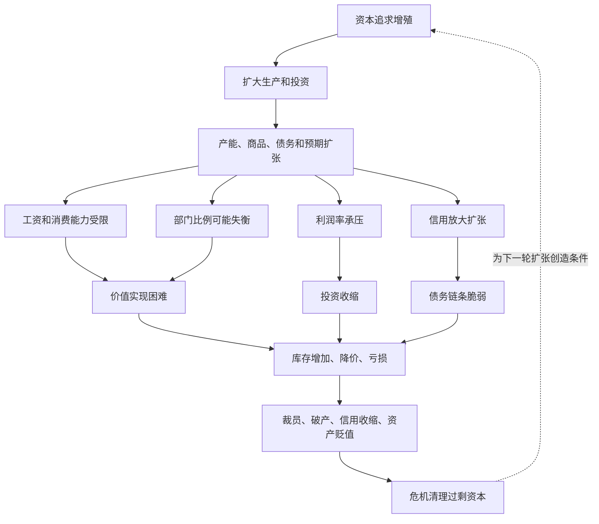

## 马哲思维筑基课: 资本主义危机规律

### 作者
digoal

### 日期
2026-05-17

### 标签
资本主义危机 , 过剩生产 , 价值实现 , 信用收缩 , 比例失衡 , 利润率压力 , 经济周期 , 资本循环 , 资产贬值 , 资本论

----

## 背景

> 面向对象: 高中生到大学低年级读者  
> 核心问题: 为什么资本主义社会会周期性出现商品卖不出去、企业倒闭、失业增加和金融收缩，而不是靠市场自动平稳协调？  
> 先说结论: 资本主义危机不是因为社会绝对生产太多、需要太少，而是因为生产为利润和价值实现服务。当生产扩张超过有支付能力的需求、部门比例失衡、利润率承压、信用链条断裂时，危机就会集中爆发。

## 一张图先看懂



## 求真讲法

### 它到底说了什么

资本主义危机规律说的是: 资本主义不是偶尔因为少数人判断错误才出问题，而是它的运行方式本身会不断制造危机可能。

资本主义生产的目的不是直接满足需要，而是价值增殖。企业生产商品，是为了卖出去、收回资本并获得利润。问题在于，生产可以在利润预期和信用支持下迅速扩大，但社会有支付能力的需求、部门之间的比例、利润率和金融偿付能力不一定同步跟上。

于是会出现一种矛盾现象: 仓库里有商品，工厂有产能，劳动者也有需要，但商品卖不出去，企业收不回钱，工人失业，需求进一步下降。看起来是“东西太多”，实质上是相对于能实现价值的市场而言过剩。

### 它是怎么来的

危机的可能性，最早就藏在商品和货币的分离里。

在简单物物交换中，卖和买是同一个动作。但商品经济中，卖出商品得到货币，再用货币买别的商品，两个动作可以分开。有人卖了不买、买方缺钱、信用延期、价格下跌，都可能让流通中断。

资本主义把这种可能性放大。因为资本不仅要卖商品，还要实现剩余价值并继续积累。生产扩张、信用扩张、技术投资、行业竞争和利润预期叠加在一起，会让失衡积累得更深。

可以把推导链写成:

```text
商品和货币分离
    ↓
卖和买可以断开
    ↓
资本为利润而扩大生产
    ↓
有支付能力的需求、部门比例和利润率跟不上
    ↓
信用链条把扩张和风险放大
    ↓
价值实现困难集中爆发为危机
```

危机不是单一原因，而是多条矛盾汇合: 生产无限扩张倾向与有支付能力需求有限之间的矛盾，私人决策与社会总协调之间的矛盾，利润率压力与资本积累之间的矛盾，信用扩张与实际价值实现之间的矛盾。

### 它依赖哪些假设

| 假设 | 含义 | 如果不成立会怎样 |
|---|---|---|
| 商品必须卖出实现价值 | 生产出来不等于价值已经实现 | 库存和滞销会中断资本循环 |
| 生产以利润为目标 | 企业按增殖预期扩大生产 | 生产可能超过有支付能力需求 |
| 社会生产高度分工 | 各部门、企业和金融链条互相依赖 | 局部失衡不容易扩散为系统危机 |
| 信用会放大扩张 | 借贷和预期提前推动投资与消费 | 危机中会出现债务收缩和连锁违约 |
| 劳动者消费能力受工资约束 | 需要不等于有支付能力的需求 | 过剩生产与贫困可同时存在 |

### 常见误解

误解一: 危机就是社会真的生产太多了。

不对。危机中的“过剩”是相对过剩: 相对于有支付能力的需求、利润实现和资本循环而言过剩。社会上可能仍有很多人需要住房、医疗、教育和食品。

误解二: 危机只是金融投机造成的。

不准确。金融投机和信用泡沫会放大危机，但危机根源还包括生产扩张、价值实现、利润率压力、收入分配和比例失衡。

误解三: 市场价格会无痛修复危机。

不对。价格下跌确实会调整供求，但调整常常通过企业破产、失业、资产贬值、债务违约和生活水平下降完成。

误解四: 危机只是不理性的例外。

不对。很多参与者在局部看都是理性的: 企业扩产、银行放贷、消费者借款、投资者追逐收益。但局部理性叠加起来，可能形成整体失衡。

## 求存讲法

### 它有什么用

这个规律可以帮助我们理解危机的几个典型表现:

| 表现 | 背后的机制 |
|---|---|
| 商品库存积压 | 生产超过有支付能力需求或部门承接能力 |
| 企业降价亏损 | 价值实现困难，价格被迫下调 |
| 裁员和失业 | 资本收缩，把劳动者排出生产过程 |
| 信用收缩 | 债务偿付困难，银行和投资者变谨慎 |
| 资产贬值 | 过剩资本被危机强制清理 |

危机的破坏性在于，它一边浪费生产力，一边让未被满足的社会需要继续存在。它不是单纯短缺，而是“贫困中的过剩”。

### 它怎么迁移到熟悉领域

#### 房地产

如果大量开发依靠高预期和信用扩张，而居民收入、人口流入和真实居住需求跟不上，就会出现库存、债务、降价和上下游收缩。房子存在，不等于价值能顺利实现。

#### 制造业

一个热门行业利润高时，资本大量进入，产能集中释放。如果需求增长不足，企业会价格战、亏损、裁员，最后通过破产和兼并清理产能。

#### 平台经济

平台靠补贴和融资扩张用户、商家和运力。如果未来利润无法兑现，融资收缩后，补贴减少、佣金上升、参与者退出，平台生态也会发生危机式调整。

### 它的适用范围和边界

资本主义危机规律适合分析经济周期、产能过剩、金融危机、债务收缩、失业、价格战、资产贬值和行业出清。

但不能把任何波动都叫系统危机。局部供需变化、季节性调整、单个企业失败、短期政策扰动，不一定构成资本主义危机。是否是危机，要看它是否引发较广范围的资本循环中断、信用收缩和再生产受阻。

也不能把危机原因简化为一个变量。不同危机中，利润率、债务、国际贸易、政策、技术、收入分配和资产泡沫的权重不同，需要具体分析。

### 正例: 怎么用它提升能力

假设你想分析“为什么一个新能源细分行业突然从高速扩张变成价格战和裁员”。

可以这样拆解:

1. 初期高利润和政策预期吸引资本进入。
2. 信用和融资支持企业快速扩产。
3. 新产能集中释放，但有效需求没有同步增长。
4. 企业降价抢市场，利润率下滑。
5. 弱企业亏损、裁员、被收购或退出。
6. 危机以价格战和产能出清的方式强制调整比例。

这比简单说“需求不好”更能解释危机从繁荣中长出来的过程。

### 反例: 前提不成立会怎样

假设一家餐馆某天备菜太多，晚上剩下一些菜。有人说:“这就是资本主义危机规律。”

这个判断过度了。这里可能只是单个经营者的短期估计误差，没有形成广泛的资本循环中断、信用收缩、失业扩散和社会再生产受阻。它可以作为小类比，但不能直接等同系统性危机。

这个反例说明: 危机规律分析的是资本主义生产方式中的系统性矛盾，不是所有卖不出去的局部事件。

## 思考

1. 为什么危机中一边有人需要商品，一边商品却卖不出去？
2. 信用为什么能在繁荣期放大扩张，在危机期又加速收缩？
3. 如果每个企业扩产都是为了活下去，为什么全行业会一起走向过剩？
4. 危机清理过剩资本后，为什么又可能开启下一轮扩张？
5. 如果生产目标不是价值增殖，而是满足社会需要，危机的表现会不会不同？

## 最后记住

1. 资本主义危机不是绝对生产太多，而是相对于价值实现和有支付能力需求而言过剩。
2. 危机根源包括生产扩张与需求限制、私人决策与社会比例、利润率压力和信用扩张等矛盾。
3. 危机表现为库存、降价、亏损、裁员、破产、信用收缩和资产贬值。
4. 危机既破坏生产力，也清理过剩资本，为下一轮积累创造条件。
5. 分析具体危机不能只找单一原因，要看生产、消费、信用、利润和部门比例如何相互作用。

## 参考资料

- 马克思: 《资本论》第二卷，关于资本循环、周转和社会总资本再生产的分析。
- 马克思: 《资本论》第三卷，关于利润率趋向下降、信用、资本过剩和危机的相关论述。
- 马克思: 《剩余价值理论》，关于危机可能性、过剩生产和政治经济学危机理论的相关讨论。
- 恩格斯: 《反杜林论》，关于资本主义生产方式、社会化生产和危机的辅助说明。
- 说明: 本文基于通行马克思主义政治经济学教材体系做教学性重构；“上层定律”是便于学习的归类说法，不是马克思、恩格斯原文中的形式化术语。
  
#### [PostgreSQL 解决方案集合](../201706/20170601_02.md "40cff096e9ed7122c512b35d8561d9c8")
  
  
#### [德哥 / digoal's Github - 公益是一辈子的事.](https://github.com/digoal/blog/blob/master/README.md "22709685feb7cab07d30f30387f0a9ae")
  
  
#### [About 德哥](https://github.com/digoal/blog/blob/master/me/readme.md "a37735981e7704886ffd590565582dd0")
  
  

  
