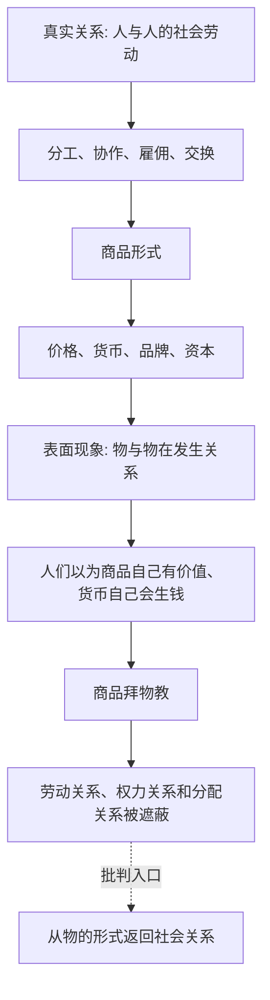

## 马哲思维筑基课: 商品拜物教规律

### 作者
digoal

### 日期
2026-05-17

### 标签
商品拜物教 , 社会关系 , 物化 , 价值形式 , 货币 , 价格 , 资本 , 劳动关系 , 意识形态 , 资本论

----

## 背景

> 面向对象: 高中生到大学低年级读者  
> 核心问题: 为什么在商品社会里，人们容易以为价格、货币、品牌和资本自己有神秘力量，而看不见背后的人与人的劳动关系？  
> 先说结论: 商品拜物教不是说人迷信商品，而是说商品社会会把人与人的社会劳动关系，颠倒地表现为物与物之间的关系。价格、货币、资本看起来像物自己的力量，实际背后是生产、交换、劳动分工和权力关系。

## 一张图先看懂



## 求真讲法

### 它到底说了什么

“商品拜物教”里的“拜物”不是日常说的迷信某个物品，也不是说消费者喜欢名牌就是拜物教。

它说的是一种社会形式的颠倒: 在商品社会中，人们的劳动彼此依赖，但这种依赖不是直接表现为“谁为谁劳动、谁支配谁、谁分配成果”，而是表现为商品和商品交换、价格和价格比较、货币和货币流动。

比如一杯咖啡，看起来只是“这杯咖啡卖30元”。但它背后连接着咖啡种植者、物流工人、烘焙厂、门店员工、房租、品牌、平台流量、金融资本和消费者收入。价格把这些复杂关系压缩成一个数字。久而久之，人们容易以为这个数字就是咖啡自己的自然属性。

所以，商品拜物教的核心是: 社会关系被物的形式遮蔽了。

### 它是怎么来的

商品拜物教来自商品形式本身。

在商品生产中，生产者彼此分散，先私人生产，再通过市场交换证明自己的劳动是否被社会承认。也就是说，人与人的社会关系不是事先直接协调，而是通过商品交换间接发生。

于是，劳动者之间的社会关系就表现为商品之间的价值关系。谁的劳动被承认、谁能获得收入、谁能支配资源，表面上都像是由商品、价格、货币自己决定。

可以把推导链写成:

```text
社会分工让人们彼此依赖
    ↓
私人生产者通过商品交换发生关系
    ↓
劳动是否被社会承认，要通过市场价格表现
    ↓
人与人的关系表现为物与物的关系
    ↓
商品、货币、资本看起来像自己有力量
```

这就是为什么马克思说商品形式有一种神秘性。神秘性不是来自人脑幻想，而是来自现实社会关系的表现方式。

### 它依赖哪些假设

| 假设 | 含义 | 如果不成立会怎样 |
|---|---|---|
| 商品生产普遍存在 | 人们主要通过商品交换连接 | 拜物教形式不容易普遍化 |
| 私人劳动需要社会承认 | 个别劳动要通过市场证明有用 | 价格和货币成为社会承认形式 |
| 价值通过形式表现 | 价值不能直接看见，只能通过交换、货币、价格表现 | 物的形式不会如此强烈遮蔽关系 |
| 货币成为一般等价物 | 各种商品都用货币衡量 | 货币更容易显得有天然权力 |
| 资本支配劳动 | 资本增殖看起来像钱自己生钱 | 剩余劳动关系被利润形式遮蔽 |

### 常见误解

误解一: 商品拜物教就是消费者爱买名牌。

不准确。爱买名牌可以是拜物教的一种日常表现，但马克思讲的商品拜物教更深: 它是商品社会中社会关系表现为物的关系的结构性现象。

误解二: 拜物教只是人们思想糊涂。

不对。它不是单纯认知错误，而是现实社会形式造成的。只要生产和交换以商品形式组织，价格、货币和资本就会真实地支配人的行动。

误解三: 看穿拜物教就是不要买东西。

不对。批判商品拜物教不是要求退出现代生活，而是要求看见商品背后的劳动、资源、制度、权力和分配关系。

误解四: 商品有价格，所以价格就是物自己的自然属性。

不对。价格不是像重量、颜色那样长在物身上的自然属性，而是商品进入社会交换关系后的表现形式。

## 求存讲法

### 它有什么用

商品拜物教规律能帮助我们从表象返回关系:

| 表面看到 | 进一步追问 |
|---|---|
| 这个商品很贵 | 谁生产？谁定价？稀缺性来自哪里？ |
| 这个平台很方便 | 谁在劳动？规则如何分配收益？ |
| 货币能生钱 | 钱通过什么关系支配劳动和资产？ |
| 品牌有价值 | 品牌价值背后是谁的劳动、渠道和注意力？ |
| 市场自然选择 | 选择背后有无垄断、流量、资本和制度力量？ |

它的作用不是否认商品有用，而是防止我们被价格和物的表象挡住，看不到社会关系。

### 它怎么迁移到熟悉领域

#### 消费

一双鞋卖得贵，可能不只是材料更好，还包括品牌、广告、明星代言、渠道控制、消费者身份认同和全球供应链中的劳动分工。如果只说“鞋自己值这么多”，就忽略了背后的关系。

#### 平台经济

手机上一个按钮就能叫车、点餐、购物，看起来像平台天然高效。商品拜物教视角会追问: 算法如何调度劳动？谁承担风险？佣金如何分配？差评和流量如何控制劳动者？

#### 金融

钱生钱看起来很自然: 存款有利息，股票有分红，资产会升值。但进一步看，利息、分红和资本收益背后，往往连接着企业利润、劳动过程、债务关系、资产稀缺和制度安排。

### 它的适用范围和边界

这个规律适合分析商品、货币、品牌、价格、资本、平台和金融如何遮蔽社会关系。

但不能把所有喜欢物品、审美选择和个人消费都简单骂成拜物教。人喜欢漂亮衣服、好工具、精致食物，可能有真实使用价值和审美意义。关键不是“喜欢物”本身，而是是否把社会关系误认为物自己的神秘属性。

还要注意，商品拜物教不是用道德批评替代经济分析。真正的分析要回到生产、交换、劳动、产权、平台规则和价值实现。

### 正例: 怎么用它提升能力

假设你想分析“为什么一个平台看起来只是提供便利，却能获得巨大权力”。

可以这样拆解:

1. 表面上，用户只看到 App、价格、评分和按钮。
2. 背后是商家、骑手、司机、主播、仓库、客服、算法和资本共同构成的劳动网络。
3. 平台通过流量、排序、佣金、评价和数据控制这个网络。
4. 这种社会关系被包装成“技术效率”和“市场选择”。
5. 商品拜物教批判就是把平台物的表象，重新还原为人和人之间的组织关系。

这样分析不会停在“平台好用”或“平台坏”这种简单判断，而能看到权力结构。

### 反例: 前提不成立会怎样

假设一个孩子珍惜爷爷做的木凳，因为它承载家庭记忆。有人说:“这就是商品拜物教。”

这个判断不准确。如果这个木凳不是作为商品进入市场交换，孩子珍惜的也不是价格、品牌或资本力量，而是亲情、记忆和手工劳动，那么它不是马克思意义上的商品拜物教。

这个反例说明: 商品拜物教的前提是商品形式和市场交换。不是所有对物的情感都叫拜物教。

## 思考

1. 为什么价格越清楚，人和人之间的劳动关系反而可能越看不见？
2. 当我们说“市场决定了”，究竟是哪些人、组织、资本和规则在起作用？
3. 平台把复杂劳动网络压缩成一个按钮时，遮蔽了什么？
4. 货币看起来能自己生钱，背后连接着哪些劳动和权力关系？
5. 如果社会生产更加透明，商品拜物教会不会减弱？

## 最后记住

1. 商品拜物教不是单纯爱买东西，而是社会关系表现为物的关系。
2. 商品、价格、货币和资本看似自己有力量，背后是劳动、交换、产权和权力关系。
3. 这种颠倒不是纯粹思想错误，而是商品社会真实运行形式造成的。
4. 批判商品拜物教，就是从物的表象返回人与人的社会关系。
5. 它适用于商品、货币、资本和市场形式分析，不能泛化为所有对物的喜爱。

## 参考资料

- 马克思: 《资本论》第一卷第一章第四节“商品的拜物教性质及其秘密”，关于商品形式神秘性和社会关系物化表现的分析。
- 马克思: 《资本论》第一卷第一章“商品”，关于价值形式、交换价值和货币形式的分析。
- 马克思: 《政治经济学批判》，关于商品、货币和社会关系表现形式的相关论述。
- 卢卡奇: 《历史与阶级意识》，关于物化问题的后续理论展开，可作延伸阅读。
- 说明: 本文基于通行马克思主义政治经济学教材体系做教学性重构；“上层定律”是便于学习的归类说法，不是马克思、恩格斯原文中的形式化术语。
  
#### [PostgreSQL 解决方案集合](../201706/20170601_02.md "40cff096e9ed7122c512b35d8561d9c8")
  
  
#### [德哥 / digoal's Github - 公益是一辈子的事.](https://github.com/digoal/blog/blob/master/README.md "22709685feb7cab07d30f30387f0a9ae")
  
  
#### [About 德哥](https://github.com/digoal/blog/blob/master/me/readme.md "a37735981e7704886ffd590565582dd0")
  
  

  
