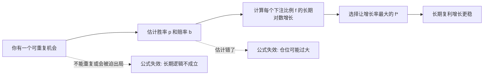

## 思维筑基课: 凯利公式

### 作者
digoal

### 日期
2026-05-17

### 标签
凯利公式 , 概率 , 赔率 , 仓位管理 , 长期增长 , 对数收益 , 风险控制 , 复利 , 投资思维 , 决策

----

## 背景

> 面向对象: 高中生到大学低年级学生  
> 核心问题: 为什么“有优势”还不能全押，长期增长最快的下注比例到底怎么来？  
> 先说结论: 凯利公式告诉我们，在一次次可重复、有正期望、概率和赔率已知的机会里，应该押财富的多大比例，才能让长期财富的对数增长率最大。它追求的不是“下一把赢最多”，而是“很多把之后最不容易被波动毁掉，同时增长最快”。

本文解释的是最常见的**二元投注版凯利公式**。设赢的概率是 `p`，输的概率是 `q = 1 - p`，赔率是 `b:1`，也就是每押 1 元，赢了净赚 `b` 元，输了亏掉 1 元。那么最优下注比例是:

```text
f* = (bp - q) / b
```

当赔率是 1:1 时，公式变成:

```text
f* = 2p - 1
```

如果算出来 `f* <= 0`，意思不是“小押一点”，而是**不要下注**。

## 一张图先看懂



## 求真讲法

### 它到底说了什么

先想一个简单游戏。

你有 100 元。每轮可以拿出一部分钱下注。硬币不是公平的，你有 55% 概率赢，45% 概率输。赔率是 1:1: 押 10 元，赢了赚 10 元，输了亏 10 元。

这个游戏有优势，因为每押 1 元，平均赚:

```text
0.55 x 1 - 0.45 x 1 = 0.10 元
```

但如果你每次都全押，迟早会遇到一次输局，财富直接归零。凯利公式的核心洞察是:

```text
有优势 ≠ 应该重仓
长期增长 = 优势大小 - 波动伤害
```

在这个例子里:

```text
f* = 2p - 1 = 2 x 0.55 - 1 = 0.10
```

也就是说，每轮押当前财富的 10%。如果财富变成 120 元，下轮押 12 元；如果财富跌到 90 元，下轮押 9 元。

### 它是怎么来的

凯利公式不是凭直觉拍出来的，而是来自“最大化长期复利增长”的目标。

假设你每次押财富比例 `f`。

- 赢时，财富变成原来的 `1 + bf` 倍。
- 输时，财富变成原来的 `1 - f` 倍。

一次下注后的平均“对数增长率”是:

```text
g(f) = p ln(1 + bf) + q ln(1 - f)
```

这里的 `ln` 是自然对数。为什么不是直接看平均收益？因为长期复利是乘法过程:

```text
100 -> 110 -> 99 -> 108.9 -> ...
```

乘法过程取对数后会变成加法，更适合描述“长期平均增长”。

对 `g(f)` 求最大值，直观上就是找曲线最高点:

```text
g'(f) = p b / (1 + bf) - q / (1 - f)
```

最高点处斜率为 0:

```text
p b / (1 + bf) = q / (1 - f)
```

整理后得到:

```text
f* = (bp - q) / b
```

这就是二元投注版凯利公式。

### 一个小表看出“押太多”的问题

用前面的例子: `p = 55%`，赔率 `b = 1`。

| 每次下注比例 | 赢后财富倍数 | 输后财富倍数 | 长期对数增长直觉 |
|---:|---:|---:|---|
| 0% | 1.00 | 1.00 | 不增长，也不波动 |
| 5% | 1.05 | 0.95 | 有增长，但没吃满优势 |
| 10% | 1.10 | 0.90 | 凯利比例，长期对数增长最大 |
| 20% | 1.20 | 0.80 | 期望收益更刺激，但波动伤害过大 |
| 100% | 2.00 | 0.00 | 只要输一次就归零 |

最反直觉的地方是: **押 20% 的单次期望收益更高，但长期复利增长反而更差**。原因是亏损对复利的伤害不对称。

```text
亏 50% 后，需要涨 100% 才回本
亏 80% 后，需要涨 400% 才回本
亏 100% 后，游戏结束
```

### 它依赖哪些假设

凯利公式成立需要一组很强的前提。

1. **机会可以重复很多次**  
   凯利公式讨论的是长期增长，不是单次成败。

2. **胜率和赔率可以被可靠估计**  
   `p` 和 `b` 如果估错，算出来的 `f*` 就可能危险。

3. **每次都能按比例下注**  
   财富变化后，下注金额也跟着变化。

4. **每次机会足够相似，且没有隐藏相关性**  
   如果很多机会其实会同时亏损，风险比公式里大。

5. **目标是最大化长期对数财富**  
   如果目标是“绝不能大幅回撤”“短期必须稳定”“不能承受心理压力”，凯利比例通常太激进。

6. **没有额外摩擦**  
   简式公式没有考虑税、手续费、滑点、流动性、融资成本、停牌、规则变化等现实约束。

### 常见误解

**误解一: 凯利公式保证赚钱。**  
不保证。它只是在假设成立时最大化长期增长率。短期连续亏损仍然会发生。

**误解二: 有正期望就应该押很多。**  
不一定。优势很小或不确定时，凯利比例可能很低，甚至应该不下注。

**误解三: 公式算出 10%，就必须押 10%。**  
现实中很多人会用半凯利、四分之一凯利，因为估计误差会让全凯利变得过于激进。

**误解四: 凯利公式适合所有投资。**  
不适合直接套用。股票、创业、职业选择、学习投入都可以借鉴“优势、赔率、仓位、长期复利”的思想，但它们通常不满足精确概率和可重复独立下注的条件。

## 求存讲法

### 它有什么用

凯利公式最原生的用途是解决一个下注问题:

```text
我知道自己有优势，但到底该押多少？
```

它把“敢不敢押”变成了三个问题:

| 问题 | 对应变量 | 要问清楚的事 |
|---|---|---|
| 赢的概率多大？ | `p` | 我真的有优势吗？ |
| 赢了赚多少，输了亏多少？ | `b` | 赔率是否补偿风险？ |
| 押多少不至于被波动摧毁？ | `f` | 仓位是否超过长期承受力？ |

这比只说“看好就重仓”更严谨，因为它强迫你同时看**概率、赔率和仓位**。

### 它怎么迁移到熟悉领域

凯利公式可以迁移成一种生活中的资源分配思维:

```text
不要只问“这件事有没有机会”
还要问“机会多大、失败损失多大、我能投入多少比例”
```

例如学习时间分配:

- `p`: 这个方法真的能提高成绩的概率。
- `b`: 成功后带来的收益，比如理解力、考试分数、长期能力。
- `f`: 每周投入多少时间。

如果一种学习方法收益可能很大，但你还不确定是否适合自己，就不应该一下子投入全部时间。更像凯利思维的做法是: 先小比例试验，观察反馈，再扩大投入。

### 它的适用范围和边界

| 前提成立时 | 前提不成立时 |
|---|---|
| 可以重复试错 | 单次失败就出局 |
| 胜率和赔率有数据支持 | 只是凭感觉估计 |
| 每次下注规模可调整 | 一旦投入就无法退出 |
| 机会之间相对独立 | 风险会同时爆发 |
| 目标是长期复利 | 目标是短期稳定或保命 |

在现实投资中，最危险的不是不知道公式，而是误以为自己知道 `p`。一旦胜率估得过高，凯利公式会把错误放大成过度下注。

### 正例: 怎么用它提升能力

假设你准备提高英语听力，有三种方法:

| 方法 | 成功概率估计 | 成功收益 | 失败成本 | 合理投入 |
|---|---:|---:|---:|---|
| 每天精听 20 分钟 | 高 | 中等 | 低 | 稳定投入 |
| 报一个昂贵速成班 | 不确定 | 可能高 | 高 | 先少量验证 |
| 完全靠刷短视频 | 低 | 低 | 时间流失 | 不投入或极少投入 |

这不是精确套公式，而是迁移凯利思维:

```text
高确定性 + 正收益 + 低失败成本 => 可以持续投入
高不确定性 + 高失败成本 => 先小仓位试验
低胜率 + 低赔率 => 不值得投入
```

这种用法能帮你避免两个极端: 一种是看到机会就全押，另一种是因为怕失败而完全不试。

### 反例: 前提不成立会怎样

反例一: 把一次性选择当成可重复游戏。

某学生把所有备考时间都押在“猜题班”上，因为听说命中率很高。问题是高考不是每天重复很多次的小额下注，而是少数关键机会。即使猜题班真有一点优势，**“可重复很多次”这个前提也不成立**。全押会让其他基础能力训练被挤掉，一旦没猜中，损失无法靠下一轮复利修复。

反例二: 把主观自信当成概率。

某投资者觉得某股票上涨概率有 70%，于是按凯利思路重仓。但这个 70% 没有数据、没有可检验模型，也没有考虑市场整体下跌时多个股票同时亏损。这里失败的前提是**胜率可靠估计**和**机会相对独立**。公式本身没有错，错在输入是幻想。

反例三: 忽略心理承受力。

全凯利策略即使长期增长率最高，也可能出现很深的回撤。一个人如果看到资产下跌 30% 就会恐慌退出，那么他的真实约束不是数学最优，而是心理和现金流约束。此时更合理的是降低比例，例如半凯利，而不是照公式硬撑。

## 思考

凯利公式把一个很深的问题摆在我们面前:

```text
你真正想最大化的是什么？
```

如果你想最大化“下一次收益”，你会倾向于押大。  
如果你想最大化“长期复利增长”，你必须控制下注比例。  
如果你想最大化“活得下来”，你可能要比凯利公式更保守。

这说明很多现实选择不是“勇敢还是胆小”的问题，而是目标函数不同。

再进一步想:

1. 如果一个机会看起来收益很高，但你无法估计胜率，它还是好机会吗？
2. 如果一个选择失败一次就让你出局，你还能用长期平均的思维吗？
3. 如果两个人面对同一个机会，一个用全凯利，一个用半凯利，谁更“理性”？答案取决于他们的目标、约束和估计误差。
4. 学习、职业、创业中的“仓位”是什么？可能是时间、金钱、注意力、声誉、健康，也可能是不可恢复的机会成本。

凯利公式最值得迁移的不是那行数学公式，而是一种更清醒的判断顺序:

```text
先问前提，再算比例。
先求活着，再求增长。
先验证优势，再扩大投入。
```

## 最后记住

1. 凯利公式解决的是“有优势时押多少”，不是“怎样预测一定赢”。
2. 二元投注版公式是 `f* = (bp - q) / b`，赔率 1:1 时是 `f* = 2p - 1`。
3. 它最大化的是长期对数财富增长，因此特别重视复利和亏损的不对称伤害。
4. 它依赖可重复、概率可估、赔率明确、风险不高度相关等强假设。
5. 现实中常用半凯利或更低比例，是因为估计误差、回撤压力和现实摩擦会让全凯利过于激进。

## 参考资料

- John L. Kelly Jr., "A New Interpretation of Information Rate", Bell System Technical Journal, 1956. 凯利公式的经典原始论文。
- Thomas M. Cover, Joy A. Thomas, *Elements of Information Theory*, 2nd edition, Wiley, 2006. 讨论对数最优投资和信息论联系的标准教材。
- Edward O. Thorp, "The Kelly Criterion in Blackjack, Sports Betting, and the Stock Market", 1997. 讨论凯利准则在赌博和投资中的应用与限制。
- Leonard C. MacLean, Edward O. Thorp, William T. Ziemba, *The Kelly Capital Growth Investment Criterion*, World Scientific, 2011. 关于凯利准则、资本增长和实际约束的论文集。
- 本文没有联网检索，基于上述经典文献和通用概率论、复利增长知识写成；现实投资应用需要结合最新市场规则、交易成本和个人约束重新评估。
  
#### [PostgreSQL 解决方案集合](../201706/20170601_02.md "40cff096e9ed7122c512b35d8561d9c8")
  
  
#### [德哥 / digoal's Github - 公益是一辈子的事.](https://github.com/digoal/blog/blob/master/README.md "22709685feb7cab07d30f30387f0a9ae")
  
  
#### [About 德哥](https://github.com/digoal/blog/blob/master/me/readme.md "a37735981e7704886ffd590565582dd0")
  
  

  
