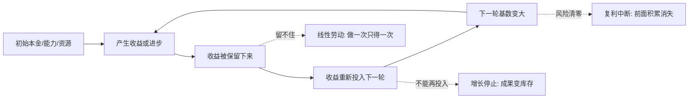

## 思维筑基课: 复利思维

### 作者
digoal

### 日期
2026-05-17

### 标签
复利思维 , 长期主义 , 指数增长 , 积累 , 再投入 , 学习方法 , 习惯 , 风险控制 , 系统思维 , 能力成长

----

## 背景

> 面向对象: 高中生到大学低年级学生  
> 核心问题: 为什么很多重要差距不是一天拉开的，而是由“持续积累 + 再投入 + 时间”慢慢放大的？  
> 先说结论: 复利思维不是“每天进步一点点就一定成功”，而是理解一个系统中，成果如果能被保留下来并继续参与下一轮增长，时间就会把小优势放大；但只要积累不能留存、增长不可持续、风险会清零，复利就会失效。

## 一张图先看懂



复利最短的表达是:

```text
下一轮的增长，不只来自原来的本金，也来自上一轮留下来的收益。
```

## 求真讲法

### 它到底说了什么

先看两个同学背单词。

甲每天背 20 个新词，但从不复习。  
乙每天背 10 个新词，并把前面学过的词反复放进阅读和写作里。

一开始甲看起来更快，因为每天新增更多。过一段时间后，乙可能更强，因为旧词没有丢掉，还变成理解句子、阅读文章、写作文的基础。旧成果继续参与新成果的产生，这就是学习中的复利。

数学里的复利更清楚。假设你有 100 元，每年增长 10%，并且收益不取走，而是继续放进去:

```text
第 0 年: 100
第 1 年: 100 x 1.10 = 110
第 2 年: 110 x 1.10 = 121
第 3 年: 121 x 1.10 = 133.1
```

它的通式是:

```text
未来价值 = 初始价值 x (1 + 增长率)^时间
```

用符号写就是:

```text
FV = PV x (1 + r)^n
```

- `PV`: 现在的本金或基础。
- `r`: 每一轮的增长率。
- `n`: 增长轮数。
- `FV`: 未来累积结果。

复利思维把这个公式迁移到更广的地方: 知识、习惯、信用、作品、组织能力、技术系统。它提醒我们，真正重要的不是单次努力多耀眼，而是这次努力能不能变成下一次努力的基础。

### 它是怎么来的

复利来自一个简单的乘法结构。

如果每一轮都在原有基础上增加同样比例，结果不是这样:

```text
100 + 10 + 10 + 10 + ...
```

而是这样:

```text
100 x 1.10 x 1.10 x 1.10 x ...
```

前者叫线性增长，每次增加固定数量。  
后者叫指数增长，每次在更大的基数上增长。

一个 ASCII 图可以帮助理解:

```text
线性增长:  100 -> 110 -> 120 -> 130 -> 140
复利增长:  100 -> 110 -> 121 -> 133 -> 146
                         ↑
                  前面的收益也参与增长
```

短期看，两者差距不大。长期看，差距会越来越明显。

但这里有一个关键点: 复利不是魔法，它只是乘法。如果增长率是负的，复利也会把损失放大。

```text
100 x 0.90 x 0.90 x 0.90 = 72.9
```

所以复利思维既可以解释财富增长，也可以解释坏习惯、债务、技术债、信任破产为什么会越拖越难处理。

### 它依赖哪些假设

复利思维成立，至少需要这些前提:

1. **成果能够留存**  
   今天学到的东西、建立的系统、积累的信用，不能明天就全部消失。

2. **成果能够再投入**  
   上一轮结果必须能帮助下一轮变得更容易、更快或更大。

3. **增长率长期为正**  
   偶尔进步不够，长期平均效果要大于损耗。

4. **时间足够长**  
   复利往往前期慢，后期快。时间太短，看不出差距。

5. **不会被一次风险清零**  
   如果一次失败就出局，后面的复利就不存在。

6. **系统容量允许继续增长**  
   很多现实系统会遇到上限，例如注意力、市场规模、身体恢复能力、竞争压力。

### 常见误解

**误解一: 每天进步 1%，一年就会变成 37 倍。**  
这个说法来自 `1.01^365 ≈ 37.8`，数学上没错，但现实中很少有人能每天稳定提高 1%，并且每一天的提高都能完整留存、完整再投入。它适合说明指数效应，不适合当成现实承诺。

**误解二: 复利只和钱有关。**  
钱是最容易量化的例子，但复利结构也存在于知识、技能、信任、品牌、代码库和组织协作中。

**误解三: 只要坚持就一定有复利。**  
坚持只是必要条件之一。如果方向错、反馈差、成果留不住，坚持可能只是线性重复，甚至是负复利。

**误解四: 复利越快越好。**  
过快增长可能伴随高风险。例如借钱投资、熬夜学习、过度扩张公司，短期增长率高，但系统可能被风险打断。

## 求存讲法

### 它有什么用

复利思维最有用的地方，是帮你区分两类努力:

| 努力类型 | 做完之后发生什么 | 长期结果 |
|---|---|---|
| 消耗型努力 | 做一次只得到一次结果 | 很难积累 |
| 积累型努力 | 结果会留下来，帮助下一次 | 可能复利 |

例如:

| 场景 | 消耗型 | 积累型 |
|---|---|---|
| 学习 | 临考前死记硬背 | 建知识框架、错题系统、表达能力 |
| 工作 | 每次手动重复处理 | 写文档、脚本、模板、流程 |
| 人际 | 临时求帮忙 | 长期守信、稳定交付、互相成就 |
| 写作 | 只追热点 | 建主题库、案例库、表达模型 |
| 编程 | 只修眼前 bug | 抽取测试、减少重复、改善可维护性 |

复利思维不是让你“更努力”，而是让你问:

```text
我今天做的事，明天还能继续帮我吗？
```

### 它怎么迁移到熟悉领域

**迁移到学习:**  
把知识变成可复用结构。笔记不是为了好看，而是为了下次遇到类似问题时更快理解。错题不是为了惩罚自己，而是为了找出重复犯错的机制。

**迁移到工作:**  
把重复劳动变成系统资产。一次解决一个问题不够，最好留下流程、文档、自动化脚本或检查清单，让下一次成本下降。

**迁移到人际关系:**  
信用也会复利。每一次准时、可靠、说到做到，都会降低别人和你合作的心理成本。反过来，失信也会负复利，一次次让别人提高防备。

**迁移到技术能力:**  
基础能力会互相放大。数学、英语、写作、编程、逻辑表达，单看都慢，但它们组合在一起，会让学习新领域的速度越来越快。

### 它的适用范围和边界

| 前提成立时 | 前提不成立时 |
|---|---|
| 成果能留存 | 做完就归零 |
| 成果能再投入 | 只能一次性消费 |
| 有稳定反馈 | 不知道做得对不对 |
| 风险可控制 | 一次失败就出局 |
| 有足够时间 | 只追求立刻见效 |
| 系统还能扩张 | 已接近身体、市场或规则上限 |

这张表说明，复利思维最适合长期主义问题，不适合所有问题。比如急救、考试当天、危机处理，首先要解决眼前约束；等系统稳定后，才谈长期复利。

### 正例: 怎么用它提升能力

假设你想提高写作能力。线性做法是每天随便写一篇，写完就丢。复利做法是建立一个能不断增厚的系统:

```text
阅读 -> 摘录好句 -> 分类主题 -> 写短评 -> 复盘反馈 -> 改写成文章
                                      ↑                 |
                                      └------ 回到素材库 ┘
```

更具体地说:

1. 建一个主题库: 把常写主题分成学习、技术、商业、人物、社会观察。
2. 建一个案例库: 每次看到好例子，都记录“场景、冲突、机制、结论”。
3. 建一个表达库: 保存自己写得清楚的比喻、结构和标题。
4. 每写完一篇文章，复盘哪些地方能复用。

这样做的关键不是每天多写几个字，而是每一次写作都留下可再投入的资产。三个月后，你不是只有 90 篇零散文章，而是多了一套更容易继续写下去的系统。

### 反例: 前提不成立会怎样

反例一: 成果不能留存。

一个学生每天刷很多短视频课程，感觉自己很努力，但没有做题、没有输出、没有复习。第二天能留下来的很少。这里失败的前提是**成果能够留存**。没有留存，努力就像水倒进漏桶，不会形成复利。

反例二: 增长率其实为负。

一个人为了“高效学习”长期熬夜。短期看学习时间增加了，但注意力下降、记忆变差、情绪不稳，第二天效率更低。这里失败的前提是**长期增长率为正**。如果身体和认知状态被透支，努力会变成负复利。

反例三: 风险会清零。

一个创业团队把全部资源押在一个未经验证的大项目上，没有小规模测试，也没有现金流缓冲。一旦方向错，团队直接解散。这里失败的前提是**不会被一次风险清零**。真正的复利需要活过足够多轮，而不是在第一轮赌完。

## 思考

复利思维最值得警惕的地方，是它容易被说成一句漂亮口号。真正严肃的复利思维，必须同时问四个问题:

```text
我积累的是什么？
它能留下来吗？
它能帮助下一轮吗？
它会不会被某个风险一次清零？
```

如果回答不上来，就不能说自己在复利。

再进一步想:

1. 哪些事看起来很忙，但其实做完就消失？
2. 哪些能力一开始慢，但会让以后所有学习都变快？
3. 你的坏习惯有没有负复利，比如拖延、熬夜、失信、逃避反馈？
4. 一个组织最大的复利资产是什么？可能不是钱，而是信任、流程、人才密度和学习速度。
5. 如果你只能坚持一个长期系统，你会选择什么？它的成果是否能留存并再投入？

复利思维不是催你盲目坚持，而是要求你设计一个“越做越容易继续做，越做越能产生下一轮基础”的系统。

## 最后记住

1. 复利的本质是: 成果留存，并参与下一轮增长。
2. 复利不是万能公式，它依赖正增长、可留存、可再投入、时间足够长和风险不清零。
3. 短期差距常常不明显，长期差距来自基数被一轮轮放大。
4. 坏习惯、债务、技术债和失信也会负复利。
5. 真正的复利思维不是“每天进步一点点”，而是“把每次努力变成下一次努力的基础”。

## 参考资料

- Albert Einstein often gets attributed with quotes about compound interest, but common versions lack reliable primary sourcing;本文不使用这些归因作为论据。
- Burton G. Malkiel, *A Random Walk Down Wall Street*, 讨论长期投资、复利和成本对财富积累的影响。
- Benjamin Graham, *The Intelligent Investor*, 讨论长期投资、风险控制和安全边际，能帮助理解复利必须建立在不被毁灭的前提上。
- James Clear, *Atomic Habits*, 用习惯系统解释小行为如何长期累积；适合把复利思维迁移到行为改变领域。
- 本文没有联网检索，基于通用数学知识、复利公式、长期投资与学习方法论的常见教材体系写成；现实投资和个人规划需结合具体约束重新判断。
  
#### [PostgreSQL 解决方案集合](../201706/20170601_02.md "40cff096e9ed7122c512b35d8561d9c8")
  
  
#### [德哥 / digoal's Github - 公益是一辈子的事.](https://github.com/digoal/blog/blob/master/README.md "22709685feb7cab07d30f30387f0a9ae")
  
  
#### [About 德哥](https://github.com/digoal/blog/blob/master/me/readme.md "a37735981e7704886ffd590565582dd0")
  
  

  
