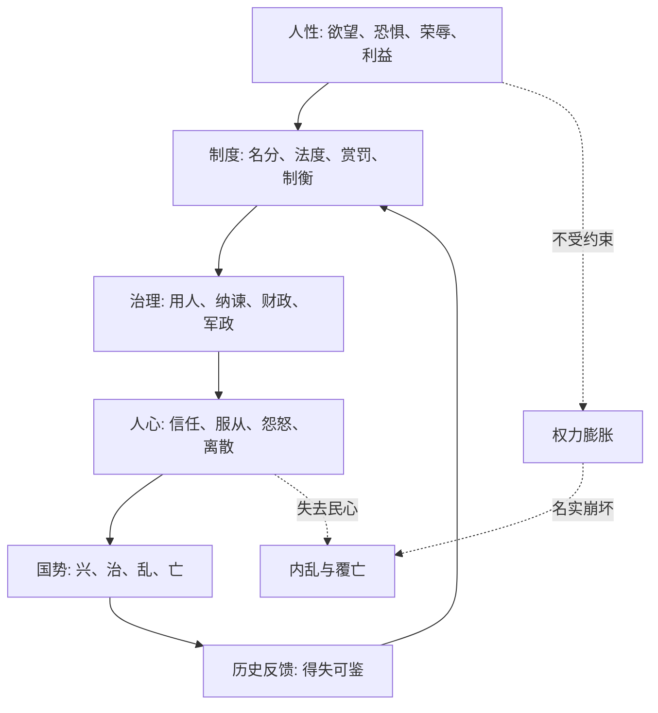

## 资治通鉴思维筑基课: 《资治通鉴》: 从历史故事中读出中华哲学的底层公理和上层定律

### 作者
digoal

### 日期
2026-05-17

### 标签
资治通鉴 , 中华哲学 , 底层公理 , 上层定律 , 治理哲学 , 人性 , 权力 , 民心 , 名实 , 时势

----

## 背景

> 面向对象: 高中生到大学通识读者  
> 核心问题: 《资治通鉴》不只是历史编年，它反复验证了哪些关于人性、权力、秩序、兴亡的基本判断？  
> 先说结论: 《资治通鉴》的底层不是“谁赢谁有理”，而是一套以人性、名分、权力、民心、时势为核心的治理哲学。它的上层定律，是这些底层公理在朝代兴亡、君臣关系、战争成败、改革得失中的反复表现。

## 一张图先看懂



## 求真讲法

### 它到底说了什么

《资治通鉴》表面写的是从战国到五代的政治军事史，深层写的是一个问题:

**人在权力、利益、恐惧和名分之中，会怎样行动？这些行动长期累积后，国家为什么会兴、会乱、会亡？**

所以它包含的“底层公理”不是数学公理，而是司马光通过历史选择出来的基本假设。这些假设无法在书内被严格证明，但会被大量事件反复检验。

### 底层公理一: 人性有欲，不能只靠道德想象

《资治通鉴》很少把政治失败解释成单纯“某个人太坏”。它更常见的判断是: 人有欲望，有恐惧，有侥幸，有荣辱心，也有趋利避害的本能。

如果制度把人放在可以无限夺利、无人约束的位置，坏结果就会变成高概率事件。

这接近儒家对道德修养的重视，也接近法家对制度约束的重视。它的底层判断是:

**君子可贵，但不能把天下安危完全押在人人都是君子上。**

### 底层公理二: 权力天然会扩张，必须被名分和法度约束

《通鉴》从“三家分晋”写起，本身就很有象征意义: 周天子的名分仍在，但实际权力已经旁落。名义秩序和实际力量脱节，天下就进入长期重组。

这里的核心公理是:

**权力若没有边界，会不断吞并边界；名分若不能约束实力，就会变成空壳。**

这也是中国政治哲学中“名分”“礼法”“纲纪”的现实功能: 它们不是只为好看，而是给权力划线。

### 底层公理三: 民心是政权的最终信用

《资治通鉴》不是现代民主理论，但它反复写到一个事实: 苛政、重敛、滥刑、穷兵，会把百姓从沉默推向逃亡、怨恨、响应叛乱。

这里的底层公理是:

**国家不是只靠军队和法令存在，还靠被治理者相信“继续服从比反抗更可活”。**

这与儒家的“民本”思想相通: 民不是天天决策的人，却是政权能否长期存在的底盘。

### 底层公理四: 德才关系决定权力系统的风险上限

司马光著名的“才德论”可以概括为: 德是方向，才是能力。只有才而无德，破坏力更强；只有德而无才，影响有限。

所以《通鉴》的用人公理是:

**能力决定一个人能做多大的事，德性决定他会把能力用到哪里。**

这不是反智，也不是只讲道德。它真正警惕的是“高能力低约束”的危险人物。

### 底层公理五: 名实相符是秩序的基础

名，是称号、身份、制度语言；实，是真实权力、真实责任、真实能力。

当“忠臣”其实结党营私，“改革”其实横征暴敛，“天命”其实只剩暴力，“赏罚”其实看亲疏不看功过，社会就进入名实背离。

底层公理是:

**名不副实越久，信任成本越高；信任成本高到一定程度，制度就会失灵。**

### 底层公理六: 治乱不是偶然，是长期因果的显现

《资治通鉴》的编年体很适合展示“积累”。很多亡国不是一天亡的，而是财政透支、边防失衡、君臣互疑、赏罚失信、民生凋敝长期叠加。

底层公理是:

**大乱常常起于小失误的累积；大治也常常来自小规则的长期稳定。**

### 底层公理七: 时势有力量，智慧必须顺势而为

书中很多人物的成败，不只取决于品德和能力，也取决于是否看懂时势。时势包括人心、兵力、财政、地理、联盟、继承关系、敌我疲劳程度。

底层公理是:

**人可以选择行动，但不能选择自己所处的全部条件；高手不是无视条件，而是识势、借势、造势。**

这与兵家、道家的思想相通: 不逆大势硬拼，不在条件不成熟时逞强。

## 从公理长出的经典上层定律

| 上层定律 | 来自哪条底层公理 | 一句话解释 | 通鉴式例子 |
|---|---|---|---|
| 德才错配律 | 德才关系 | 才越大、德越低，系统风险越高 | 智伯恃才骄横，终致三家灭智 |
| 权力失衡律 | 权力扩张 | 权力没有边界，必然侵蚀旧秩序 | 三家分晋显示周礼名分失效 |
| 民心底盘律 | 民心信用 | 失去民生和信任，再强的命令也会变脆 | 秦末苛政激化天下反抗 |
| 名实背离律 | 名实相符 | 名义秩序与真实权力脱节，政治语言会失去信用 | 王莽托古改制，名义复古而现实失配 |
| 赏罚信号律 | 人性与制度 | 奖惩不明，所有人都会重新计算投机收益 | 乱世中军功、谗言、亲疏混杂则军政败坏 |
| 纳谏安全律 | 权力约束 | 君主能不能听逆耳话，决定错误能否提前暴露 | 唐太宗与魏征常被视为正面样本 |
| 继承脆弱律 | 权力与人性 | 最高权力交接期，是制度最容易被私欲击穿的时刻 | 多次宫廷政变、废立之争反复出现 |
| 盛衰转化律 | 治乱因果 | 安逸、骄矜、财政透支会把盛世推向衰败 | 唐玄宗后期由治入乱，安史之乱爆发 |
| 兵势窗口律 | 时势 | 战争胜负取决于力量、时机、士气和联盟的组合 | 淝水之战中苻坚强而不稳，东晋弱而有势 |
| 改革承载律 | 名实与民心 | 改革若超出社会承载力，会从治术变成扰民 | 王莽改制常被当作反面样本 |

## 求存讲法

### 它有什么用

这些公理和定律不是为了背历史，而是训练一种判断力:

1. 看人，不只看口号，还看利益位置。
2. 看制度，不只看名称，还看权责是否匹配。
3. 看组织，不只看一时强弱，还看信任、财政、继承、纠错能力。
4. 看决策，不只看愿望，还看条件和时机。

### 它怎么迁移到今天熟悉的领域

《资治通鉴》写的是帝王将相，但底层模型可以迁移到公司、团队、学校、家庭和个人成长。

```text
古代政治系统                 现代组织系统
------------------------------------------------
君主                         CEO / 负责人
臣僚                         管理层 / 专家团队
名分                         职责、权限、流程
赏罚                         晋升、奖金、评价
民心                         员工信任、用户信任
财政                         现金流、预算、资源
纳谏                         反馈机制、复盘机制
继承                         接班、交接、组织梯队
```

如果一个团队只奖励会表现的人，不奖励真正解决问题的人，就是“赏罚信号”错了。  
如果一个岗位有责任却无权力，或有权力却不承担责任，就是“名实背离”。  
如果创始人不允许反对意见，组织就失去提前发现风险的能力，这就是“纳谏安全律”失效。

### 它的适用范围和边界

这些规律适合分析人、权力、组织和长期秩序，但不能机械套用。

| 使用时要成立的前提 | 如果前提不成立会怎样 |
|---|---|
| 人处在利益、荣誉、恐惧等激励之中 | 如果只是自然现象，不能用人性解释 |
| 组织存在权责分配 | 如果是临时松散协作，名分问题没那么强 |
| 行动会长期累积后果 | 如果是一次性随机事件，治乱因果可能不明显 |
| 信息不完全且人会误判 | 如果信息完全透明，很多权谋判断会失效 |

所以读《通鉴》不能把它变成阴谋论。它讲人性幽暗，但也讲制度、德性、节制和长期主义。

### 正例: 怎么用它提升判断力

假设你在一个团队里看到一个人能力很强，但经常抢功、甩锅、压制反馈。通鉴式判断不是简单说“他很厉害，要重用”，而是问:

1. 他的能力是否被清晰边界约束？
2. 他的收益是否和团队长期目标一致？
3. 是否有人能监督他？
4. 一旦他掌握关键资源，组织有没有替代方案？

这就是把“德才错配律”和“权力失衡律”迁移到现代组织。

### 反例: 前提不成立会怎样

如果一个小组只是三天临时合作，任务简单、资源很少、没有长期权力结构，那么用《通鉴》的宫廷权力模型去分析每一句话，就会过度解释。

失败原因不是《通鉴》没用，而是前提不成立: 没有长期权责结构，没有重大利益分配，也没有继承和财政压力。

## 思考

《资治通鉴》最深的地方，不是告诉人“如何成功”，而是告诉人“为什么失败总有结构性原因”。

可以继续追问三个问题:

1. 如果人性有欲望，制度应该相信人，还是防范人？
2. 如果民心重要，为什么历史上仍有那么多统治者选择苛政？
3. 如果名实背离必然危险，为什么组织总喜欢保留漂亮名称，而不愿修正真实权责？

这些问题没有简单答案，但它们会把读史从“记故事”提升到“看结构”。

## 最后记住

1. 《资治通鉴》的底层公理，是关于人性、权力、民心、名实、时势的基本判断。
2. 它的上层定律，是这些判断在兴亡、战争、改革、用人、继承中的反复表现。
3. 司马光不是只讲道德，也不是只讲权术，而是用历史说明: 德性、制度和现实条件必须同时成立。
4. 读《通鉴》的关键，不是站在胜利者一边，而是看清胜败背后的因果链。
5. 能迁移到今天的，不是帝王术，而是对组织风险、人性激励和长期秩序的判断力。

## 参考资料

- 司马光: 《资治通鉴》
- 朱熹: 《资治通鉴纲目》
- 《论语》《孟子》《荀子》《韩非子》《孙子兵法》《老子》
- 钱穆: 《国史大纲》
- 吕思勉: 《中国通史》
- 本文基于通用历史与中国思想史知识整理，未联网检索；具体章句和事件细读时应回到《资治通鉴》原文校验。
  
#### [PostgreSQL 解决方案集合](../201706/20170601_02.md "40cff096e9ed7122c512b35d8561d9c8")
  
  
#### [德哥 / digoal's Github - 公益是一辈子的事.](https://github.com/digoal/blog/blob/master/README.md "22709685feb7cab07d30f30387f0a9ae")
  
  
#### [About 德哥](https://github.com/digoal/blog/blob/master/me/readme.md "a37735981e7704886ffd590565582dd0")
  
  

  
