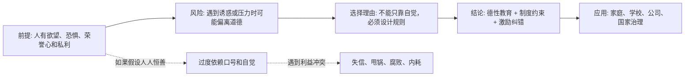

## 资治通鉴思维筑基课: 人性有欲，不能只靠道德想象

### 作者
digoal

### 日期
2026-05-17

### 标签
人性有欲 , 道德想象 , 制度设计 , 治理哲学 , 欲望 , 激励 , 约束 , 自律 , 组织管理 , 人性假设

----

## 背景

> 面向对象: 高中生到大学通识读者  
> 核心问题: 为什么很多制度、组织和政治思想都不能只假设“大家会自觉做好事”？  
> 先说结论: “人性有欲”不是说人天生邪恶，而是说人在利益、恐惧、荣誉、惰性和比较心理面前会动摇。因此，好的治理不能只靠道德期待，还要靠清楚的规则、边界、激励和纠错机制。

## 一张图先看懂



## 求真讲法

### 它到底说了什么

“人性有欲，不能只靠道德想象”可以拆成两句话:

第一，人不是纯粹理性的机器，也不是永远高尚的圣人。人会想要安全、利益、地位、面子、轻松、被认可，也会害怕损失、惩罚和孤立。

第二，正因为人会被这些东西影响，所以治理一个家庭、班级、公司或国家，不能只说“大家要自觉”“你应该有道德”。道德很重要，但它需要制度帮助它站稳。

这里的“欲”，不是单指贪婪。它包括更广的心理动力:

| 欲望或心理 | 日常表现 | 可能带来的风险 |
|---|---|---|
| 利益欲 | 想多拿资源、少承担成本 | 抢功、占便宜、以公谋私 |
| 安全欲 | 害怕失败、害怕被罚 | 隐瞒错误、推卸责任 |
| 荣誉欲 | 想被表扬、被看见 | 做表面文章、夸大成绩 |
| 惰性 | 想省力、少麻烦 | 规则松弛、拖延敷衍 |
| 比较心 | 不愿吃亏，盯着别人所得 | 内耗、嫉妒、破坏合作 |

所以这条公理不是在骂人，而是在提醒: **制度设计必须面对真实的人，而不是想象中的完人。**

### 它是怎么来的

这条公理来自长期生活经验和政治经验。

在中国思想传统里，儒家重视道德教化，法家重视法度赏罚，荀子强调人需要礼法引导，韩非强调不能把国家安危寄托在少数圣贤身上。它们立场不同，但共同面对同一个问题: 人会被欲望牵引，社会需要某种秩序来安放欲望、限制欲望、转化欲望。

用学生能懂的例子说:

如果一个班级考试完全无人监考，还把答案放在桌上，只说“大家要诚实”，那么有些同学能守住，有些同学可能会动摇。问题不只是个别人道德差，而是这个环境把诚实的人放在吃亏位置，把投机的人放在占便宜位置。

这就是制度问题。好的制度不是假设所有人都会作弊，而是让守规则的人不吃亏，让破坏规则的人付成本。

### 它依赖哪些假设

这条公理要成立，至少依赖几个前提:

1. 人会面对资源稀缺。比如名额、钱、时间、机会、评价不可能无限供应。
2. 人会受到激励影响。奖励什么，很多人就会倾向于追求什么。
3. 人会受到环境影响。同一个人在不同规则下，行为可能不同。
4. 人有道德能力，但道德稳定性有限。人在轻松时容易讲原则，在高压和诱惑下更容易变形。
5. 信息通常不完全。别人不一定立刻知道你有没有偷懒、撒谎、作弊或滥权。

这说明它不是一个“人人皆恶”的判断，而是一个更稳妥的治理假设: **承认人有向善能力，也承认人有失守可能。**

### 常见误解

**误解一: 既然人有欲，那就不用讲道德。**  
不对。正因为人会动摇，才更需要道德训练。只是道德不能孤零零存在，它需要规则、榜样、反馈和环境支持。

**误解二: 制度能解决一切。**  
也不对。制度需要人执行，人也会钻制度空子。没有基本的羞耻感、责任感和公共精神，再细的规则也会被消耗。

**误解三: 这是把人想得太坏。**  
不是。它不是说人一定会作恶，而是说设计系统时不能假设人永远不会作恶。就像修桥要考虑洪水，不是因为每天都有洪水，而是因为一旦来了，桥不能塌。

**误解四: 只要领导者道德高尚，制度就不重要。**  
不对。好人也会老去、误判、偏心、疲惫。把系统寄托在一个人的自觉上，本身就是高风险设计。

## 求存讲法

### 它有什么用

这条公理最大的用处，是帮我们从“责怪个人”升级到“分析结构”。

当一个组织反复出问题时，不要只问“为什么这些人不自觉”，还要问:

1. 规则是否清楚？
2. 权力是否有边界？
3. 贡献和奖励是否匹配？
4. 犯错是否能被及时发现？
5. 说真话的人会不会被惩罚？
6. 守规则的人会不会反而吃亏？

如果这些问题没有答案，只靠喊口号，很容易变成道德想象。

### 它怎么迁移到熟悉领域

```text
只靠道德想象的设计          面对人性有欲的设计
--------------------------------------------------
大家自觉排队                画清队伍、设置入口、违规重排
大家主动交作业              明确截止时间、反馈标准、迟交后果
员工自然会为公司着想        目标透明、权责匹配、奖惩一致
干部会自动廉洁              权力公开、流程留痕、审计监督
朋友之间不用谈钱            先说清费用、分工和边界
```

它可以迁移到学习、家庭、公司和公共治理。

学习上，不要只说“我要自律”，还要把手机放远、设定固定时间、找同伴监督。  
公司里，不要只说“我们重视贡献”，还要让真正解决问题的人被看见、被奖励。  
公共治理中，不要只说“官员应当清廉”，还要让权力运行有记录、有审查、有问责。

### 它的适用范围和边界

这条公理适合用在有利益冲突、有长期合作、有权责分配的场景。它不适合被滥用成“谁都不能信”。

| 场景 | 是否适合使用这条公理 | 原因 |
|---|---|---|
| 班级考试、公司绩效、财政审批 | 适合 | 有资源分配和作弊空间 |
| 朋友长期合伙做项目 | 适合 | 有贡献、收益、责任边界问题 |
| 一次性小忙，比如帮同学递书 | 不必过度使用 | 利益很小，制度成本可能高于收益 |
| 亲密关系中的日常关心 | 谨慎使用 | 不能把所有情感都制度化，否则信任会被伤害 |
| 高风险权力岗位 | 必须使用 | 一旦失守，代价巨大 |

边界很重要。承认人性有欲，不等于把所有关系都变成防贼。它真正要求的是: **风险越高、诱惑越大、影响越广，越不能只靠自觉。**

### 正例: 怎么用它提升能力

假设你总是想认真学习，但一坐下就刷手机。只靠道德想象的做法是责骂自己: “我怎么这么不自律。”

面对人性有欲的做法是重新设计环境:

1. 把手机放到另一个房间。
2. 每次只设定 25 分钟学习。
3. 桌上只留下当前任务。
4. 学完后记录完成量，而不是只记录学习时长。
5. 找同学互相检查成果。

这个方法不是否定自律，而是承认注意力会被即时刺激诱惑。它让环境帮你守住目标。

### 反例: 前提不成立会怎样

如果一个人真心帮你一次小忙，比如顺手带一本书，你却要求对方签字、拍照、留证据、写承诺书，这就不是成熟，而是过度制度化。

这里失败的原因是: 场景风险很低，利益冲突很小，制度成本超过收益。你把适合高风险场景的治理公理，错用到了低风险信任场景。

这说明“不能只靠道德想象”还有后半句: **也不能只靠制度想象。** 好判断要看风险大小、关系性质和后果严重程度。

## 思考

这条公理最值得思考的地方，是它把“做人”和“做制度”连接起来。

如果只相信道德，容易幼稚: 以为坏事发生只是因为别人不够善良。  
如果只相信制度，容易冷酷: 以为人只会算计，不需要信任和羞耻感。  
更成熟的看法是: 道德负责指出方向，制度负责降低失守概率。

可以继续追问:

1. 一个班级、公司或国家，怎样让守规则的人不吃亏？
2. 为什么很多人明知规则重要，却仍喜欢把希望寄托在“好领导”“好员工”“好孩子”身上？
3. 在亲密关系里，哪些事情应该靠信任，哪些事情必须提前说清边界？
4. 如果一个制度总是诱导普通人变坏，应该怪人，还是怪制度？

## 最后记住

1. “人性有欲”不是“人性本恶”的简单版，而是承认人会受利益、恐惧、荣誉和环境影响。
2. 道德很重要，但不能单独承担治理任务；它需要制度、激励和纠错机制支撑。
3. 好制度不是不信任人，而是不让守规则的人吃亏，不让破坏规则的人占便宜。
4. 使用这条公理要看风险大小；低风险关系中过度制度化，会损害信任。
5. 成熟的判断是: 用道德确定方向，用制度降低失守概率，用反馈不断修正系统。

## 参考资料

- 《论语》
- 《孟子》
- 《荀子》
- 《韩非子》
- 《礼记》
- 司马光: 《资治通鉴》
- 本文基于通用中国思想史与组织治理常识整理，未联网检索；若用于严肃学术写作，应回到原典章句和专业注释本校验。
  
#### [PostgreSQL 解决方案集合](../201706/20170601_02.md "40cff096e9ed7122c512b35d8561d9c8")
  
  
#### [德哥 / digoal's Github - 公益是一辈子的事.](https://github.com/digoal/blog/blob/master/README.md "22709685feb7cab07d30f30387f0a9ae")
  
  
#### [About 德哥](https://github.com/digoal/blog/blob/master/me/readme.md "a37735981e7704886ffd590565582dd0")
  
  

  
