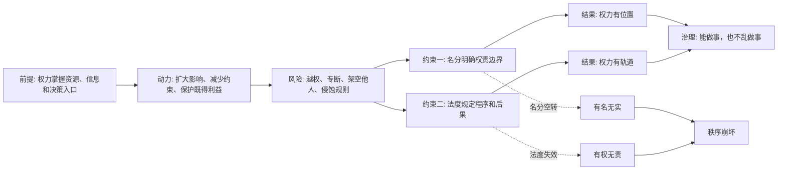

## 资治通鉴思维筑基课: 权力天然会扩张，必须被名分和法度约束

### 作者
digoal

### 日期
2026-05-17

### 标签
权力扩张 , 名分 , 法度 , 权力边界 , 治理秩序 , 监督 , 授权 , 越权 , 组织管理 , 制度约束

----

## 背景

> 面向对象: 高中生到大学通识读者  
> 核心问题: 为什么一个人或一个部门一旦掌握资源和决定权，就容易把手伸向本来不属于自己的范围？  
> 先说结论: 权力会天然扩张，不是因为掌权者一定邪恶，而是因为权力本身会带来资源、便利、信息优势和自我保护冲动。名分负责说明“你是谁、该管什么”，法度负责规定“你能怎么管、越界会怎样”。

## 一张图先看懂



## 求真讲法

### 它到底说了什么

“权力天然会扩张，必须被名分和法度约束”包含三层意思。

第一，权力不是静止的。只要一个人或组织掌握审批、资源、任免、评价、信息入口，它就会倾向于扩大自己的影响范围。

第二，这种扩张不一定从恶意开始。有时它以“为了效率”“为了安全”“为了统一管理”“我来帮你决定”为理由出现。但只要边界不清，临时方便就可能变成长期控制。

第三，约束权力不能只靠掌权者自觉。需要名分和法度。名分是身份与责任的秩序，法度是规则、程序和惩戒的秩序。

用简单话说:

```text
名分回答: 你是谁？你该管什么？你对谁负责？
法度回答: 你怎么管？按什么程序管？越界后怎么办？
```

没有名分，大家不知道谁该负责；没有法度，负责的人可能把负责变成支配。

### 它是怎么来的

这条公理来自长期的政治和组织经验。

在古代中国政治中，“名分”不是单纯的称号，而是秩序边界。君、臣、父、子、官、民，各自有名，也就各自有分。名分混乱，权责就混乱。比如臣子掌握废立之权，外戚干预朝政，宦官控制诏令，藩镇自握兵财，表面都还在旧名分中，实际权力已经越界。

“法度”则是让边界可执行。只有名分，没有法度，容易变成空话；只有法度，没有名分，容易变成机械条文，不知道权力的正当位置。

《资治通鉴》从“三家分晋”写起，正好展示了一个经典问题: 周天子的名分还在，但诸侯和卿大夫的实际权力已经膨胀到能改写天下格局。名分不能约束真实力量时，旧秩序就会破裂。

这不是说所有权力都坏。没有权力，就无法组织公共事务、抵御风险、分配资源、执行决策。真正的问题是:

**权力必须存在，但不能没有边界。**

### 它依赖哪些假设

这条公理要成立，需要几个前提:

1. 组织中存在资源差异。有人能审批、分配、任免或评价别人。
2. 权力会带来利益和便利。掌权者能更容易保护自己、影响他人、获得信息。
3. 信息不完全。被管理者不一定知道权力是否被滥用。
4. 监督有成本。越高层、越专业、越封闭的权力，越难被外部看清。
5. 人有自我保护冲动。掌权者面对批评和限制时，可能本能地维护自己的位置。

如果这些前提都不存在，比如只是一次性临时协作，权力扩张的风险就没有那么强。

### 常见误解

**误解一: 约束权力就是反对权威。**  
不对。约束权力不是不要权威，而是让权威更稳定、更可信。没有边界的权威，短期可能强，长期会消耗信任。

**误解二: 只要掌权者是好人，就不需要约束。**  
不对。好人也会偏心、疲惫、误判，也会被身边人包围。制度不能只为坏人设计，也要为好人可能犯错而设计。

**误解三: 名分只是封建等级。**  
不准确。古代名分确实带有等级色彩，但抽象来看，它讨论的是身份、职责、权限和责任是否匹配。现代组织也需要这种“名分”: 岗位职责、授权边界、汇报关系、签字权限。

**误解四: 法度越多越好。**  
不对。法度太少会纵容越界，法度太碎会压垮行动。好的法度要抓住关键权力点，而不是把所有小事都变成审批。

## 求存讲法

### 它有什么用

这条公理的用处，是帮助我们识别组织中的“权力越界”。

当你看到下面这些现象，就要警惕权力正在扩张:

1. 临时授权变成永久权力。
2. 协助决策变成替别人决策。
3. 信息汇总变成信息垄断。
4. 流程把关变成故意设卡。
5. 资源协调变成资源控制。
6. 承担责任的人没有权力，有权力的人不承担责任。

这时不能只问“这个人是不是好人”，还要问“他的名分和法度是否清楚”。

### 它怎么迁移到熟悉领域

| 古代概念 | 现代对应 | 核心问题 |
|---|---|---|
| 名分 | 岗位、角色、授权、职责 | 谁该管什么，谁对结果负责 |
| 法度 | 规则、流程、审计、问责 | 怎么管，越界怎么办 |
| 越权 | 跨级干预、私自审批、架空负责人 | 权力是否超过授权 |
| 专断 | 一人决定、拒绝解释、压制反馈 | 决策是否缺少程序 |
| 失纲 | 权责不清、流程失灵、人人观望 | 秩序是否还能运行 |

在学校里，班干部可以组织活动，但不能随意处罚同学。  
在公司里，财务可以审核报销，但不能用审核权干预业务判断。  
在家庭里，父母可以保护孩子，但不能把保护变成对所有选择的控制。  
在公共治理中，行政权可以执行政策，但必须受法律程序和责任机制约束。

### 它的适用范围和边界

这条公理最适合分析有持续权力结构的场景，比如政府、公司、学校、社团、家庭企业、平台系统。

| 前提成立 | 应该怎么做 |
|---|---|
| 权力影响他人利益 | 明确授权范围和责任人 |
| 权力掌握关键信息 | 建立记录、公开和复核机制 |
| 权力可以处罚或奖励别人 | 设置申诉和监督渠道 |
| 权力跨越多个部门 | 明确协调权不等于决定权 |

| 前提不成立 | 不宜怎么做 |
|---|---|
| 只是低风险临时协作 | 不要设置复杂审批 |
| 只是专业建议 | 不要把建议者当成实际负责人 |
| 任务需要快速试错 | 不要让流程压过行动 |
| 关系主要依赖信任 | 不要把所有互动都法条化 |

边界在于: 约束权力不是让权力不能行动，而是让权力沿着正当轨道行动。

### 正例: 怎么用它提升能力

假设一个学生社团要办活动。负责人掌握预算、人员分工和最终方案。如果只说“负责人要公平”，风险很大。

更好的做法是:

1. 名分清楚: 谁是总负责人，谁管预算，谁管宣传，谁管现场。
2. 授权清楚: 预算多少以内可直接决定，超过多少要集体确认。
3. 流程清楚: 每笔支出保留记录，活动后公开收支。
4. 反馈清楚: 成员可以对分工和资源使用提出异议。
5. 责任清楚: 出问题不能让没有决定权的人背锅。

这样做不是不信任负责人，而是保护负责人、成员和社团本身。权力被约束后，反而更容易获得信任。

### 反例: 前提不成立会怎样

如果三个人临时讨论午饭吃什么，却要求设立主席、秘书、预算审批、申诉流程，那就是错用这条公理。

失败原因在于: 场景低风险、低成本、低后果，没有持续权力结构。此时复杂法度会消耗合作，名分设计也没有必要。

这说明这条公理不能变成形式主义。权力越大、影响越广、持续越久，越需要名分和法度；事情越小、风险越低、关系越简单，越需要保留弹性。

## 思考

权力最容易扩张的地方，往往不是公开宣布“我要更多权力”，而是通过看似合理的小步骤完成:

```text
帮你看一下 -> 我来替你把关 -> 以后都先经过我 -> 没有我同意不能做
```

这一过程提醒我们: 权力扩张常常披着效率、安全、专业、统一的外衣。它可能一开始真的有用，但如果没有边界，就会从工具变成目的。

可以继续追问:

1. 一个组织里，哪些人拥有“没有写出来但实际存在”的权力？
2. 为什么有些岗位名义上不高，却能通过信息入口控制很多事情？
3. 怎样区分“必要协调”和“越权干预”？
4. 如果一个好领导离开后组织立刻混乱，说明他强，还是说明制度弱？

## 最后记住

1. 权力会扩张，不一定因为人坏，而是因为资源、信息、便利和自我保护会推动权力越界。
2. 名分解决“你是谁、该管什么、对谁负责”，法度解决“怎么管、按什么程序管、越界怎么办”。
3. 没有权力，组织无法行动；没有边界，权力会侵蚀信任和秩序。
4. 约束权力不是削弱权威，而是让权威可预期、可监督、可持续。
5. 这条公理适用于持续、高风险、有资源分配的场景；低风险小事中过度套用，会变成形式主义。

## 参考资料

- 司马光: 《资治通鉴》
- 《论语》
- 《荀子》
- 《韩非子》
- 《礼记》
- 《周礼》
- 孟德斯鸠: 《论法的精神》
- 马克斯·韦伯: 《经济与社会》
- 本文基于通用中国思想史、政治哲学和组织治理常识整理，未联网检索；若用于严肃学术写作，应回到原典、注释本和专业研究文献校验。
  
#### [PostgreSQL 解决方案集合](../201706/20170601_02.md "40cff096e9ed7122c512b35d8561d9c8")
  
  
#### [德哥 / digoal's Github - 公益是一辈子的事.](https://github.com/digoal/blog/blob/master/README.md "22709685feb7cab07d30f30387f0a9ae")
  
  
#### [About 德哥](https://github.com/digoal/blog/blob/master/me/readme.md "a37735981e7704886ffd590565582dd0")
  
  

  
