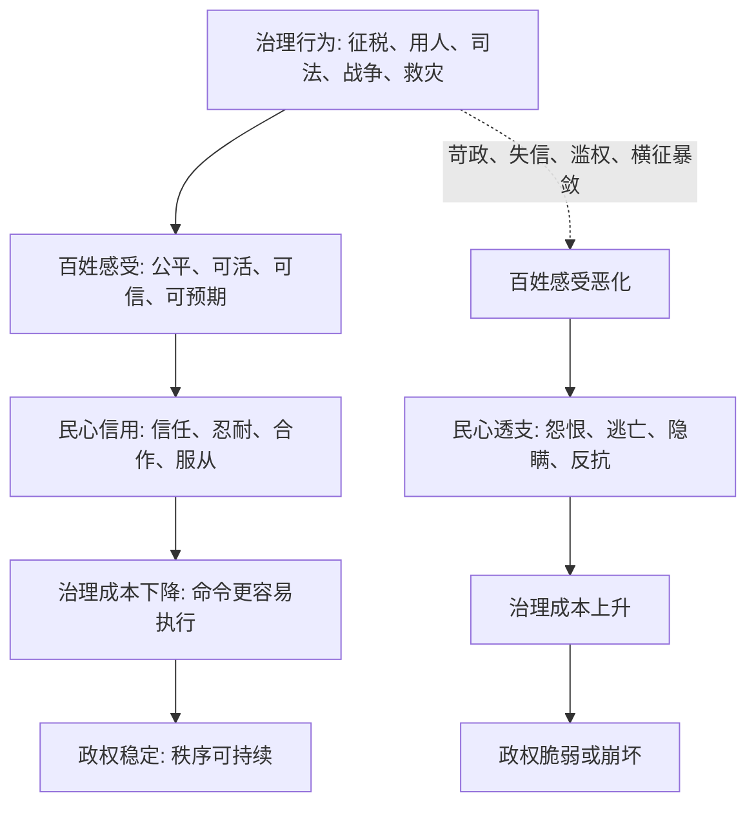

## 资治通鉴思维筑基课: 民心是政权的最终信用

### 作者
digoal

### 日期
2026-05-17

### 标签
民心 , 政权信用 , 民本 , 治理成本 , 信任 , 合作意愿 , 合法性 , 危机韧性 , 组织信用 , 长期秩序

----

## 背景

> 面向对象: 高中生到大学通识读者  
> 核心问题: 为什么一个政权即使有军队、法律和官僚体系，也可能因为失去民心而变得脆弱？  
> 先说结论: 民心不是一句漂亮口号，而是百姓愿不愿意相信、忍耐、服从、合作和继续生活在这个秩序里的总和。政权可以短期靠强制运行，但长期必须靠民心提供信用。

## 一张图先看懂



## 求真讲法

### 它到底说了什么

“民心是政权的最终信用”可以拆成三个层次。

第一，政权不是只靠命令存在。命令要有人听，赋税要有人交，粮食要有人种，军队要有人供养，地方事务要有人配合。只要百姓大规模不信、不服、不合作，治理成本就会急剧上升。

第二，民心不是一时情绪，而是一种长期信用。信用的意思是: 百姓相信这个秩序虽然有不完美，但大体还能让人活下去、讲道理、有盼头、少受任意伤害。

第三，民心是“最终”信用，意思是政权还有很多中间信用，比如法律、官员、军队、财政、礼仪、宣传。但这些东西最终都要落到百姓的真实体验上。如果真实体验长期崩坏，中间信用会逐层失效。

用一句学生能懂的话说:

**一个班级不能只靠班规存在，还要让大多数同学觉得班规基本公平；一个国家不能只靠法令存在，还要让百姓觉得继续服从比逃离或反抗更有希望。**

### 它是怎么来的

这条公理来自中国传统政治思想中的“民本”经验，也来自历代治乱兴亡的反复观察。

《孟子》说“民为贵，社稷次之，君为轻”，强调民众是政治秩序的根基。《尚书》中也有“民惟邦本，本固邦宁”的思想。到《资治通鉴》这样的历史叙事里，民心不是抽象教条，而是通过赋役、饥荒、战争、刑罚、用人和财政透支体现出来。

很多政权衰亡时，并不是第一天就没有军队，也不是第一天就没有官府。更常见的是: 百姓先从相信变成忍耐，从忍耐变成怨恨，从怨恨变成逃亡、观望或响应反叛。到这一步，政权表面还在，信用已经空了。

所以这条公理被采用，是因为它能解释一个重要现象:

**为什么强制力看起来还在，秩序却突然崩得很快。**

答案是: 强制力是显性的，民心信用是隐性的。隐性信用耗尽时，显性力量会突然显得不够用。

### 它依赖哪些假设

这条公理要成立，依赖几个前提:

1. 政权需要百姓持续合作。种田、纳税、服役、提供信息、接受裁判，都需要最低限度的配合。
2. 百姓会比较成本和希望。如果服从带来的是更重压迫、更少生路，服从意愿会下降。
3. 治理能力有成本。民心好时，同样的法令执行成本低；民心坏时，执行要靠更多强制。
4. 信用可以积累，也可以透支。一次失信未必立刻亡国，长期失信会改变人们对政权的预期。
5. 民心不等于人人满意。它指的是多数人是否仍认为这个秩序大体可忍、可信、可持续。

这些前提说明，“民心”不是玄学，而是社会合作意愿和治理成本之间的关系。

### 常见误解

**误解一: 民心就是民意调查或一时舆论。**  
不对。民心比一时舆论更深，包含长期生活体验、对公平的判断、对未来的预期和对权力的信任。

**误解二: 只要让百姓高兴，就是得民心。**  
不对。得民心不是讨好所有人，而是让公共秩序大体公平、稳定、可活、可信。短期讨好如果透支财政，反而会损害长期民心。

**误解三: 有军队就不怕失民心。**  
不对。军队本身也来自社会，也需要粮饷、士气和合法性。民心大坏时，军队维持秩序的成本会越来越高。

**误解四: 民心只和仁政有关，和制度能力无关。**  
不对。百姓不只看统治者是否“心善”，还看粮价、治安、司法、灾荒救济、赋税、官吏是否可信。善意如果没有能力，也难以形成信用。

## 求存讲法

### 它有什么用

这条公理帮助我们看懂一个组织或政权是否在透支信用。

如果只看表面，可能会看到命令仍在、会议仍开、口号仍响、流程仍走。但如果基层开始普遍敷衍、隐瞒、逃避、沉默、私下抱怨，说明信用已经在流失。

可以用四个问题判断“民心信用”:

1. 人们是否相信规则大体公平？
2. 人们是否相信努力和服从还有回报？
3. 人们是否相信受到伤害时能得到救济？
4. 人们是否相信掌权者不会任意改变规则？

如果答案长期是否定的，治理就会越来越依赖强制，而强制越多，信用越少。

### 它怎么迁移到熟悉领域

```text
国家治理中的民心              现代组织中的信用
------------------------------------------------
百姓愿意纳税                  员工愿意投入真实努力
百姓相信司法                  成员相信评价和申诉机制
百姓愿意服从法令              团队愿意执行共同规则
百姓遇灾相信救济              成员遇到困难相信组织支持
百姓不轻易响应叛乱            成员不轻易离职、躺平或对抗
```

在班级里，“民心”就是同学是否相信班干部和老师处理事情基本公平。  
在公司里，“民心”就是员工是否相信付出会被看见，问题能被解决，承诺不会随便变。  
在平台上，“民心”就是用户和商家是否相信规则稳定、处罚透明、申诉有效。

这些都不是古代政治的简单复制，而是同一个底层机制: **任何秩序都需要成员愿意继续合作。**

### 它的适用范围和边界

| 前提成立 | 这条公理很重要 |
|---|---|
| 组织需要长期合作 | 信用决定成员是否持续投入 |
| 管理者掌握奖惩权 | 公平感决定服从是否稳定 |
| 成员有离开、沉默、对抗的选择 | 民心流失会转化为真实成本 |
| 规则执行依赖基层配合 | 不信任会导致隐瞒和敷衍 |

| 前提不成立 | 不能机械套用 |
|---|---|
| 一次性强制任务 | 短期服从不一定反映民心 |
| 高度专业的技术判断 | 不能用多数喜好替代专业标准 |
| 紧急灾害或战时决策 | 有时需要先行动，再解释和修复信用 |
| 小范围低影响事务 | 不必把所有不满都上升为信用危机 |

边界在于: 民心重要，但不等于所有决策都要迎合即时情绪。真正的民心，是长期可活、可信、可预期，不是短期讨好。

### 正例: 怎么用它提升能力

假设一个班级要制定晚自习规则。只靠强制的做法是: 老师宣布任何说话都扣分，不解释、不区分情况、不允许申诉。

更好的做法是:

1. 说明规则目的: 保护想学习的同学。
2. 明确边界: 正常问题交流和持续喧哗不同。
3. 执行一致: 班干部、成绩好的同学、普通同学同样适用。
4. 提供反馈: 允许对误判提出说明。
5. 定期调整: 如果规则造成新问题，就公开修正。

这样做不是放松管理，而是让被管理者相信规则大体公平。公平感会降低执行成本，这就是“小组织里的民心信用”。

### 反例: 前提不成立会怎样

如果一场突发火灾中，负责人必须立刻命令人群按路线撤离，这时不能先组织投票、收集所有人的感受、再决定怎么走。

这里不是民心不重要，而是紧急场景下“即时安全”优先。正确做法是先用权威完成撤离，事后再解释、复盘、修正流程。如果把“民心”误解成任何时候都要即时满意，就会耽误行动。

这个反例说明: 民心是长期信用，不是每一个瞬间都让所有人舒服。

## 思考

“民心是政权的最终信用”真正深刻的地方，是它把政治从“谁掌握权力”拉回到“权力是否还能被相信”。

一个政权或组织可能短期很强，但如果所有人都在心里计算“怎样少吃亏、怎样逃出去、怎样不说真话”，它的信用已经受损。反过来，一个组织即使资源有限，只要成员相信规则公平、目标可信、困难会被共同承担，它就还有韧性。

可以继续追问:

1. 为什么很多统治者或管理者明知民心重要，却仍然透支民心？
2. 民心和效率冲突时，应该如何取舍？
3. 短期高压能不能换来长期稳定？
4. 一个组织里，沉默是服从，还是信用流失的信号？

## 最后记住

1. 民心不是抽象口号，而是信任、忍耐、合作、服从和希望的长期总账。
2. 政权可以短期靠强制运行，但长期必须靠民心降低治理成本。
3. 民心不等于人人满意，也不等于迎合情绪；它要求秩序大体公平、可活、可信、可预期。
4. 失民心通常不是突然发生，而是从失信、苛政、滥权、救济失败中长期累积。
5. 在现代组织中，民心可以理解为成员是否愿意继续真实合作。

## 参考资料

- 《尚书》
- 《孟子》
- 《荀子》
- 《论语》
- 司马光: 《资治通鉴》
- 钱穆: 《国史大纲》
- 吕思勉: 《中国通史》
- 本文基于通用中国思想史、政治哲学和组织治理常识整理，未联网检索；若用于严肃学术写作，应回到原典、注释本和专业研究文献校验。
  
#### [PostgreSQL 解决方案集合](../201706/20170601_02.md "40cff096e9ed7122c512b35d8561d9c8")
  
  
#### [德哥 / digoal's Github - 公益是一辈子的事.](https://github.com/digoal/blog/blob/master/README.md "22709685feb7cab07d30f30387f0a9ae")
  
  
#### [About 德哥](https://github.com/digoal/blog/blob/master/me/readme.md "a37735981e7704886ffd590565582dd0")
  
  

  
