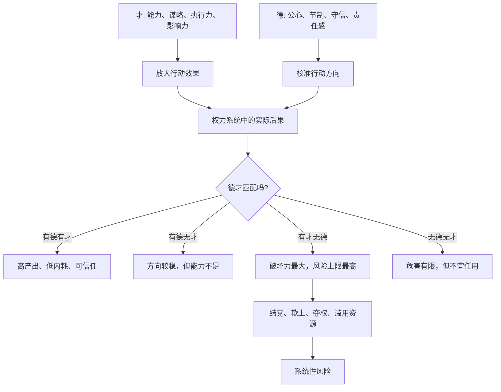

## 资治通鉴思维筑基课: 德才关系决定权力系统的风险上限

### 作者
digoal

### 日期
2026-05-17

### 标签
德才关系 , 权力风险 , 用人之道 , 德性 , 才能 , 授权 , 组织风险 , 才德论 , 治理哲学 , 关键岗位

----

## 背景

> 面向对象: 高中生到大学通识读者  
> 核心问题: 为什么一个很有能力的人，如果德性不足，反而可能给组织或国家带来更大的危险？  
> 先说结论: 才决定一个人能把事情做到多大，德决定他会把能力用到哪里。在权力系统里，高才低德不是普通缺点，而是风险放大器；德才关系决定了系统最坏能坏到什么程度。

## 一张图先看懂



## 求真讲法

### 它到底说了什么

“德才关系决定权力系统的风险上限”说的是: 在普通生活中，一个人的才华和品德都重要；但一旦他进入权力系统，能够影响资源、任免、奖惩、信息和他人命运，德才关系就变得特别关键。

这里的“德”，不是只会说好听话，也不是温和老实。它至少包括四件事:

1. 公心: 能把公共利益放在私人利益前面。
2. 节制: 有能力也不越界，不把方便变成特权。
3. 守信: 说话、承诺、规则具有稳定性。
4. 责任感: 决策造成后果时，不甩锅、不逃避。

这里的“才”，也不是考试分数，而是解决问题、组织资源、判断形势、说服他人、执行计划的能力。

所以这条公理的核心不是“德比才重要”这么简单，而是:

**德决定能力的方向，才决定方向被执行到多远。**

### 它是怎么来的

这条公理在中国传统政治思想中很典型。《资治通鉴》开篇不久，司马光讨论智伯之亡时提出“才德论”: 才与德不同，才是聪察强毅，德是正直中和。才胜德者，容易成为小人之雄；德胜才者，至少不至于造成巨大破坏。

这不是抽象说教，而是从权力运行中总结出来的经验。

一个能力平庸、德性也差的人，当然不值得任用，但他能造成的破坏通常有限。一个能力极强、德性不足的人，危险在于他能看懂规则、利用规则、绕过监督、拉拢同盟、制造漂亮叙事，甚至把组织资源变成个人工具。

用学生熟悉的例子说:

一个普通同学想作弊，影响可能只是一张试卷。一个掌握成绩系统、又懂技术、还缺乏底线的人，能改分数、删记录、嫁祸别人。能力越强，越需要方向约束。

### 它依赖哪些假设

这条公理成立，需要几个前提:

1. 这个人拥有或将要拥有权力。没有影响他人的权力，德才错配的系统风险会小很多。
2. 权力能放大个人行为。一个人的选择会影响资源、机会、评价或安全。
3. 监督不是完全透明。越聪明能干的人，越可能找到监督盲区。
4. 组织会被结果诱惑。高才低德者常常能在短期交出漂亮成绩，从而获得更多授权。
5. 德性不是口号，而是能在利益冲突中约束自己的能力。

如果这些前提不成立，比如只是评价一个人的兴趣爱好或单次技术任务，就不能把德才关系上升为系统风险。

### 常见误解

**误解一: 讲德才关系就是反对能力。**  
不对。没有能力，很多公共事务做不成。问题不是才不重要，而是才需要被德校准。

**误解二: 德就是听话。**  
不对。真正的德不是服从上级，而是面对权力、利益和压力时仍能守住公正、责任和边界。有时敢于进谏、反对错误命令，反而是德。

**误解三: 有才无德的人短期能干，所以应该先用起来。**  
危险在于“先用起来”会给他更多资源。权力系统会奖励短期结果，而高才低德者最擅长把短期结果变成长期控制。

**误解四: 有德无才就一定适合掌权。**  
也不对。有德无才的人适合放在低风险、规则明确的位置，或通过训练提升能力；但高风险岗位需要德才兼备。善意不能替代判断力和执行力。

## 求存讲法

### 它有什么用

这条公理帮助我们做用人判断，尤其是在高权力、高资源、高风险岗位上。

不要只问一个人“能不能把事做成”，还要问:

1. 他会不会为了做成事破坏底线？
2. 他是否愿意接受监督？
3. 他是否把功劳归团队，把错误推给别人？
4. 他是否在不同权力距离的人面前表现一致？
5. 他掌握更多资源后，组织是否还能约束他？

在权力系统里，能力是发动机，德性是方向盘和刹车。发动机越强，方向盘和刹车越不能失灵。

### 它怎么迁移到熟悉领域

```text
德才组合             适合位置                    风险判断
---------------------------------------------------------------
有德有才             高权力、高复杂度岗位          优先任用
有德无才             低风险岗位、培养型岗位        可培养，不宜骤然重任
有才无德             受限岗位、强监督岗位          最忌无边界授权
无德无才             不宜关键岗位                  危害有限但不可托付
```

在班级里，成绩好但经常欺负同学的人，不适合掌握评价和分配权。  
在公司里，业绩强但常常造假、抢功、压制反馈的人，不适合进入核心管理层。  
在公共事务中，精明能干但没有公心的人，越掌权越可能把公共资源私人化。

### 它的适用范围和边界

| 场景 | 是否应高度重视德才关系 | 原因 |
|---|---|---|
| 管理岗位、财务岗位、人事岗位 | 必须重视 | 直接影响资源和他人命运 |
| 安全、司法、审计、公共权力 | 必须重视 | 一旦失守，伤害范围很大 |
| 单次低风险技术任务 | 可以侧重能力 | 权力放大效应较弱 |
| 创意讨论、比赛展示 | 不宜过度道德化 | 主要评价作品或表现 |
| 长期合伙、团队核心成员 | 必须重视 | 信任和边界决定合作寿命 |

边界在于: 不要把“德才关系”变成道德审判工具。评价德性要看可观察行为，比如是否守信、是否承担责任、是否尊重规则、是否接受监督，而不是凭喜欢或讨厌贴标签。

### 正例: 怎么用它提升能力

假设一个社团要选财务负责人。候选人甲很会做表格、沟通能力强，但经常把集体资源用于私人关系，也不愿公开账目。候选人乙能力中等，但守时、透明、愿意记录和复核。

通鉴式的判断不是简单选“最能干的人”，而是看岗位风险。财务岗位掌握钱和记录，德性缺口会被权力放大。因此更稳妥的方案是:

1. 让乙担任财务负责人。
2. 让甲在有明确边界的任务中发挥能力，比如活动策划或数据整理。
3. 建立双人复核和公开账目制度。
4. 如果甲能长期证明守规则，再逐步增加授权。

这不是浪费人才，而是让能力在可控边界内发挥。

### 反例: 前提不成立会怎样

如果只是一次数学竞赛选手选拔，题目明确、评价标准透明、没有资源分配权，那么过度考察“谁更适合掌权”就会偏离目标。此时主要标准应该是解题能力、稳定性和训练投入。

这里失败的原因是: 场景不是权力系统，候选人不会因为入选而掌握他人命运或公共资源。把高风险岗位的德才框架机械套到低权力任务上，会造成不必要的道德化。

这说明这条公理的重点不是评价所有人，而是评价“谁可以被授予权力”。

## 思考

德才关系最难的地方，是高才低德者往往很会包装自己。他们能给出漂亮结果，也能解释为什么规则要为自己让路。组织如果只看短期成果，就容易把风险人物一步步推到更高位置。

可以继续追问:

1. 为什么组织常常愿意容忍“能干但不守规矩”的人？
2. 高才低德者造成损害前，通常有哪些早期信号？
3. 德性能不能培养？如果能，靠说教还是靠制度和环境？
4. 如果一个组织必须依赖某个高才低德的人，说明这个人强，还是说明组织弱？

## 最后记住

1. 才决定能力的大小，德决定能力的方向。
2. 在权力系统中，高才低德是风险放大器，因为权力会放大个人选择的后果。
3. 德不是听话，而是在利益、压力和权力面前守住公心、边界、信用和责任。
4. 有德无才不宜骤然重任，有才无德最忌无边界授权。
5. 评价德性要看长期行为和监督态度，不要凭好恶做道德贴标签。

## 参考资料

- 司马光: 《资治通鉴》
- 《论语》
- 《孟子》
- 《荀子》
- 《韩非子》
- 《礼记》
- 钱穆: 《国史大纲》
- 吕思勉: 《中国通史》
- 本文基于通用中国思想史、政治哲学和组织治理常识整理，未联网检索；若用于严肃学术写作，应回到《资治通鉴》原文、注释本和专业研究文献校验。
  
#### [PostgreSQL 解决方案集合](../201706/20170601_02.md "40cff096e9ed7122c512b35d8561d9c8")
  
  
#### [德哥 / digoal's Github - 公益是一辈子的事.](https://github.com/digoal/blog/blob/master/README.md "22709685feb7cab07d30f30387f0a9ae")
  
  
#### [About 德哥](https://github.com/digoal/blog/blob/master/me/readme.md "a37735981e7704886ffd590565582dd0")
  
  

  
