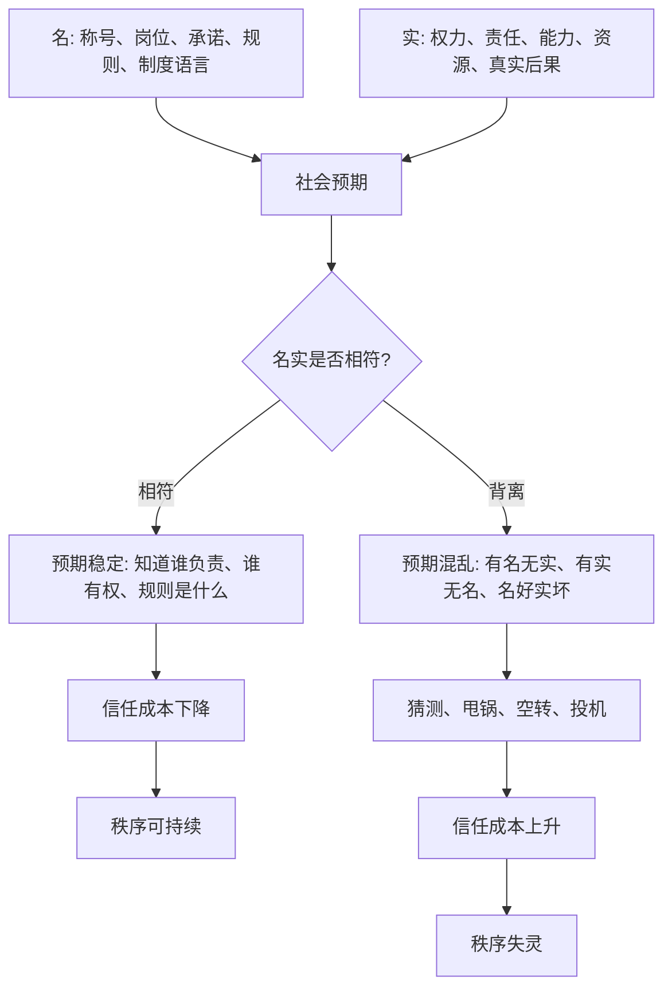

## 资治通鉴思维筑基课: 名实相符是秩序的基础

### 作者
digoal

### 日期
2026-05-17

### 标签
名实相符 , 秩序基础 , 正名 , 权责一致 , 组织信任 , 规则语言 , 岗位职责 , 治理哲学 , 信任成本 , 制度运行

----

## 背景

> 面向对象: 高中生到大学通识读者  
> 核心问题: 为什么一个组织里，称号、职责、权力和真实结果一旦对不上，秩序就会慢慢失灵？  
> 先说结论: “名”是人们用来理解秩序的名称、身份、岗位、承诺和规则语言；“实”是真实权力、真实责任、真实能力和真实后果。名实相符，大家才知道该信什么、找谁负责、按什么规则行动；名实背离，信任和执行都会被消耗。

## 一张图先看懂



## 求真讲法

### 它到底说了什么

“名实相符是秩序的基础”说的是: 一个社会、组织或团队要稳定运行，人们使用的名称、身份、岗位、规则和承诺，必须和真实权力、责任、能力、资源、结果大体一致。

“名”不是虚假的表面。它是人们理解世界的标签和约定。比如“老师”“班长”“负责人”“审核人”“改革”“奖励”“处罚”“公开”“公平”，这些都是名。

“实”是这些名称背后的真实内容。比如老师是否真的教书育人，班长是否真的服务班级，负责人是否真的能拍板并承担后果，审核是否真的按规则，改革是否真的解决问题，奖励是否真的给到贡献者。

名实相符时，大家不需要反复猜测，秩序就顺。名实不符时，所有人都要重新计算:

```text
他说的是规则，还是借口？
这个岗位有责任，还是只有背锅？
这个人没有头衔，却是不是实际拍板者？
所谓公平，是按贡献，还是按关系？
```

猜测越多，信任成本越高；信任成本越高，秩序越脆弱。

### 它是怎么来的

这条公理来自中国思想史中很重要的“名实”问题。

孔子讲“正名”，强调名分不正，言语就不顺，事情就难办。法家也重视“循名责实”，意思是根据职位和承诺检查真实效果，不能只听漂亮说法。儒家更重视名分背后的伦理秩序，法家更重视名实对应后的考核和赏罚，但它们都看到了同一个问题: 如果语言和现实脱节，治理就会空转。

《资治通鉴》中也反复出现名实背离的情形。比如有的君主名义上励精图治，实际沉迷享乐；有的臣子名义上忠君报国，实际结党营私；有的改革名义上恢复古制，实际脱离民生和财政承载；有的官职名义上负责，真实权力却被外戚、宦官、权臣或地方军阀夺走。

这条公理被采用，是因为它能解释一个常见现象:

**秩序崩坏常常不是从没有规则开始，而是从规则的名字还在、真实作用已经变了开始。**

### 它依赖哪些假设

这条公理成立，依赖几个前提:

1. 人们需要共同语言来协作。没有稳定名称，复杂协作无法进行。
2. 名称会创造预期。一个人被称为负责人，别人就会期待他能决定并负责。
3. 预期落空会消耗信任。名义和现实越不一致，越容易产生怀疑和投机。
4. 组织需要可追责。只有名实对应，才能判断谁做得好、谁失职、谁越权。
5. 名实不符会被人利用。有人会借好名声掩盖坏实质，也有人会拥有实权却逃避名义责任。

这些前提说明，“名实相符”不是文字游戏，而是协作和治理的基础设施。

### 常见误解

**误解一: 名不重要，结果才重要。**  
不对。结果当然重要，但复杂组织必须靠名称、职责和规则来提前协调。名乱了，结果往往也难以稳定。

**误解二: 只要把名称改好，现实就会变好。**  
不对。改名不能自动改变事实。把“惩罚”改叫“成长激励”，如果真实作用还是羞辱和压迫，名实背离只会更严重。

**误解三: 名实相符就是死守等级。**  
不准确。古代名分确实常和等级秩序相连，但抽象来看，名实相符关心的是身份、权力、责任和结果是否一致。现代组织同样需要这个原则。

**误解四: 名实不符一定是故意欺骗。**  
也不一定。有时是制度老化，有时是环境变化，有时是职责扩张后没有重新定义。但无论是否故意，长期不修正都会伤害秩序。

## 求存讲法

### 它有什么用

这条公理最实用的地方，是帮助我们识别“组织空转”和“语言污染”。

当你看到这些现象，就要警惕名实不符:

1. 有负责人之名，却没有决策权。
2. 有管理权之实，却不用承担责任。
3. 口号说重视贡献，奖励却给了会表现的人。
4. 制度说公开透明，关键信息却不让人看。
5. 会议说集体讨论，实际早已有人定调。
6. 改革说减负，实际增加更多表格和流程。

这时真正的问题不是“大家态度不好”，而是共同语言已经失去信用。

### 它怎么迁移到熟悉领域

| 名 | 如果实相符 | 如果实不符 |
|---|---|---|
| 负责人 | 有授权，也承担结果 | 只背锅，不能决策 |
| 奖励 | 奖给真实贡献 | 奖给关系、表演或运气 |
| 公平 | 标准清楚，执行一致 | 标准模糊，看人下菜 |
| 公开 | 信息可查，过程可复核 | 只公布结论，不公布依据 |
| 改革 | 解决旧问题，降低真实成本 | 换名称、加流程、造新负担 |
| 服务 | 以对方需求和结果为中心 | 用服务名义行控制之实 |

在学习中，名实相符就是“我说自己复习了，就真的完成了理解、练习和纠错”，而不是只把书翻了一遍。  
在团队中，名实相符就是“谁负责，谁有权；谁决定，谁担责”。  
在公司中，名实相符就是岗位描述、实际工作、评价标准和晋升奖励互相对得上。

### 它的适用范围和边界

| 场景 | 是否适合使用这条公理 | 原因 |
|---|---|---|
| 岗位职责、考核评价、公共承诺 | 必须使用 | 名实不符会直接破坏信任 |
| 政策、制度、组织改革 | 必须使用 | 名称容易掩盖真实成本和真实效果 |
| 学习目标和自我管理 | 适合使用 | 能防止用漂亮话骗自己 |
| 文学、艺术、隐喻表达 | 谨慎使用 | 艺术语言不总是追求字面对应 |
| 探索期的新项目 | 适度使用 | 早期可以试错，但要及时校正定义 |

边界在于: 名实相符不是要求语言永远僵硬，也不是禁止比喻、愿景和试验。它要求的是: 当一个名称被用于分配权力、责任、资源和评价时，必须能对得上真实内容。

### 正例: 怎么用它提升能力

假设一个小组做研究作业。组长这个“名”如果只是头衔，却没有分工权、提醒权和协调权，那么最后项目出问题，组长就会变成背锅者。

更好的做法是让名实相符:

1. 明确组长的权力: 可以安排进度、提醒延期、协调冲突。
2. 明确组长的责任: 要保证最终提交质量和时间。
3. 明确成员的责任: 每个人负责哪一部分，何时交付。
4. 明确检查机制: 每两天同步一次，问题提前暴露。
5. 明确评价方式: 贡献记录进入最终互评。

这样“组长”“成员”“负责”“完成”这些名，才对应真实行动和真实后果。协作成本会明显下降。

### 反例: 前提不成立会怎样

如果朋友之间开玩笑说“你今天是我们的队长”，只是临时调侃，没有真实任务、资源分配和责任后果，却非要追问“队长权限在哪里、责任边界是什么”，就会显得过度严肃。

这里失败的原因是: 这个“名”没有进入真实治理场景，没有用于分配权力、责任和利益。把名实相符原则机械套到轻松语境里，会破坏交流弹性。

这说明这条公理的关键边界是: **当名称开始影响权责、资源、评价和后果时，名实相符才变成硬要求。**

## 思考

名实问题最危险的地方，是它会慢慢污染语言。刚开始只是一个称号不准确，后来所有人都学会说漂亮话、绕开真问题、猜测潜规则。

当“负责”不等于能负责，“公开”不等于真公开，“改革”不等于解决问题，“公平”不等于标准一致，组织还会说很多话，但这些话已经很难组织真实行动。

可以继续追问:

1. 一个组织里，哪些词已经变成“听起来正确，但没人相信”的词？
2. 为什么人们明知道名实不符，却仍愿意保留漂亮名称？
3. 名实不符时，是先改名，还是先改实？
4. 如果一个人有实权却没有名义责任，谁能约束他？

## 最后记住

1. 名是名称、身份、岗位、承诺和规则语言；实是真实权力、责任、能力和后果。
2. 名实相符能降低信任成本，让人知道该找谁、信什么、按什么规则行动。
3. 名实背离会制造猜测、甩锅、空转和投机，长期会让秩序失灵。
4. 正名不是只改名称，而是让名称背后的权责和事实重新对齐。
5. 这条公理适用于权责、资源、评价和公共承诺场景；轻松玩笑和艺术隐喻中不能机械套用。

## 参考资料

- 《论语》
- 《荀子》
- 《韩非子》
- 《礼记》
- 司马光: 《资治通鉴》
- 钱穆: 《国史大纲》
- 吕思勉: 《中国通史》
- 本文基于通用中国思想史、政治哲学和组织治理常识整理，未联网检索；若用于严肃学术写作，应回到原典、注释本和专业研究文献校验。
  
#### [PostgreSQL 解决方案集合](../201706/20170601_02.md "40cff096e9ed7122c512b35d8561d9c8")
  
  
#### [德哥 / digoal's Github - 公益是一辈子的事.](https://github.com/digoal/blog/blob/master/README.md "22709685feb7cab07d30f30387f0a9ae")
  
  
#### [About 德哥](https://github.com/digoal/blog/blob/master/me/readme.md "a37735981e7704886ffd590565582dd0")
  
  

  
