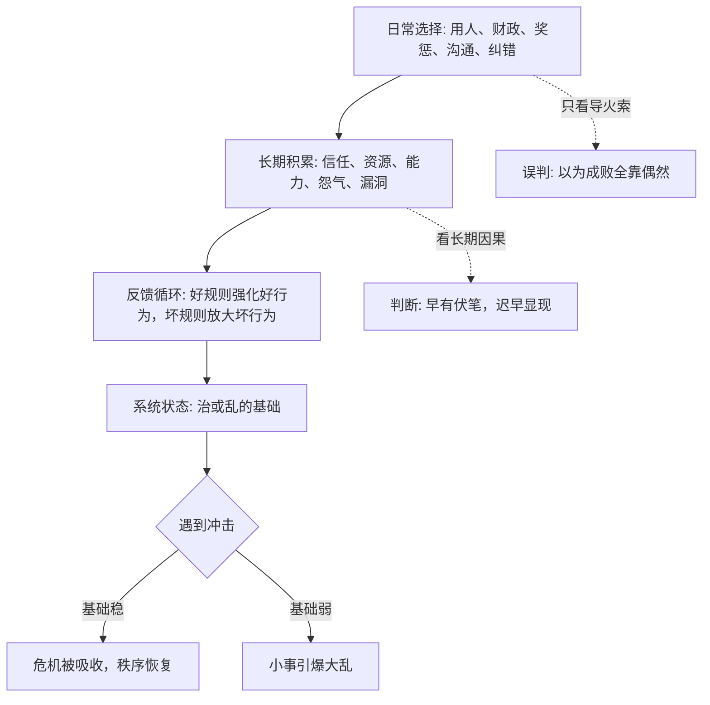

## 资治通鉴思维筑基课: 治乱不是偶然，是长期因果的显现

### 作者
digoal

### 日期
2026-05-17

### 标签
治乱因果 , 长期主义 , 历史哲学 , 系统反馈 , 风险积累 , 临界点 , 组织治理 , 兴亡逻辑 , 纠错机制 , 因果链

----

## 背景

> 面向对象: 高中生到大学通识读者  
> 核心问题: 为什么一个国家、组织或个人的“突然崩坏”，往往不是突然发生的？  
> 先说结论: 治与乱通常不是单点事件造成的，而是长期选择、制度反馈、资源消耗、信任积累或透支之后的显现。偶然事件常常只是导火索，真正的原因早已在系统内部累积。

## 一张图先看懂



## 求真讲法

### 它到底说了什么

“治乱不是偶然，是长期因果的显现”说的是: 一个系统的好坏，不主要看它某一天发生了什么，而要看它长期如何积累。

“治”，不是一天没有出事，而是规则能运行、资源能支撑、人心能合作、错误能纠正。  
“乱”，也不是一天突然混乱，而是规则失信、资源透支、人心离散、错误无法纠正之后的集中爆发。

很多历史事件看上去像是被一个偶然点燃。比如一次兵变、一次饥荒、一次继承危机、一次财政断裂。但如果往前看，常常能看到长期伏笔:

```text
小失误 -> 被掩盖
小不公 -> 被默许
小透支 -> 被习惯
小谎言 -> 被奖励
小怨气 -> 被忽视
长期累积 -> 临界点 -> 大崩坏
```

所以这条公理提醒我们: 导火索不是全部原因。真正的历史判断，要看导火索点燃了什么。

### 它是怎么来的

这条公理来自历史叙事中反复出现的“积累效应”。

《资治通鉴》采用编年体，一个重要优点就是能让读者看到因果如何在时间中展开。很多衰败不是突然出现的，而是从用人不当、财政透支、法令失信、边防松弛、君臣互疑、民生困苦开始，一层层积累。等到危机爆发时，人们才说“怎么突然这样了”，但历史早已写下原因。

中国思想传统中也有类似判断。儒家重视修身、齐家、治国的连续性，法家重视制度与赏罚的稳定反馈，道家提醒事物会在微小处变化，兵家强调胜败在战前已有形势基础。这些思想虽然不同，但都不把治乱简单归结为单一偶然。

这条公理被采用，是因为它能解释一个关键现象:

**同样遇到灾荒、战争、继承、外敌或财政压力，有的系统能挺过去，有的系统一碰就碎。差别不只在冲击本身，而在冲击到来前，系统已经积累成什么样。**

### 它依赖哪些假设

这条公理成立，需要几个前提:

1. 系统有连续性。今天的规则、资源和信任会影响明天。
2. 行为会留下后果。奖惩、用人、财政、承诺、沟通都会积累成结构。
3. 反馈会强化倾向。好规则让好行为更容易，坏规则让坏行为更划算。
4. 风险有延迟。很多错误不会当天爆炸，而是在压力到来时集中显现。
5. 偶然事件需要土壤。同样的导火索，在不同系统里会产生不同结果。

这些前提说明，它不是否认偶然，而是把偶然放回长期结构中理解。

### 常见误解

**误解一: 既然有长期因果，就没有偶然。**  
不对。偶然事件真实存在。问题是偶然只解释“何时爆发”，长期因果解释“为什么能爆发、爆发后为什么那么严重”。

**误解二: 事后都能找到原因，所以这是马后炮。**  
有这种风险。因此使用这条公理时，要找可观察的长期信号，而不是事后硬编故事。比如财政赤字、军纪败坏、赏罚失信、基层逃避、人才流失，都是可观察信号。

**误解三: 治乱因果都是道德因果。**  
不对。道德很重要，但财政、制度、地理、技术、组织能力、人口压力也会参与因果链。不能把复杂问题都简化成“好人得治，坏人致乱”。

**误解四: 只要长期做对，就不会遇到危机。**  
也不对。长期做对只能提高韧性，不能取消外部冲击。好系统不是永远没危机，而是危机来时不至于一击即溃。

## 求存讲法

### 它有什么用

这条公理最大的用处，是训练我们不要被“突然”迷惑。

当一个组织突然崩盘、一个项目突然失败、一个人突然失控时，不要只问最后一件事是什么，还要问:

1. 长期有没有小问题被忽视？
2. 坏行为是不是曾经被奖励？
3. 真实成本是不是一直被隐藏？
4. 反馈机制是不是早就失灵？
5. 信任是不是已经被透支？
6. 危机前有没有人说过真话却没人听？

这些问题能把分析从“事故现场”推进到“系统病史”。

### 它怎么迁移到熟悉领域

| 古代治乱 | 现代组织或个人中的对应 |
|---|---|
| 财政透支 | 长期超预算、靠借新还旧 |
| 赏罚失信 | 做事的人不被奖励，投机的人得好处 |
| 用人失当 | 关键岗位交给不合适的人 |
| 民心离散 | 员工、用户或成员不再真实合作 |
| 边防松弛 | 风险管理、技术债、安全漏洞长期放任 |
| 纳谏失效 | 反馈被压制，坏消息无法上达 |

在学习上，考试失利常常不是考试当天突然失常，而是平时错题没有复盘、概念没有打牢、作息长期混乱。  
在公司里，产品崩盘常常不是一次发布造成的，而是技术债、用户抱怨、团队沟通、质量流程长期失效。  
在家庭里，关系破裂常常不是一次争吵造成的，而是长期不被听见、长期不公平、长期没有修复。

### 它的适用范围和边界

| 场景 | 适合使用这条公理吗 | 原因 |
|---|---|---|
| 国家兴亡、组织成败、长期关系 | 非常适合 | 都有积累、反馈和临界点 |
| 学习习惯、健康管理、职业成长 | 适合 | 日常选择会长期复利 |
| 随机抽奖、自然突发小概率事件 | 谨慎使用 | 偶然性占比很高 |
| 单次比赛中的临场失误 | 需要结合分析 | 可能有训练原因，也可能真是偶发 |
| 灾害、战争、金融危机 | 适合但不能简化 | 外部冲击和内部脆弱性都要看 |

边界在于: 长期因果不是万能解释。它适合分析有连续性和反馈机制的系统，不适合把所有随机事件都解释成“早有因果”。

### 正例: 怎么用它提升能力

假设你想提高成绩。只靠考试前几天突击，等于把结果寄托在偶然状态上。用“长期因果”的思路，就要把成绩看成日常系统的显现:

1. 每天是否有固定复习时间。
2. 错题是否分类复盘。
3. 不懂的问题是否及时问清。
4. 睡眠是否稳定。
5. 每周是否检查一次薄弱点。

这样做的核心不是保证每次考试都完美，而是让好结果有稳定来源。考试只是长期学习系统的一次显现。

### 反例: 前提不成立会怎样

如果一个人走路时被突然掉落的小物件砸到，而此前没有任何可见风险、管理责任或重复信号，硬说这是“长期因果显现”，就会变成牵强解释。

这里失败的原因是: 缺少连续系统、可观察反馈和长期积累。这个事件可能主要是偶然。把长期因果公理套到纯随机小概率事件上，会制造虚假的深刻。

这说明成熟判断要同时承认两件事: 大多数复杂系统的崩坏有长期伏笔，但世界也确实存在偶然。

## 思考

这条公理最重要的提醒是: 不要只在结果出现时才认真。

很多人喜欢在失败后找“最后一根稻草”，却不愿承认前面已经放了很多稻草。历史、组织和个人成长都一样，真正决定结果的，往往是那些平时不显眼的小选择。

可以继续追问:

1. 你所在的班级、团队或公司，有哪些问题已经被大家习惯了？
2. 哪些坏行为正在被奖励，只是还没有爆发后果？
3. 哪些好结果其实不是运气，而是长期积累的回报？
4. 如果今天的系统遇到一次冲击，它会吸收冲击，还是被冲击放大问题？

## 最后记住

1. 治乱通常不是单点偶然，而是长期选择、反馈和积累的显现。
2. 偶然事件常常决定爆发时间，长期因果决定系统为什么会爆发、爆发后有多严重。
3. 好系统不是没有危机，而是平时积累了吸收危机的能力。
4. 使用这条公理要看连续性、反馈机制和可观察信号，不能把纯随机事件硬解释成深层因果。
5. 读史和做事都要少问“怎么突然这样”，多问“它早在哪里开始变成这样”。

## 参考资料

- 司马光: 《资治通鉴》
- 《论语》
- 《孟子》
- 《荀子》
- 《韩非子》
- 《老子》
- 《孙子兵法》
- 钱穆: 《国史大纲》
- 吕思勉: 《中国通史》
- 本文基于通用中国思想史、历史哲学和组织治理常识整理，未联网检索；若用于严肃学术写作，应回到原典、注释本和专业研究文献校验。
  
#### [PostgreSQL 解决方案集合](../201706/20170601_02.md "40cff096e9ed7122c512b35d8561d9c8")
  
  
#### [德哥 / digoal's Github - 公益是一辈子的事.](https://github.com/digoal/blog/blob/master/README.md "22709685feb7cab07d30f30387f0a9ae")
  
  
#### [About 德哥](https://github.com/digoal/blog/blob/master/me/readme.md "a37735981e7704886ffd590565582dd0")
  
  

  
