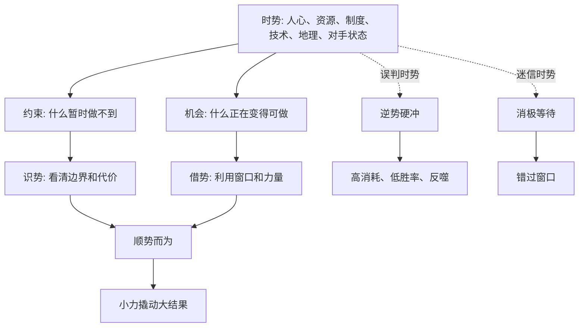

## 资治通鉴思维筑基课: 时势有力量，智慧必须顺势而为

### 作者
digoal

### 日期
2026-05-17

### 标签
时势 , 顺势而为 , 决策哲学 , 趋势判断 , 战略窗口 , 借势 , 造势 , 资源格局 , 行动节奏 , 历史智慧

----

## 背景

> 面向对象: 高中生到大学通识读者  
> 核心问题: 为什么同样聪明、努力、勇敢的人，在不同时间和环境中会得到完全不同的结果？  
> 先说结论: 时势不是迷信，而是人心、资源、制度、技术、地理、对手状态和历史阶段共同形成的外部条件。智慧不是硬冲条件，也不是随波逐流，而是识势、待势、借势、造势，在合适窗口做合适的事。

## 一张图先看懂



## 求真讲法

### 它到底说了什么

“时势有力量，智慧必须顺势而为”说的是: 人的主观努力很重要，但努力不是在真空中发生的。每个人、每个组织、每个国家都处在一组条件里，这组条件会影响行动的成本、方向和成功概率。

“时”是时间窗口。比如机会是否成熟，危机是否刚出现，敌人是否疲惫，社会是否已经准备好接受某种变化。

“势”是力量格局。比如人心向背、资源多少、制度松紧、技术变化、地理位置、联盟关系、对手状态。

顺势而为不是“别人做什么我就做什么”，而是:

```text
看清条件 -> 判断窗口 -> 选择打法 -> 调整节奏 -> 借助外力
```

如果条件不成熟，蛮干会把勇气变成消耗；如果条件已经成熟，却还犹豫不动，谨慎会变成错失。

### 它是怎么来的

这条公理来自中国思想传统中对“势”的长期重视。

兵家讲“势”，强调战争胜负不只取决于单个士兵勇敢，也取决于地形、士气、虚实、奇正、粮道、时机和将帅判断。《孙子兵法》说“善战者，求之于势”，意思是高手不只依赖个人蛮力，而是让局势本身帮助自己。

道家讲“因势”“无为”，不是完全不做事，而是不违背事物运行的条件，不用粗暴方式强行推动尚未成熟的东西。

《资治通鉴》中，许多成败也不能只看个人品德或能力。有人才智很高，但处在财政枯竭、人心离散、将帅不和、敌强我弱的局面中，硬做大事就容易失败。也有人看准对方内部松动、民心变化、联盟窗口和军事疲劳，以较小力量撬动较大结果。

这条公理被采用，是因为它能解释一个常见问题:

**为什么同样的策略，在一个时间点是远见，在另一个时间点就是冒进。**

答案是: 策略不能脱离时势判断。

### 它依赖哪些假设

这条公理成立，需要几个前提:

1. 行动受到外部条件影响。资源、制度、人心、技术和对手都会改变成功概率。
2. 条件会变化。今天不可做的事，未来可能可做；今天能做的事，拖久也可能失去窗口。
3. 人的力量有限。有限力量必须选择施力点，不能同时硬推所有方向。
4. 系统存在杠杆点。某些时刻、位置和关系能让小行动产生大影响。
5. 判断存在不确定性。顺势不是机械计算，而是在不完全信息中不断校正。

这些前提说明，“顺势”不是命定论，而是一种条件意识和节奏意识。

### 常见误解

**误解一: 顺势而为就是随波逐流。**  
不对。随波逐流是不判断方向，只跟着走；顺势而为是先判断大势，再选择自己的行动位置。

**误解二: 顺势就是投机。**  
不准确。投机只看短期利益，顺势强调条件、时机、长期目标和代价。真正顺势有方向，不是哪里热闹去哪里。

**误解三: 逆势就一定错。**  
也不对。有些正确的事一开始就是逆风的。问题是要区分“价值上不妥协”和“方法上硬碰硬”。可以坚持方向，但调整路径和节奏。

**误解四: 时势决定一切，个人努力没用。**  
不对。时势提供边界和机会，人的智慧决定能否识别、利用和改变这些条件。没有行动，机会也会过去。

## 求存讲法

### 它有什么用

这条公理帮助我们做决策时少一些蛮干，多一些结构判断。

遇到大事前，可以先问六个问题:

1. 现在的核心矛盾是什么？
2. 哪些条件已经成熟，哪些还没成熟？
3. 谁的力量正在上升，谁的力量正在下降？
4. 如果现在行动，最大阻力来自哪里？
5. 如果等待，窗口会扩大还是消失？
6. 有没有一个小切口能借助大趋势？

这些问题能防止两种常见错误: 条件不成熟时硬冲，条件成熟时迟疑。

### 它怎么迁移到熟悉领域

| 古代时势判断 | 现代场景中的对应 |
|---|---|
| 人心向背 | 用户需求、团队士气、公众信任 |
| 粮草财政 | 预算、现金流、时间和注意力 |
| 地理险要 | 渠道、平台、入口、关键位置 |
| 敌强我弱 | 竞争格局、能力差距、资源差距 |
| 联盟离合 | 合作伙伴、组织支持、生态关系 |
| 战机窗口 | 技术变化、政策窗口、考试节点、市场拐点 |

在学习中，顺势不是等状态好才学，而是识别自己的精力节奏: 难题放在清醒时，重复任务放在低能量时。  
在职业选择中，顺势不是追所有热门，而是看行业趋势、个人能力、资源位置和进入时机是否匹配。  
在创业中，顺势不是复制风口，而是找到需求刚出现、旧方案失效、自己又有独特切入点的位置。

### 它的适用范围和边界

| 场景 | 适合使用这条公理吗 | 原因 |
|---|---|---|
| 战略选择、职业规划、组织改革 | 非常适合 | 都受长期趋势和资源格局影响 |
| 学习安排、项目推进、比赛备战 | 适合 | 节奏和窗口会影响效果 |
| 基本道德底线 | 不能用顺势当借口 | 大势不能替代是非判断 |
| 需要立即救人的紧急场景 | 谨慎使用 | 先行动救急，再优化策略 |
| 纯粹随机事件 | 不宜过度使用 | 没有稳定趋势可顺 |

边界在于: 顺势而为不能变成“形势如此，所以我什么都可以做”。时势判断解决的是方法和节奏，不负责取消底线。

### 正例: 怎么用它提升能力

假设你想提高英语成绩。逆势硬冲的做法是每天随机背很多单词，累了就停，考试前再突击。

顺势而为的做法是看清自己的条件和窗口:

1. 你的薄弱点是听力、阅读还是写作？
2. 距离考试还有多久？
3. 每天哪个时间段注意力最好？
4. 试卷中哪类题提分快、可训练？
5. 哪些资源最容易获得，比如真题、老师反馈、同伴练习？

然后选择打法: 早晨做听力，晚上复盘错题，每周固定写一篇作文请人反馈。这里的“势”不是宏大历史，而是你的时间、精力、考试结构和反馈渠道。顺势就是把力用到最容易产生复利的位置。

### 反例: 前提不成立会怎样

如果一个人看到同学都在选择某个热门专业，就说“这就是大势，我也必须去”，却没有分析自己的兴趣、能力、家庭资源、行业真实需求和进入门槛，这不是顺势，而是跟风。

这里失败的原因是: 他把“人多”误当成“势”，把“热闹”误当成“机会”。真正的势必须包含结构性条件，而不只是短期情绪。

这说明顺势而为的前提是识势。看不清势，就谈不上顺势。

## 思考

时势最难判断的地方，是它常常在变化初期不明显。真正的机会刚出现时，可能看起来很小；真正的风险刚积累时，也可能被热闹掩盖。

所以智慧不只是聪明，还包括耐心观察、承认边界、等待窗口、敢于行动和及时修正。

可以继续追问:

1. 你现在做的事，是在借助趋势，还是在对抗基本条件？
2. 哪些看似努力的行动，其实只是低效率地逆势硬冲？
3. 哪些看似保守的等待，其实是在错过窗口？
4. 如果坚持方向不变，方法和节奏能不能顺势调整？

## 最后记住

1. 时势是人心、资源、制度、技术、地理、对手状态和历史阶段共同形成的外部条件。
2. 顺势而为不是随波逐流，而是识势、待势、借势、造势。
3. 智慧不是无视条件硬冲，也不是把一切交给命运，而是在有限力量中选择最有效的施力点。
4. 同一策略在不同时势下可能意义相反，所以决策必须先看条件和窗口。
5. 顺势不能替代底线；它解决方法和节奏，不取消是非判断。

## 参考资料

- 《孙子兵法》
- 《老子》
- 《庄子》
- 《韩非子》
- 司马光: 《资治通鉴》
- 钱穆: 《国史大纲》
- 吕思勉: 《中国通史》
- 本文基于通用中国思想史、兵家思想、历史哲学和组织决策常识整理，未联网检索；若用于严肃学术写作，应回到原典、注释本和专业研究文献校验。
  
#### [PostgreSQL 解决方案集合](../201706/20170601_02.md "40cff096e9ed7122c512b35d8561d9c8")
  
  
#### [德哥 / digoal's Github - 公益是一辈子的事.](https://github.com/digoal/blog/blob/master/README.md "22709685feb7cab07d30f30387f0a9ae")
  
  
#### [About 德哥](https://github.com/digoal/blog/blob/master/me/readme.md "a37735981e7704886ffd590565582dd0")
  
  

  
