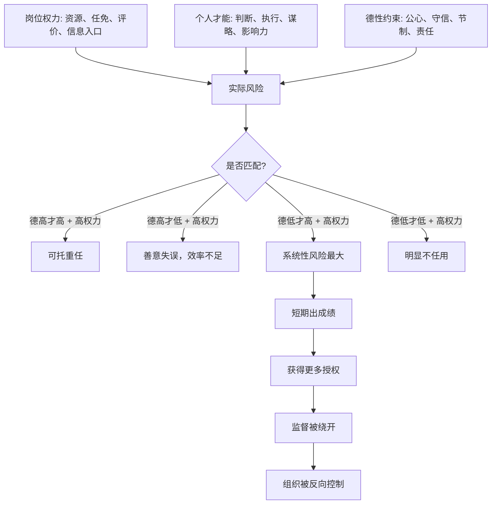

## 资治通鉴思维筑基课: 德才错配律

### 作者
digoal

### 日期
2026-05-17

### 标签
德才错配律 , 用人风险 , 授权边界 , 高才低德 , 组织治理 , 权力岗位 , 监督机制 , 人才判断 , 风险放大 , 才德匹配

----

## 背景

> 面向对象: 高中生到大学通识读者  
> 核心问题: 为什么一个组织用错人，尤其是把高能力低德性的人放到关键位置，会比单纯“能力不足”更危险？  
> 先说结论: 德才错配律说的是: 岗位权力、个人能力和德性约束三者不匹配时，组织风险会被放大。最危险的不是“无才无德”，而是“高才低德却被授予高权力”。

## 一张图先看懂



## 求真讲法

### 它到底说了什么

“德才错配律”不是简单说“好人比能人重要”，而是说: **一个人适不适合某个位置，要看他的德、才和岗位权力是否匹配。**

这里有三个变量:

1. 德: 是否有公心、边界感、守信能力、责任感。
2. 才: 是否有判断力、执行力、组织力、说服力和解决问题能力。
3. 位: 岗位给他的权力大小，包括资源、信息、评价、任免和决策入口。

错配有很多种。比如:

| 类型 | 表现 | 主要风险 |
|---|---|---|
| 高德低才居高位 | 人品可信，但能力不足 | 好心办坏事、决策迟缓、错失窗口 |
| 高才低德居高位 | 能干但缺底线 | 滥权、造假、结党、架空组织 |
| 低德低才居高位 | 德才都不支撑岗位 | 明显败坏秩序，通常较易识别 |
| 高德高才居低位 | 能力和德性被闲置 | 人才流失、组织浪费 |
| 高才低德居低位且强监督 | 能力可用但需边界 | 可做工具性任务，不宜托付核心权力 |

其中最需要警惕的是“高才低德居高位”。因为才会放大行动效果，权力会放大影响范围，低德会让方向偏离公共利益。三者叠加，就会形成系统性风险。

### 它是怎么来的

这条定律可以看作从“德才关系决定权力系统的风险上限”这条底层公理推出来的上层规律。

《资治通鉴》中，司马光借智伯之亡讨论“才德论”。他把人分成圣人、君子、小人、愚人等类型，核心意思是: 德才兼备最好；才胜过德最危险。智伯有才，强毅果敢，能扩张权势，却缺少节制和公心，最终把自己的能力变成招祸之源。

这类判断在历史中反复出现。很多组织不是毁在没有人才，而是毁在把不受约束的能人放到了能支配资源、操纵信息、影响人事的位置上。

用学生生活类比:

一个同学很聪明，组织能力强，口才好。如果让他负责活动策划，他可能很有用；如果让他同时掌握经费、评分、名单和信息发布，而他又喜欢抢功、压人、造假，那么他的能力越强，伤害越大。

### 它依赖哪些假设

德才错配律要成立，需要几个前提:

1. 岗位有真实权力。如果只是无资源、无决策权的小任务，错配风险会小很多。
2. 才能可以放大后果。能力强的人更会动员资源、影响他人、包装行为。
3. 德性会影响方向。面对利益、压力和诱惑时，德性决定是否守边界。
4. 组织存在监督盲区。高才低德者常能利用信息不对称绕开规则。
5. 组织容易被短期结果诱惑。只看眼前成绩，会忽视长期风险。

这些前提说明，德才错配律不是用来随便评价人格，而是用来判断“能否授权、授权多少、放在哪个位置”。

### 常见误解

**误解一: 德才错配律就是重德轻才。**  
不对。高风险岗位需要德才兼备。有德无才也可能误事，只是它造成的风险类型不同。

**误解二: 高才低德的人一律不能用。**  
不准确。可以在边界清楚、监督强、权力小的任务中使用其才能，但不能无边界授权，更不能放到核心控制位。

**误解三: 德性靠感觉判断。**  
不对。德性要看长期行为: 是否守信、是否接受监督、是否尊重规则、是否承担后果、是否在利益冲突中仍能守边界。

**误解四: 只要制度足够强，就不怕德才错配。**  
制度能降低风险，但制度需要人执行。高才低德者如果占据关键节点，可能反过来利用制度漏洞。

## 求存讲法

### 它有什么用

德才错配律最实用的地方，是帮助组织做授权判断。

不要只问“这个人强不强”，还要问:

1. 这个岗位的权力有多大？
2. 这个人的能力会放大什么后果？
3. 他的德性缺口会不会影响公共利益？
4. 有没有监督、复核和替代方案？
5. 他一旦坐大，组织还能不能纠偏？

这条定律把用人从“喜欢谁、谁能干”推进到“谁适合什么权力边界”。

### 它怎么迁移到熟悉领域

```text
任用判断 = 德性水平 x 才能水平 x 岗位权力 x 监督强度

高权力 + 高才能 + 低德性 + 弱监督 = 高危
高权力 + 中才能 + 高德性 + 强支持 = 可培养
低权力 + 高才能 + 低德性 + 强监督 = 可限用
高权力 + 高德性 + 高才能 + 可监督 = 可重用
```

在班级里，班干部不仅要会做事，还要公平、守信、愿意接受同学反馈。  
在公司里，销售高手如果长期虚报业绩、抢客户、压制同事，就不适合进入管理层。  
在公共事务中，精明强干但缺少公心的人，越接近资源和人事权，风险越高。

### 它的适用范围和边界

| 场景 | 是否适合使用德才错配律 | 原因 |
|---|---|---|
| 干部任用、团队负责人、财务人事 | 必须使用 | 权力会放大个人德才后果 |
| 长期合伙、核心岗位、公共资源管理 | 必须使用 | 一旦错配，纠错成本高 |
| 单次低风险技术任务 | 适度使用 | 可重点看能力，但要设边界 |
| 艺术创作、竞赛展示 | 谨慎使用 | 主要评价作品，不宜过度人格化 |
| 朋友间普通帮忙 | 不宜过度使用 | 权力和风险都很小 |

边界在于: 德才错配律不是让人到处做道德审判，而是在“授权”和“托付”之前做风险判断。评价越高风险，证据要求越高。

### 正例: 怎么用它提升能力

假设一个创业小团队要选运营负责人。候选人甲能力强，增长思路多，但过去经常夸大数据、把团队成果说成个人功劳。候选人乙能力略弱，但记录透明、执行稳定、愿意接受复盘。

更稳妥的安排是:

1. 不把甲直接放到掌握预算、数据口径和人员评价的核心位置。
2. 让甲负责边界清楚的增长实验，指标和数据由他人复核。
3. 让乙负责流程、记录和跨团队协作。
4. 对关键数据、预算和对外承诺设置双人确认。
5. 如果甲长期证明能守规则，再逐步扩大授权。

这不是压制能人，而是防止“能力强但德性缺口大”的人过早掌握系统关键节点。

### 反例: 前提不成立会怎样

如果只是一次班级才艺表演，某个同学唱歌很好，但平时有点爱表现。此时若因为“德才错配律”就禁止他上台，可能是过度使用。

失败原因在于: 这个场景主要评价才艺表现，不涉及长期授权、公共资源、人事评价和高风险权力。德才错配律适用于“托权”，不适合把所有能力展示都变成道德筛选。

这说明: **德才错配律的核心问题不是“这个人完不完美”，而是“这个人能不能被授予这类权力”。**

## 思考

德才错配最危险的地方，是它常常在早期被误认为“人才难得”。高才低德者可能短期带来业绩、效率和声望，组织会因此不断给他更多授权。等到他掌握关键资源后，再纠错就变得很贵。

可以继续追问:

1. 为什么组织常常会被短期能力诱惑，而忽视德性风险？
2. 如何区分“有个性的人才”和“破坏规则的能人”？
3. 一个岗位到底需要多高的德性要求，取决于什么？
4. 如果一个组织离不开高才低德者，是这个人太强，还是组织太弱？

## 最后记住

1. 德才错配律关注的是德、才、位三者是否匹配。
2. 最危险的组合是高才低德居高权力位，尤其在监督薄弱时。
3. 德不是听话，才也不是单一技能；德看边界和责任，才看解决问题和影响他人的能力。
4. 高才低德者不是绝对不能用，但必须限权、强监督、可替代。
5. 这条定律适用于授权和托付，不适合把所有低风险表现都道德化。

## 参考资料

- 司马光: 《资治通鉴》
- 《论语》
- 《孟子》
- 《荀子》
- 《韩非子》
- 《礼记》
- 钱穆: 《国史大纲》
- 吕思勉: 《中国通史》
- 本文基于通用中国思想史、政治哲学和组织治理常识整理，未联网检索；若用于严肃学术写作，应回到《资治通鉴》原文、注释本和专业研究文献校验。
  
#### [PostgreSQL 解决方案集合](../201706/20170601_02.md "40cff096e9ed7122c512b35d8561d9c8")
  
  
#### [德哥 / digoal's Github - 公益是一辈子的事.](https://github.com/digoal/blog/blob/master/README.md "22709685feb7cab07d30f30387f0a9ae")
  
  
#### [About 德哥](https://github.com/digoal/blog/blob/master/me/readme.md "a37735981e7704886ffd590565582dd0")
  
  

  
