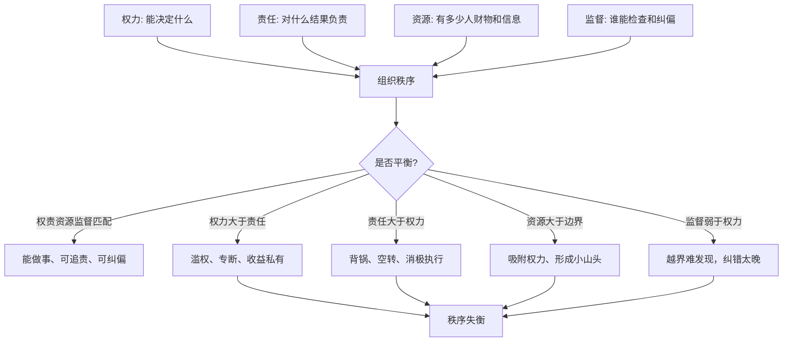

## 资治通鉴思维筑基课: 权力失衡律

### 作者
digoal

### 日期
2026-05-17

### 标签
权力失衡律 , 权责匹配 , 资源配置 , 监督机制 , 组织秩序 , 有权无责 , 有责无权 , 授权设计 , 治理风险 , 制度平衡

----

## 背景

> 面向对象: 高中生到大学通识读者  
> 核心问题: 为什么一个组织里，只要权力、责任、资源和监督不匹配，就容易出现越权、甩锅、内耗甚至失控？  
> 先说结论: 权力失衡律说的是: 权力如果大于责任和监督，就会走向滥用；责任如果大于权力和资源，就会走向背锅；资源如果集中而边界不清，就会吸附更多权力。健康秩序要求权力、责任、资源、监督大体匹配。

## 一张图先看懂



## 求真讲法

### 它到底说了什么

“权力失衡律”说的是: 一个组织能否稳定运行，不只看有没有权力，还要看权力和责任、资源、监督是否匹配。

权力，是能决定什么。比如审批、任免、评价、处罚、分配资源。  
责任，是出了结果谁承担后果。比如项目失败谁解释，钱花错谁负责。  
资源，是能调动什么。比如预算、人手、信息、工具、渠道。  
监督，是谁能看见、检查、质疑、纠正权力运行。

一旦四者失衡，问题就会出现:

| 失衡类型 | 表现 | 后果 |
|---|---|---|
| 有权无责 | 能拍板，但不用承担后果 | 专断、滥权、短期冒进 |
| 有责无权 | 要负责，但不能调资源和做决定 | 背锅、内耗、消极执行 |
| 有资源无边界 | 掌握人财物，却职责不清 | 小圈子、资源私用、权力膨胀 |
| 有监督无能力 | 名义监督，实际看不懂也管不了 | 监督空转 |
| 有权无监督 | 权力运行不透明 | 越界、腐败、信息垄断 |

所以权力失衡律的核心不是“权力越小越好”，而是:

**权力必须足以完成责任，又必须受到足以防止越界的监督。**

### 它是怎么来的

这条定律可以看作从“权力天然会扩张，必须被名分和法度约束”这条底层公理推出来。

如果权力天然会扩张，那么只给权力一个名称还不够，还要让它被责任、资源边界和监督机制固定住。名分说明这个权力属于谁、该做什么；法度说明它怎么运行、越界后怎么办。

《资治通鉴》里反复出现权力失衡的例子。权臣掌握实际决策却不受君臣名分约束，外戚和宦官能影响任免却不承担天下责任，藩镇掌握兵财却不听中央节制，君主拥有最高权力却拒绝纳谏和监督。这些场景形式不同，机制相似: 权力从原来的轨道里滑出去了。

这条定律也解释现代组织里的常见现象。一个部门如果掌握审批权，却不对业务结果负责，它可能倾向于保守设卡；一个项目经理如果要对进度负责，却不能调人、调预算、改优先级，他就只能催促和背锅。

### 它依赖哪些假设

权力失衡律成立，需要几个前提:

1. 组织中存在真实权力。有人能影响资源、机会、评价或他人行动。
2. 权力会改变人的行为。掌握决定权的人，会受到便利、利益和自我保护的影响。
3. 责任需要可追溯。否则做决定的人和承担后果的人会分离。
4. 资源会吸附权力。谁掌握关键资源，谁就容易获得实际影响力。
5. 监督有成本且可能失灵。监督者必须看得见、看得懂、敢纠正。

这些前提说明，权力失衡律不是抽象道德判断，而是组织结构中的风险规律。

### 常见误解

**误解一: 权力失衡就是权力太大。**  
不完全对。有时问题不是权力大，而是权力没有责任、没有边界、没有监督。高责任岗位反而需要足够权力，否则只能空转。

**误解二: 只要加强监督就能解决。**  
不够。监督必须有信息、有能力、有独立性，也要有纠偏手段。只让人签字、填表、开会，不等于有效监督。

**误解三: 有责无权是锻炼人。**  
多数时候不是。长期有责无权会把人训练成甩锅、躲事、做表面工作，因为他没有真实解决问题的条件。

**误解四: 资源集中一定坏。**  
不一定。复杂任务需要资源集中。问题在于资源集中后，边界、责任和复核是否同步建立。

## 求存讲法

### 它有什么用

权力失衡律能帮助我们快速诊断组织问题。

看到一个问题时，不要只问“谁态度不好”，先问四个结构问题:

1. 谁有决定权？
2. 谁承担后果？
3. 谁掌握资源和信息？
4. 谁能监督并纠偏？

如果这四个答案不是同一套清楚结构，组织就容易出问题。

### 它怎么迁移到熟悉领域

```text
健康授权:
要你负责结果 -> 给你必要权力 -> 配给相应资源 -> 设置透明监督

失衡授权:
要你负责结果 -> 不给权力资源 -> 出事追责
给你权力资源 -> 不问结果后果 -> 越界扩张
设置监督名义 -> 不给信息能力 -> 监督空转
```

在班级里，让班长负责纪律，却不给明确规则和老师支持，就是有责无权。  
在公司里，让财务掌握所有审批，却不对业务效率负责，容易形成流程设卡。  
在家庭里，父母让孩子“自己安排学习”，却又随时推翻孩子计划，就是名义放权、实际控制。  
在平台治理中，算法能决定流量分配，但如果申诉和解释机制不足，就会形成看不见的权力失衡。

### 它的适用范围和边界

| 场景 | 是否适合使用权力失衡律 | 原因 |
|---|---|---|
| 政府机构、公司管理、学校班级 | 非常适合 | 都有权责资源监督结构 |
| 项目管理、预算审批、人事评价 | 非常适合 | 失衡会直接造成低效和不公 |
| 家庭分工、社团协作 | 适合 | 小组织也有隐性权力 |
| 临时低风险帮忙 | 不宜过度使用 | 制度化成本可能超过收益 |
| 高度紧急救援 | 谨慎使用 | 可先集中指挥，事后复盘监督 |

边界在于: 权力失衡律不是要求所有事情都平均分权。面对复杂任务，权力可以集中，但责任、边界、记录和纠偏必须同步加强。

### 正例: 怎么用它提升能力

假设一个小组要做公开展示。老师要求组长对最终效果负责。合理做法不是只给组长一个头衔，而是让权责资源监督匹配:

1. 权力: 组长可以分配任务、调整进度、召集讨论。
2. 责任: 组长对整体时间和质量负责，成员对各自部分负责。
3. 资源: 组长能看到所有材料、进度和问题。
4. 监督: 每个成员可以提出异议，老师定期检查一次。
5. 纠偏: 如果有人长期不交付，可以重新分工并记录贡献。

这样组长不是“官”，而是被授权完成责任的人。权力有边界，责任可追踪，监督能纠偏。

### 反例: 前提不成立会怎样

如果几个同学临时决定谁去买水，谁去占座，只是五分钟的小事，却要求列出授权书、监督人、责任矩阵和复核流程，就会把简单协作搞复杂。

失败原因在于: 场景低风险、低成本、低持续性，没有必要建立完整权责结构。权力失衡律适合分析有持续影响和真实资源分配的场景，不适合压到所有小事上。

这说明成熟使用这条定律，要看权力规模、后果严重性和持续时间。

## 思考

权力失衡最隐蔽的地方，是它常常披着“提高效率”或“明确责任”的外衣。

比如，把所有决定交给一个人，短期看很快，但如果没有记录和复核，就可能变成专断。把所有责任压给一线，短期看很严格，但如果不给资源和授权，就只是把风险往下转移。把监督变成填表，短期看很规范，但如果没人真正看懂问题，就只是制造合规外观。

可以继续追问:

1. 你所在的组织里，谁有实际权力却不用承担相应责任？
2. 谁承担结果，却没有足够权力和资源？
3. 哪些监督只是形式，不能真正发现和纠正问题？
4. 如果一个岗位离开某个人就失控，是这个人强，还是权力结构失衡？

## 最后记住

1. 权力失衡律关注权力、责任、资源、监督是否匹配。
2. 有权无责会滥用，有责无权会背锅，有资源无边界会吸附权力，有监督无能力会空转。
3. 健康授权不是削弱权力，而是让权力足以完成责任，同时可见、可查、可纠偏。
4. 权力可以集中，但越集中越需要清楚边界、记录、复核和问责。
5. 这条定律适用于持续、高影响、有资源分配的场景；低风险小事中过度使用会变成形式主义。

## 参考资料

- 司马光: 《资治通鉴》
- 《论语》
- 《荀子》
- 《韩非子》
- 《礼记》
- 《周礼》
- 孟德斯鸠: 《论法的精神》
- 马克斯·韦伯: 《经济与社会》
- 本文基于通用中国思想史、政治哲学和组织治理常识整理，未联网检索；若用于严肃学术写作，应回到原典、注释本和专业研究文献校验。
  
#### [PostgreSQL 解决方案集合](../201706/20170601_02.md "40cff096e9ed7122c512b35d8561d9c8")
  
  
#### [德哥 / digoal's Github - 公益是一辈子的事.](https://github.com/digoal/blog/blob/master/README.md "22709685feb7cab07d30f30387f0a9ae")
  
  
#### [About 德哥](https://github.com/digoal/blog/blob/master/me/readme.md "a37735981e7704886ffd590565582dd0")
  
  

  
