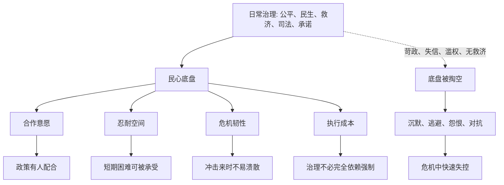

## 资治通鉴思维筑基课: 民心底盘律

### 作者
digoal

### 日期
2026-05-17

### 标签
民心底盘律 , 治理承载 , 组织信任 , 危机韧性 , 合作意愿 , 民心信用 , 公平 , 救济 , 长期合作 , 治理成本

----

## 背景

> 面向对象: 高中生到大学通识读者  
> 核心问题: 为什么一个政权或组织在平时看起来很强，遇到危机时却可能因为“底盘不稳”突然失控？  
> 先说结论: 民心底盘律说的是: 民心不是锦上添花的情绪支持，而是政权和组织承受压力的底盘。底盘稳，命令、制度和资源才能被真实执行；底盘空，外表再强也会在危机中快速露出裂缝。

## 一张图先看懂



## 求真讲法

### 它到底说了什么

“民心底盘律”说的是: 一个政权或组织能不能长期运行，不只看上层有没有权力、命令和制度，还要看下层是否愿意继续合作、忍耐和相信。

“底盘”这个比喻很好理解。车的发动机再强，如果底盘散了，速度越快越危险。政权或组织也是一样: 军队、法律、流程、预算、口号像发动机和外壳，民心则像底盘。它平时不一定最显眼，但决定系统能不能承重、转弯和过坑。

民心底盘由几种东西组成:

| 底盘要素 | 它回答的问题 | 如果缺失会怎样 |
|---|---|---|
| 可活 | 普通人是否有基本生路 | 逃亡、怨恨、对抗增加 |
| 公平 | 规则是否大体一致 | 服从意愿下降 |
| 可信 | 承诺是否稳定 | 说什么都被怀疑 |
| 可诉 | 受委屈是否有救济 | 私力报复和沉默离开增加 |
| 有望 | 未来是否还有改善可能 | 忍耐空间消失 |

所以这条定律不是说“得民心就不会出事”，而是说: **民心决定系统遇到压力时有多少承载力。**

### 它是怎么来的

民心底盘律来自“民心是政权的最终信用”这条底层公理。

如果民心是最终信用，那么这种信用在平时会表现为配合、纳税、服役、遵守规则、相信裁判；在危机时会表现为忍耐、互助、等待修复，而不是立刻逃散、隐瞒、抢夺或反抗。

《资治通鉴》反复写到，很多政权不是没有军队和官府才失败，而是在苛政、重役、滥刑、财政透支、救灾失败、用人失当长期累积后，百姓已经不再把现有秩序当作可依靠的东西。等到饥荒、战败、继承危机或叛乱出现时，原本隐藏的底盘问题突然显现。

这条定律也能解释现代组织。一个公司平时靠高压命令推动项目，员工虽然不说话，但心里已经不信管理层。等到业务下滑或加班加压时，离职、摆烂、沉默抵抗会集中爆发。问题看似是危机造成的，实则是底盘早已被掏空。

### 它依赖哪些假设

民心底盘律成立，需要几个前提:

1. 政权或组织需要成员持续合作。没有合作，命令和流程只能空转。
2. 成员有感受和记忆。公平、失信、伤害和救济都会被长期记录在心理账户中。
3. 危机会放大底盘差异。平时看不出的信任差距，在压力下会显现。
4. 强制力有成本上限。越不被信任，越需要高成本强制，最终难以持续。
5. 民心不是短期情绪，而是长期体验形成的稳定预期。

这些前提说明，民心底盘不是玄学，而是合作意愿、治理成本和危机韧性的合成指标。

### 常见误解

**误解一: 民心底盘就是讨好所有人。**  
不对。底盘稳不是人人都满意，而是大多数人认为秩序大体公平、可活、可信，困难时还有修复可能。

**误解二: 只要经济好，民心底盘就稳。**  
不一定。经济改善很重要，但如果规则不公、权力任性、救济无门，底盘仍可能变脆。

**误解三: 底盘看不见，所以不重要。**  
正相反。底盘平时不显眼，是因为它在默默承重；等它显眼时，往往已经出了大问题。

**误解四: 高压能替代民心。**  
高压能短期制造服从，但会提高长期治理成本。高压越常用，越说明底盘不足，也越可能继续伤害底盘。

## 求存讲法

### 它有什么用

民心底盘律能帮助我们判断一个系统是否有真正韧性。

不要只看表面指标:

1. 命令是否还能发出。
2. 会议是否还能召开。
3. 口号是否还很响。
4. 组织架构是否还完整。

还要看底盘指标:

1. 人们是否愿意说真话。
2. 规则是否被认为大体公平。
3. 受损者是否相信有救济。
4. 普通成员是否还愿意多做一点。
5. 危机来时，大家是互相补位，还是各自逃离。

底盘强的系统，危机中会出现自发配合；底盘弱的系统，危机中会出现集中算账。

### 它怎么迁移到熟悉领域

```text
政权民心底盘                 现代组织信任底盘
------------------------------------------------
百姓有基本生路               员工有基本安全感和发展空间
司法大体可信                 评价、申诉、复盘机制可信
赋税徭役不过度               任务负荷和资源投入大体匹配
灾荒时有救济                 困难时组织愿意支持成员
官吏不任意侵扰               管理者不随意改规则和甩锅
```

在班级里，底盘就是同学是否相信班规不是只管普通人、不管关系好的人。  
在公司里，底盘就是员工是否相信组织不会只在需要奉献时谈文化、分利益时谈成本。  
在家庭里，底盘就是成员是否相信遇到矛盾还能被听见，而不是只能忍着。

### 它的适用范围和边界

| 场景 | 是否适合使用民心底盘律 | 原因 |
|---|---|---|
| 国家治理、组织管理、团队协作 | 非常适合 | 都依赖长期合作和信任 |
| 危机管理、改革推进、政策执行 | 非常适合 | 底盘决定承压能力 |
| 学校班级、社团、家庭 | 适合 | 小组织也有信任底盘 |
| 一次性交易 | 谨慎使用 | 长期底盘作用较弱 |
| 高度专业的技术判断 | 不能替代专业标准 | 民心支持不等于技术正确 |

边界在于: 民心底盘律不能替代事实判断和专业判断。一个方案受欢迎，不代表它可行；一个必要改革一开始不受欢迎，也不代表它一定错误。关键是解释、承载、补偿和修复机制是否存在。

### 正例: 怎么用它提升能力

假设一个班级要推行新的手机管理规则。如果老师只宣布“以后发现一次就没收一周”，短期可能有效，但容易激起隐瞒和对抗。

更稳的做法是先加固底盘:

1. 说明目的: 保护课堂注意力，而不是羞辱学生。
2. 规则一致: 老师、班干部、成绩好的同学不能例外。
3. 留出边界: 紧急联系和必要学习使用有明确处理方式。
4. 设置申诉: 误判可以说明。
5. 定期复盘: 如果规则造成新问题，就公开调整。

这样规则不是单靠强制压下去，而是建立在“大家认为基本公平”的底盘上，执行成本会下降。

### 反例: 前提不成立会怎样

如果一次地震救援现场需要立刻决定撤离路线，负责人不能先花大量时间做满意度调查，争取所有人认可后再行动。

这里不是民心底盘不重要，而是紧急场景下必须先保护生命。正确做法是先集中指挥，事后解释依据、复盘得失、补偿受损者，以修复和巩固底盘。

这个反例说明: 民心底盘律强调长期承载力，不等于每个瞬间都要先取得所有人的情绪同意。

## 思考

民心底盘最容易被忽视，是因为它在正常时期不吵不闹。沉默可能是信任，也可能是失望；服从可能是认可，也可能是暂时没有选择。

真正的管理者和治理者不能只看“有没有反对声”，还要看普通人是否仍愿意真实合作。底盘坏掉的早期信号，往往不是公开反抗，而是敷衍、冷漠、隐瞒、离开和不再说真话。

可以继续追问:

1. 一个组织里，沉默到底是稳定，还是底盘变空？
2. 为什么很多管理者愿意加码强制，却不愿修复信任？
3. 改革如果短期损害一部分人，怎样避免伤到底盘？
4. 底盘被掏空后，靠一次宣传或奖励能不能补回来？

## 最后记住

1. 民心底盘律关注的是长期合作、忍耐空间、危机韧性和治理成本。
2. 民心不是讨好所有人，而是让多数人相信秩序大体公平、可活、可信、可修复。
3. 底盘稳，危机中会有自发配合；底盘空，危机中会集中逃避、对抗或算账。
4. 高压可以制造短期服从，但不能替代长期信用。
5. 这条定律适合分析持续合作系统；紧急处置和专业判断中不能机械套用。

## 参考资料

- 《尚书》
- 《孟子》
- 《荀子》
- 《论语》
- 司马光: 《资治通鉴》
- 钱穆: 《国史大纲》
- 吕思勉: 《中国通史》
- 本文基于通用中国思想史、政治哲学和组织治理常识整理，未联网检索；若用于严肃学术写作，应回到原典、注释本和专业研究文献校验。
  
#### [PostgreSQL 解决方案集合](../201706/20170601_02.md "40cff096e9ed7122c512b35d8561d9c8")
  
  
#### [德哥 / digoal's Github - 公益是一辈子的事.](https://github.com/digoal/blog/blob/master/README.md "22709685feb7cab07d30f30387f0a9ae")
  
  
#### [About 德哥](https://github.com/digoal/blog/blob/master/me/readme.md "a37735981e7704886ffd590565582dd0")
  
  

  
