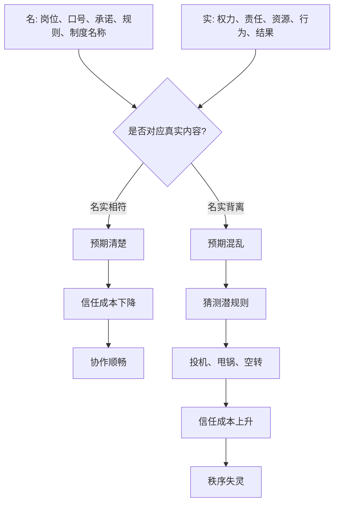

## 资治通鉴思维筑基课: 名实背离律

### 作者
digoal

### 日期
2026-05-17

### 标签
名实背离律 , 语言信用 , 有名无实 , 有实无名 , 名好实坏 , 组织空转 , 潜规则 , 权责错位 , 制度失信 , 治理风险

----

## 背景

> 面向对象: 高中生到大学通识读者  
> 核心问题: 为什么一个组织里，漂亮名称、正式岗位和真实运行一旦对不上，大家就会越来越不信规则？  
> 先说结论: 名实背离律说的是: 当名称、承诺、岗位、制度语言与真实权力、真实责任、真实效果长期不一致时，组织会进入高猜测、高甩锅、高空转状态。名还在，实已变，秩序就会从内部失去信用。

## 一张图先看懂



## 求真讲法

### 它到底说了什么

“名实背离律”是“名实相符是秩序的基础”这条底层公理的反面展开。

“名”是人们用来理解秩序的语言: 职位、头衔、制度、口号、承诺、规则、评价标准。  
“实”是这些语言背后的真实内容: 谁有权、谁负责、资源怎么分、规则怎么执行、最后产生什么结果。

名实背离，就是名和实长期对不上。常见有三类:

| 背离类型 | 一句话解释 | 典型表现 |
|---|---|---|
| 有名无实 | 名称还在，真实功能没有了 | 名义负责人不能决策，只能背锅 |
| 有实无名 | 没有正式名义，却掌握真实权力 | 幕后拍板者不承担公开责任 |
| 名好实坏 | 名称很好听，真实效果相反 | “减负”变成更多表格，“服务”变成控制 |

名实背离最伤人的地方，不只是某个词不准确，而是它会让所有人不再相信公共语言。大家听到“公开”“公平”“负责”“改革”“服务”，不再按字面理解，而是先猜背后有什么真实目的。

### 它是怎么来的

这条定律来自中国思想史中长期讨论的“名实”问题。

孔子讲“正名”，关心的是名分和行为是否对应。法家讲“循名责实”，关心的是根据职位和承诺检查真实结果。两者立场不同，但都承认: 复杂秩序必须依赖稳定语言。如果语言不能指向现实，协作就会变成猜谜。

《资治通鉴》中，名实背离反复出现。君主名义上掌天下，实际可能被权臣、外戚、宦官或藩镇架空；臣子名义上忠君报国，实际可能结党营私；改革名义上救弊，实际可能增加民间负担；赏罚名义上按功过，实际可能按亲疏。

这条定律被采用，是因为它能解释一种很常见的衰败:

**组织不是没有规则，而是规则的名字还在，真实作用已经反过来了。**

### 它依赖哪些假设

名实背离律成立，需要几个前提:

1. 组织依赖共同语言协作。没有稳定名称，复杂分工无法运行。
2. 名称会创造预期。人们会根据“负责人”“公开”“公平”“奖励”等词来安排行动。
3. 预期落空会损害信任。一次落空可解释，长期落空会让语言失信。
4. 真实权力可能隐藏。掌握实权者不一定有公开名义，也未必承担责任。
5. 人会适应潜规则。当名实长期不符，人们会学会按真实利益行动，而不是按公开规则行动。

这些前提说明，名实背离律不是文字洁癖，而是组织信用问题。

### 常见误解

**误解一: 名实背离只是宣传问题。**  
不对。宣传只是表层。真正问题是权责、资源、行为和结果不对齐。

**误解二: 改个名字就能解决名实背离。**  
不够。改名必须伴随真实权力、责任和流程调整。否则只是制造新一轮背离。

**误解三: 只要结果好，名实不符也没关系。**  
短期可能没关系，长期会破坏可预期性。别人不知道下次该信名称、信人情，还是信潜规则。

**误解四: 名实相符就是不能有愿景。**  
不对。愿景可以高于现实，但必须承认它是目标，而不是假装已经实现。

## 求存讲法

### 它有什么用

名实背离律能帮助我们识别组织里的“语言失信”。

当你看到下面这些现象，就要警惕:

1. 说是负责人，却没有授权。
2. 说是公开透明，却看不到依据。
3. 说是按贡献奖励，却总是奖励会表演的人。
4. 说是改革优化，却让一线负担更重。
5. 说是集体决策，实际早有人定调。
6. 说是服务对象，实际让对象围着流程转。

这些问题如果长期存在，大家就会停止相信制度语言，转而研究潜规则。组织成本会急剧上升。

### 它怎么迁移到熟悉领域

```text
名实相符:
说负责 -> 有权决策 -> 有资源执行 -> 对结果负责

名实背离:
说负责 -> 无权决策 -> 无资源执行 -> 出事背锅

名实相符:
说公开 -> 信息可见 -> 依据可查 -> 结果可复核

名实背离:
说公开 -> 只给结论 -> 不给依据 -> 不能质疑
```

在学习中，说“我复习了”，如果只是翻书，没有理解、练习和纠错，就是名实背离。  
在班级中，说“公平评优”，如果标准临时变化，就是名实背离。  
在公司中，说“用户第一”，如果内部考核只奖励短期收入，就是名实背离。  
在公共治理中，说“依法办事”，如果执行标准因人而异，就是名实背离。

### 它的适用范围和边界

| 场景 | 是否适合使用名实背离律 | 原因 |
|---|---|---|
| 岗位职责、考核评价、政策承诺 | 非常适合 | 名实不符会直接损害信任 |
| 改革、组织调整、公共服务 | 非常适合 | 名称容易掩盖真实效果 |
| 学习目标和自我管理 | 适合 | 能防止自我欺骗 |
| 文学隐喻、玩笑、临时称呼 | 不宜机械使用 | 语言本来就不追求治理对应 |
| 探索期新项目 | 适度使用 | 可以先试验，但要及时校准定义 |

边界在于: 名实背离律不是要求每个词都僵硬精确，而是要求凡是用于分配权力、责任、资源和评价的语言，必须对应真实内容。

### 正例: 怎么用它提升能力

假设一个团队要推行“项目负责人制”。如果只是给某个人贴上“负责人”标签，却不给他排期权、协调权和资源信息，最后项目失败还让他承担全部责任，这就是有名无实。

更好的做法是:

1. 明确负责人可以决定哪些事项。
2. 明确哪些资源可以调用。
3. 明确成员各自交付内容。
4. 明确重大变更需要谁确认。
5. 明确项目结束后如何复盘责任和贡献。

这样“负责人”这个名才有真实内容。名实相符后，组织协作会减少猜测和甩锅。

### 反例: 前提不成立会怎样

如果几个朋友开玩笑称某人为“今天的队长”，只是因为他走在最前面，没有真实权力、资源分配和责任后果，却非要追究“队长名实是否相符”，就会把轻松语境过度制度化。

失败原因在于: 这个名称没有进入真实治理和协作结构，不承担权责分配功能。名实背离律适用于影响权责、资源、评价和承诺的语言，不适用于所有玩笑和隐喻。

## 思考

名实背离最危险的地方，是它会让人慢慢失去对语言的信任。

当“负责”意味着背锅，“公平”意味着看关系，“公开”意味着只公布结论，“改革”意味着增加负担，“服务”意味着控制流程，组织还能说很多正确的话，但这些话已经很难组织真实行动。

可以继续追问:

1. 一个组织里，哪些词听起来很正确，却已经没有人相信？
2. 为什么人们明知道名实不符，还愿意维持漂亮名称？
3. 名实背离时，应该先改名，还是先改真实权责？
4. 谁从名实背离中获益，谁承担名实背离的成本？

## 最后记住

1. 名实背离律关注名称、承诺、岗位和规则语言是否对应真实权力、责任、资源和结果。
2. 有名无实会制造背锅，有实无名会逃避责任，名好实坏会污染语言信用。
3. 名实背离的长期后果，是大家不再相信公开规则，转而研究潜规则。
4. 修复名实背离不能只改口号，要重新对齐权力、责任、资源、流程和结果。
5. 这条定律适用于权责和公共承诺场景，不适合机械套用到玩笑、隐喻和低风险称呼。

## 参考资料

- 《论语》
- 《荀子》
- 《韩非子》
- 《礼记》
- 司马光: 《资治通鉴》
- 钱穆: 《国史大纲》
- 吕思勉: 《中国通史》
- 本文基于通用中国思想史、政治哲学和组织治理常识整理，未联网检索；若用于严肃学术写作，应回到原典、注释本和专业研究文献校验。
  
#### [PostgreSQL 解决方案集合](../201706/20170601_02.md "40cff096e9ed7122c512b35d8561d9c8")
  
  
#### [德哥 / digoal's Github - 公益是一辈子的事.](https://github.com/digoal/blog/blob/master/README.md "22709685feb7cab07d30f30387f0a9ae")
  
  
#### [About 德哥](https://github.com/digoal/blog/blob/master/me/readme.md "a37735981e7704886ffd590565582dd0")
  
  

  
