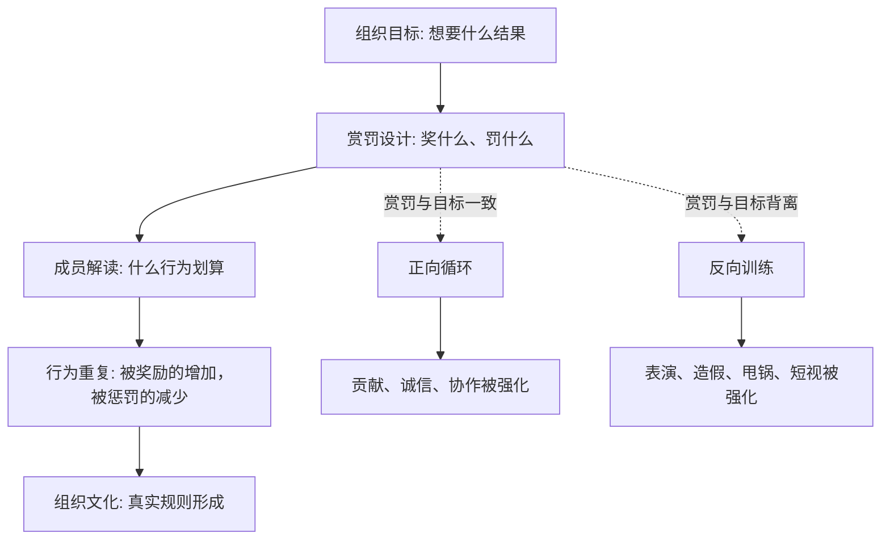

## 资治通鉴思维筑基课: 赏罚信号律

### 作者
digoal

### 日期
2026-05-17

### 标签
赏罚信号律 , 激励机制 , 奖惩设计 , 组织行为 , 信号系统 , 绩效管理 , 行为塑造 , 名实相符 , 人性有欲 , 治理工具

----

## 背景

> 面向对象: 高中生到大学通识读者  
> 核心问题: 为什么一个组织嘴上说重视什么不重要，真正奖励和惩罚什么才最重要？  
> 先说结论: 赏罚信号律说的是: 奖励会告诉人们“什么行为值得重复”，惩罚会告诉人们“什么行为必须避免”。如果赏罚和真实目标不一致，组织就会训练出与口号相反的行为。

## 一张图先看懂



## 求真讲法

### 它到底说了什么

“赏罚信号律”说的是: 一个组织真正鼓励什么，不看它墙上写什么，而看它实际奖励什么、惩罚什么、忽视什么。

赏，是奖励、晋升、表扬、资源倾斜、机会分配。  
罚，是批评、降级、扣分、追责、边缘化、资源减少。  
信号，是成员从赏罚中读出的真实规则。

比如一个班级说“重视诚实”，但作弊被发现后只是轻轻带过，认真学习的人反而被忽视，学生就会读到另一个信号: 诚实不重要，成绩表面好看更重要。

一个公司说“重视长期价值”，但只奖励短期销售额，不追究虚假承诺，员工就会读到信号: 先把数字做上去，后果以后再说。

所以这条定律的核心是:

**赏罚不是事后评价，而是在提前训练人的行为。**

### 它是怎么来的

赏罚信号律来自两个底层公理。

第一，人性有欲，不能只靠道德想象。人会关注收益、损失、荣誉、风险和机会。组织奖励什么、惩罚什么，会影响人的选择。

第二，名实相符是秩序的基础。如果口号说一套，赏罚做一套，名和实就会背离。时间久了，成员会相信赏罚，不再相信口号。

中国传统政治思想中，法家特别重视赏罚分明，认为赏罚是治理的重要工具。儒家虽然更重视德性和教化，也不否认赏罚会塑造风气。《资治通鉴》中，军政成败也常与赏罚是否公正有关: 有功不赏，士气会散；有罪不罚，法度会坏；赏罚看亲疏不看功过，组织就会转向投机和依附。

这条定律被采用，是因为它能解释一个常见现象:

**为什么很多组织反复强调正确价值观，却不断产生相反行为。**

答案往往是: 口号发出的信号弱，赏罚发出的信号强。

### 它依赖哪些假设

赏罚信号律成立，需要几个前提:

1. 成员会观察收益和代价。人不只听命令，也会看什么行为被奖励。
2. 赏罚具有可见性。别人看到谁被奖、谁被罚，才会形成公共信号。
3. 成员会重复有效行为。哪种行为带来好处，哪种行为就更容易扩散。
4. 组织目标需要通过行为实现。目标不能只靠口号，必须落到日常选择。
5. 赏罚可能被误读。奖励指标如果设计粗糙，成员会优化指标而不优化真实目标。

这些前提说明，赏罚信号不是小事，而是组织行为的方向盘。

### 常见误解

**误解一: 赏罚越重越有效。**  
不对。赏罚重但不公，会制造恐惧和投机；赏罚轻但稳定、公正，也能形成强信号。

**误解二: 有制度就等于赏罚分明。**  
不对。制度写了不执行，或选择性执行，发出的信号反而是“规则可以被绕过”。

**误解三: 只奖励结果，不看过程，更有效率。**  
短期可能有效，长期可能诱导造假、压榨、甩锅和冒险。结果重要，但过程决定结果是否可持续。

**误解四: 惩罚能解决所有问题。**  
惩罚只能告诉人们不要做什么，不能自动告诉人们应该怎么做。好的赏罚要同时强化正确行为。

## 求存讲法

### 它有什么用

赏罚信号律能帮助我们看懂组织真正的价值排序。

不要只看组织说:

1. 我们重视诚信。
2. 我们重视协作。
3. 我们重视长期主义。
4. 我们重视用户。

要看组织实际做:

1. 造假的人有没有付代价？
2. 说真话的人有没有被保护？
3. 真正协作的人有没有被看见？
4. 只做表面数字的人有没有被奖励？
5. 短期损害长期的人有没有被纠正？

真实赏罚会比正式口号更快塑造行为。

### 它怎么迁移到熟悉领域

```text
口号: 我们重视学习
赏罚: 只表扬分数，不表扬订正和提问
信号: 分数比理解重要

口号: 我们重视协作
赏罚: 抢功的人晋升，补位的人隐形
信号: 表现自己比帮助团队重要

口号: 我们重视创新
赏罚: 失败就追责，保守不出错反而安全
信号: 不要冒险，少做少错
```

在学习中，如果你只奖励自己“学了多久”，而不奖励“真正弄懂多少”，你会训练出耗时间而不是解决问题。  
在班级中，如果只惩罚吵闹但不奖励安静自律，管理会越来越依赖惩罚。  
在公司中，如果只奖励短期指标，不惩罚透支用户信任的行为，长期价值就会被系统性牺牲。

### 它的适用范围和边界

| 场景 | 是否适合使用赏罚信号律 | 原因 |
|---|---|---|
| 班级管理、公司绩效、公共治理 | 非常适合 | 赏罚会持续塑造行为 |
| 团队协作、项目管理、家庭教育 | 适合 | 奖惩反馈会形成习惯 |
| 创造性探索 | 谨慎使用 | 过度奖惩会压制试错 |
| 道德成长和亲密关系 | 谨慎使用 | 不能把所有关系都交易化 |
| 一次性偶发事件 | 适度使用 | 信号效应较弱 |

边界在于: 赏罚不是万能工具。它适合塑造可观察、可重复的行为，但不适合替代信任、意义、教育和内在动机。

### 正例: 怎么用它提升能力

假设你想养成稳定学习习惯。只奖励“今天学了三小时”，可能会训练出坐在书桌前发呆。更好的赏罚信号应该对准真实目标:

1. 奖励完成一组错题复盘。
2. 奖励把一个概念讲清楚。
3. 奖励主动问出一个关键问题。
4. 对拖延设置小代价，比如减少娱乐时间。
5. 每周检查是否真的解决了薄弱点。

这样你奖励的不是“看起来努力”，而是“学习系统真的变强”。

### 反例: 前提不成立会怎样

如果朋友因为关心你而陪你散步，你却马上设计积分、奖惩、排名和惩罚机制，可能会破坏关系。

失败原因在于: 这个场景主要靠情感、信任和自愿，不是靠持续绩效管理。把赏罚信号律机械套到亲密关系里，会让本来温暖的互动变成交易。

这说明赏罚信号律适合管理公共行为和重复协作，但不能替代所有人际关系中的真诚和信任。

## 思考

赏罚信号最可怕的地方，是它常常比语言诚实。

一个组织可以每天说重视长期价值，但如果每次都奖励短期数字，它就在训练短视。一个班级可以说重视诚实，但如果作弊成本很低，它就在训练侥幸。一个人可以说重视健康，但如果每天用熬夜换娱乐，他也在给自己发信号: 健康可以以后再说。

可以继续追问:

1. 你所在的班级、团队或公司，真正奖励的是什么？
2. 哪些被口头批评的行为，实际却一直带来好处？
3. 哪些真正有价值的行为，因为没有被看见而正在减少？
4. 如果把一个组织的口号全部遮住，只看赏罚，你会判断它真正重视什么？

## 最后记住

1. 赏罚不是事后评价，而是在提前训练人的行为。
2. 奖励告诉人们什么值得重复，惩罚告诉人们什么必须避免。
3. 口号和赏罚不一致时，成员通常会相信赏罚，而不是相信口号。
4. 好赏罚要公正、稳定、可见，并且对准真实目标而不是表面指标。
5. 赏罚适合塑造公共行为和重复协作，但不能替代信任、教育和内在动机。

## 参考资料

- 《韩非子》
- 《论语》
- 《荀子》
- 《礼记》
- 司马光: 《资治通鉴》
- 钱穆: 《国史大纲》
- 吕思勉: 《中国通史》
- 本文基于通用中国思想史、政治哲学、行为激励和组织治理常识整理，未联网检索；若用于严肃学术写作，应回到原典、注释本和专业研究文献校验。
  
#### [PostgreSQL 解决方案集合](../201706/20170601_02.md "40cff096e9ed7122c512b35d8561d9c8")
  
  
#### [德哥 / digoal's Github - 公益是一辈子的事.](https://github.com/digoal/blog/blob/master/README.md "22709685feb7cab07d30f30387f0a9ae")
  
  
#### [About 德哥](https://github.com/digoal/blog/blob/master/me/readme.md "a37735981e7704886ffd590565582dd0")
  
  

  
