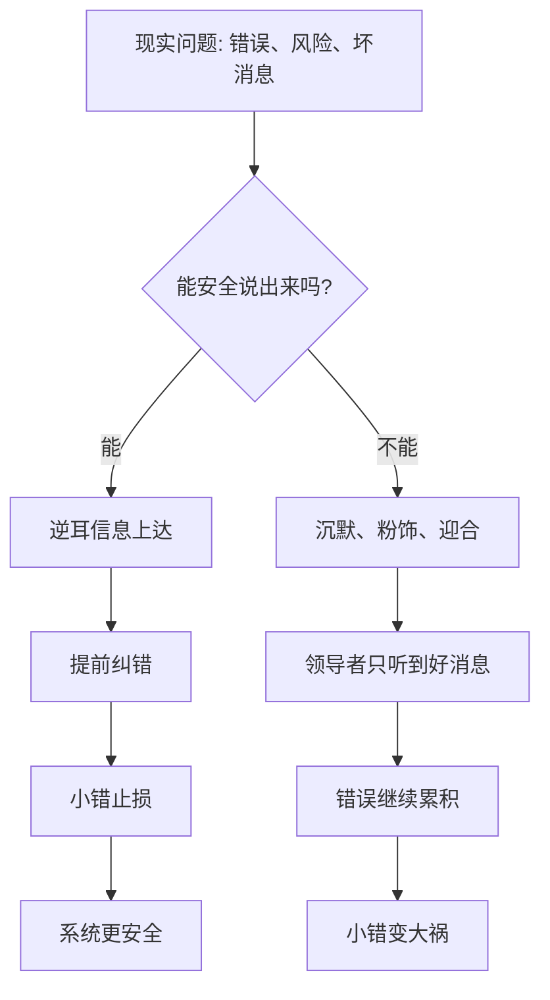

## 资治通鉴思维筑基课: 纳谏安全律

### 作者
digoal

### 日期
2026-05-17

### 标签
纳谏安全律 , 逆耳信息 , 反馈机制 , 纠错能力 , 心理安全 , 权力约束 , 坏消息 , 组织复盘 , 真实信息 , 决策安全

----

## 背景

> 面向对象: 高中生到大学通识读者  
> 核心问题: 为什么一个领导者或组织越听不到逆耳真话，越容易在看似稳定中走向大错？  
> 先说结论: 纳谏安全律说的是: 一个系统能否安全接收反对意见、坏消息和纠错提醒，决定了错误能否在小阶段被发现。说真话有安全，错误就早暴露；说真话有代价，错误就会被沉默保护，直到变成大灾难。

## 一张图先看懂



## 求真讲法

### 它到底说了什么

“纳谏安全律”说的是: 一个组织真正的安全，不只来自领导者聪明，也来自别人能不能安全地指出他的盲点。

“纳谏”不是简单听建议。它特别指听到不舒服、不顺耳、可能挑战权威的意见。比如:

1. 这个决策有风险。
2. 这个数据不真实。
3. 这个人不适合重用。
4. 这个政策基层承受不了。
5. 领导者自己的判断可能错了。

“安全”也不是说提意见的人永远正确，而是说他不会因为诚实指出问题而被羞辱、报复、边缘化或扣帽子。

这条定律的核心是:

**组织最需要听到的信息，往往正是最难听、最容易被压下去的信息。**

### 它是怎么来的

纳谏安全律可以看作从两条底层公理推出的上层定律。

第一，权力天然会扩张，必须被名分和法度约束。权力越高，越容易屏蔽不舒服的信息；身边人越可能迎合，越不敢说逆耳话。

第二，治乱不是偶然，是长期因果的显现。很多大错不是一天形成的，而是在早期没人敢说、说了没人听、听了不纠正中慢慢累积。

中国传统政治思想长期重视“谏”。《资治通鉴》中，君主能否听谏，经常关系到政策得失、用人安危和国家兴衰。唐太宗与魏征常被视为正面样本，不是因为魏征永远正确，而是因为最高权力旁边存在一个能提出逆耳意见的通道。

这条定律也能解释现代组织。很多公司失败前，并不是没有人知道问题，而是知道问题的人不敢说，敢说的人没人听，听见的人不愿改。

### 它依赖哪些假设

纳谏安全律成立，需要几个前提:

1. 领导者或核心决策者不可能全知。信息、经验和视角都有盲区。
2. 下层或旁观者常掌握关键局部信息。问题最早出现的地方，往往离最高决策者很远。
3. 说逆耳话有社会成本。可能得罪人、破坏气氛、影响评价和升迁。
4. 权力会影响信息流。人们会根据领导者反应决定以后说真话还是说好话。
5. 错误越早纠正，成本越低。小问题阶段能说出来，系统就有机会低成本修复。

这些前提说明，纳谏不是礼貌问题，而是信息安全和纠错机制问题。

### 常见误解

**误解一: 纳谏就是谁提意见都要采纳。**  
不对。纳谏是让意见能被听见、被认真判断，不是让所有意见都变成决策。

**误解二: 会听好话的人也算纳谏。**  
不算。真正检验纳谏能力的，是面对反对、质疑、坏消息和指出自己错误时的反应。

**误解三: 提意见的人态度不好，所以可以不听。**  
态度会影响沟通，但不能因此跳过事实判断。成熟系统要区分“表达方式不舒服”和“内容有没有价值”。

**误解四: 只要领导者胸怀宽广就够了。**  
不够。还要有制度化通道，比如记录、复盘、匿名反馈、异议保护和责任分离。不能只靠个人气量。

## 求存讲法

### 它有什么用

纳谏安全律能帮助我们判断一个组织有没有真实纠错能力。

不要只看会议上有没有人发言，还要看:

1. 有没有人敢讲坏消息？
2. 讲坏消息的人后来有没有被惩罚？
3. 反对意见是否会被记录和复盘？
4. 领导者是否会公开承认自己改过判断？
5. 组织是否区分“忠诚反对”和“恶意拆台”？

如果一个组织里所有人都只报喜不报忧，表面和气，实际危险。

### 它怎么迁移到熟悉领域

```text
低安全纳谏环境:
发现问题 -> 不敢说 -> 私下抱怨 -> 问题扩大 -> 出事追责

高安全纳谏环境:
发现问题 -> 能说出 -> 被判断 -> 及时修正 -> 小错止损
```

在班级里，如果学生指出班规不公平就被说“找借口”，以后大家就会沉默。  
在公司里，如果工程师提醒质量风险却被说“阻碍进度”，产品事故就会越来越近。  
在家庭里，如果孩子表达真实困难就被否定，父母听到的就只剩表面顺从。  
在公共治理中，如果基层只敢报好数字，不敢报真实困难，政策就会越来越脱离现实。

### 它的适用范围和边界

| 场景 | 是否适合使用纳谏安全律 | 原因 |
|---|---|---|
| 政策制定、公司管理、项目复盘 | 非常适合 | 都需要真实信息纠错 |
| 安全生产、医疗、工程质量 | 必须使用 | 坏消息越早暴露越能救命 |
| 班级管理、家庭沟通 | 适合 | 安全表达能减少长期误解 |
| 紧急现场指挥 | 谨慎使用 | 可先执行命令，但要保留关键风险提醒 |
| 恶意造谣或人身攻击 | 不适用 | 纳谏保护事实和理性，不保护破坏性攻击 |

边界在于: 纳谏安全不是放任无根据指责，也不是让所有决策都无限讨论。它保护的是基于事实、风险和责任的真实反馈。

### 正例: 怎么用它提升能力

假设一个小组准备公开展示。组长已经定了方案，但一个成员发现资料有明显错误。如果他说出来会被嫌麻烦，他可能选择沉默，最后展示时全组出错。

更好的做法是建立纳谏安全:

1. 组长提前说: 发现错误必须讲，指出问题不等于否定别人。
2. 所有关键资料在提交前留出检查时间。
3. 反对意见要说清依据和风险。
4. 如果意见正确，及时修改并感谢提醒。
5. 如果意见不采纳，也说明理由。

这样组员会把发现问题当成贡献，而不是冒犯。小组就能在错误变大前修正。

### 反例: 前提不成立会怎样

如果有人在紧急撤离时反复提出没有事实依据的质疑，阻碍人群离开危险区域，还说“你们必须纳谏”，这就是误用。

失败原因在于: 紧急场景下，时间窗口极短，且质疑缺少事实依据。正确做法是允许关键风险提醒，但不能让无根据争论阻断救命行动。

这说明纳谏安全律保护真实风险信息，不保护无责任、无依据、无限拖延的表达。

## 思考

纳谏安全最难的地方，是权力者往往以为自己“愿意听”，但下属判断的是“说完以后会怎样”。

一次发怒、一次报复、一次让说真话的人吃亏，就足以让很多人学会沉默。后来领导者听不到真话，不一定是大家没有意见，而是系统已经训练大家不要说。

可以继续追问:

1. 一个组织里，谁最早知道坏消息？他敢不敢说？
2. 领导者说“欢迎批评”之后，真正批评的人后来过得怎么样？
3. 如何区分忠诚的反对意见和情绪化破坏？
4. 如果所有会议都一团和气，这是共识，还是沉默？

## 最后记住

1. 纳谏安全律关注的是逆耳信息能否安全上达。
2. 说真话安全，小错就能早暴露；说真话有代价，错误会被沉默保护。
3. 纳谏不是所有意见都采纳，而是让真实风险被听见、被判断、被记录。
4. 只靠领导者胸怀不够，还需要反馈通道、异议保护、复盘机制和纠错责任。
5. 这条定律保护基于事实和责任的反馈，不保护无依据攻击和无限拖延。

## 参考资料

- 司马光: 《资治通鉴》
- 《论语》
- 《孟子》
- 《荀子》
- 《韩非子》
- 《贞观政要》
- 钱穆: 《国史大纲》
- 吕思勉: 《中国通史》
- 本文基于通用中国思想史、政治哲学和组织治理常识整理，未联网检索；若用于严肃学术写作，应回到原典、注释本和专业研究文献校验。
  
#### [PostgreSQL 解决方案集合](../201706/20170601_02.md "40cff096e9ed7122c512b35d8561d9c8")
  
  
#### [德哥 / digoal's Github - 公益是一辈子的事.](https://github.com/digoal/blog/blob/master/README.md "22709685feb7cab07d30f30387f0a9ae")
  
  
#### [About 德哥](https://github.com/digoal/blog/blob/master/me/readme.md "a37735981e7704886ffd590565582dd0")
  
  

  
