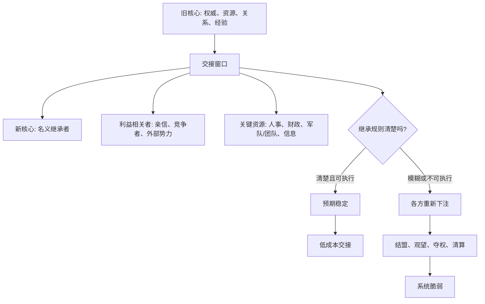

## 资治通鉴思维筑基课: 继承脆弱律

### 作者
digoal

### 日期
2026-05-17

### 标签
继承脆弱律 , 权力交接 , 接班机制 , 合法性 , 资源交接 , 组织传承 , 关键岗位 , 继任风险 , 制度化交接 , 权力预期

----

## 背景

> 面向对象: 高中生到大学通识读者  
> 核心问题: 为什么政权、公司、社团或家庭企业在“换人接班”的时候，最容易出乱子？  
> 先说结论: 继承脆弱律说的是: 权力、资源和合法性从旧核心转移到新核心时，系统会短暂进入高不确定状态。规则越不清、利益越大、监督越弱、候选人越多，继承越脆弱。

## 一张图先看懂



## 求真讲法

### 它到底说了什么

“继承脆弱律”说的是: 一个系统最危险的时刻，常常不是正常运行时，而是核心权力交接时。

这里的“继承”，不只指皇位继承。它也包括公司换 CEO、项目换负责人、社团换主席、家族企业交班、关键岗位交接、技术系统移交、班级干部换届。

继承为什么脆弱？因为它同时牵动四件事:

| 交接内容 | 问题 | 风险 |
|---|---|---|
| 权力 | 谁能拍板 | 多头指挥、架空、夺权 |
| 资源 | 谁掌握人财物和信息 | 截留资源、重新站队 |
| 合法性 | 大家凭什么承认新人 | 不服、观望、阳奉阴违 |
| 责任 | 出问题谁承担 | 甩锅、清算、推诿 |

正常时期，权力关系比较固定，大家知道谁说了算。继承时期，旧权威正在下降，新权威还没完全站稳，各方都会重新判断: 我该听谁？我支持谁？我会不会被清算？机会是不是来了？

这就是继承脆弱的根本原因: **交接不是简单换名字，而是权力预期的重新定价。**

### 它是怎么来的

继承脆弱律可以从几条底层公理推出。

第一，权力天然会扩张，必须被名分和法度约束。继承时，如果名分不清、法度不稳，权力竞争就会浮出水面。

第二，人性有欲，不能只靠道德想象。继承关系到位置、资源、安全和前途，各方不可能只靠自觉克制。

第三，名实相符是秩序的基础。如果名义继承人没有真实权力，或实际掌权者没有正式责任，就会出现有名无实、有实无名。

《资治通鉴》中，宫廷废立、幼主继位、外戚干政、宦官专权、权臣辅政、藩镇割据，都常常发生在继承或交接窗口。不是因为古人特别喜欢争斗，而是因为最高权力交接把平时隐藏的利益结构暴露出来。

现代组织也一样。一个创始人长期凭个人权威推动公司，如果没有制度化授权、清晰接班人和稳定团队结构，创始人一退，原本被个人威望压住的矛盾就会爆发。

### 它依赖哪些假设

继承脆弱律成立，需要几个前提:

1. 被交接的位置有真实权力。没有资源和影响力的小角色，继承风险较低。
2. 旧核心曾经承担关键整合作用。很多关系、信息和信任绑定在旧核心身上。
3. 新核心尚未建立足够信用。名义接任不等于真实服从。
4. 继承会改变利益分配。有人受益，有人失势，有人担心被清算。
5. 规则需要被各方相信并执行。规则写着是一回事，关键时刻能不能压住私心是另一回事。

这些前提说明，继承脆弱不是“换人就一定乱”，而是高权力、高资源、高不确定的交接最容易乱。

### 常见误解

**误解一: 选一个能力强的人接班就够了。**  
不够。能力强很重要，但继承还需要合法性、团队承认、资源交接、制度支持和旧核心退出方式。

**误解二: 继承问题只属于古代王朝。**  
不对。任何依赖核心人物、关键岗位和资源控制的组织，都会遇到继承问题。

**误解三: 交接越快越好。**  
不一定。太慢会拖出派系和观望，太快会造成信息断裂和信任不足。关键是节奏清楚、边界清楚。

**误解四: 老人继续掌控可以保证稳定。**  
短期可能稳定，长期可能让新人有名无实，团队不知道该听谁，反而延长脆弱期。

## 求存讲法

### 它有什么用

继承脆弱律能帮助我们提前识别交接风险。

看到一个组织准备换负责人时，不要只问“新人是谁”，还要问:

1. 继承规则是否提前明确？
2. 旧负责人如何退出，是否继续干预？
3. 新负责人是否掌握必要资源？
4. 关键成员是否承认新权威？
5. 原有利益格局会如何变化？
6. 如果出现争议，谁有最终裁决权？

如果这些问题没有答案，交接就不是完成了，只是开始暴露风险。

### 它怎么迁移到熟悉领域

```text
脆弱继承:
旧核心突然退出 -> 新核心只有头衔 -> 资源不清 -> 各方观望 -> 矛盾爆发

稳健继承:
提前培养候选人 -> 明确授权边界 -> 公开交接资源 -> 关键人确认 -> 逐步建立信用
```

在班级里，班干部换届如果只宣布新班长，却不交接资料、规则和老师支持，新班长会很难做事。  
在公司里，老负责人离开后，如果客户关系、预算权限、团队信任都没有交接，新负责人只有职位名，没有真实权力。  
在家庭企业里，如果父辈不明确交班规则，子女、亲属和老员工都可能重新站队。

### 它的适用范围和边界

| 场景 | 是否适合使用继承脆弱律 | 原因 |
|---|---|---|
| 政权更替、公司接班、家族企业传承 | 非常适合 | 权力、资源和合法性高度集中 |
| 项目负责人交接、社团换届 | 适合 | 需要信息、关系和责任连续 |
| 技术系统运维交接 | 适合 | 隐性知识断裂会造成风险 |
| 低风险临时任务换人 | 不宜过度使用 | 权力和资源影响很小 |
| 纯个人技能传授 | 谨慎使用 | 更多是学习问题，不一定是权力问题 |

边界在于: 继承脆弱律不是说所有交接都危险。风险大小取决于权力大小、资源集中度、规则清晰度和组织对旧核心的依赖程度。

### 正例: 怎么用它提升能力

假设一个社团主席准备毕业，需要交接给下一任。稳健做法不是临走前宣布名字，而是提前降低继承脆弱性:

1. 提前三个月确定候选人，并让候选人参与核心会议。
2. 公开说明换届规则，避免私下猜测。
3. 交接预算、账号、合作方、活动资料和未完成事项。
4. 让老主席逐步退出日常决策，只保留咨询角色。
5. 关键成员公开确认新主席的授权。
6. 第一个月设置复盘机制，帮助新人建立信用。

这样做的核心，是把“个人权威”转化为“制度化交接”，让新核心不只是有名义，也有真实资源和承认。

### 反例: 前提不成立会怎样

如果只是同学轮流擦黑板，今天甲擦、明天乙擦，任务简单、资源很少、没有长期权力结构，却用继承脆弱律设计复杂的候选人培养、权力确认和交接仪式，就是过度套用。

失败原因在于: 这个场景没有高权力、高资源、高不确定性。交接成本超过了任务本身。

这说明继承脆弱律主要用于关键位置、长期组织和高影响资源，不适合压到所有轮换小事上。

## 思考

继承问题最难的地方，是很多组织在核心人物还在时看起来很稳定。其实那可能不是制度稳定，而是个人威望暂时压住了矛盾。

真正稳健的系统，不是永远依赖某个强人，而是强人离开后，规则、人才、信息和信任仍能继续运转。

可以继续追问:

1. 一个组织的稳定，来自制度，还是来自某个人的个人权威？
2. 新人接班时，最难继承的是职位、资源，还是信任？
3. 老人退而不退，会怎样影响新人的真实权威？
4. 如果继承只能靠临终指定或突然宣布，说明制度哪里薄弱？

## 最后记住

1. 继承脆弱律关注权力、资源、合法性和责任交接时的高不确定性。
2. 继承不是换名字，而是权力预期、资源控制和组织信任的重新分配。
3. 规则不清、候选人多、利益大、监督弱，继承就更脆弱。
4. 稳健继承需要提前培养、公开规则、资源交接、旧核心退出和新核心建立信用。
5. 这条定律适用于关键岗位和长期组织，不适合过度套用到低风险轮换小事。

## 参考资料

- 司马光: 《资治通鉴》
- 《论语》
- 《孟子》
- 《荀子》
- 《韩非子》
- 《礼记》
- 钱穆: 《国史大纲》
- 吕思勉: 《中国通史》
- 本文基于通用中国思想史、政治哲学和组织治理常识整理，未联网检索；若用于严肃学术写作，应回到原典、注释本和专业研究文献校验。
  
#### [PostgreSQL 解决方案集合](../201706/20170601_02.md "40cff096e9ed7122c512b35d8561d9c8")
  
  
#### [德哥 / digoal's Github - 公益是一辈子的事.](https://github.com/digoal/blog/blob/master/README.md "22709685feb7cab07d30f30387f0a9ae")
  
  
#### [About 德哥](https://github.com/digoal/blog/blob/master/me/readme.md "a37735981e7704886ffd590565582dd0")
  
  

  
