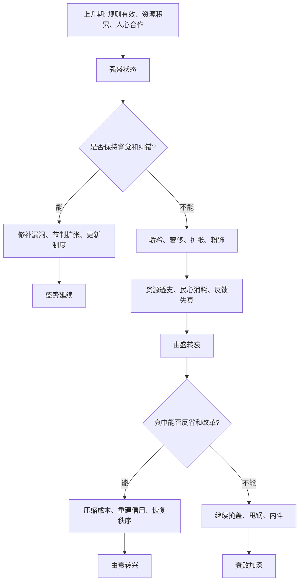

## 资治通鉴思维筑基课: 盛衰转化律

### 作者
digoal

### 日期
2026-05-17

### 标签
盛衰转化律 , 历史周期 , 长期因果 , 危机韧性 , 资源透支 , 反馈失真 , 纠错机制 , 组织发展 , 兴衰逻辑 , 反周期警觉

----

## 背景

> 面向对象: 高中生到大学通识读者  
> 核心问题: 为什么一个国家、组织或个人在最顺的时候，反而可能开始埋下衰败的种子？  
> 先说结论: 盛衰转化律说的是: 盛不是静止的成功，衰也不是永远的失败。盛极时容易产生骄矜、透支、迟钝和制度松弛；衰落时如果能暴露问题、压缩幻想、重新校准，也可能出现转机。

## 一张图先看懂



## 求真讲法

### 它到底说了什么

“盛衰转化律”说的是: 盛和衰不是两个固定标签，而是可以互相转化的过程。

一个系统为什么会盛？通常因为它在某段时间里做对了一些事: 用人较当、财政可支撑、赏罚较明、人心较稳、制度能纠错、外部环境也有利。

但盛本身会改变人的判断。资源多了，容易扩大开支；胜利多了，容易轻敌；赞美多了，容易听不进坏消息；制度运行久了，容易形式化；旧成功路径有效久了，容易被当成永远有效。

所以盛中会生出衰因:

| 盛的条件 | 可能转化出的衰因 |
|---|---|
| 资源充足 | 奢侈、浪费、扩张冲动 |
| 威望很高 | 听不进反对意见 |
| 制度稳定 | 僵化、惯性、形式主义 |
| 成功经验丰富 | 迷信旧打法 |
| 外部压力较小 | 警觉下降、风险积累 |

反过来，衰也不是没有机会。衰落会暴露真实问题，迫使系统节制、反省、改革和重新选择。如果能承认问题、修正赏罚、恢复信用、重建能力，衰中也可能出现新生。

### 它是怎么来的

盛衰转化律可以从两条底层公理推出。

第一，治乱不是偶然，是长期因果的显现。盛不是凭空而来，衰也不是突然降临，它们都来自长期因果积累。

第二，时势有力量，智慧必须顺势而为。盛衰本质上是时势变化。聪明的治理者要在盛时看到风险，在衰时看到修复窗口。

中国历史叙事中，盛衰转化反复出现。《资治通鉴》写历代兴亡，一个重要价值就是让人看到“盛世后期”如何因为奢侈、边功、用人、财政、谏路堵塞和民生压力逐渐变形。唐玄宗前期开元之治，后期转入骄奢、用人失当和边镇坐大，最终安史之乱爆发，就是常被用来理解盛衰转化的例子。

这条定律被采用，是因为它能解释一个反直觉现象:

**最危险的衰败，常常不是发生在最困难时，而是开始于最顺利时。**

### 它依赖哪些假设

盛衰转化律成立，需要几个前提:

1. 系统有时间连续性。今天的成功会影响明天的心态、制度和资源配置。
2. 成功会改变激励。强盛会带来更多资源，也带来更多诱惑和错觉。
3. 反馈机制可能失真。越成功，越容易只听到赞美和好消息。
4. 资源有承载上限。扩张、开支和承诺不能无限增长。
5. 衰落也会释放信息。困难会暴露过去被遮住的问题。

这些前提说明，盛衰转化不是神秘循环，而是激励、资源、反馈和时势变化共同作用的结果。

### 常见误解

**误解一: 盛极必衰是宿命。**  
不对。盛中有衰因，不等于一定衰。能否纠错、节制和更新，决定盛势能否延续。

**误解二: 衰落一定会带来改革。**  
不一定。衰落只会暴露问题，不会自动解决问题。如果继续掩盖、内斗和甩锅，衰会更深。

**误解三: 保持强盛就是继续扩大。**  
不对。有时真正的强盛恰恰来自节制，知道什么不能做、哪里不能透支。

**误解四: 过去成功的方法永远有效。**  
不对。时势变化后，旧方法可能从优势变成负担。成功经验需要复盘，不应该被神化。

## 求存讲法

### 它有什么用

盛衰转化律能训练一种“反周期警觉”。

顺利时，不只问“为什么成功”，还要问:

1. 成功是否掩盖了成本？
2. 有没有人敢说坏消息？
3. 资源是否被透支？
4. 旧打法是否仍适合新环境？
5. 是否开始奖励表演而不是真实贡献？

困难时，也不只问“谁害了我们”，还要问:

1. 衰落暴露了什么真实问题？
2. 哪些开支、承诺和流程必须收缩？
3. 哪些旧习惯必须停止？
4. 哪些信任可以重新修复？
5. 有没有新的窗口正在出现？

### 它怎么迁移到熟悉领域

```text
个人成长中的盛衰转化:
成绩上升 -> 自信增强 -> 放松复盘 -> 错题积累 -> 成绩下滑
成绩下滑 -> 暴露短板 -> 重建方法 -> 稳定训练 -> 再次上升

组织管理中的盛衰转化:
业务增长 -> 资源变多 -> 流程膨胀 -> 反馈变慢 -> 危机出现
业务承压 -> 削减虚耗 -> 聚焦核心 -> 修复信任 -> 找到新增长点
```

在学习中，考得好之后如果停止复盘，优势会变成松懈。  
在公司中，增长快之后如果盲目扩张，收入增长可能掩盖成本失控。  
在国家治理中，长期安定之后如果听不进逆耳话，稳定本身可能让风险被低估。

### 它的适用范围和边界

| 场景 | 是否适合使用盛衰转化律 | 原因 |
|---|---|---|
| 国家兴亡、组织发展、个人成长 | 非常适合 | 都存在长期积累和反馈变化 |
| 企业周期、项目管理、团队士气 | 适合 | 成功和失败都会改变行为 |
| 短期随机比赛结果 | 谨慎使用 | 可能只是偶然波动 |
| 自然灾害等外部冲击 | 需要结合分析 | 外部冲击和内部承载力都要看 |
| 稳定重复的小任务 | 不宜过度使用 | 盛衰转化不明显 |

边界在于: 盛衰转化律不是万能循环论。它适合分析有连续性、反馈机制和资源承载的系统，不适合把所有波动都解释成必然盛衰。

### 正例: 怎么用它提升能力

假设你连续几次考试进步，很容易觉得方法已经没问题。此时如果用盛衰转化律，就要主动检查“盛中的衰因”:

1. 是真的理解了，还是题型刚好熟悉？
2. 错题是否变少，还是只是没遇到难题？
3. 作息是否稳定，还是靠短期透支？
4. 有没有开始轻视基础题？
5. 有没有人能指出你的薄弱点？

如果你能在顺利时复盘和修正，就能把短期进步变成长期能力，而不是让成功变成下一次退步的原因。

### 反例: 前提不成立会怎样

如果一次抽奖中了奖，下一次没中，就说这是“盛衰转化”，其实是误用。

失败原因在于: 抽奖主要是随机事件，没有持续行为、制度反馈和资源承载机制。盛衰转化律要求系统有连续因果，不能把纯随机波动解释成深层规律。

这说明使用这条定律时，要先确认: 这里是否存在长期积累、反馈变化和承载边界。

## 思考

盛衰转化最难的地方，是人在盛时最不愿相信风险，在衰时最容易只想找替罪羊。

真正成熟的判断，是在顺境中保持冷静，在逆境中保持结构分析。盛时能节制，衰时能修复，才不会被一时状态牵着走。

可以继续追问:

1. 你现在拥有的优势，是否正在制造某种盲点？
2. 哪些成功经验已经变成惯性负担？
3. 一个组织最顺利时，谁还能安全地说坏消息？
4. 衰落暴露的问题，是偶然问题，还是长期问题终于显现？

## 最后记住

1. 盛和衰不是固定标签，而是可以互相转化的过程。
2. 盛中容易产生骄矜、扩张、反馈失真和资源透支，这些就是衰因。
3. 衰中会暴露真实问题，如果能节制、纠错和重建信用，也可能出现转机。
4. 盛极必衰不是宿命，关键看能否在盛时保持纠错，在衰时承认现实。
5. 这条定律适合分析有长期因果和反馈机制的系统，不适合解释纯随机波动。

## 参考资料

- 司马光: 《资治通鉴》
- 《论语》
- 《孟子》
- 《荀子》
- 《老子》
- 《孙子兵法》
- 钱穆: 《国史大纲》
- 吕思勉: 《中国通史》
- 本文基于通用中国思想史、历史哲学和组织治理常识整理，未联网检索；若用于严肃学术写作，应回到原典、注释本和专业研究文献校验。
  
#### [PostgreSQL 解决方案集合](../201706/20170601_02.md "40cff096e9ed7122c512b35d8561d9c8")
  
  
#### [德哥 / digoal's Github - 公益是一辈子的事.](https://github.com/digoal/blog/blob/master/README.md "22709685feb7cab07d30f30387f0a9ae")
  
  
#### [About 德哥](https://github.com/digoal/blog/blob/master/me/readme.md "a37735981e7704886ffd590565582dd0")
  
  

  
