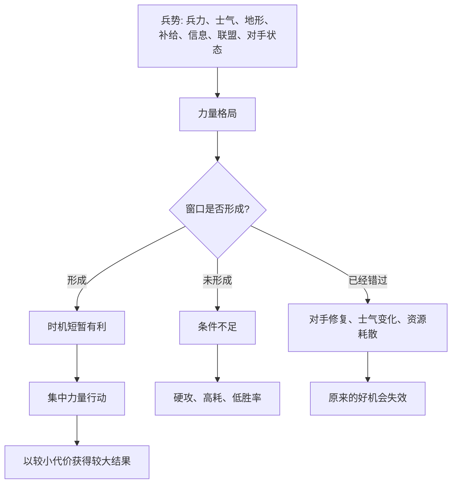

## 资治通鉴思维筑基课: 兵势窗口律

### 作者
digoal

### 日期
2026-05-17

### 标签
兵势窗口律 , 兵家思想 , 行动窗口 , 战略时机 , 力量配置 , 士气 , 补给 , 竞争策略 , 顺势而为 , 决策节奏

----

## 背景

> 面向对象: 高中生到大学通识读者  
> 核心问题: 为什么同样的行动，有时能以小胜大，有时却会变成硬碰硬的消耗？  
> 先说结论: 兵势窗口律说的是: 胜负不只取决于力量大小，还取决于力量是否在合适时间、合适位置、合适状态下集中释放。兵势形成窗口时，小力可以撬动大结果；窗口未成或已过，强行动手也可能失败。

## 一张图先看懂



## 求真讲法

### 它到底说了什么

“兵势窗口律”说的是: 在战争和竞争中，力量不是静止数字。真正决定行动效果的，是力量在某个短暂窗口里的组合状态。

“兵”不只指士兵数量，也包括装备、训练、组织、补给、士气、指挥、信息。  
“势”是这些因素形成的合力。  
“窗口”是适合行动的时间段。它可能很短，错过后条件就变了。

例如，表面上强的一方，如果内部不稳、士气低、补给长、指挥混乱，可能在某个窗口中变得可击。表面上弱的一方，如果地形有利、士气高、目标集中、对手轻敌，也可能抓住窗口反败为胜。

所以这条定律的核心是:

**行动不是越早越好，也不是越晚越稳，而是要在力量组合最有利的窗口出手。**

### 它是怎么来的

兵势窗口律来自兵家对“势”和“机”的重视，也可以看作“时势有力量，智慧必须顺势而为”的军事化展开。

《孙子兵法》强调“势”“虚实”“奇正”“先胜而后求战”，意思不是迷信技巧，而是先让力量格局变得有利，再进入决战。真正高明的行动，不是靠蛮力硬拼，而是通过等待、诱导、分化、集中、奇袭、断补给等方式，让对方在某个窗口变弱，让自己在某个窗口变强。

《资治通鉴》中许多战争成败，也不能只看双方人数。淝水之战常被讨论，就是因为前秦虽强，但内部整合不足、战线远、士气和协同存在问题；东晋虽弱，却抓住了对方阵势松动和心理崩溃的窗口。具体细节需回到史料考证，但它很适合说明: 强弱不是静态数字，窗口会改变力量的实际效果。

这条定律被采用，是因为它能解释一个常见现象:

**为什么有些胜利看似突然，其实是窗口成熟；有些失败看似可惜，其实是窗口未成或已失。**

### 它依赖哪些假设

兵势窗口律成立，需要几个前提:

1. 力量不是单一数量。人数、资源、士气、信息、位置、组织都会影响胜率。
2. 条件会快速变化。今天有利，明天可能消失；今天不利，等待后可能转化。
3. 行动有不可逆成本。出手后会消耗资源、暴露意图、改变对手反应。
4. 对手也会调整。窗口不会永远等待，敌我都在变化。
5. 判断存在不确定性。所谓窗口不是绝对确定，而是在有限信息中判断胜率和代价。

这些前提说明，兵势窗口律不是赌博，而是对条件组合和行动时机的判断。

### 常见误解

**误解一: 兵势窗口就是等机会。**  
不对。窗口有时要等，有时要造。分化对手、积累资源、改变地形、争取联盟，都是造势。

**误解二: 抓窗口就是冒险。**  
不准确。真正的窗口不是凭冲动出手，而是条件组合已经显著改善，行动风险低于继续等待风险。

**误解三: 强者不需要窗口。**  
不对。强者也会因补给、士气、轻敌、内部矛盾而失败。强者无视窗口，容易把优势变成消耗。

**误解四: 弱者只能等待窗口。**  
也不对。弱者更需要主动造势，比如集中局部优势、避开正面硬拼、寻找对手裂缝。

## 求存讲法

### 它有什么用

兵势窗口律能帮助我们判断“什么时候该出手，什么时候该蓄势”。

行动前可以问七个问题:

1. 我的核心力量是什么？
2. 对手或问题的薄弱点在哪里？
3. 现在的士气、资源和信息是否支持行动？
4. 如果立刻行动，最大代价是什么？
5. 如果等待，窗口会变大还是消失？
6. 能不能先做一件小事改变力量格局？
7. 有没有局部胜利可以代替全面硬拼？

这些问题能防止两个错误: 条件不足时硬冲，条件成熟时迟疑。

### 它怎么迁移到熟悉领域

```text
军事兵势窗口                 学习/工作中的对应
------------------------------------------------
兵力集中                     时间、注意力、能力集中
士气高涨                     团队信心、个人状态良好
补给充足                     预算、资料、工具、支持到位
敌方松动                     竞争者失误、难题出现突破口
地形有利                     渠道、平台、考试题型、项目位置有利
战机短暂                     报名期、发布期、政策窗口、市场空档
```

在学习中，考前最后一周不是适合全面重学的窗口，而是适合查漏补缺、稳定节奏的窗口。  
在项目中，如果用户需求刚刚明确、团队资源也到位，就是推进关键功能的窗口。  
在创业中，如果技术成熟、旧方案失效、用户痛点强烈、竞争者还没反应过来，就可能出现兵势窗口。

### 它的适用范围和边界

| 场景 | 是否适合使用兵势窗口律 | 原因 |
|---|---|---|
| 战争、竞争、谈判、创业 | 非常适合 | 都有对手、资源和时机变化 |
| 考试备考、项目推进、职业选择 | 适合 | 行动窗口会影响收益 |
| 长期价值修炼 | 谨慎使用 | 不能把所有成长都变成短期战机 |
| 道德底线问题 | 不适用作借口 | 窗口不能取消是非判断 |
| 纯随机事件 | 不宜使用 | 没有稳定势能可判断 |

边界在于: 兵势窗口律解决的是行动时机和力量配置，不解决价值正当性。不能因为“有窗口”就做不该做的事。

### 正例: 怎么用它提升能力

假设你准备参加一次演讲比赛。硬冲的做法是临近比赛才随便背稿，靠临场发挥。

用兵势窗口律，可以这样设计:

1. 先识别战场: 评分看内容、表达、台风还是问答。
2. 集中兵力: 把最多时间投入最能拉开差距的部分。
3. 建立补给: 找老师或同学提前反馈。
4. 侦察对手: 了解常见优秀作品的结构。
5. 抓住窗口: 在比赛前三天不再大改主题，只做节奏和问答训练。
6. 避免错窗: 比赛前夜不熬夜重写全文，防止状态崩掉。

这里的“兵势”不是打仗，而是让时间、注意力、反馈和状态在关键窗口里形成合力。

### 反例: 前提不成立会怎样

如果一个人把所有日常学习都理解成“等窗口”，平时不积累，考试前才说要抓战机，这就是误用。

失败原因在于: 窗口需要基础力量支撑。没有平时训练、资料积累和能力底座，窗口来了也抓不住。兵势窗口律不是替代长期积累，而是让长期积累在合适时机集中释放。

这说明: **没有势，窗口只是幻想；没有窗口，势也可能被浪费。**

## 思考

兵势窗口最难的地方，是它通常不会写着“现在就是机会”。太早行动，条件不足；太晚行动，对手已经修复；犹豫不决，窗口就会关闭。

真正的智慧，是在长期积累中保持等待能力，在窗口出现时保持行动能力。

可以继续追问:

1. 你现在面对的问题，是该硬攻，还是该先造势？
2. 你以为的机会，是条件成熟，还是只是情绪冲动？
3. 哪些资源如果不提前准备，窗口出现时也用不上？
4. 你所在的团队有没有能力在窗口出现时快速集中力量？

## 最后记住

1. 兵势窗口律关注力量、状态、位置和时间窗口的组合。
2. 胜负不只看资源多少，还看资源是否在合适窗口集中释放。
3. 窗口可以等待，也可以通过分化、积累、集中和试探来创造。
4. 没有长期积累，窗口来了也抓不住；没有窗口判断，积累可能被低效消耗。
5. 这条定律适合竞争和行动时机判断，不能替代价值底线和长期修炼。

## 参考资料

- 《孙子兵法》
- 《吴子》
- 《司马法》
- 司马光: 《资治通鉴》
- 《老子》
- 钱穆: 《国史大纲》
- 吕思勉: 《中国通史》
- 本文基于通用兵家思想、历史哲学和组织决策常识整理，未联网检索；若用于严肃学术写作，应回到原典、注释本和专业研究文献校验。
  
#### [PostgreSQL 解决方案集合](../201706/20170601_02.md "40cff096e9ed7122c512b35d8561d9c8")
  
  
#### [德哥 / digoal's Github - 公益是一辈子的事.](https://github.com/digoal/blog/blob/master/README.md "22709685feb7cab07d30f30387f0a9ae")
  
  
#### [About 德哥](https://github.com/digoal/blog/blob/master/me/readme.md "a37735981e7704886ffd590565582dd0")
  
  

  
