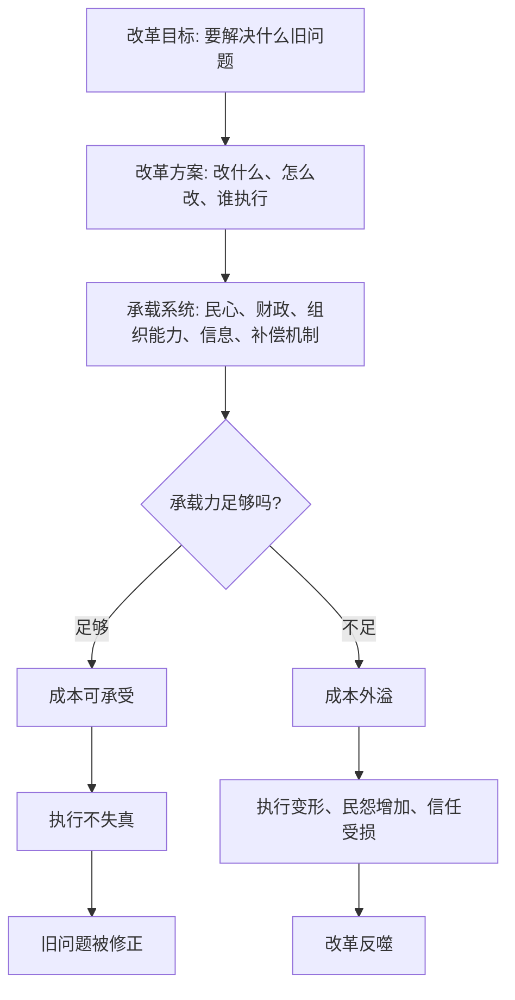

## 资治通鉴思维筑基课: 改革承载律

### 作者
digoal

### 日期
2026-05-17

### 标签
改革承载律 , 组织变革 , 民心承载 , 财政承载 , 执行能力 , 改革节奏 , 补偿机制 , 试点反馈 , 治理改革 , 承载力

----

## 背景

> 面向对象: 高中生到大学通识读者  
> 核心问题: 为什么有些改革目标看起来正确，却会因为推进过急、成本过高或执行失真而失败？  
> 先说结论: 改革承载律说的是: 改革不只要看方向是否正确，还要看社会、人心、财政、组织能力和执行系统能否承受。超过承载力的改革，会从解决问题变成制造新问题。

## 一张图先看懂



## 求真讲法

### 它到底说了什么

“改革承载律”说的是: 改革不是把一个正确目标写出来就算完成。改革要穿过真实世界，真实世界有承载上限。

承载力至少包括五个方面:

| 承载维度 | 它问的问题 | 如果不足会怎样 |
|---|---|---|
| 民心承载 | 被影响的人是否觉得大体可忍、可懂、可期待 | 抵触、怨恨、逃避、对抗 |
| 财政承载 | 钱、粮、预算和资源是否支撑得住 | 半途而废、加重负担、变相搜刮 |
| 组织承载 | 执行者是否有能力、时间和工具 | 层层加码、形式主义、执行走样 |
| 信息承载 | 决策者是否知道真实情况 | 好政策错配真实场景 |
| 补偿承载 | 受损者是否有过渡和救济 | 局部痛苦变成系统性反弹 |

因此，改革承载律的核心不是反对改革，而是反对不看承载力的改革。

**方向正确，只说明值得做；承载足够，才说明做得下去。**

### 它是怎么来的

改革承载律可以从几条底层公理推出。

第一，民心是政权的最终信用。改革会重新分配成本和利益，如果让太多人觉得无路可走，民心信用会被快速消耗。

第二，名实相符是秩序的基础。改革名义上减负、救弊、富国、强兵，但实际如果增加负担、制造混乱，就是名好实坏。

第三，治乱不是偶然，是长期因果的显现。改革失败通常不是一个口号失败，而是财政、执行、利益、信息和节奏长期错配后的集中暴露。

《资治通鉴》中，王莽改制常被当作反面样本。许多措施名义上复古、均平、救弊，但现实中制度设计、执行能力、社会承载和利益结构严重错配，结果加剧混乱。这里不是说所有改革都错，而是说明: 改革若脱离承载系统，越用力越可能反噬。

### 它依赖哪些假设

改革承载律成立，需要几个前提:

1. 改革会改变利益分配。有人受益，也有人承担成本。
2. 执行系统不是完美机器。政策到基层可能被误读、加码、简化或扭曲。
3. 人心有忍耐上限。人们可以承受短期痛苦，但需要理解、希望和补偿。
4. 财政和资源有限。改革需要成本，不能只计算收益，不计算过渡成本。
5. 旧制度虽有问题，也可能承担某些稳定功能。拆旧之前要知道它曾经支撑了什么。

这些前提说明，改革不是纸面设计，而是对真实系统做手术。

### 常见误解

**误解一: 讲承载力就是保守。**  
不对。真正负责的改革一定要评估承载力。承载力评估不是阻止改变，而是提高改变成功率。

**误解二: 只要目标正确，痛苦都值得。**  
不一定。痛苦如果没有边界、没有补偿、没有解释、没有结果，就会损害信任，让正确目标失去执行基础。

**误解三: 改革失败说明改革方向一定错。**  
不一定。方向可能对，但节奏、方法、执行和补偿错了。

**误解四: 承载力不足就什么都不能改。**  
也不对。可以先试点、分阶段、降低成本、补齐能力、建立反馈，再扩大改革。

## 求存讲法

### 它有什么用

改革承载律能帮助我们判断一个改变方案是否真正可执行。

推动改革前，不要只问“要不要改”，还要问:

1. 谁承担成本，谁获得收益？
2. 受影响者是否理解为什么改？
3. 执行者有没有足够能力和时间？
4. 有没有试点和反馈机制？
5. 失败或误伤时如何纠偏？
6. 过渡期由谁提供补偿和支持？

这些问题能防止改革从“解决旧问题”变成“制造新负担”。

### 它怎么迁移到熟悉领域

```text
低承载改革:
目标正确 -> 立刻全面推开 -> 执行者不懂 -> 一线负担加重 -> 抵触增加

高承载改革:
目标明确 -> 小范围试点 -> 发现真实成本 -> 调整方案 -> 分阶段扩大
```

在班级里，突然要求所有人每天额外完成大量作业，目标可能是提高成绩，但如果时间承载不足，会造成敷衍和抄袭。  
在公司里，推行新流程如果不减少旧流程，只是叠加表格，就会变成“改革增负”。  
在家庭里，想让孩子自律，如果同时制定十几条新规则，孩子可能不是变自律，而是变抵触。

### 它的适用范围和边界

| 场景 | 是否适合使用改革承载律 | 原因 |
|---|---|---|
| 政策改革、组织变革、流程重构 | 非常适合 | 都涉及成本转移和执行能力 |
| 学习计划、家庭规则、团队制度 | 适合 | 小系统也有承载上限 |
| 紧急止损 | 谨慎使用 | 有时必须先止血，再补承载 |
| 纯理念讨论 | 适度使用 | 理念可讨论，但落地仍要看承载 |
| 低成本个人习惯微调 | 不宜过度复杂化 | 小改动不需要重型评估 |

边界在于: 承载力不是借口。不能因为有人不适应，就永远不改。关键是区分“必要阵痛”和“系统超载”。

### 正例: 怎么用它提升能力

假设一个班级想提高数学成绩。直接把作业量翻倍，可能短期看起来更努力，实际会超过学生时间承载，导致抄答案、睡眠不足和厌学。

更好的改革设计是:

1. 先诊断问题: 是基础概念弱，还是计算慢，还是题型不熟？
2. 小范围试点: 先让一组学生试行错题分层复盘。
3. 控制成本: 减少重复作业，换成高质量订正。
4. 建立反馈: 每周看错题减少情况，而不是只看作业页数。
5. 分阶段推广: 证明有效后再扩大到全班。

这个方案不是不改革，而是让改革穿过真实承载系统。

### 反例: 前提不成立会怎样

如果只是个人决定每天早起十分钟，成本很低、影响范围很小、失败也容易调整，却花大量时间做复杂承载评估，可能会拖延行动。

失败原因在于: 这个改变是低风险、低成本、可快速试错的小改动。改革承载律适合高影响、多主体、难逆转的变化，不适合把微小行动复杂化。

这说明使用这条定律时，要看改革规模、影响范围、逆转成本和受影响人数。

## 思考

改革最难的地方，是正确目标常常会让人低估真实成本。人们容易相信“只要方向对，大家就应该支持”，却忘了现实中的人要承受时间、金钱、身份、习惯和安全感的变化。

真正成熟的改革，不是只会批判旧制度，而是知道旧制度为什么能存在、改它会伤到哪里、谁会承担过渡成本、怎样避免执行变形。

可以继续追问:

1. 一个改革方案中，谁的成本最容易被忽视？
2. 改革名义上解决的问题，是否会在执行中变成新问题？
3. 是制度本身错了，还是执行系统承载不了？
4. 如果先试点而不是全面推开，会暴露哪些真实成本？

## 最后记住

1. 改革承载律关注目标、节奏、成本、执行能力和人心承受力是否匹配。
2. 方向正确不等于能落地，承载足够才说明改革做得下去。
3. 超过承载力的改革，会诱发执行变形、民心受损、财政透支和信任下降。
4. 好改革通常需要试点、反馈、分阶段推进、补偿机制和纠偏机制。
5. 这条定律适用于高影响、多主体、难逆转的改变；低成本小改动不必过度复杂化。

## 参考资料

- 司马光: 《资治通鉴》
- 《论语》
- 《孟子》
- 《荀子》
- 《韩非子》
- 《礼记》
- 钱穆: 《国史大纲》
- 吕思勉: 《中国通史》
- 本文基于通用中国思想史、政治哲学、组织变革和治理常识整理，未联网检索；若用于严肃学术写作，应回到原典、注释本和专业研究文献校验。
  
#### [PostgreSQL 解决方案集合](../201706/20170601_02.md "40cff096e9ed7122c512b35d8561d9c8")
  
  
#### [德哥 / digoal's Github - 公益是一辈子的事.](https://github.com/digoal/blog/blob/master/README.md "22709685feb7cab07d30f30387f0a9ae")
  
  
#### [About 德哥](https://github.com/digoal/blog/blob/master/me/readme.md "a37735981e7704886ffd590565582dd0")
  
  

  
