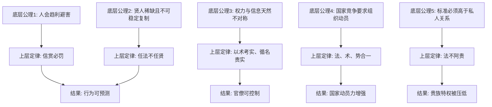

## 法家思维筑基课: 中国法家思想的底层公理和经典上层定律

### 作者
digoal

### 日期
2026-05-18

### 标签
法家 , 法家思想 , 底层公理 , 上层定律 , 法术势 , 赏罚 , 治理模型 , 先秦思想 , 韩非 , 制度设计

----

## 背景

> 面向对象: 高中生到大学低年级读者  
> 核心问题: 法家为什么总在谈法、术、势、赏罚、君权，而不是先谈道德感化？  
> 先说结论: 先秦法家把国家看成一个需要稳定运行的治理机器。它的底层公理是: 人会趋利避害，权力会被私心扭曲，单靠贤人和道德不可靠，所以必须用公开的法、可检验的术、不可私分的势来塑造行为。

本文讨论的是先秦法家思想的“理论模型”，主要以商鞅、慎到、申不害、韩非为代表，尤其是韩非对“法、术、势”的综合。它不是现代意义上的法治理论，也不等同于秦朝全部政治实践。

## 一张图先看懂



## 求真讲法

### 它到底说了什么

法家思想不是一句“严刑峻法”就能概括。更准确地说，它是一套关于国家治理的制度工程学:

1. 人不是不能讲道德，而是不能把国家秩序建立在“人人自觉”上。
2. 君主不是天然聪明，而是必须掌握制度位置和考核工具。
3. 官员不是天然忠诚，而是要被明确职责、公开标准和赏罚机制约束。
4. 法不是现代意义上的权利保障体系，而是统一命令、分配责任、塑造行为的治理标准。

所以法家的核心不是“喜欢惩罚”，而是“不相信松散的人情、血缘、贵族身份、道德号召能够稳定治理大国”。

### 它是怎么来的

法家兴起于战国时代。那时诸侯竞争激烈，战争规模扩大，人口、土地、军队、粮食、赋税都需要更高程度的组织。旧的宗法贵族秩序已经难以支撑这种竞争。

可以把它的形成动机理解成一个问题:

```text
春秋以前: 贵族身份 + 礼乐秩序 + 熟人政治
              ↓  战争扩大、国家变大、流动增强
战国问题: 如何治理大量陌生人、官僚、军队和资源？
              ↓
法家答案: 用统一规则、职位权威、绩效考核和赏罚激励取代身份特权
```

韩非后来把几条法家传统合并起来:

| 来源 | 关键词 | 解决的问题 |
|---|---|---|
| 商鞅 | 法、赏罚、耕战、变法 | 怎样把民众动员到国家目标上 |
| 申不害 | 术、官僚考核 | 怎样防止官员欺上瞒下 |
| 慎到 | 势、位置权威 | 为什么制度位置比个人贤能更稳定 |
| 韩非 | 法术势合一 | 怎样形成完整的君主集权治理模型 |

### 它依赖哪些假设

这里说“公理”，不是说它们是永恒真理，而是说: 在法家体系内部，这些假设通常不再被证明，而是被当作制度设计的出发点。

**公理一: 人性以趋利避害为可治理的最低共同点。**

法家并不一定否认人有情义和道德，但它认为治理不能押注于高尚动机。制度要抓住多数人都会有的行为机制: 想获得利益，避免损害。

**公理二: 贤人稀缺，且不可稳定复制。**

如果治理依赖圣君贤臣，那么问题会变成“怎样保证每一代都有圣君贤臣”。法家的回答是: 不能保证。所以要让普通才能的人也能在制度中按规则运行。

**公理三: 官僚会利用信息差谋私。**

上级看不到全部真实情况，下级掌握具体执行信息。法家因此重视“术”: 通过名实核验、职责分离、暗中考察等方法控制官员。

**公理四: 国家竞争优先要求秩序、资源和动员能力。**

战国不是一个和平学术沙龙，而是高压竞争环境。谁能征税、征兵、组织生产、统一命令，谁更可能存活。

**公理五: 私人关系会腐蚀公共标准。**

亲疏、贵贱、门第、人情都会让规则失效。法家强调“法不阿贵”，意思是标准不能因为身份高贵就弯曲。

### 经典上层定律

下面这些“上层定律”可以理解为: 如果接受上面的公理，法家自然会推出的治理原则。

| 上层定律 | 来自哪些公理 | 核心意思 | 典型表达 |
|---|---:|---|---|
| 信赏必罚 | 公理一、四 | 奖惩必须确定、及时、可预期 | 有功必赏，有过必罚 |
| 法不阿贵 | 公理五 | 法令标准不能向贵族和权臣让步 | 刑过不避大臣，赏善不遗匹夫 |
| 任法不任贤 | 公理二 | 制度比个人品德更可靠 | 不把治理押在贤人出现上 |
| 循名责实 | 公理三 | 官员说了什么、职责是什么，就按实际结果核验 | 名实相符才算合格 |
| 二柄不可失 | 公理三、四 | 君主必须掌握赏与罚两种核心权柄 | 赏罚是控制臣下的两个把手 |
| 法、术、势合一 | 公理二、三、四 | 公开规则、官僚技术、职位权威必须互相配合 | 有法无术会被官员架空，有术无势不能执行 |
| 以法为教，以吏为师 | 公理四、五 | 用国家法令统一知识和行为标准 | 减少多元解释对命令系统的冲击 |
| 事功优先 | 公理一、四 | 评价政治不看辞令和身份，而看可检验结果 | 功劳、产出、军功、秩序 |

### 常见误解

**误解一: 法家等于现代法治。**

不对。现代法治强调限制公权力、保护权利、程序正义和法律面前人人平等。先秦法家的“法”更多是君主治理国家的工具，重点是统一命令和控制臣民。

**误解二: 法家只会用暴力。**

不完整。法家确实重视刑罚，但更核心的是“可预期的激励结构”。赏和罚必须成对出现。只有罚没有赏，会削弱动员；只有赏没有罚，会失去约束。

**误解三: 法家完全否认道德。**

也不准确。法家的重点是: 道德可以存在，但不能作为大规模治理的唯一支柱。它关心的是低信任环境下怎样让秩序仍然可运行。

**误解四: 法家一定高效。**

不一定。法家模型在战争动员、官僚控制、规则统一上可能很强，但如果缺少纠错机制、权力制衡和社会信任，它也可能制造恐惧、压抑创新，并把错误命令放大成系统灾难。

## 求存讲法

### 它有什么用

法家思想的原生用途，是帮助战国国家完成三件事:

1. 打破贵族世袭特权，让国家能直接控制人口、土地和军队。
2. 通过统一法令和赏罚，把民众行为引向耕战、纳税、服役等国家目标。
3. 通过术和势，让君主控制官僚系统，减少权臣架空。

它的长处在于: 当组织很大、成员互不熟悉、目标高度竞争、执行链条很长时，不能只靠“大家自觉”，必须建立可检查、可奖惩、可执行的机制。

### 它怎么迁移到熟悉领域

把法家思想迁移到现代组织时，不能照搬君主集权和严刑峻法，但可以抽取一个中性的管理洞察:

```text
好愿望  ≠  好结果
好人品  ≠  稳定执行
口头承诺 ≠  真实绩效

可见目标 + 清晰职责 + 过程核验 + 稳定奖惩 + 纠错机制
        才更接近可复制的组织能力
```

例如班级小组做项目:

| 场景 | 只靠自觉 | 借鉴法家的中性部分 |
|---|---|---|
| 分工 | “大家看着办” | 每个人有明确任务和截止时间 |
| 检查 | 到最后才发现没人做 | 每两天检查一次阶段成果 |
| 奖惩 | 做多做少都一样 | 贡献记录进入最终评分 |
| 责任 | 出问题互相甩锅 | 任务和负责人一一对应 |
| 纠错 | 关系好就不好意思指出 | 用公开标准讨论问题 |

### 它的适用范围和边界

法家模型在这些条件下更有效:

1. 组织目标明确，比如征税、修渠、军功、生产、安全。
2. 成员数量大，彼此不熟，不能靠熟人关系协调。
3. 行为结果可以被观察和考核。
4. 外部竞争压力高，需要快速统一行动。

但它在这些条件下容易失效:

1. 目标本身复杂，无法用单一指标衡量。
2. 创新、学术、艺术、科学探索需要试错和自由讨论。
3. 上级可能犯错，却没有反馈、制衡和纠错通道。
4. 奖惩过重，导致人们只求避责，开始隐瞒坏消息。
5. 法令服务于个人权力，而不是公共秩序。

### 正例: 怎么用它提升能力

假设你想提高数学成绩。只说“我要努力”很像靠道德自觉，容易失败。借鉴法家的中性部分，可以这样设计:

1. **法:** 每天完成 20 道基础题和 3 道错题复盘，这是公开规则。
2. **术:** 每周检查错题类型，不看“我感觉懂了”，只看错误率是否下降。
3. **势:** 给学习环境设置权威位置，比如固定时间、固定桌面、手机放远。
4. **赏罚:** 连续完成五天，周末奖励一段娱乐时间；未完成则减少当天娱乐时间。
5. **循名责实:** “复习了”不算结果，能独立做对同类题才算结果。

这里并没有使用法家的政治专制部分，只迁移了“目标、规则、核验、反馈”的制度逻辑。

### 反例: 前提不成立会怎样

一个公司想提高创新能力，于是规定:

1. 每个员工每月必须提交 10 个创新点。
2. 提交少的人扣绩效。
3. 领导只统计数量，不判断质量。
4. 失败项目直接追责。

这看起来像“信赏必罚”，但会失败。原因是法家模型的一个关键前提不成立: **创新质量不能被简单数量指标准确衡量**。结果很可能是员工提交大量低质量点子，真正有风险但有价值的想法反而没人敢做。

这说明法家式治理最怕“指标替代目标”。当考核指标不能代表真实目标时，赏罚越严格，系统越容易变形。

## 思考

### 法家思想最深的洞察

法家最有穿透力的地方，是它很早就看到了“制度比个人意愿更稳定”。

如果一个系统只有在领导英明、下属忠诚、人人自觉时才能运转，那它其实很脆弱。真正强的系统，应该让普通人在普通动机下，也能做出相对合格的行为。

这就是法家的现代启发。

### 法家思想最危险的地方

它的危险也来自同一个地方: 一旦制度只服务于最高权力，而没有限制最高权力的机制，那么整个国家会变成高效率执行错误命令的机器。

法家擅长回答:

```text
怎样让命令被执行？
怎样让官员不欺骗君主？
怎样让民众服从国家目标？
```

但它较少充分回答:

```text
谁来判断最高命令是否正确？
被治理者有没有正当权利？
法律能不能反过来限制君主？
当法令不义时，社会如何纠错？
```

这些问题，正是现代法治、宪政、公共伦理和民主监督会继续追问的地方。

### 一个反事实问题

如果把法家公理一换成“人天生会自觉追求公共善”，那么法家大厦会立刻改变。赏罚不再是中心，教化、自治、共同体信任会变得更重要。

如果把公理三换成“官员天然忠诚且信息透明”，那么“术”也不再重要。

这说明法家并不是从天上掉下来的真理，而是战国高压竞争、低信任、大规模组织环境下的一种制度选择。

## 最后记住

1. 法家的底层公理是低信任治理: 不押注人人高尚，而押注可预测的趋利避害。
2. 法家的经典上层定律包括信赏必罚、法不阿贵、循名责实、二柄不可失、法术势合一。
3. 法家强在组织动员、官僚控制和规则统一，弱在权力纠错、权利保障和复杂目标衡量。
4. 现代人可以学习法家的制度设计意识，但不能把先秦法家的君主工具论误当成现代法治。
5. 判断一个制度好不好，不只看它能否执行命令，还要看它能否发现错误、限制权力、保护正当权益。

## 参考资料

1. 《韩非子》: 尤其是《有度》《二柄》《定法》《主道》《难势》等篇，集中呈现法、术、势、赏罚、名实考核等思想。
2. 《商君书》: 尤其是《更法》《农战》《赏刑》《定分》等篇，体现变法、耕战、赏罚和国家动员逻辑。
3. 《史记》: 《商君列传》《老子韩非列传》，可作为理解人物和战国政治背景的传统史料。
4. 冯友兰《中国哲学史》、侯外庐等《中国思想通史》相关章节，可作为现代学术梳理参考。
5. 本文基于通行先秦思想史和中国哲学史知识整理，重点解释理论结构，不把法家思想等同于任何单一历史政权的全部实践。
  
#### [PostgreSQL 解决方案集合](../201706/20170601_02.md "40cff096e9ed7122c512b35d8561d9c8")
  
  
#### [德哥 / digoal's Github - 公益是一辈子的事.](https://github.com/digoal/blog/blob/master/README.md "22709685feb7cab07d30f30387f0a9ae")
  
  
#### [About 德哥](https://github.com/digoal/blog/blob/master/me/readme.md "a37735981e7704886ffd590565582dd0")
  
  

  
