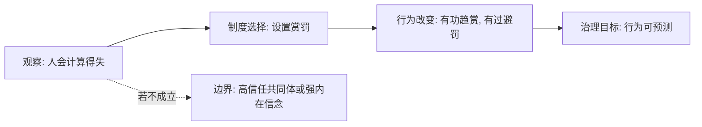

## 法家思维筑基课: 公理一: 人会趋利避害

### 作者
digoal

### 日期
2026-05-18

### 标签
法家 , 趋利避害 , 人性假设 , 赏罚机制 , 行为激励 , 治理公理 , 商鞅 , 韩非 , 制度设计 , 低信任治理

----

## 背景

> 面向对象: 高中生到大学低年级读者  
> 核心问题: 法家为什么总把赏罚放在治理中心？  
> 先说结论: 在法家模型里，人不一定没有道德，但治理不能押注人人自觉；最稳定、最可设计的共同机制，是多数人会追求利益、回避损害。

## 一张图先看懂



## 求真讲法

### 它到底说了什么

“趋利避害”不是说人只能贪利怕死，而是说在大规模治理中，制度设计要抓住一个最低共同点: 多数人会对收益和损失有反应。

法家因此不把国家秩序建立在“人人自动成圣”上，而是建立在可观察、可奖惩、可重复的行为机制上。

### 它是怎么来的

战国时期国家竞争激烈，治理对象不再只是熟人贵族圈，而是大量农民、士兵、官吏和地方社会。对陌生人大规模动员时，讲情分和身份不够，必须让人清楚知道:

```text
做什么会得利
不做什么会受罚
谁来记录
什么时候兑现
```

这就是赏罚制度成为法家核心工具的原因。

### 它依赖哪些假设

| 假设 | 含义 | 若不成立会怎样 |
|---|---|---|
| 人会响应得失 | 奖惩能改变行为概率 | 奖惩效果变弱 |
| 奖惩可以被执行 | 规则不是空话 | 制度失去可信度 |
| 行为结果能被观察 | 能判断功过 | 奖惩会错配 |
| 得失标准相对稳定 | 人能预期后果 | 人会转向投机和猜测 |

作为公理，它不是法家体系内部证明出来的，而是法家为了处理低信任、大规模治理问题而选择的出发点。

### 常见误解

**误解一: 法家认为人天生邪恶。**  
不必这样理解。法家更关心的是: 即使人有善意，也不能保证每个人、每一天、每个职位都靠善意行事。

**误解二: 趋利避害等于金钱万能。**  
利益不只包括钱，也包括地位、安全、荣誉、免罚、机会。

**误解三: 有赏罚就一定有效。**  
如果目标错了、记录不准、执行不公，赏罚越强，扭曲越大。

## 求存讲法

### 它有什么用

它让治理从“劝人做好事”转向“设计让人愿意做事的环境”。这对军功、耕作、纳税、服役、官僚考核等目标尤其重要。

### 它怎么迁移到熟悉领域

学习管理中也一样。只说“我要自律”很脆弱；把手机放远、设定每日题量、记录完成情况、给予小奖励，更接近制度设计。

### 它的适用范围和边界

适用: 目标明确、行为可观察、奖惩能兑现的场景。  
边界: 创造力、信任、友谊、学术探索等场景不能只靠外部奖惩，否则会损伤内在动机。

### 正例: 怎么用它提升能力

准备考试时，规定每天 40 分钟错题复盘，完成后才能娱乐 30 分钟；连续五天完成，周末看一场电影。这里用的是“趋利避害”的最低机制，让行为稳定出现。

### 反例: 前提不成立会怎样

学校只按刷题数量奖励学生，结果学生大量抄答案。失败原因不是“学生坏”，而是“行为结果能被观察”这个前提不成立: 数量指标不能代表真实掌握。

## 思考

如果一个制度必须靠每个人都自觉才能运转，它到底是强制度，还是脆弱制度？  
反过来，如果一个制度只会用奖惩，却不能培养信任和理解，它又会不会把人训练得只会算账？

## 最后记住

1. 趋利避害是法家的治理出发点，不是完整人性论。
2. 赏罚有效的前提是目标清楚、记录准确、执行可信。
3. 外部激励能稳定行为，但可能压低内在动机。
4. 用这个公理时，必须同时问: 奖惩指标真的代表目标吗？

## 参考资料

1. 《韩非子·二柄》《韩非子·有度》。
2. 《商君书·赏刑》《商君书·农战》。
3. 冯友兰《中国哲学史》相关章节。
4. 本文基于通行先秦思想史整理，重点解释理论模型。

  
#### [PostgreSQL 解决方案集合](../201706/20170601_02.md "40cff096e9ed7122c512b35d8561d9c8")
  
  
#### [德哥 / digoal's Github - 公益是一辈子的事.](https://github.com/digoal/blog/blob/master/README.md "22709685feb7cab07d30f30387f0a9ae")
  
  
#### [About 德哥](https://github.com/digoal/blog/blob/master/me/readme.md "a37735981e7704886ffd590565582dd0")
  
  

  
