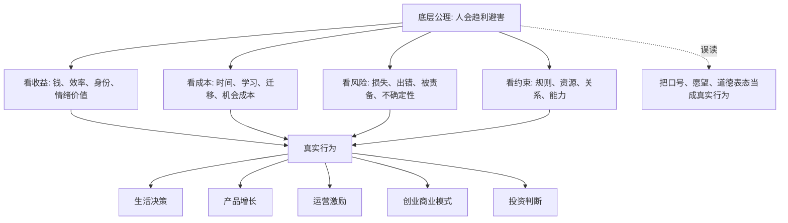
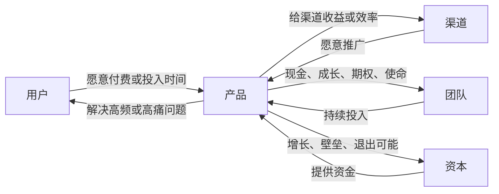

## 法家思维筑基课: 人会趋利避害

### 作者
digoal

### 日期
2026-05-18

### 标签
法家思想 , 趋利避害  

----

## 背景

> 面向对象: 大学生、产品经理、运营经理、有投资需求的人  
> 核心问题: 表面变化太快，怎样用一个更稳定的底层规律判断生活、产品、创业和投资中的真伪与趋势？  
> 先说结论: “人会趋利避害”不是说人只贪钱怕死，而是说人在多数情境下会被收益、成本、风险、身份、安全感、便利性和损失厌恶影响。看懂这个公理，就能从表面话术下看到真实激励，从而更好地判断行为、产品、商业模式和投资机会。

## 一张图先看懂



## 求真讲法

### 它到底说了什么

“人会趋利避害”是一条观察人类行为的基础假设。它说的不是“人都坏”，也不是“钱能解释一切”，而是:

1. 人会更倾向于选择自己认为有收益的事。
2. 人会回避自己认为成本高、风险高、损失大的事。
3. 人说出来的理由，常常不是完整原因；真实行为往往由激励结构决定。
4. 一个制度、产品、组织或商业模式，最终要和人的收益、成本、风险结构相容，才可能持续。

这里的“利”很宽，不只是金钱。它还包括省时间、少麻烦、被认可、获得安全感、保持面子、减少焦虑、提升身份、避免责任、获得确定性。

这里的“害”也很宽，不只是身体伤害。它还包括损失金钱、浪费时间、学习成本高、迁移成本高、社交尴尬、被上级责备、投资亏损、未来不确定。

### 它是怎么来的

这条公理来自很多领域的共同观察。

经济学常把人看作会响应激励的人。行为经济学进一步指出，人并不总是理性计算，但会受到损失厌恶、锚定、从众、即时满足等心理机制影响。管理学关注激励与约束如何改变组织行为。产品和运营实践则反复证明: 用户嘴上说喜欢某个功能，不等于真的愿意付费、学习、迁移和长期使用。

可以把它压缩成一句判断公式:

```text
真实行为 ≈ 感知收益 - 感知成本 - 感知风险 + 情境约束
```

注意这里说的是“感知”，不是客观事实。一个东西客观上有价值，但用户感觉不到，他就不会行动。一个风险客观上很小，但用户感觉很可怕，他也会回避。

### 它依赖哪些假设

作为公理，它不是在本文内部被证明出来的，而是我们为了理解复杂行为而选择的底层模型。它依赖这些假设:

| 假设 | 含义 | 你应该怎么用 |
|---|---|---|
| 人会响应激励 | 收益、成本、风险会影响选择 | 不只听表态，要看激励结构 |
| 人的理性有限 | 人不总能算清长期得失 | 要看感知、习惯和默认选项 |
| 人会厌恶损失 | 损失带来的痛感常大于收益快感 | 投资和产品迁移尤其要重视风险感 |
| 行为受环境塑造 | 规则、流程、同伴、工具会改变选择 | 改变行为不只靠说服，还要改环境 |
| 短期与长期会冲突 | 人常被即时反馈吸引 | 设计机制时要处理延迟收益 |

如果这些假设在某个场景中不成立，这条公理的解释力就会下降。例如人在强信仰、强爱、强使命、极端危机中，可能主动牺牲短期利益，甚至承受巨大风险。

### 常见误解

**误解一: 趋利避害等于自私。**

不等于。一个人帮助别人，也可能因为同情、责任、信仰、长期关系、身份认同而获得心理收益。利不只是物质利益。

**误解二: 趋利避害等于短期逐利。**

不等于。真正高水平的人，会把长期信用、复利、健康、能力、关系也纳入“利”。低水平的趋利避害才只看眼前。

**误解三: 只要给钱，人就会行动。**

不一定。钱只是激励之一。如果学习成本太高、风险太大、身份受损、流程太麻烦，钱可能不够。

**误解四: 用户说喜欢，就代表需求成立。**

不成立。需求成立至少要看用户是否愿意付出成本: 时间、注意力、迁移成本、数据、信任或金钱。

**误解五: 投资只要看故事够大。**

不够。故事要落到激励结构: 用户为什么买？渠道为什么推？员工为什么留？管理层为什么不乱来？资本为什么愿意继续支持？竞争者为什么不能轻易抢走？

## 求存讲法

### 它有什么用

这条公理最有用的地方，是帮你穿透表面现象。

很多事情表面上变化很快:

```text
新概念、新平台、新技术、新消费、新资产、新赛道
```

但底层问题经常没变:

```text
谁得利？
谁受损？
谁承担风险？
谁有动力持续做？
谁只是嘴上支持？
谁在用别人的钱、时间和信任买自己的收益？
```

一旦你从“表面叙事”切换到“激励结构”，判断力会明显提高。

### 它怎么迁移到生活

生活中很多冲突不是道理讲不清，而是激励不一致。

比如合租卫生问题。大家都说要保持干净，但如果不打扫也没有后果，打扫的人反而吃亏，最后很容易变成少数人长期付出。

更好的设计不是反复讲道德，而是明确值日表、可见检查、轮换责任和共同后果。这样行为激励才和共同目标一致。

### 它怎么迁移到产品经理

产品经理判断需求时，不要只问“用户想不想要”，而要问:

| 问题 | 真实含义 |
|---|---|
| 用户现在怎么解决？ | 现有替代方案是什么 |
| 用户为痛点付出了什么？ | 痛点是否足够强 |
| 用户要迁移什么成本？ | 新产品的阻力有多大 |
| 用户为什么现在就用？ | 是否有触发点 |
| 用户持续使用得到什么？ | 留存激励是否存在 |

产品成功往往不是因为“功能更多”，而是因为它让用户的收益明显增加，成本明显下降，风险感明显降低。

### 它怎么迁移到运营经理

运营不是制造热闹，而是设计行为路径。

如果你希望用户签到、分享、复购、邀请朋友，就要问:

```text
用户做这个动作的即时收益是什么？
不做有没有损失？
动作是否足够简单？
奖励是否可信？
用户会不会觉得打扰朋友、损害形象？
平台有没有把收益兑现给用户？
```

很多运营活动失败，不是创意不够，而是动作成本高于用户感知收益。

### 它怎么迁移到创业

创业不是“我相信这个方向”，而是要证明多方激励能闭环。



任何一条边的激励断了，商业模式都会变脆。

### 它怎么迁移到投融资

投资判断里，“人会趋利避害”至少能帮你看五层:

| 层次 | 要问的问题 |
|---|---|
| 用户 | 为什么买？为什么复购？为什么不换？ |
| 公司 | 为什么能赚钱？为什么成本不会失控？ |
| 管理层 | 为什么会善待股东？为什么不做短期粉饰？ |
| 竞争者 | 为什么不能用更低成本抢走用户？ |
| 市场 | 为什么现在的价格补偿了风险？ |

真正的投资不是相信故事，而是判断激励、现金流、竞争格局和价格之间是否一致。

### 它的适用范围和边界

这条公理适合用在:

1. 产品需求判断。
2. 用户增长和留存设计。
3. 团队管理和绩效机制。
4. 商业模式验证。
5. 投资中的利益相关者分析。
6. 生活中的合作、承诺、关系和冲突。

它不适合被粗暴使用在:

1. 把所有善意都解释成算计。
2. 把所有关系都变成交易。
3. 忽略信仰、爱、责任、荣誉、长期主义。
4. 只看短期利益，不看长期复利和系统后果。

### 正例: 怎么用它提升能力

假设你是产品经理，要做一个 AI 笔记工具。表面判断是“AI 很火，大家都需要提高效率”。底层判断应该这样拆:

| 维度 | 检查 |
|---|---|
| 收益 | 用户能否明显节省整理时间，或产出更好的内容 |
| 成本 | 是否需要迁移历史笔记，是否要学习复杂命令 |
| 风险 | 用户是否担心隐私、资料丢失、AI 编造 |
| 替代 | 现有工具是否已经够用 |
| 触发 | 用户在什么时刻非用不可 |
| 付费 | 节省的时间或创造的价值是否足以支撑价格 |

如果你发现用户只愿意试用，不愿意导入真实资料，也不愿付费，就说明“感知收益 - 感知成本 - 感知风险”还没有转正。

### 反例: 前提不成立会怎样

某创业团队做知识付费 App，认为“大学生都想进步，所以一定会买系统课程”。他们设计了 100 小时课程、复杂学习路径、高价会员。

结果转化很差。原因不是大学生不想进步，而是团队误判了激励结构:

1. 长期收益太远，短期反馈太弱。
2. 课程太重，学习成本太高。
3. 价格对学生来说风险感太强。
4. 免费内容和短视频替代品太多。
5. “想进步”的口头愿望，不等于愿意立刻付费和坚持学习。

这个反例失败的关键，是把“愿望”当成“行为”，把“客观有用”当成“用户感知值得”。

## 思考

### 为什么表面变化会骗你

新技术、新平台、新资产经常制造一种错觉: “这次不一样。”

但你可以先不争论概念，而是问:

```text
谁的收益变大了？
谁的成本变小了？
谁的风险被转移了？
谁在承担看不见的代价？
谁有动力把这件事持续做十年？
```

这些问题比追逐热词更稳定。

### 为什么它能帮助预言未来

所谓预言未来，不是准确猜中每个事件，而是判断哪类行为更可能持续。

如果一个产品同时满足:

1. 用户收益高。
2. 使用成本低。
3. 风险感低。
4. 替代品弱。
5. 商业模式能赚钱。
6. 参与各方都有持续动力。

那它更可能增长。

如果一个商业模式靠补贴掩盖真实成本，靠话术掩盖用户低留存，靠融资掩盖现金流缺口，靠短期指标掩盖长期风险，那它未来大概率要回归现实。

### 一句反事实

如果人不会趋利避害，那么产品不需要降低使用成本，运营不需要激励，管理不需要绩效，投资不需要分析管理层动机，创业不需要商业模式闭环。

但现实不是这样。

所以这条公理虽然不解释一切，却足以成为你判断很多复杂现象的第一把刀。

## 最后记住

1. “人会趋利避害”不是犬儒主义，而是理解行为的底层模型。
2. 利不只是钱，害不只是损失；身份、安全感、时间、风险、面子、确定性都很重要。
3. 不要只听别人说什么，要看他的收益、成本、风险和约束。
4. 产品、运营、创业、投资的核心问题，都是多方激励能否持续闭环。
5. 真正高水平的趋利避害，会把长期信用、能力复利、健康关系和系统风险也算进去。

## 参考资料

1. 亚当·斯密，《国富论》，关于分工、交换和自利行为的经典讨论。
2. 加里·贝克尔，《人类行为的经济分析》，把经济学激励分析扩展到更广行为领域。
3. 丹尼尔·卡尼曼，《思考，快与慢》，关于有限理性、损失厌恶和判断偏差。
4. 理查德·塞勒、卡斯·桑斯坦，《助推》，关于选择架构如何影响行为。
5. 查理·芒格，《穷查理宝典》，关于激励机制、误判心理学和跨学科思维模型。
6. 本文基于通行经济学、行为经济学、管理学和产品实践知识整理，重点解释可迁移的底层规律。
  
#### [PostgreSQL 解决方案集合](../201706/20170601_02.md "40cff096e9ed7122c512b35d8561d9c8")
  
  
#### [德哥 / digoal's Github - 公益是一辈子的事.](https://github.com/digoal/blog/blob/master/README.md "22709685feb7cab07d30f30387f0a9ae")
  
  
#### [About 德哥](https://github.com/digoal/blog/blob/master/me/readme.md "a37735981e7704886ffd590565582dd0")
  
  

  
